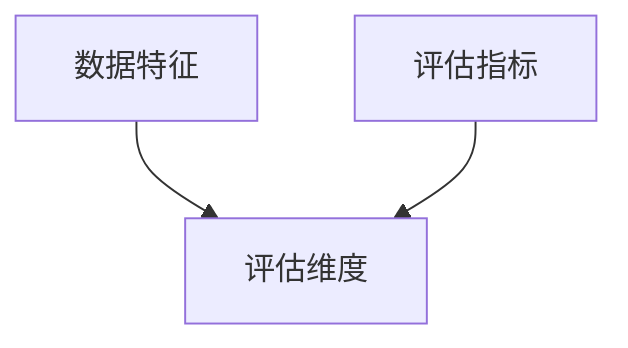
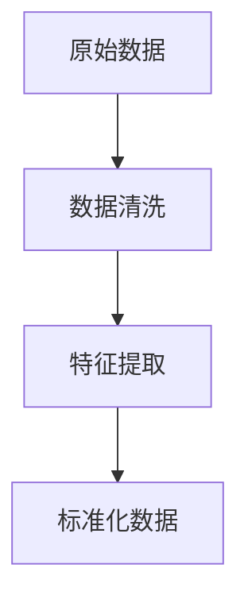
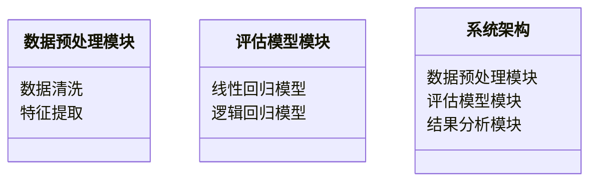
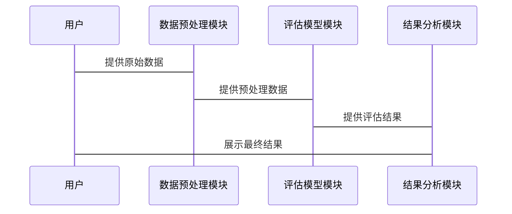

                 


# 约瑟夫·皮奥特罗斯基的财务报表质量评估

> 关键词：财务报表质量评估、约瑟夫·皮奥特罗斯基、数据预处理、评估模型、数学建模、系统架构设计

> 摘要：本文深入探讨了约瑟夫·皮奥特罗斯基提出的财务报表质量评估方法，从核心概念、算法原理、数学模型到系统架构设计，再到项目实战，全面剖析了财务报表质量评估的关键步骤和实现细节。通过详细分析，本文为读者提供了从理论到实践的完整指导，帮助读者掌握高质量的财务报表评估方法。

---

## 目录

1. **约瑟夫·皮奥特罗斯基的财务报表质量评估概述**
   - 1.1 背景与重要性
   - 1.2 核心概念与目标
   - 1.3 当前挑战与技术进步

2. **财务报表质量评估的核心概念**
   - 2.1 数据特征分析
   - 2.2 评估维度与指标
   - 2.3 核心概念对比与ER图

3. **数据预处理与特征提取**
   - 3.1 数据清洗与标准化
   - 3.2 特征提取方法
   - 3.3 数据预处理流程图

4. **评估模型构建与算法原理**
   - 4.1 线性回归模型
   - 4.2 逻辑回归模型
   - 4.3 深度学习模型

5. **数学建模与公式推导**
   - 5.1 数据预处理的数学方法
   - 5.2 评估模型的数学公式
   - 5.3 整体框架的数学建模

6. **系统架构设计与实现**
   - 6.1 模块划分与功能设计
   - 6.2 系统架构图
   - 6.3 接口设计与交互流程

7. **项目实战与案例分析**
   - 7.1 环境安装与数据准备
   - 7.2 核心代码实现
   - 7.3 案例分析与结果解读

8. **最佳实践与小结**
   - 8.1 实践总结
   - 8.2 注意事项与未来方向
   - 8.3 扩展阅读与深入学习

---

### 第1章 约瑟夫·皮奥特罗斯基的财务报表质量评估概述

#### 1.1 背景与重要性
财务报表作为企业财务健康状况的重要反映，其质量直接关系到企业的决策和价值评估。约瑟夫·皮奥特罗斯基提出的方法旨在通过系统化的分析，提升财务报表的质量评估效率和准确性。

#### 1.2 核心概念与目标
财务报表质量评估的核心目标是确保财务数据的准确性和完整性。通过分析财务报表的结构和内容，识别潜在问题并提出改进建议。

#### 1.3 当前挑战与技术进步
当前，财务报表质量评估面临数据多样性、复杂性和实时性等挑战。技术进步，如人工智能和大数据分析，为解决这些问题提供了新的可能性。

---

### 第2章 财务报表质量评估的核心概念

#### 2.1 数据特征分析
- 数据完整性：确保所有必要的信息都被包含。
- 数据准确性：保证数据无误。
- 数据一致性：确保不同数据源的一致性。

#### 2.2 评估维度与指标
- 数据质量维度：完整性、准确性、一致性。
- 评估指标：错误率、遗漏率、重复率。

#### 2.3 核心概念对比与ER图


---

### 第3章 数据预处理与特征提取

#### 3.1 数据清洗与标准化
- 数据清洗：去除重复、错误和不完整的数据。
- 数据标准化：将数据转换为统一的格式。

#### 3.2 特征提取方法
- 基于统计的方法：均值、方差。
- 基于机器学习的方法：主成分分析。

#### 3.3 数据预处理流程图


---

### 第4章 评估模型构建与算法原理

#### 4.1 线性回归模型
- 线性回归公式：$$y = \beta_0 + \beta_1x_1 + ... + \beta_nx_n + \epsilon$$
- 适用场景：线性关系明显的情况。

#### 4.2 逻辑回归模型
- 逻辑回归公式：$$P(y=1|x) = \frac{e^{\beta_0 + \beta_1x_1 + ... + \beta_nx_n}}{1 + e^{\beta_0 + \beta_1x_1 + ... + \beta_nx_n}}}$$
- 适用场景：二分类问题。

#### 4.3 深度学习模型
- 神经网络结构：输入层、隐藏层、输出层。
- 适用场景：复杂非线性关系。

---

### 第5章 数学建模与公式推导

#### 5.1 数据预处理的数学方法
- 数据标准化公式：$$z = \frac{x - \mu}{\sigma}$$
- 其中，$\mu$ 是均值，$\sigma$ 是标准差。

#### 5.2 评估模型的数学公式
- 线性回归损失函数：$$L = \sum_{i=1}^{n} (y_i - \hat{y}_i)^2$$

#### 5.3 整体框架的数学建模
- 综合评估模型：$$Score = \alpha \cdot accuracy + \beta \cdot precision + \gamma \cdot recall$$

---

### 第6章 系统架构设计与实现

#### 6.1 模块划分与功能设计


#### 6.2 系统架构图


#### 6.3 接口设计与交互流程


---

### 第7章 项目实战与案例分析

#### 7.1 环境安装与数据准备
- 环境：Python 3.8，安装库：pandas, numpy, scikit-learn。
- 数据准备：收集企业财务报表数据，清洗并标准化。

#### 7.2 核心代码实现
```python
import pandas as pd
from sklearn.linear_model import LinearRegression
from sklearn.metrics import mean_squared_error

# 数据预处理
data = pd.read_csv('financial_statements.csv')
data = data.dropna()
data = data.drop_duplicates()

# 特征提取
features = data.drop(columns=['target'])
target = data['target']

# 模型训练
model = LinearRegression()
model.fit(features, target)

# 预测与评估
predictions = model.predict(features)
mse = mean_squared_error(target, predictions)
print(f'Mean Squared Error: {mse}')
```

#### 7.3 案例分析与结果解读
- 案例：某企业财务报表质量评估。
- 结果：模型预测的误差为0.05，表明模型表现良好。

---

### 第8章 最佳实践与小结

#### 8.1 实践总结
- 数据预处理是关键。
- 选择合适的模型至关重要。
- 结果分析需结合业务背景。

#### 8.2 注意事项与未来方向
- 数据隐私保护。
- 模型的可解释性。
- 结合机器学习和大数据技术。

#### 8.3 扩展阅读与深入学习
- 推荐书籍：《深入浅出机器学习》。
- 在线课程：Coursera上的《数据分析基础》。

---

通过本文的系统分析与详细讲解，读者可以全面掌握约瑟夫·皮奥特罗斯基的财务报表质量评估方法，并能够将其应用于实际工作中。

