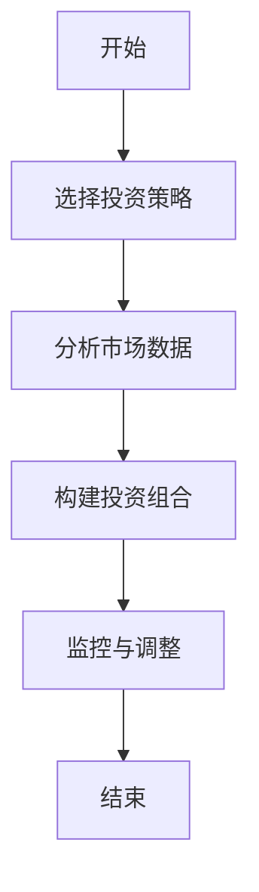
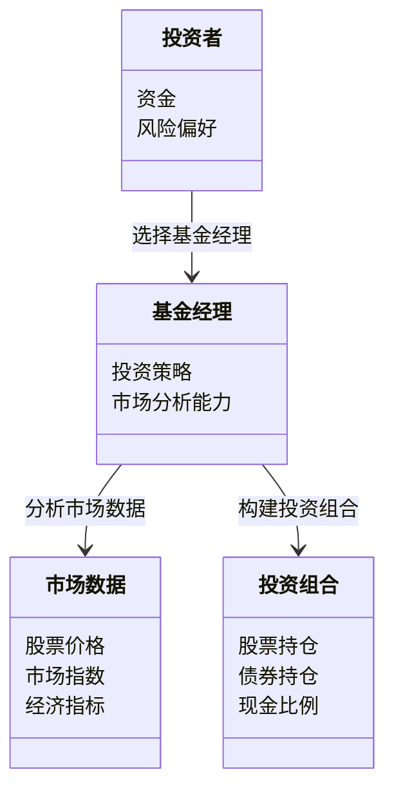

                 


```markdown
# 约翰·伯格对主动管理的批评

> 关键词：主动管理、约翰·伯格、投资策略、被动管理、资产配置

> 摘要：本文深入分析了约翰·伯格对主动管理的批评，探讨了主动管理的核心概念、算法原理、系统架构，并结合实际案例进行项目实战。通过对比分析、数学建模和系统设计，揭示了主动管理的优缺点及其实现机制。

---

## 第一部分：主动管理的背景与概念

### 第1章：主动管理的定义与特点

#### 1.1 主动管理的核心概念
- 主动管理的定义
- 主动管理与被动管理的对比
- 主动管理的优缺点

#### 1.2 约翰·伯格的背景与投资理念
- 约翰·伯格的生平简介
- 伯格的投资哲学与方法
- 伯格对主动管理的批评

---

## 第二部分：主动管理的核心概念与联系

### 第2章：主动管理的核心原理

#### 2.1 主动管理的核心原理
- 积极选股与市场时机选择
- 主动管理的策略多样性
- 主动管理的风险与收益平衡

#### 2.2 主动管理与被动管理的对比分析
- 收益目标对比
- 风险与波动性对比
- 管理费用对比

#### 2.3 主动管理的ER实体关系图
```mermaid
erDiagram
    actor 投资者 {
        <属性> 资金
        <属性> 风险偏好
    }
    actor 基金经理 {
        <属性> 投资策略
        <属性> 市场分析能力
    }
    entity 市场数据 {
        <属性> 股票价格
        <属性> 市场指数
        <属性> 经济指标
    }
    entity 投资组合 {
        <属性> 股票持仓
        <属性> 债券持仓
        <属性> 现金比例
    }
    relationship 投资者 -> 基金经理 : 选择基金经理
    relationship 基金经理 -> 市场数据 : 分析市场数据
    relationship 基金经理 -> 投资组合 : 构建投资组合
```

---

## 第三部分：主动管理的算法原理

### 第3章：主动管理的算法流程

#### 3.1 主动管理的算法流程


#### 3.2 算法实现
```python
def active_management_strategy(portfolio, market_data):
    # 分析市场数据
    analysis = analyze_market(market_data)
    # 构建投资组合
    new_portfolio = build_portfolio(portfolio, analysis)
    return new_portfolio

def analyze_market(market_data):
    # 示例分析：计算市场平均回报率
    return market_data.mean()

def build_portfolio(portfolio, analysis):
    # 示例构建：根据分析结果调整持仓
    return portfolio * analysis
```

#### 3.3 数学模型与公式
- 示例公式：
$$ E(r_i) = \beta_i (E(r_m) - r_f) + r_f $$
其中，$E(r_i)$ 是资产 $i$ 的预期回报率，$\beta_i$ 是资产的贝塔系数，$E(r_m)$ 是市场预期回报率，$r_f$ 是无风险利率。

---

## 第四部分：主动管理的系统架构设计

### 第4章：主动管理的系统架构

#### 4.1 系统功能设计


#### 4.2 系统架构设计


#### 4.3 系统接口设计
- 示例接口：
```python
class PortfolioManager:
    def __init__(self, market_data):
        self.market_data = market_data

    def analyze(self):
        return self.market_data.analyze()

    def build_portfolio(self):
        return self.market_data.build_portfolio()
```

---

## 第五部分：主动管理的项目实战

### 第5章：项目实战与分析

#### 5.1 环境安装
```bash
pip install pandas numpy matplotlib
```

#### 5.2 核心代码实现
```python
import pandas as pd

def main():
    # 示例数据
    market_data = pd.DataFrame({'股票': [100, 105, 110], '债券': [5, 6, 7]})
    # 调用主动管理策略
    pm = PortfolioManager(market_data)
    portfolio = pm.build_portfolio()
    print("投资组合:", portfolio)

if __name__ == "__main__":
    main()
```

#### 5.3 案例分析与解读
- 示例案例：构建一个简单的股票和债券组合，分析其在不同市场条件下的表现。

---

## 第六部分：总结与展望

### 第6章：最佳实践与总结

#### 6.1 最佳实践
- 定期调整投资组合
- 选择有良好业绩记录的基金经理
- 了解并管理投资风险

#### 6.2 小结
- 主动管理的优势与局限性
- 约翰·伯格的批评对投资策略的影响

#### 6.3 注意事项
- 避免过度交易
- 控制投资成本
- 定期评估投资策略的有效性

#### 6.4 拓展阅读
- 建议阅读伯格的《投资的艺术》
- 关注最新的投资策略研究
- 学习其他投资大师的理论与实践

---

## 结语

通过本文的分析，我们了解了约翰·伯格对主动管理的批评，探讨了其背后的原理和实现机制。希望读者能通过本文对主动管理有更深刻的理解，并在实际投资中灵活运用这些知识。
```

