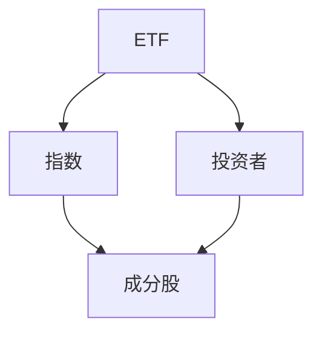
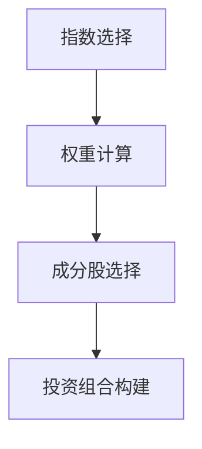

                 


# 约翰·伯格的ETF革命：新一代指数投资工具

## 关键词：
- ETF
- 指数投资
- 被动投资
- 指数基金
- 投资工具

## 摘要：
本文深入探讨了约翰·伯格的ETF革命，分析了ETF作为一种新一代指数投资工具的核心概念、算法原理、系统架构以及实际应用。通过详细的技术分析和实际案例，展示了ETF在投资领域的重要性和优势。

---

## 第一部分: ETF革命的背景与基础

### 第1章: ETF革命的背景与起源

#### 1.1 ETF的起源与发展
##### 1.1.1 ETF的定义与特点
ETF（交易所交易基金，Exchange-Traded Funds）是一种在交易所上市交易的开放式基金，兼具封闭式基金和开放式基金的特性。其特点包括：
1. **透明性**：ETF的净值和成分股构成公开透明，投资者可以随时查询。
2. **流动性**：ETF可以在交易所像股票一样买卖，具有较高的流动性。
3. **分散风险**：通过投资多个成分股，ETF降低了单一投资的风险。

##### 1.1.2 ETF与传统投资工具的对比
| 投资工具 | 开放式基金 | 封闭式基金 | ETF |
|----------|------------|------------|-----|
| 交易方式 | 需要申购/赎回 | 在交易所交易 | 在交易所交易 |
| 成立规模 | 受资金影响 | 固定 | 灵活 |
| 费用 | 较高 | 较低 | 一般较低 |

##### 1.1.3 ETF市场的现状与发展趋势
近年来，ETF市场快速发展，成为全球投资领域的重要组成部分。根据统计，全球ETF管理的资产规模已经超过5万亿美元，且仍在快速增长中。

#### 1.2 ETF的核心概念与运作机制
##### 1.2.1 ETF的基本原理
ETF通过跟踪特定的指数或资产类别，实现被动投资。投资者通过购买ETF份额，间接投资于指数中的成分股。

##### 1.2.2 ETF的运作流程
1. **指数选择**：选择一个特定的指数作为跟踪目标。
2. **成分股构建**：根据指数的权重分配，购买相应的成分股。
3. **基金份额发行**：通过市场机制发行基金份额，供投资者购买。
4. **交易与结算**：投资者在交易所买卖ETF份额，基金公司负责结算。

##### 1.2.3 ETF的类型与分类
| 类型 | 描述 |
|------|------|
| 股票型ETF | 投资于股票指数 |
| 债券型ETF | 投资于债券指数 |
| 商品型ETF | 投资于商品（如黄金、原油） |
| 按揭ETF | 投资于房地产按揭资产 |

#### 1.3 ETF的投资价值与优势
##### 1.3.1 ETF的低成本优势
ETF的管理费用通常低于主动管理型基金，降低了投资者的成本。

##### 1.3.2 ETF的风险分散特性
通过投资多个成分股，ETF降低了单一资产的风险。

##### 1.3.3 ETF的透明度与流动性
ETF的净值和成分股构成公开透明，且具有高流动性，便于投资者随时买卖。

---

## 第二部分: ETF的核心概念与数学模型

### 第2章: ETF的核心概念与数学模型

#### 2.1 ETF的被动投资策略
##### 2.1.1 被动投资的基本原理
被动投资通过跟踪指数实现收益，不依赖于主动管理。

##### 2.1.2 ETF的指数跟踪方法
1. **完全复制**：直接购买指数中的所有成分股，按权重分配资金。
2. **抽样复制**：通过选择部分成分股来近似跟踪指数。
3. **优化复制**：通过优化算法选择成分股，降低跟踪误差。

##### 2.1.3 被动投资与主动投资的对比
| 对比维度 | 被动投资 | 主动投资 |
|----------|----------|----------|
| 管理费用 | 低 | 高 |
| 风险 | 低 | 高 |
| 收益 | 稳定 | 波动 |

#### 2.2 ETF的数学模型与公式
##### 2.2.1 被动投资的数学模型
$$ R_p = \sum_{i=1}^{n} w_i R_i $$
其中，$R_p$ 是投资组合的收益率，$w_i$ 是第i只股票的权重，$R_i$ 是第i只股票的收益率。

##### 2.2.2 ETF的跟踪误差公式
$$ \text{跟踪误差} = \sqrt{\text{投资组合方差} - \text{指数方差}} $$

#### 2.3 ETF的核心概念关系图


---

## 第三部分: ETF的投资策略与算法原理

### 第3章: ETF的投资策略与算法原理

#### 3.1 ETF的投资策略
##### 3.1.1 完全复制策略
完全复制策略通过购买指数中的所有成分股，按权重分配资金，确保与指数完全一致。

##### 3.1.2 抽样复制策略
抽样复制策略通过选择部分成分股来近似跟踪指数，适用于成分股较多的指数。

##### 3.1.3 优化复制策略
优化复制策略通过优化算法选择成分股，降低跟踪误差，提高效率。

#### 3.2 ETF的算法实现
##### 3.2.1 ETF指数复制的算法流程
1. **选择指数**：确定跟踪的指数。
2. **计算权重**：根据指数权重分配资金。
3. **选择成分股**：根据权重选择成分股。
4. **构建投资组合**：将资金分配到选定的成分股中。



---

## 第四部分: ETF的系统架构与实现

### 第4章: ETF的系统架构与实现

#### 4.1 ETF投资系统的功能设计
##### 4.1.1 系统功能模块
1. **数据源模块**：获取指数数据和市场数据。
2. **指数计算模块**：计算指数的权重和成分股。
3. **交易执行模块**：执行买卖交易。
4. **风险管理模块**：监控和管理投资风险。

##### 4.1.2 系统功能流程
1. 获取指数数据。
2. 计算指数权重和成分股。
3. 构建投资组合。
4. 执行交易。
5. 监控风险。

#### 4.2 ETF投资系统的架构设计


#### 4.3 ETF投资系统的接口设计
##### 4.3.1 系统接口
1. 数据接口：获取指数数据。
2. 交易接口：执行买卖交易。
3. 风险管理接口：监控投资风险。

##### 4.3.2 系统接口流程
1. 数据接口获取指数数据。
2. 交易接口执行买卖交易。
3. 风险管理接口监控投资风险。

#### 4.4 ETF投资系统的交互流程


---

## 第五部分: ETF的项目实战与分析

### 第5章: ETF的项目实战与分析

#### 5.1 项目背景与目标
选择一个具体的ETF产品，分析其历史表现和风险管理策略。

#### 5.2 项目实施
##### 5.2.1 选择ETF产品
选择标普500ETF作为分析对象。

##### 5.2.2 分析历史表现
分析标普500ETF的历史收益率和波动性。

##### 5.2.3 风险管理策略
制定风险管理策略，如止损、止盈等。

#### 5.3 项目代码实现
##### 5.3.1 ETF投资策略的Python实现
```python
import pandas as pd
import numpy as np

# 数据获取
data = pd.read_csv('index.csv')

# 计算指数收益率
returns = data.pct_change()

# 计算投资组合收益率
def calculate_portfolio_returns(weights, returns):
    return np.sum(weights * returns, axis=1)

# 优化复制策略实现
def optimize_weights(weights, returns):
    # 使用优化算法计算最优权重
    pass

# 交易执行模拟
def execute_trades(weights, data):
    # 模拟交易执行
    pass
```

#### 5.4 项目分析与总结
分析ETF投资策略的实际效果，总结经验教训。

---

## 第六部分: ETF的最佳实践与总结

### 第6章: ETF的最佳实践与总结

#### 6.1 ETF投资的关键点
1. **低成本**：选择费用较低的ETF。
2. **分散投资**：通过投资多个成分股降低风险。
3. **定期再平衡**：定期调整投资组合以保持目标权重。

#### 6.2 ETF投资中的注意事项
1. **税务影响**：了解ETF的税务政策。
2. **流动性风险**：关注ETF的流动性。
3. **市场波动**：关注市场波动对ETF的影响。

#### 6.3 ETF投资的未来展望
随着技术的发展，ETF的投资策略将更加智能化，人工智能将被更多地应用于ETF的投资和管理中。

---

## 总结
ETF作为一种新一代指数投资工具，凭借其低成本、高透明度和高流动性，已经成为投资领域的重要组成部分。通过本文的分析，读者可以全面了解ETF的核心概念、算法原理和实际应用，为投资决策提供有力支持。

---

通过以上内容，我们可以看到ETF作为一种高效的投资工具，具有广阔的应用前景。无论是个人投资者还是机构投资者，都可以通过ETF实现多样化的投资策略。

