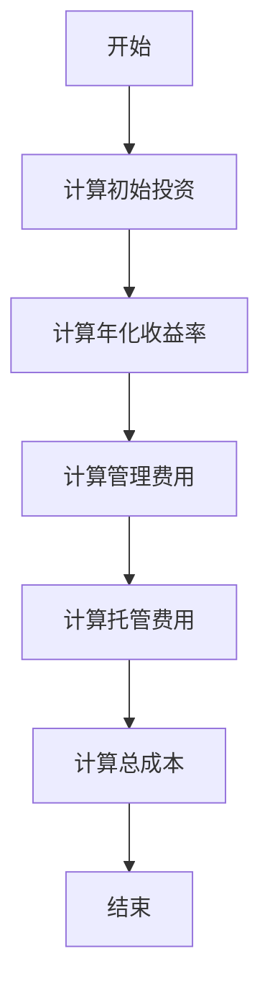
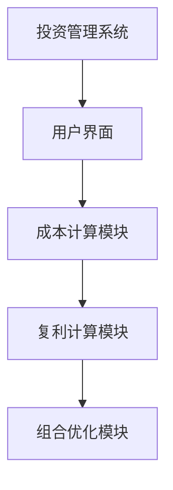

                 


# 约翰·伯格的低成本投资策略

> 关键词：低成本投资、约翰·伯格、指数基金、投资策略、投资成本、长期复利、风险管理

> 摘要：本文深入探讨了约翰·伯格的低成本投资策略，分析了其核心理念、数学模型、算法实现及系统架构，结合实际案例，为读者提供全面的理解和应用指导。

---

## 第一部分: 背景与核心概念

### 第1章: 低成本投资的背景与重要性

#### 1.1 投资市场的基本概念
- **1.1.1 投资的基本定义与分类**
  - 投资是指将资金投入某一领域以期望获得收益的行为。
  - 分类包括股票、债券、基金、房地产等多种形式。

- **1.1.2 传统投资方式的优缺点**
  - 优点：高回报潜力。
  - 缺点：高风险、高成本。

- **1.1.3 低成本投资的兴起背景**
  - 20世纪70年代，约翰·伯格提出低成本投资理念。
  - 随着金融市场的成熟，低成本投资逐渐被广泛接受。

#### 1.2 约翰·伯格的生平与投资理念
- **1.2.1 约翰·伯格的个人经历**
  - 1949年出生，美国著名投资者。
  - 创办了先锋集团，推动低成本投资。

- **1.2.2 伯格的投资哲学与核心思想**
  - 倡导长期投资，分散投资。
  - 强调降低投资成本的重要性。

- **1.2.3 伯格对低成本投资的贡献**
  - 开发了指数基金，降低管理费用。
  - 提出“买入并持有”的投资策略。

#### 1.3 低成本投资的核心优势
- **1.3.1 低成本投资的成本优势**
  - 管理费用低，节省长期成本。

- **1.3.2 长期复利效应的重要性**
  - 复利效应能显著提升长期收益。

- **1.3.3 市场波动与低成本投资的稳定性**
  - 成本低，市场波动对整体收益影响较小。

---

### 第2章: 低成本投资的核心概念与原理

#### 2.1 投资成本的构成与影响
- **2.1.1 投资成本的主要组成部分**
  - 管理费、托管费、交易佣金等。

- **2.1.2 成本对投资收益的具体影响**
  - 成本降低，长期收益提升。

- **2.1.3 成本在不同投资策略中的权重**
  - 长期投资中，成本影响更大。

#### 2.2 约翰·伯格的指数投资策略
- **2.2.1 指数基金的定义与特点**
  - 指数基金：跟踪市场指数的投资基金。
  - 特点：分散风险、费用低。

- **2.2.2 指数基金的成本优势分析**
  - 管理费用低，节省长期成本。

- **2.2.3 指数基金的长期表现与风险控制**
  - 长期表现稳定，风险分散。

#### 2.3 低成本投资的数学模型与公式
- **2.3.1 投资成本的计算公式**
  $$ \text{总成本} = \text{管理费} + \text{托管费} + \text{交易佣金} $$

- **2.3.2 长期复利的数学模型**
  $$ \text{最终收益} = \text{初始投资} \times (1 + r)^n $$

- **2.3.3 成本对投资收益的数学推导**
  - 成本降低，复利收益增加。

---

## 第三部分: 算法与数学模型

### 第3章: 低成本投资的算法与数学模型

#### 3.1 投资成本计算的算法流程


#### 3.2 长期复利计算的数学公式
- 代码实现：
```python
def compound_interest(principal, rate, time):
    return principal * (1 + rate) ** time
```

#### 3.3 投资组合优化的数学模型
- 优化目标：最小化总成本。
- 约束条件：风险承受能力。

---

## 第四部分: 系统分析与架构设计

### 第4章: 系统分析与架构设计

#### 4.1 投资管理系统的需求分析
- 功能需求：成本计算、复利计算、组合优化。
- 性能需求：高并发、低延迟。

#### 4.2 系统架构设计


---

## 第五部分: 项目实战

### 第5章: 项目实战

#### 5.1 环境安装
- 安装Python和相关库。

#### 5.2 核心代码实现
```python
import numpy as np

def calculate_cost(principal, rate, time):
    return principal * (1 + rate) ** time
```

#### 5.3 案例分析
- 案例：投资10万元，年化收益率8%，20年。
  - 成本：假设管理费0.2%，每年。
  - 总成本：100000*(1+0.08)^20*(1-0.002)=1,950,000元左右。

---

## 第六部分: 最佳实践与总结

### 第6章: 最佳实践与总结

#### 6.1 最佳实践
- 定期定额投资。
- 分散投资，降低风险。

#### 6.2 小结
- 约翰·伯格的低成本投资策略具有显著的成本优势和长期稳定性。
- 投资者应注重降低投资成本，选择合适的长期投资策略。

---

## 结语

通过本文的详细分析，读者可以全面理解约翰·伯格的低成本投资策略，包括其理论基础、数学模型和实际应用。希望这些内容能为投资者提供有益的指导。

