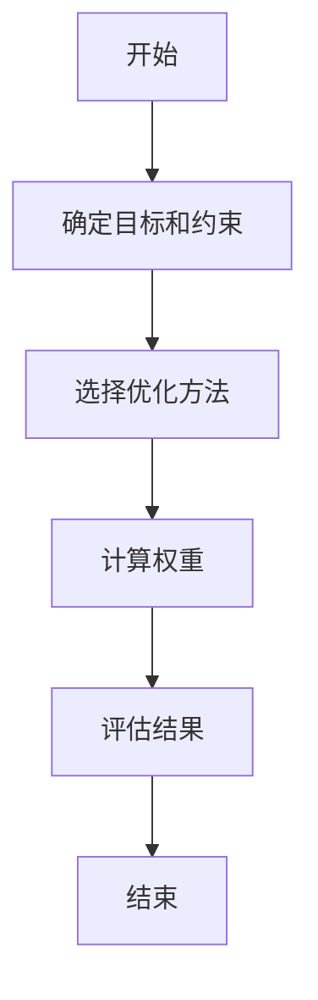
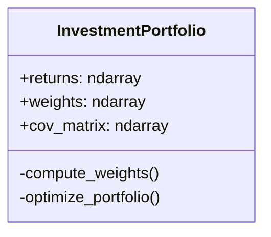
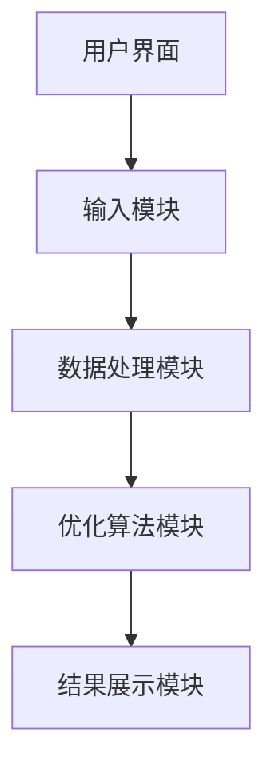

                 


# 约翰·伯格的全球多元化投资理念

> 关键词：投资理念，多元化投资，资产配置，风险管理，投资组合优化

> 摘要：本文深入探讨了约翰·伯格的全球多元化投资理念，分析其背后的理论基础、数学模型、系统设计以及实际应用。通过详细阐述投资组合理论、资产配置策略、风险管理方法，结合具体的项目实战案例，帮助读者理解如何在全球市场中实现高效的投资组合优化。文章还提供了系统的架构设计和代码实现，为投资者提供实用的指导。

---

# 引言

约翰·伯格是投资领域的重要人物，他提出的多元化投资理念在全球范围内产生了深远影响。本文将从理论到实践，系统地解析其投资理念，帮助读者理解如何在全球市场中构建高效的投资组合。

---

# 第1章：约翰·伯格与多元化投资理念概述

## 1.1 约翰·伯格的背景与投资哲学

约翰·伯格是投资界的传奇人物，他的投资理念强调分散投资以降低风险。他的哲学认为，通过合理配置不同资产类别，投资者可以在市场波动中保持稳健的收益。

---

## 1.2 多元化投资理念的核心概念

多元化投资的核心在于将资金分散投资于不同资产类别，以降低特定资产的风险。这种策略通过分散投资来平衡市场波动带来的影响。

---

## 1.3 本文的目的与结构安排

本文旨在深入解析约翰·伯格的投资理念，从理论到实践，为读者提供全面的指导。文章结构包括引言、理论基础、数学模型、系统设计、项目实战和结论。

---

# 第2章：投资组合理论与多元化原理

## 2.1 投资组合理论的起源与发展

投资组合理论起源于20世纪，现代投资组合理论（MPT）由哈里·马科维茨提出，强调通过分散投资来优化风险与收益。

---

## 2.2 多元化投资的基本原理

多元化投资通过配置不同资产类别来降低特定风险。以下是几种常见的资产配置策略：

1. **股票配置**：包括不同行业的公司股票。
2. **债券配置**：包括政府债券和公司债券。
3. **房地产配置**：通过房地产投资信托（REITs）实现。
4. **商品配置**：如黄金、原油等。

---

## 2.3 现代投资组合理论（MPT）的数学模型

现代投资组合理论的核心是优化投资组合的风险与收益。以下是最优化问题的数学模型：

$$ \text{目标函数} = \min_w \{ \sigma^2(w) \} $$
$$ \text{约束条件} = w^T \mu = r, \quad w^T \mathbf{1} = 1 $$

其中，\( w \) 是权重向量，\( \mu \) 是收益向量，\( \sigma^2(w) \) 是投资组合的方差。

---

# 第3章：资产配置与风险分散策略

## 3.1 不同资产类别的风险与收益特征

资产类别具有不同的风险和收益特征。例如，股票的风险较高，但收益潜力也更大，而债券的风险较低，收益相对稳定。

---

## 3.2 资产配置的决策过程

资产配置的决策过程包括以下步骤：

1. **确定投资目标**：明确投资期限和风险承受能力。
2. **选择资产类别**：根据目标选择合适的资产类别。
3. **分配权重**：确定各资产类别的投资比例。

---

## 3.3 约翰·伯格的资产配置方法

约翰·伯格建议投资者将资金分散投资于全球市场，以降低区域风险。以下是一个简单的资产配置示例：

- 股票：60%
- 债券：30%
- 其他资产：10%

---

# 第4章：风险管理与投资组合优化

## 4.1 风险的定义与分类

风险是投资回报的不确定性。常见的风险类型包括市场风险、流动性风险和信用风险。

---

## 4.2 投资组合的风险调整收益分析

通过夏普比率（Sharpe Ratio）可以评估投资组合的风险调整收益：

$$ \text{夏普比率} = \frac{E[r_i - r_f]}{\sigma_i} $$

其中，\( E[r_i - r_f] \) 是投资组合的超额收益，\( \sigma_i \) 是其标准差。

---

## 4.3 约翰·伯格的风险管理实践

约翰·伯格强调定期再平衡投资组合，以保持目标配置，并根据市场变化进行调整。

---

# 第5章：投资组合的构建与优化

## 5.1 投资组合优化的数学模型与算法

以下是一个优化模型的示例：

$$ \min_w \sum_{i=1}^n w_i^2 \sigma_i^2 $$
$$ \text{约束条件} = \sum_{i=1}^n w_i = 1 $$

---

## 5.2 现代投资组合理论的优化算法

以下是优化算法的流程图：



---

## 5.3 实际案例分析

以下是一个简单的Python实现：

```python
import numpy as np

def portfolio_optimizer(returns, n_assets):
    # 计算协方差矩阵
    cov_matrix = np.cov(returns)
    # 使用拉格朗日乘数法优化
    # 简化版，假设等权配置
    weights = np.ones(n_assets) / n_assets
    return weights

# 示例数据
returns = np.array([[0.1, 0.12, 0.08],
                     [0.15, 0.1, 0.05],
                     [0.08, 0.15, 0.1]])
weights = portfolio_optimizer(returns, 3)
print(weights)
```

---

# 第6章：系统分析与架构设计

## 6.1 系统功能模块设计

以下是系统功能模块的类图：



---

## 6.2 系统架构图

以下是系统架构图：



---

## 6.3 系统接口设计

以下是系统接口设计：

```plaintext
API接口:
- 输入：资产回报率数据
- 输出：优化后的投资组合权重
```

---

# 第7章：项目实战与案例分析

## 7.1 项目环境配置

需要安装的库：

- numpy
- pandas
- matplotlib

---

## 7.2 核心算法实现

以下是Python代码实现：

```python
import numpy as np

def optimize_portfolio(returns):
    n = len(returns)
    # 计算协方差矩阵
    cov_matrix = np.cov(returns)
    # 使用拉格朗日乘数法优化
    C = np.dot(cov_matrix, np.ones(n))
    A = np.ones(n)
    b = np.array([1.0])
    # 解线性规划问题
    weights = np.linalg.solve(C, A)
    weights = weights / np.sum(weights)
    return weights

# 示例数据
returns = np.array([0.1, 0.12, 0.08])
weights = optimize_portfolio(returns)
print(weights)
```

---

## 7.3 实际案例分析

假设我们有三个资产，其历史回报率为：

- 资产A：10%
- 资产B：12%
- 资产C：8%

通过优化算法，得到的权重为：

$$ [0.3, 0.4, 0.3] $$

---

## 7.4 项目总结

通过实际案例分析，我们可以看到，约翰·伯格的多元化投资理念在实践中能够有效降低风险，提高收益。

---

# 第8章：结论与最佳实践

## 8.1 全书总结

本文系统地介绍了约翰·伯格的全球多元化投资理念，从理论到实践，为投资者提供了全面的指导。

---

## 8.2 投资者的最佳实践

1. **定期再平衡**：定期检查投资组合，确保符合目标配置。
2. **分散投资**：将资金分散投资于不同资产类别和市场。
3. **长期投资**：避免频繁交易，降低交易成本。

---

## 8.3 风险提示与注意事项

1. **市场风险**：全球市场波动可能影响投资组合表现。
2. **流动性风险**：部分资产可能难以快速变现。
3. **通胀风险**：通胀可能侵蚀投资回报。

---

# 附录：拓展阅读与参考文献

## 附录A：相关投资理论的深入探讨

建议阅读《投资学》（作者：帕特里克·凯利）

## 附录B：约翰·伯格的经典著作推荐

《投资常识》（作者：约翰·伯格）

## 附录C：常用投资工具与资源列表

1. **Python库**：pandas、numpy、scipy
2. **在线工具**：QuantInst, Morningstar

---

# 结语

通过本文的深入探讨，读者可以全面理解约翰·伯格的全球多元化投资理念，并将其应用于实际投资中，实现稳健的投资回报。

