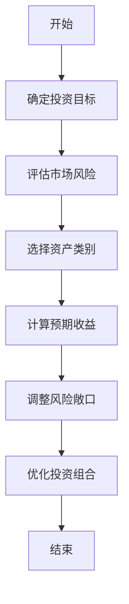
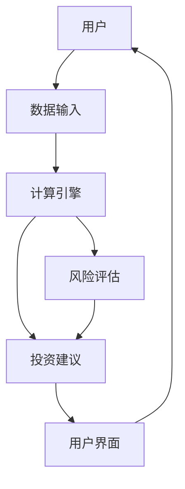
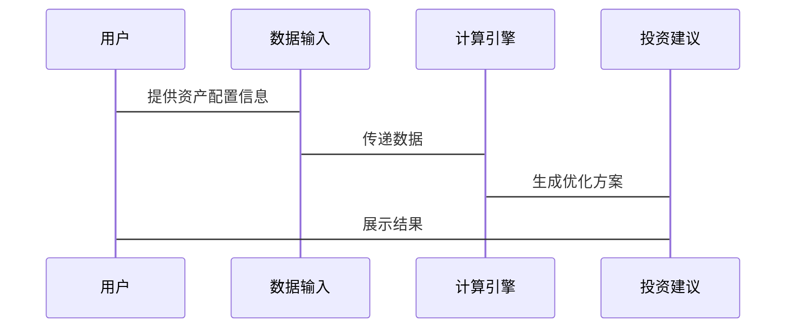

                 


# 约翰·伯格的养老金投资管理原则

## 关键词：养老金、投资管理、风险管理、长期投资、数学模型、系统架构

## 摘要

养老金投资管理是保障退休生活的重要组成部分，约翰·伯格的管理原则强调了安全性与收益性的平衡、风险管理的重要性以及长期投资策略。本文通过数学模型和系统架构设计，详细讲解这些原则，并结合实际案例进行分析，为读者提供实用的指导。

---

## 正文

### 第一部分：背景介绍

#### 第1章：养老金投资管理的背景与重要性

##### 1.1 问题背景
- **养老金的重要性**：养老金是许多人退休生活的主要收入来源，确保其安全性和稳定性至关重要。
- **养老金投资的必要性**：通过投资实现保值增值，以应对通货膨胀和退休生活的需求。
- **养老金投资的挑战**：市场波动、长寿风险和政策变化等都可能影响养老金的充足性。

##### 1.2 问题描述
- **问题目标**：确保养老金在退休期间的购买力，同时实现资产的最优配置。
- **问题现状**：传统投资方式存在收益不稳定、风险较高的问题。
- **问题解决**：通过科学的投资策略和风险管理，实现养老金的稳健增长。

##### 1.3 问题解决
- **投资管理的原则**：分散投资、长期持有、定期调整。
- **投资管理的策略**：根据风险承受能力选择合适的投资组合。
- **投资管理的工具**：利用数学模型和系统架构进行分析和优化。

##### 1.4 边界与外延
- **养老金投资的边界**：资金来源、投资期限、监管要求。
- **养老金投资的外延**：税收优惠、退休规划、遗产规划。
- **养老金投资的限制**：合规性、流动性、可承受风险。

##### 1.5 概念结构与核心要素
- **核心概念**：安全性、收益性、流动性。
- **核心要素**：资产配置、风险管理、定期审查。
- **概念结构**：通过系统架构将各要素整合，确保目标的实现。

---

### 第二部分：核心概念与联系

#### 第2章：养老金投资管理的核心概念

##### 2.1 核心概念原理
- **投资管理的基本原理**：通过分散投资降低风险，通过长期持有实现复利效应。
- **风险与收益的关系**：高收益意味着高风险，需在两者之间找到平衡点。
- **投资组合的构建**：根据个人风险偏好选择股票、债券、房地产等资产类别。

##### 2.2 概念属性特征对比
以下表格展示了不同投资策略的对比：

| 属性       | 保守型投资 | 平衡型投资 | 激进型投资 |
|------------|------------|------------|------------|
| 风险水平     | 低         | 中         | 高         |
| 预期收益     | 稳定       | 较高       | 高         |
| 适合人群     | 低风险承受者 | 中风险承受者 | 高风险承受者 |

##### 2.3 ER实体关系图架构

```mermaid
erd
  章节2.3
    entity 投资组合 {
      id
      资产类别
      风险等级
      预期收益
    }
    entity 风险管理 {
      id
      风险评估
      对策建议
    }
    entity 资产配置 {
      id
      资产比例
      投资策略
    }
    relation 资产配置 --> 投资组合: 实现
    relation 风险管理 --> 投资组合: 支持
```

---

### 第三部分：算法原理讲解

#### 第3章：养老金投资管理的算法原理

##### 3.1 算法原理
- **现金流贴现法**：评估投资项目未来现金流的现值，判断其合理性。
- **风险调整回报率**：根据风险调整预期回报率，确保投资决策的准确性。
- **投资组合优化**：通过优化算法选择最优资产配置，最大化收益并最小化风险。

##### 3.2 算法流程图



##### 3.3 算法代码实现

```python
import numpy as np
import pandas as pd
from scipy.optimize import minimize

# 示例：投资组合优化代码
def portfolio_optimization(returns, weights):
    # 定义目标函数
    def objective(weights):
        return -np.sum(weights * returns * weights.T)
    # 约束条件
    constraints = [{'type': 'eq', 'fun': lambda w: np.sum(w) - 1},
                   {'type': 'ineq', 'fun': lambda w: w >= 0}]
    # 求解
    result = minimize(objective, weights, constraints)
    return result.x

# 示例数据
returns = np.array([0.05, 0.07, 0.04])
weights = np.array([1/3, 1/3, 1/3])

optimal_weights = portfolio_optimization(returns, weights)
print("最优权重:", optimal_weights)
```

---

### 第四部分：数学模型和公式

#### 第4章：养老金投资管理的数学模型

##### 4.1 数学模型
- **现值公式**：用于计算未来现金流的当前价值。
- **终值公式**：用于计算当前投资在未来某时点的价值。
- **几何平均回报率**：衡量投资回报的长期增长率。

##### 4.2 数学公式
- **现值公式**：$$ PV = \frac{FV}{(1 + r)^n} $$
- **终值公式**：$$ FV = PV \times (1 + r)^n $$
- **几何平均回报率**：$$ r = \left( \prod_{i=1}^{n} (1 + r_i) \right)^{\frac{1}{n}} - 1 $$

---

### 第五部分：系统分析与架构设计

#### 第5章：系统分析与架构设计

##### 5.1 系统功能设计
- **用户界面**：直观展示投资组合、风险评估和预期收益。
- **数据输入**：允许用户输入资产配置、风险偏好等信息。
- **计算引擎**：执行数学模型和优化算法，生成投资建议。

##### 5.2 系统架构设计



##### 5.3 系统交互设计



---

### 第六部分：项目实战

#### 第6章：项目实战

##### 6.1 实战环境安装
- 安装必要的库：`numpy`, `pandas`, `scipy`

##### 6.2 核心代码实现

```python
import numpy as np
import pandas as pd
from scipy.optimize import minimize

def portfolio_optimization(returns, weights):
    def objective(weights):
        return -np.sum(weights * returns * weights.T)
    constraints = [{'type': 'eq', 'fun': lambda w: np.sum(w) - 1},
                   {'type': 'ineq', 'fun': lambda w: w >= 0}]
    result = minimize(objective, weights, constraints)
    return result.x

returns = np.array([0.05, 0.07, 0.04])
weights = np.array([1/3, 1/3, 1/3])

optimal_weights = portfolio_optimization(returns, weights)
print("最优权重:", optimal_weights)
```

##### 6.3 实战案例分析
- **案例分析**：假设某人有100万元，选择股票、债券和房地产作为投资标的。
- **优化结果**：通过代码计算得出各资产的最优配置比例。

##### 6.4 实战结果解读
- **结果展示**：输出优化后的资产配置比例，展示投资组合的预期收益和风险水平。

---

### 第七部分：最佳实践

#### 第7章：最佳实践

##### 7.1 小结
- 通过数学模型和系统架构设计，实现了养老金投资管理的优化。
- 强调分散投资、定期审查和长期持有的原则。

##### 7.2 注意事项
- 定期审视和调整投资组合，以适应市场变化。
- 考虑税收优惠和通胀影响，优化投资策略。

##### 7.3 拓展阅读
- 《投资学基础》
- 《风险管理与金融工具》

---

## 结语

约翰·伯格的养老金投资管理原则为投资者提供了科学的指导。通过系统的分析和实际案例的分析，我们可以更好地理解并应用这些原则，确保养老金的稳健增长和安全。希望本文能为读者在养老金投资管理方面提供有价值的参考。

