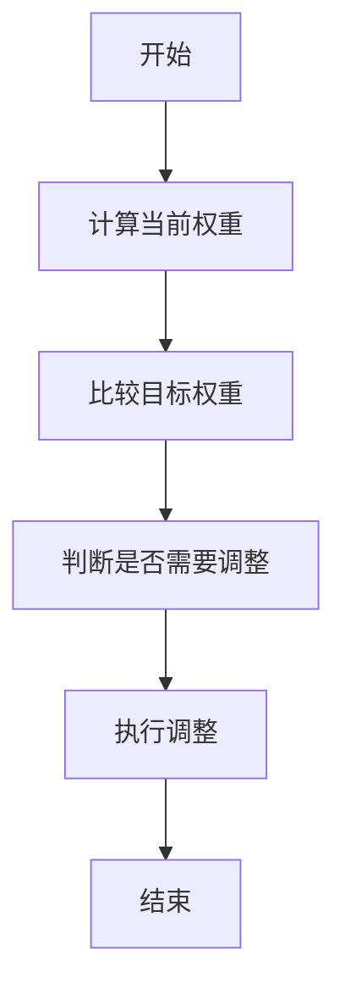

                 


# 约翰·伯格的再平衡策略

## 关键词：再平衡策略，投资组合优化，资产配置，权重调整，数学模型，系统架构

## 摘要：  
约翰·伯格的再平衡策略是一种经典的投资组合管理方法，旨在通过定期调整资产配置以维持目标权重，从而优化风险收益比。本文深入分析该策略的核心概念、数学模型、系统架构，并通过实际案例展示其应用，为读者提供全面的理解和实践指南。

---

## 第一部分：背景与概念

### 第1章：再平衡策略的背景与概念

#### 1.1 问题背景
- **投资组合管理的挑战**：投资者需要在不同资产之间分配资金，以在风险可控的前提下最大化收益。然而，市场波动会导致各资产的实际权重偏离目标权重，影响整体收益。
- **再平衡的必要性**：定期调整投资组合，使其恢复到预定的目标权重，是降低风险、优化收益的重要手段。
- **约翰·伯格策略的特点**：伯格的策略强调长期持有和定期再平衡，避免频繁交易，从而降低交易成本和税务负担。

#### 1.2 再平衡策略的定义与描述
- **定义**：再平衡是指根据市场变化或投资者风险承受能力的变化，调整投资组合中各资产的权重，使其符合预定的目标配置。
- **核心目标**：通过调整资产权重，优化投资组合的风险收益比，避免某一资产过度暴露。
- **边界与外延**：再平衡的范围可以是整体投资组合，也可以是特定资产类别；频率可以是定期（如季度）或事件驱动（如重大资产配置变化）。

#### 1.3 约翰·伯格策略的核心要素
- **核心概念**：长期投资、定期再平衡、避免频繁交易。
- **结构化分析**：策略包括目标设定、权重计算、调整执行三个主要环节。
- **属性特征对比表**：
  | 特性 | 再平衡策略 | 其他策略 |
  |------|------------|----------|
  | 目标 | 优化风险收益 | 追求短期收益 |
  | 频率 | 定期执行 | 高频交易 |
  | 成本 | 低 | 高 |

---

## 第二部分：核心原理与数学模型

### 第2章：再平衡策略的核心原理

#### 2.1 理论基础
- **投资组合优化的原理**：现代投资组合理论（MPT）指出，通过合理配置资产可以有效降低非系统性风险。
- **再平衡的数学模型**：权重调整是基于当前资产价值与目标权重的差异进行的。

#### 2.2 核心概念的ER实体关系图


#### 2.3 算法原理


#### 2.4 数学模型与公式
- **权重计算公式**：
  $$ w_i = \frac{a_i}{\sum_{j=1}^{n} a_j} $$
  其中，$w_i$ 是第 $i$ 个资产的权重，$a_i$ 是第 $i$ 个资产的金额，$n$ 是资产总数。
- **调整幅度计算**：
  $$ \Delta w_i = w_i^{\text{目标}} - w_i^{\text{当前}} $$
  其中，$\Delta w_i$ 是第 $i$ 个资产的调整幅度。

---

## 第三部分：系统分析与架构设计

### 第3章：系统架构与实现

#### 3.1 问题场景介绍
- **应用场景**：个人投资者和机构投资者均可使用该策略。
- **系统功能需求**：包括资产配置、权重计算、再平衡决策和执行功能。

#### 3.2 系统功能设计
- **模块划分**：
  - 输入模块：接收用户输入的目标权重和当前资产价值。
  - 计算模块：计算当前权重和调整幅度。
  - 决策模块：判断是否需要调整。
  - 执行模块：执行调整操作。

#### 3.3 领域模型
```mermaid
classDiagram
    class 投资组合管理 {
        +当前权重: Map<String, Double>
        +目标权重: Map<String, Double>
        +计算再平衡操作()
    }
    class 资产配置 {
        +资产列表: List<String>
        +权

---

## 第四部分：项目实战

### 第4章：环境安装与代码实现

#### 4.1 环境安装
- **Python环境**：安装Python 3.8及以上版本。
- **依赖库**：安装`pandas`、`numpy`、`scipy`。

#### 4.2 核心代码实现
```python
import pandas as pd
import numpy as np

def calculate_weights(current_values, target_weights):
    total = sum(current_values)
    return {asset: value / total for asset, value in zip(target_weights.keys(), current_values)}

def rebalance_portfolio(current_values, target_weights):
    current_weights = calculate_weights(current_values, target_weights)
    rebalance_needed = {}
    for asset in target_weights:
        target = target_weights[asset]
        current = current_weights.get(asset, 0)
        rebalance_needed[asset] = target - current
    return rebalance_needed

# 示例用法
target_weights = {'股票': 0.6, '债券': 0.3, '现金': 0.1}
current_values = {'股票': 60000, '债券': 30000, '现金': 10000}
print(rebalance_portfolio(current_values, target_weights))
```

#### 4.3 案例分析
- **案例背景**：假设目标权重为股票60%、债券30%、现金10%，当前资产价值分别为6万元、3万元、1万元。
- **计算过程**：
  - 当前总价值：10万元。
  - 当前权重：股票60%，债券30%，现金10%。
  - 需要调整：假设股票下跌10%，当前价值为5.4万元，债券上涨5%，当前价值为3.15万元，现金不变。
  - 调整后：股票权重为54%，债券31.5%，现金14.5%，需要调整到目标权重。

---

## 第五部分：总结与扩展阅读

### 第5章：总结与扩展

#### 5.1 总结
- **策略优点**：降低风险、优化收益、降低交易成本。
- **潜在问题**：频繁调整可能增加成本，市场波动可能影响效果。

#### 5.2 最佳实践 Tips
- **定期审查**：建议每季度审查一次投资组合。
- **长期视角**：避免短期市场波动影响决策。
- **风险管理**：设置止损点以保护资本。

#### 5.3 注意事项
- **市场风险**：再平衡策略无法完全规避市场风险。
- **税务影响**：调整资产可能涉及税务问题，需谨慎处理。

#### 5.4 拓展阅读
- 《投资学》：深入理解现代投资组合理论。
- 《约翰·伯格的投资策略》：学习伯格的经典策略。

---

通过以上结构，读者可以全面理解约翰·伯格的再平衡策略，并在实际投资中应用这些知识。

