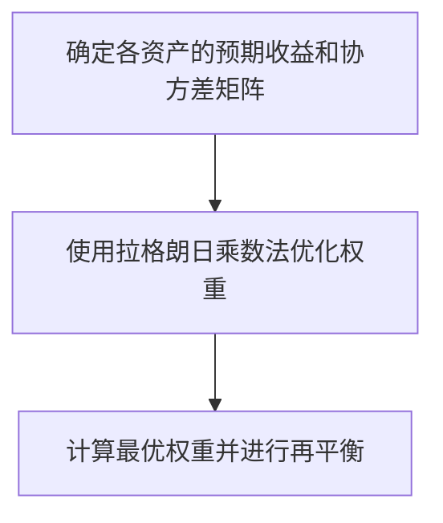

                 


# 约翰·伯格的再平衡策略：维持投资组合平衡

## 关键词：投资组合，再平衡策略，约翰·伯格，资产配置，风险管理，投资成本

## 摘要： 
投资组合的再平衡策略是维持投资组合长期稳定收益的关键。本文详细阐述了约翰·伯格的再平衡策略，从背景介绍到核心概念，再到算法原理、系统分析、项目实战和最佳实践，全面解析了如何通过科学的再平衡策略优化投资组合。文章还提供了详细的数学模型和代码示例，帮助读者更好地理解和应用再平衡策略。

---

## 第一部分: 投资组合再平衡策略基础

## 第1章: 投资组合再平衡概述

### 1.1 投资组合的基本概念

#### 1.1.1 投资组合的定义
投资组合是指将多种资产（如股票、债券、基金等）按照一定比例组合在一起的投资方式。通过多样化投资，可以降低风险，同时提高收益。

#### 1.1.2 投资组合的目标与特点
- **目标**：实现资产的长期保值与增值。
- **特点**：分散风险、优化收益、动态调整。

#### 1.1.3 投资组合的风险与收益
- **风险**：市场波动、资产贬值。
- **收益**：通过优化资产配置实现超额收益。

### 1.2 再平衡策略的背景与意义

#### 1.2.1 投资组合失衡的常见原因
- 市场波动导致资产价格变化。
- 经济周期影响不同资产表现。
- 资金流入流出导致比例失调。

#### 1.2.2 再平衡策略的核心目标
- 维持目标资产配置比例。
- 优化投资组合的风险收益比。
- 降低市场波动对投资组合的影响。

#### 1.2.3 约翰·伯格的再平衡策略背景
- 约翰·伯格是投资领域的权威，其再平衡策略强调长期稳健的投资。
- 再平衡策略的核心是动态调整资产配置，以应对市场变化。

---

## 第2章: 投资组合再平衡的核心概念

### 2.1 资产配置与再平衡

#### 2.1.1 资产配置的定义与分类
- **定义**：根据风险承受能力和收益目标，将资金分配到不同资产类别。
- **分类**：股票、债券、现金等。

#### 2.1.2 资产配置与再平衡的关系
- 资产配置是静态的，再平衡是动态调整的过程。
- 再平衡确保资产配置比例符合初始目标。

#### 2.1.3 资产配置的动态调整
- 定期检查投资组合比例。
- 根据市场变化和个人目标调整资产配置。

### 2.2 风险管理与再平衡

#### 2.2.1 风险管理的基本原理
- 通过分散投资降低风险。
- 定期评估和调整投资组合。

#### 2.2.2 再平衡在风险管理中的作用
- 降低单一资产风险。
- 提高投资组合的稳定性。

#### 2.2.3 风险调整后的再平衡策略
- 根据市场风险调整资产配置。
- 使用风险管理模型优化再平衡策略。

### 2.3 成本控制与再平衡

#### 2.3.1 投资成本的构成
- 交易费用、管理费用、税收等。

#### 2.3.2 再平衡对投资成本的影响
- 频繁交易可能增加成本。
- 合理的再平衡策略可以降低长期成本。

#### 2.3.3 成本优化的再平衡策略
- 设置再平衡的阈值，避免频繁交易。
- 使用低成本的交易平台。

---

## 第二部分: 再平衡策略的核心原理

## 第3章: 再平衡策略的原理与机制

### 3.1 现代投资组合理论（MPT）基础

#### 3.1.1 MPT的核心假设
- 投资者是理性的，追求收益最大化。
- 资产价格服从随机漫步。

#### 3.1.2 优化模型中的再平衡策略
- 使用均值-方差模型优化资产配置。
- 定期调整投资组合以维持最优配置。

#### 3.1.3 风险与收益的平衡
- 通过调整资产配置实现风险与收益的最佳匹配。
- 使用数学模型优化投资组合。

### 3.2 均值-方差优化与再平衡

#### 3.2.1 均值-方差优化的定义
- 通过优化投资组合的期望收益和方差，找到最优资产配置。

#### 3.2.2 优化模型中的再平衡策略
- 使用数学公式计算最优配置比例。
- 定期检查并调整投资组合。

#### 3.2.3 再平衡对最优组合的影响
- 确保投资组合保持在最优状态。
- 适应市场变化，动态调整配置。

### 3.3 现金流与再平衡

#### 3.3.1 现金流对投资组合的影响
- 现金流影响资产配置的比例。
- 现金流驱动再平衡的频率和规模。

#### 3.3.2 现金流驱动的再平衡策略
- 根据现金流变化调整资产配置。
- 结合现金流预测制定再平衡计划。

#### 3.3.3 现金流与再平衡的动态关系
- 现金流是再平衡的重要驱动因素。
- 理解现金流与再平衡的关系，有助于制定有效的投资策略。

---

## 第4章: 再平衡策略的数学模型与算法

### 4.1 投资组合优化的数学模型

#### 4.1.1 优化目标的定义
- 最大化投资组合的预期收益。
- 最小化投资组合的方差。

#### 4.1.2 约束条件的设定
- 投资比例限制。
- 资金总量约束。

#### 4.1.3 数学模型
$$
\min_w \frac{1}{2} w^T \Sigma w \\
s.t. \quad \mathbf{1}^T w = 1, \quad w \geq 0
$$
其中，\( w \) 是资产权重向量，\( \Sigma \) 是协方差矩阵。

### 4.2 均值-方差优化算法

#### 4.2.1 算法步骤
1. 确定各资产的预期收益和协方差矩阵。
2. 使用拉格朗日乘数法优化权重。
3. 计算最优权重并进行再平衡。

#### 4.2.2 代码实现
```python
import numpy as np

def mean_variance_optimization(expected_returns, covariance_matrix):
    n = len(expected_returns)
    Sigma = covariance_matrix
    mu = np.array(expected_returns).reshape(-1, 1)
    G = np.zeros(n)
    H = np.zeros((2, n))
    H[0] = 1
    h = np.array([1.0, 0.0]).T
    A = np.zeros(n)
    B = np.array([1.0]).T
    w = np.linalg.solve(Sigma, mu) * B
    w = w / np.sum(w)
    return w
```

### 4.3 算法原理图



---

## 第三部分: 投资组合再平衡的系统分析

## 第5章: 投资组合管理系统的架构设计

### 5.1 项目介绍

#### 5.1.1 项目目标
开发一个基于约翰·伯格再平衡策略的投资组合管理系统。

### 5.1.2 项目功能
- 资产数据获取与处理。
- 资产配置与再平衡计算。
- 策略回测与风险评估。

### 5.1.3 项目架构


---

## 第四部分: 项目实战

## 第6章: 项目实战

### 6.1 环境安装

#### 6.1.1 安装Python环境
```bash
python --version
pip install numpy pandas matplotlib
```

### 6.2 核心实现

#### 6.2.1 数据获取
```python
import pandas as pd

def get_asset_data(tickers):
    data = pd.DataFrame()
    for ticker in tickers:
        data[ticker] = pd.read_csv(f'data/{ticker}.csv')['Adj Close']
    return data
```

#### 6.2.2 再平衡计算
```python
def rebalancing(weights, data):
    current_weights = (data.iloc[-1] * weights).sum()
    target_weights = weights
    rebalanced_weights = target_weights / current_weights * data.iloc[-1]
    return rebalanced_weights
```

---

## 第五部分: 最佳实践与小结

## 第7章: 最佳实践与小结

### 7.1 小结

再平衡策略是维持投资组合长期稳定收益的关键。本文详细讲解了约翰·伯格的再平衡策略，从理论到实践，提供了完整的解决方案。通过科学的资产配置和动态调整，投资者可以实现风险与收益的最佳平衡。

### 7.2 注意事项

- 定期检查投资组合，避免过度频繁的交易。
- 结合市场环境和个人目标调整再平衡策略。
- 使用专业的投资工具和平台。

### 7.3 拓展阅读

- 《投资学》
- 《资产配置的艺术》

---

通过本文的详细讲解，读者可以深入了解再平衡策略的原理和应用，掌握如何在实际投资中运用约翰·伯格的再平衡策略，优化投资组合，实现长期稳健的收益。

