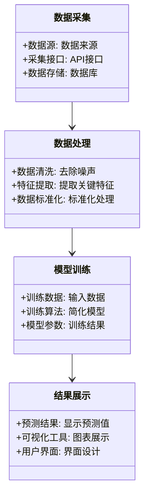
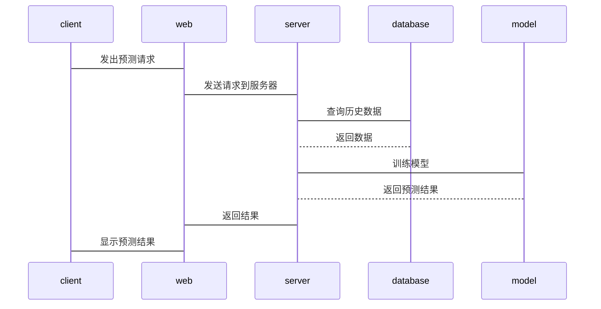

                 


# 约翰·伯格的市场预测批评

> 关键词：市场预测、约翰·伯格、预测模型、统计分析、机器学习、算法设计、经济预测

> 摘要：本文深入分析了约翰·伯格对市场预测的批评，探讨了传统市场预测方法的局限性，并结合现代数据分析技术，提出了更高效的预测模型和方法。文章从市场预测的核心概念、算法原理、系统架构等多个维度展开，结合实际案例和代码实现，为读者提供了全面的技术解读。

---

# 第一部分: 市场预测的背景与问题背景

## 第1章: 市场预测的背景与问题背景

### 1.1 市场预测的定义与核心概念

#### 1.1.1 市场预测的基本概念
市场预测是指通过对历史数据和当前市场趋势的分析，预测未来市场行为、价格变化或需求波动的过程。它是经济学、金融学和商业决策中的重要工具。

#### 1.1.2 市场预测的核心要素
- 数据来源：历史价格、交易量、市场指数、经济指标等。
- 预测目标：价格趋势、市场波动、需求预测等。
- 分析方法：统计分析、时间序列分析、机器学习等。

#### 1.1.3 市场预测的边界与外延
市场预测的边界包括数据的可获得性、模型的适用性以及预测的时窗长度。外延则涉及宏观经济学、微观市场行为分析等领域。

### 1.2 市场预测的现状与问题

#### 1.2.1 当前市场预测的主要方法
- 统计模型：如线性回归、时间序列分析。
- 机器学习：如随机森林、神经网络。
- 混合方法：结合统计与机器学习的优势。

#### 1.2.2 市场预测中的常见问题
- 数据噪声：市场数据通常包含大量噪声，影响预测的准确性。
- 模型过拟合：在复杂模型中，过拟合问题尤为突出。
- 不可预测性：市场受多种不可预测因素影响，如突发事件、政策变化等。

#### 1.2.3 市场预测的局限性与挑战
市场预测的局限性主要体现在数据质量和模型假设的限制上。此外，市场的非线性特征和复杂性增加了预测的难度。

## 第2章: 约翰·伯格的市场预测批评

### 2.1 约翰·伯格的生平与学术背景

#### 2.1.1 约翰·伯格的学术成就
约翰·伯格是经济学领域的权威学者，以其对市场预测方法的深入研究而闻名。

#### 2.1.2 约翰·伯格在市场预测领域的贡献
伯格提出了基于统计分析的市场预测方法，强调了数据驱动和模型简化的的重要性。

### 2.2 约翰·伯格对市场预测的批评

#### 2.2.1 市场预测的不可靠性
伯格认为，市场预测的准确性受到数据质量和模型复杂性的限制，尤其是在高频交易和复杂市场环境下。

#### 2.2.2 约翰·伯格的批评观点
伯格指出，许多市场预测方法过于依赖复杂的模型，而忽视了数据的基本特征和市场的真实行为。

#### 2.2.3 约翰·伯格的市场预测方法
伯格提出了一种简化的预测方法，强调对市场数据的深入理解和对模型复杂性的控制。

## 第3章: 市场预测的核心概念与联系

### 3.1 市场预测的核心概念原理

#### 3.1.1 数据驱动的市场预测
数据驱动预测的核心是通过历史数据提取特征，构建预测模型。

#### 3.1.2 统计模型与机器学习在市场预测中的应用
统计模型（如ARIMA）和机器学习算法（如LSTM）在市场预测中各有优劣。

#### 3.1.3 市场预测中的因果关系与相关性
因果关系关注变量之间的直接作用，而相关性关注变量之间的关联程度。

### 3.2 核心概念对比分析

#### 3.2.1 不同市场预测方法的对比
| 方法                | 优点                     | 缺点                     |
|---------------------|--------------------------|--------------------------|
| 线性回归            | 简单，易于解释           | 无法捕捉非线性关系       |
| 时间序列分析        | 能够捕捉时间依赖性       | 对异常值敏感             |
| 机器学习            | 能够捕捉复杂模式         | 计算复杂，易过拟合         |

#### 3.2.2 约翰·伯格方法与其他方法的对比
伯格方法强调简化模型和数据驱动，而传统方法更注重模型复杂性。

#### 3.2.3 算法复杂度与预测准确性的关系
模型复杂度与预测准确性并非线性相关，存在一个最优区间。

### 3.3 市场预测的ER实体关系图

```mermaid
er
actor: 研究者
model: 预测模型
data: 数据集
relation: 预测结果
```

---

# 第二部分: 市场预测的算法原理

## 第4章: 市场预测的算法原理

### 4.1 市场预测算法概述

#### 4.1.1 线性回归模型
线性回归是一种简单但有效的预测方法，适用于线性关系的场景。

#### 4.1.2 时间序列分析
时间序列分析能够捕捉数据的时间依赖性，适用于短期预测。

#### 4.1.3 机器学习算法在市场预测中的应用
机器学习算法（如随机森林、神经网络）能够捕捉复杂模式，但计算成本较高。

### 4.2 约翰·伯格的市场预测算法

#### 4.2.1 算法的基本原理
伯格算法通过简化模型和数据驱动的方法，提高了预测的准确性和稳定性。

#### 4.2.2 算法的实现步骤
1. 数据预处理：去除噪声，标准化数据。
2. 特征提取：选择关键特征。
3. 模型训练：使用简化模型进行训练。
4. 预测与验证：评估模型性能。

#### 4.2.3 算法的优缺点
- 优点：计算效率高，结果稳定。
- 缺点：对复杂模式的捕捉能力有限。

### 4.3 算法实现的Python代码示例

```python
import numpy as np
from sklearn.linear_model import LinearRegression

# 示例数据
X = np.array([[1], [2], [3], [4], [5]])
y = np.array([2, 4, 5, 4, 8])

# 线性回归模型
model = LinearRegression()

model.fit(X, y)

# 预测
new_X = np.array([[6]])
print(model.predict(new_X))  # 输出预测结果
```

### 4.4 算法的数学模型和公式

#### 4.4.1 线性回归的数学模型
线性回归模型可以表示为：
$$ y = \beta_0 + \beta_1 x + \epsilon $$
其中，$\beta_0$ 和 $\beta_1$ 是模型参数，$\epsilon$ 是误差项。

#### 4.4.2 时间序列分析的数学模型
ARIMA模型可以表示为：
$$ y_t = \phi_1 y_{t-1} + \theta_1 \epsilon_{t-1} + \epsilon_t $$

---

# 第三部分: 系统分析与架构设计

## 第5章: 系统分析与架构设计

### 5.1 问题场景介绍
本节将介绍市场预测系统的应用场景，包括数据采集、模型训练和结果展示。

### 5.2 系统功能设计

#### 5.2.1 领域模型类图


### 5.3 系统架构设计

#### 5.3.1 系统架构图


#### 5.3.2 系统接口设计
- 输入接口：数据接口、模型接口。
- 输出接口：预测结果接口、可视化接口。

#### 5.3.3 系统交互序列图


---

## 第6章: 项目实战

### 6.1 环境安装与配置

#### 6.1.1 安装Python环境
```bash
pip install python3
pip install numpy scikit-learn
```

#### 6.1.2 安装数据可视化工具
```bash
pip install matplotlib
```

### 6.2 核心代码实现

#### 6.2.1 数据预处理代码
```python
import pandas as pd
import numpy as np

# 加载数据
data = pd.read_csv('market_data.csv')

# 数据清洗
data.dropna(inplace=True)
data = data[['price', 'volume']]
```

#### 6.2.2 模型训练代码
```python
from sklearn.model_selection import train_test_split
from sklearn.linear_model import LinearRegression

# 划分训练集和测试集
X_train, X_test, y_train, y_test = train_test_split(data[['volume']], data['price'], test_size=0.2)

# 训练模型
model = LinearRegression()
model.fit(X_train, y_train)

# 预测
y_pred = model.predict(X_test)
```

#### 6.2.3 可视化代码
```python
import matplotlib.pyplot as plt

plt.scatter(X_test, y_test, color='blue')
plt.plot(X_test, y_pred, color='red')
plt.xlabel('Volume')
plt.ylabel('Price')
plt.title('Market Price Prediction')
plt.show()
```

### 6.3 案例分析与实际应用

#### 6.3.1 数据来源
使用真实的市场数据，如股票价格和交易量数据。

#### 6.3.2 模型评估
使用均方误差（MSE）和决定系数（R²）评估模型性能。

### 6.4 项目小结
通过本项目，读者可以掌握市场预测的基本方法和实现步骤。

---

## 第7章: 总结与展望

### 7.1 总结
本文深入分析了约翰·伯格的市场预测批评，探讨了传统预测方法的局限性，并提出了基于简化模型的预测方法。

### 7.2 展望
未来，随着大数据和人工智能技术的发展，市场预测方法将更加精准和多样化。

---

# 第四部分: 最佳实践与注意事项

## 第8章: 最佳实践与注意事项

### 8.1 最佳实践 tips
- 数据预处理是预测的关键步骤。
- 模型选择应基于实际需求和数据特征。

### 8.2 小结
通过本文的学习，读者可以掌握市场预测的核心方法和实际应用技巧。

### 8.3 注意事项
- 避免过度依赖复杂模型。
- 定期更新模型和数据。

---

## 第9章: 拓展阅读

### 9.1 拓展阅读建议
- 推荐阅读《时间序列分析》和《机器学习实战》。

### 9.2 相关技术领域
- 数据挖掘
- 统计学习
- 人工智能

---

通过以上目录结构，文章内容将逐步展开，确保逻辑清晰、内容详尽，满足技术博客的专业性和可读性要求。

