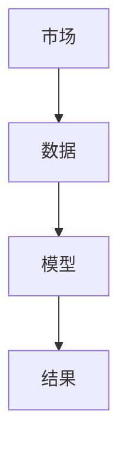

                 


# 《约翰·伯格的市场预测警告：为什么不应试图择时》

## 关键词：市场预测、约翰·伯格、择时交易、投资策略、风险管理、技术分析

## 摘要：  
本文将探讨市场预测的复杂性和不确定性，通过分析约翰·伯格的市场预测警告，揭示为什么试图择时交易往往不可行。文章将从技术角度出发，结合市场预测的算法原理、系统架构设计、数学模型等多方面进行深入分析，并通过实际案例说明为什么投资者应避免依赖市场预测，转而采取更稳健的投资策略。  

---

## 第一部分：市场预测的背景与挑战

### 第1章：市场预测的背景介绍

#### 1.1 市场预测的背景

- **1.1.1 市场预测的定义与目标**  
  市场预测是指通过分析历史数据和市场趋势，预测未来市场走势的过程。其目标是帮助投资者做出更明智的决策，以规避风险或抓住投资机会。

- **1.1.2 市场预测的核心概念**  
  市场预测涉及多种方法，包括技术分析、基本面分析和算法交易。这些方法旨在识别市场中的规律和模式，从而预测未来的价格走势。

- **1.1.3 市场预测的边界与外延**  
  市场预测的边界包括数据的局限性、模型的假设以及市场的不可预测性。其外延则涉及风险管理、投资策略优化等领域。

#### 1.2 问题背景与描述

- **1.2.1 市场预测的复杂性**  
  市场受多种因素影响，如经济指标、政策变化、投资者情绪等。这些因素的交互作用使得市场预测变得极其复杂。

- **1.2.2 市场预测的局限性**  
  市场预测的准确性受限于数据质量和模型假设。此外，市场参与者的行为往往不可预测，导致模型失效。

- **1.2.3 为什么人们试图预测市场**  
  人们试图预测市场的主要原因是追求超额收益和规避风险。然而，这种行为往往忽略了市场的随机性和不可预测性。

#### 1.3 问题解决与核心要素

- **1.3.1 市场预测的解决方案**  
  通过结合技术分析、基本面分析和风险管理，可以制定更稳健的投资策略。

- **1.3.2 核心要素与概念结构**  
  市场预测的核心要素包括数据采集、模型构建、风险评估和结果解读。

---

## 第二部分：市场预测的核心概念与联系

### 第2章：市场预测的核心概念原理

#### 2.1 市场预测的原理分析

- **2.1.1 市场预测的基本原理**  
  市场预测基于统计学和数学模型，试图发现数据中的规律。

- **2.1.2 市场预测的核心要素**  
  包括历史数据、市场趋势、投资者行为等。

- **2.1.3 市场预测的内在联系**  
  数据、模型和结果之间存在相互依赖关系，影响预测的准确性。

#### 2.2 核心概念特征对比

- **2.2.1 不同预测方法的特征对比**  
  | 方法         | 特点                     |
  |--------------|--------------------------|
  | 技术分析     | 依赖价格和成交量数据     |
  | 基本面分析     | 依赖公司财务数据         |
  | 算法交易     | 依赖机器学习模型         |

- **2.2.2 市场预测与实际结果的差异**  
  市场预测的结果往往与实际走势存在较大偏差，尤其是短期预测。

- **2.2.3 市场预测的不确定性分析**  
  市场的随机性和不可预测性使得预测结果具有高度不确定性。

#### 2.3 实体关系图分析



---

## 第三部分：市场预测的算法原理与数学模型

### 第3章：市场预测的算法原理

#### 3.1 市场预测算法概述

- **3.1.1 常见的市场预测算法**  
  - 线性回归
  - 时间序列分析
  - 机器学习算法（如随机森林、神经网络）

- **3.1.2 算法的优缺点分析**  
  | 算法         | 优点                     | 缺点                     |
  |--------------|--------------------------|--------------------------|
  | 线性回归     | 简单，易于解释             | 无法捕捉复杂关系         |
  | 时间序列分析   | 适合处理时间相关性数据     | 对异常值敏感             |
  | 机器学习     | 能捕捉复杂模式             | 计算复杂，需要大量数据   |

- **3.1.3 算法选择的原则**  
  根据数据类型和预测目标选择合适的算法。

#### 3.2 算法原理的详细讲解

- **3.2.1 线性回归算法原理**  
  线性回归通过最小化预测值与实际值的平方差，找到最佳拟合直线。

  ```mermaid
  graph TD
      X[输入特征] --> Y[输出结果]
      X --> W[权重]
      W --> F[线性组合]
      F --> O[预测结果]
  ```

- **3.2.2 时间序列分析算法**  
  时间序列分析通过识别数据中的趋势、周期性和季节性模式，预测未来值。

- **3.2.3 机器学习算法的应用**  
  机器学习算法（如随机森林和神经网络）能够捕捉非线性关系，适用于复杂的市场预测。

#### 3.3 算法流程图分析

- **3.3.1 线性回归算法流程图**  
  ```mermaid
  graph TD
      Start --> CollectData[收集数据]
      CollectData --> CleanData[清洗数据]
      CleanData --> SplitData[划分训练集和测试集]
      SplitData --> TrainModel[训练模型]
      TrainModel --> EvaluateModel[评估模型]
      EvaluateModel --> End
  ```

---

## 第四部分：系统分析与架构设计

### 第4章：系统分析与架构设计

#### 4.1 问题场景介绍

- 投资者希望通过预测市场走势，制定投资策略。

#### 4.2 系统功能设计

- **4.2.1 系统功能模块**  
  - 数据采集与处理
  - 模型训练与预测
  - 结果可视化与分析

- **4.2.2 领域模型图分析**  
  ```mermaid
  classDiagram
      class 数据采集模块 {
          输入数据源
          输出清洗数据
      }
      class 模型训练模块 {
          输入清洗数据
          输出预测结果
      }
      class 结果分析模块 {
          输入预测结果
          输出可视化报告
      }
      数据采集模块 --> 模型训练模块
      模型训练模块 --> 结果分析模块
  ```

#### 4.3 系统架构设计

- **4.3.1 系统架构图分析**  
  ```mermaid
  graph TD
      Client[客户端] --> API[API接口]
      API --> DB[数据库]
      API --> MLModel[机器学习模型]
      MLModel --> DB
  ```

---

## 第五部分：项目实战

### 第5章：项目实战

#### 5.1 环境安装与配置

- **5.1.1 环境要求**  
  - Python 3.8+
  - Jupyter Notebook
  - Scikit-learn、Pandas、Matplotlib

#### 5.2 系统核心实现源代码

```python
import pandas as pd
from sklearn.linear_model import LinearRegression
from sklearn.metrics import mean_squared_error

# 数据加载与预处理
data = pd.read_csv('market_data.csv')
X = data[['open', 'high', 'low', 'volume']]
y = data['close']

# 数据划分
from sklearn.model_selection import train_test_split
X_train, X_test, y_train, y_test = train_test_split(X, y, test_size=0.2, random_state=42)

# 模型训练
model = LinearRegression()
model.fit(X_train, y_train)

# 模型预测
y_pred = model.predict(X_test)

# 模型评估
mse = mean_squared_error(y_test, y_pred)
print(f'Mean Squared Error: {mse}')
```

#### 5.3 代码解读与分析

- 数据加载与预处理：从CSV文件中读取市场数据，并提取特征和目标变量。
- 数据划分：将数据划分为训练集和测试集。
- 模型训练：使用线性回归模型训练数据。
- 模型预测：使用训练好的模型预测测试集的输出。
- 模型评估：计算均方误差，评估模型的性能。

#### 5.4 实际案例分析

- 使用历史股价数据，训练线性回归模型，预测未来股价。
- 通过实际案例分析，展示模型的预测能力和局限性。

#### 5.5 项目小结

- 通过项目实战，读者可以理解市场预测的实际应用。
- 强调模型的局限性和预测结果的不确定性。

---

## 第六部分：最佳实践与小结

### 第6章：最佳实践

#### 6.1 小结

- 市场预测的复杂性和不确定性使得其难以准确预测。
- 投资者应避免过度依赖市场预测，转而采取分散投资和风险管理策略。

#### 6.2 注意事项

- 选择合适的数据和模型，避免过度拟合。
- 定期评估和调整投资策略。

#### 6.3 拓展阅读

- 《投资学》
- 《算法交易》
- 《风险管理》

---

## 结语

本文通过技术角度分析了市场预测的复杂性和不确定性，结合约翰·伯格的市场预测警告，强调了投资者不应过度依赖市场预测。希望本文能为读者提供有价值的见解，帮助他们制定更稳健的投资策略。

