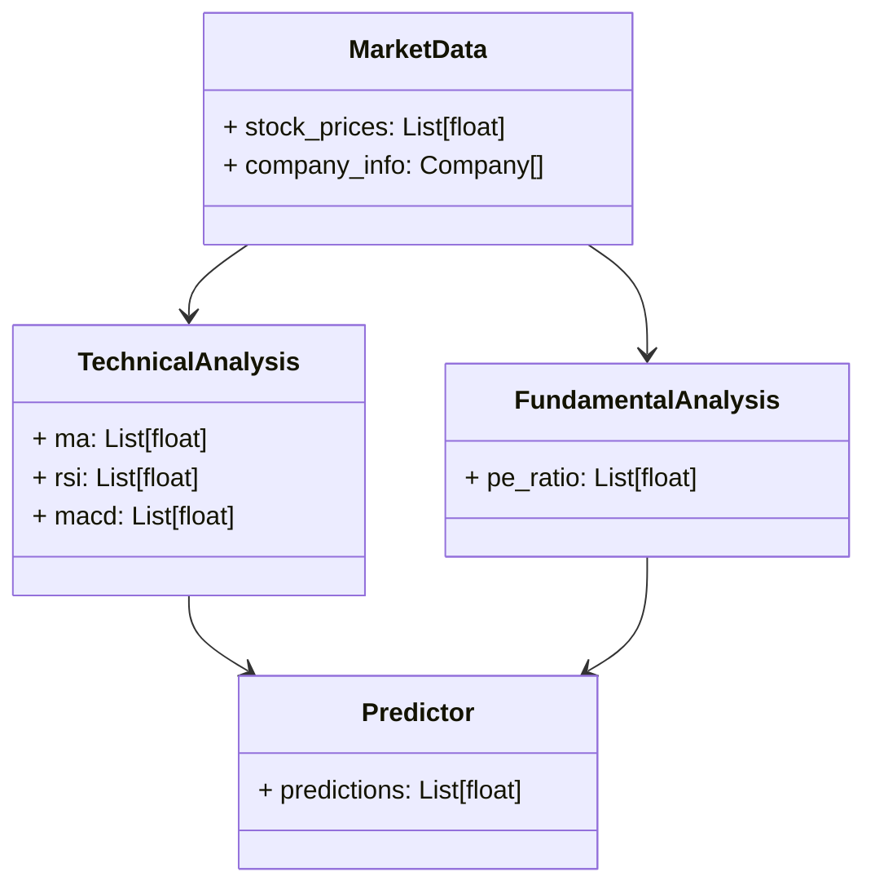

                 


# 约翰·伯格的市场预测警告：为什么不要试图择时

## 关键词：市场预测、择时、概率论、统计学、技术分析、基本面分析、投资策略

## 摘要：本文深入探讨了市场预测的不可靠性，重点分析了约翰·伯格对择时的警告。通过概率论和统计学的视角，结合技术分析和基本面分析的算法实现，揭示了市场预测的局限性。最终，本文主张采用长期投资策略，避免短期择时带来的风险。

---

## 第一部分：市场预测的背景与现状

### 第1章：市场预测的定义与挑战

#### 1.1 市场预测的基本概念

##### 1.1.1 市场预测的定义与范围
市场预测是指通过分析历史数据和市场趋势，预测未来市场走势的过程。其范围涵盖股票、债券、商品等多种金融资产。

##### 1.1.2 市场预测的常见误区
- **误区1**：认为市场是可预测的。
- **误区2**：忽视市场的随机性和不确定性。
- **误区3**：过度依赖技术分析或基本面分析。

##### 1.1.3 投资者与市场预测的关系
- 投资者往往希望通过市场预测来获取超额收益，但这种行为往往导致过度交易和情绪化决策。

#### 1.2 市场预测的常见工具与方法

##### 1.2.1 技术分析的定义与特点
技术分析通过分析历史价格数据，预测未来价格走势。其特点包括：
- 基于价格和成交量数据。
- 强调市场的自我修复能力。
- 使用图表和指标（如K线图、MACD、RSI等）。

##### 1.2.2 基本面分析的定义与特点
基本面分析通过分析公司的财务状况、行业地位、宏观经济环境等因素，预测未来股价走势。其特点包括：
- 强调公司内在价值。
- 数据来源包括财务报表、行业报告等。
- 结果具有一定的滞后性。

##### 1.2.3 其他市场预测方法的对比
- **数量分析**：通过数学模型和算法预测市场走势。
- **行为分析**：研究投资者心理和行为对市场的影响。
- **宏观经济分析**：通过宏观经济指标预测市场走势。

#### 1.3 约翰·伯格的市场预测观点

##### 1.3.1 约翰·伯格的市场预测警告
约翰·伯格强调市场预测的不确定性，并警告投资者不要试图通过择时来获取超额收益。

##### 1.3.2 为什么伯格反对择时
- 市场预测的准确性难以保证。
- 拙于择时会导致交易成本增加。
- 长期投资能够分散市场波动的风险。

##### 1.3.3 拆解市场预测的不确定性
- 市场参与者的行为复杂性。
- 宏观经济环境的不确定性。
- 信息不对称和市场噪声的影响。

---

## 第二部分：市场预测的数学原理与概率分析

### 第2章：概率论与市场预测

#### 2.1 概率论基础

##### 2.1.1 概率的基本定义与性质
概率是衡量某事件发生的可能性大小，其范围在0到1之间。

##### 2.1.2 随机变量与概率分布
- 随机变量：可以取多个值的变量，如股票价格。
- 概率分布：描述随机变量取值及其对应的概率。

##### 2.1.3 贝叶斯定理与市场预测
贝叶斯定理通过更新概率来反映新信息对预测的影响。

##### 2.1.4 马尔可夫链模型
马尔可夫链用于描述系统状态的转移过程，常用于预测市场的短期波动。

#### 2.2 市场预测的统计学基础

##### 2.2.1 时间序列分析的基本概念
时间序列分析通过分析数据的时序特征，预测未来的趋势。

##### 2.2.2 回归分析与预测模型
回归分析通过建立变量之间的关系模型，预测市场走势。

##### 2.2.3 统计学在市场预测中的局限性
- 数据样本的局限性。
- 市场参与者的理性与非理性行为。
- 市场环境的不可预测性。

#### 2.3 市场预测中的马尔可夫链模型

##### 2.3.1 马尔可夫链的基本原理
马尔可夫链假设系统的下一个状态仅依赖于当前状态，与过去无关。

##### 2.3.2 市场状态转移的马尔可夫模型
通过马尔可夫链模型，可以预测市场状态的转移概率。

##### 2.3.3 马尔可夫链在市场预测中的应用
- 预测市场的短期波动。
- 分析市场的周期性特征。

---

## 第三部分：市场预测的算法原理与实现

### 第3章：技术分析与基本面分析的算法实现

#### 3.1 技术分析的算法实现

##### 3.1.1 移动平均线（MA）的算法实现
- MA的计算公式：$$MA_t = \frac{1}{n} \sum_{i=1}^{n} p_{t-i}$$
- 代码实现：
```python
def calculate_ma(prices, window):
    ma = []
    for i in range(len(prices)):
        if i < window:
            ma.append(prices[i])
        else:
            ma.append(sum(prices[i-window:i+1])/window)
    return ma
```

##### 3.1.2 相对强弱指数（RSI）的算法实现
- RSI的计算公式：$$RSI = \frac{100}{1 + \frac{A}{B}}$$
  - A为上涨幅度，B为下跌幅度。
- 代码实现：
```python
def calculate_rsi(prices, window):
    rsi = []
    up = [max(0, prices[i] - prices[i-1]) for i in range(1, len(prices))]
    down = [max(0, prices[i-1] - prices[i]) for i in range(1, len(prices))]
    avg_up = []
    avg_down = []
    for i in range(len(up)):
        if i < window-1:
            avg_up.append(up[i])
            avg_down.append(down[i])
        else:
            avg_u = sum(up[i-window+1:i+1])/window
            avg_d = sum(down[i-window+1:i+1])/window
            avg_up.append(avg_u)
            avg_down.append(avg_d)
    for i in range(len(avg_up)):
        if avg_down[i] == 0:
            rsi_val = 100
        else:
            rsi_val = 100 / (1 + (avg_up[i]/avg_down[i]))
        rsi.append(rsi_val)
    return rsi
```

##### 3.1.3 MACD指标的算法实现
- MACD计算公式：$$MACD = \text{EMA}(12) - \text{EMA}(26)$$
  - EMA为指数移动平均线。
- 代码实现：
```python
def calculate_macd(prices, short_window, long_window):
    ema_short = []
    ema_long = []
    macd = []
    for i in range(len(prices)):
        if i == 0:
            ema_short.append(prices[i])
            ema_long.append(prices[i])
        else:
            ema_short_val = ema_short[i-1] * (1 - 0.1/(short_window-1)) + prices[i] * 0.1/(short_window-1)
            ema_long_val = ema_long[i-1] * (1 - 0.1/(long_window-1)) + prices[i] * 0.1/(long_window-1)
            ema_short.append(ema_short_val)
            ema_long.append(ema_long_val)
    for i in range(len(ema_short)):
        macd_val = ema_short[i] - ema_long[i]
        macd.append(macd_val)
    return macd
```

#### 3.2 基本面分析的算法实现

##### 3.2.1 市盈率（P/E）的计算
- 市盈率公式：$$P/E = \frac{\text{股价}}{\text{每股收益}}$$
- 代码实现：
```python
def calculate_pe(stock_price, earnings_per_share):
    pe_ratio = stock_price / earnings_per_share
    return pe_ratio
```

---

## 第四部分：系统分析与架构设计方案

### 第4章：市场预测系统的架构设计

#### 4.1 问题场景介绍
市场预测系统需要在复杂的金融环境中，帮助投资者做出合理的投资决策。

#### 4.2 系统功能设计

##### 4.2.1 领域模型（Mermaid 类图）


#### 4.3 系统架构设计（Mermaid 架构图）


---

## 第五部分：项目实战

### 第5章：基于技术分析和基本面分析的市场预测

#### 5.1 环境安装
- 安装必要的Python库，如Pandas、NumPy、Matplotlib等。

#### 5.2 系统核心实现源代码

##### 5.2.1 技术分析代码
```python
import pandas as pd
import numpy as np

def calculate_ma(df, window):
    df['MA'] = df['Close'].rolling(window).mean()
    return df

def calculate_rsi(df, window):
    df['Up'] = df['Close'].diff().apply(lambda x: max(x, 0))
    df['Down'] = df['Close'].diff().apply(lambda x: max(-x, 0))
    df['RSI'] = df['Up'].rolling(window).mean() / df['Down'].rolling(window).mean()
    df['RSI'] = 100 / (1 + df['RSI'])
    return df

def calculate_macd(df, short_window, long_window):
    df['EMA12'] = df['Close'].ewm(span=short_window, adjust=False).mean()
    df['EMA26'] = df['Close'].ewm(span=long_window, adjust=False).mean()
    df['MACD'] = df['EMA12'] - df['EMA26']
    return df
```

##### 5.2.2 基本面分析代码
```python
import pandas as pd

def calculate_pe(df):
    df['PE'] = df['Close'] / df['Earnings_per_share']
    return df
```

#### 5.3 实际案例分析与详细解读

##### 5.3.1 技术分析案例
- 使用真实数据计算移动平均线、RSI和MACD指标，观察指标的变化趋势。

##### 5.3.2 基本面分析案例
- 使用真实数据计算市盈率，分析公司的估值是否合理。

##### 5.3.3 长期投资策略的比较
- 比较技术分析、基本面分析和长期投资策略的收益与风险。

#### 5.4 项目小结
通过实际案例分析，验证了长期投资策略的稳健性，以及技术分析和基本面分析的局限性。

---

## 第六部分：总结与展望

### 第6章：总结与展望

#### 6.1 不要试图择时的理由
- 市场预测的不确定性。
- 拙于择时的成本。
- 长期投资的优势。

#### 6.2 长期投资策略的最佳实践
- 分散投资，降低风险。
- 定期定额投资，避免择时。
- 保持耐心，避免频繁交易。

#### 6.3 风险管理的重要性
- 设置止损点，避免重大损失。
- 保持充足的资金流动性。
- 定期评估投资组合的表现。

#### 6.4 拓展阅读
- 《证券分析》——本杰明·格雷厄姆
- 《投资学原理》——理查德·A·阿aron

---

通过本文的分析，读者可以深刻理解为什么不要试图择时，以及如何通过长期投资策略实现稳健的投资回报。

