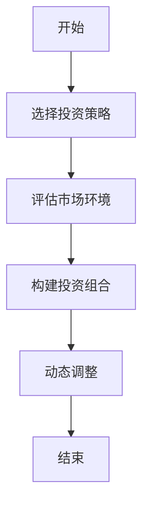

                 


# 约翰·伯格的广泛多元化vs聚焦投资

> 关键词：约翰·伯格，价值投资，广泛多元化，聚焦投资，投资策略，投资组合优化

> 摘要：本文深入探讨了约翰·伯格的投资理念，重点分析了广泛多元化与聚焦投资两种策略的核心原理、优缺点及其实际应用。通过对比这两种策略，结合数学模型和实际案例，为投资者提供了科学的投资决策参考。

---

# 引言

约翰·伯格是价值投资领域的权威，他的投资理念深刻影响了全球投资者。本文将围绕伯格的两大核心策略——**广泛多元化**与**聚焦投资**展开分析，探讨其在投资实践中的应用与优劣。

---

# 第一部分: 投资理念背景

## 1.1 价值投资的核心原理

### 1.1.1 价值投资的定义

价值投资是一种基于对公司内在价值分析的投资策略，旨在以低于内在价值的价格买入优质资产。

### 1.1.2 价值投资的核心原则

- **安全边际**：买入价格低于内在价值。
- **长期视角**：关注企业的长期盈利能力。
- **分散风险**：通过多样化投资降低风险。

### 1.1.3 伯格的投资哲学

伯格强调 **“时间是伟大企业的朋友”**，主张长期持有优质资产，避免频繁交易。

---

## 1.2 投资市场的多样性与风险

### 1.2.1 市场风险的来源

- **系统性风险**：市场整体波动带来的风险。
- **非系统性风险**：特定资产或行业的波动带来的风险。

### 1.2.2 投资者的风险偏好

- **保守型投资者**：倾向于分散投资，降低波动性。
- **进取型投资者**：愿意承担更高风险，追求超额收益。

---

# 第二部分: 广泛多元化投资策略

## 2.1 广泛多元化的核心原理

### 2.1.1 分散投资的基本原理

通过投资不同资产类别、行业或地区，降低非系统性风险。

### 2.1.2 广泛多元化的特点

- **低波动性**：投资组合的收益相对稳定。
- **低择时要求**：无需精准预测市场波动。

### 2.1.3 与集中投资的对比

| 对比维度       | 广泛多元化         | 聚焦投资           |
|----------------|------------------|------------------|
| 风险控制       | 低               | 高               |
| 收益潜力       | 稳定             | 高               |
| 投资难度       | 低               | 高               |

---

## 2.2 广泛多元化的优势

### 2.2.1 风险分散的优势

通过投资多个低相关的资产，降低组合波动性。

### 2.2.2 长期收益的稳定性

历史数据显示，广泛多元化投资在长期内表现优于集中投资。

### 2.2.3 适合不同风险偏好的投资者

保守型投资者可通过广泛多元化实现稳健收益。

---

## 2.3 广泛多元化的实施策略

### 2.3.1 投资组合的构建方法

1. **资产配置**：股票、债券、现金等的比例分配。
2. **行业分散**：避免过度集中于单一行业。
3. **地域分散**：投资不同国家的资产。

### 2.3.2 资产配置的数学模型

**投资组合优化问题**：  
$$ \text{目标函数：} \min \sigma^2 \text{（波动率）} $$  
$$ \text{约束条件：} \sum w_i = 1, \quad w_i \geq 0 $$  

### 2.3.3 实际案例分析

以伯格的指数基金投资为例，通过广泛分散投资，实现长期稳定的收益。

---

# 第三部分: 聚焦投资策略

## 3.1 聚焦投资的核心原理

### 3.1.1 高集中度投资

通过集中投资于少数优质资产，追求超额收益。

### 3.1.2 聚焦投资的特点

- **高收益潜力**：集中投资优质资产可能带来超额收益。
- **高风险**：投资结果波动较大。

---

## 3.2 聚焦投资的优势

### 3.2.1 高收益潜力

通过精选优质资产，实现高于市场平均水平的收益。

### 3.2.2 需要更高的市场洞察力

投资者需具备较强的研究能力和市场敏感性。

### 3.2.3 适合风险承受能力强的投资者

进取型投资者可通过聚焦投资实现高收益目标。

---

## 3.3 聚焦投资的实施策略

### 3.3.1 标的选择标准

1. **基本面分析**：关注企业的盈利能力、财务状况。
2. **竞争优势分析**：企业是否有独特的竞争优势。
3. **估值分析**：买入价格低于内在价值。

### 3.3.2 投资组合的优化方法

**单资产优化问题**：  
$$ \text{目标函数：} \max \text{收益} $$  
$$ \text{约束条件：} \text{风险可控} $$  

### 3.3.3 实际案例分析

以伯格的集中投资策略为例，通过精选优质企业，实现长期超额收益。

---

# 第四部分: 广泛多元化与聚焦投资的比较

## 4.1 投资目标与风险承受能力

### 4.1.1 不同投资目标的适用策略

- **稳健收益**：广泛多元化。
- **高收益潜力**：聚焦投资。

### 4.1.2 风险承受能力对策略选择的影响

- 低风险承受能力：广泛多元化。
- 高风险承受能力：聚焦投资。

---

## 4.2 短期与长期投资效果

### 4.2.1 广泛多元化在短期波动中的表现

- 低波动性，适合风险厌恶型投资者。
- 收益稳定，适合长期稳健投资。

### 4.2.2 聚焦投资在长期增长中的优势

- 高收益潜力，适合长期看好优质资产的投资者。

---

## 4.3 组合优化与动态调整

### 4.3.1 组合优化的数学模型

**投资组合优化问题**：  
$$ \text{目标函数：} \max \mu \text{（收益）} $$  
$$ \text{约束条件：} \sigma \leq \text{风险容忍度} $$  

### 4.3.2 动态调整的时机与方法

- **市场环境变化**：根据市场波动调整资产配置。
- **资产表现**：定期评估资产表现，进行再平衡。

---

# 第五部分: 广泛多元化与聚焦投资的结合

## 5.1 策略结合的理论基础

### 5.1.1 投资组合理论

通过结合两种策略，实现风险与收益的平衡。

### 5.1.2 现代投资组合理论与伯格理念的结合

通过科学的资产配置，平衡风险与收益。

---

## 5.2 策略结合的实施方法

### 5.2.1 分阶段投资策略

- **初期阶段**：广泛多元化，降低风险。
- **后期阶段**：逐步聚焦优质资产，提升收益。

### 5.2.2 根据市场环境动态调整

- **牛市**：适当增加聚焦投资比例。
- **熊市**：增加广泛多元化比例，降低风险。

---

## 5.3 结合策略的优势

### 5.3.1 风险与收益的平衡

通过结合两种策略，实现风险可控，收益潜力大。

### 5.3.2 适应不同市场环境

根据市场波动，灵活调整投资策略。

---

# 总结

约翰·伯格的价值投资理念为我们提供了重要的启示。广泛多元化与聚焦投资各有优劣，投资者应根据自身风险承受能力和投资目标选择合适的策略。通过科学的资产配置和动态调整，可以在风险与收益之间找到最佳平衡点。

---

# 最佳实践 Tips

1. **定期评估投资组合**：根据市场变化和个人财务状况调整投资策略。
2. **分散与集中相结合**：根据市场环境灵活调整资产配置。
3. **长期投资**：避免短期波动影响投资决策。

---

# 附录

## 附录 A: 投资组合优化的数学模型

$$ \text{目标函数：} \min \sigma^2 $$  
$$ \text{约束条件：} \sum w_i = 1, \quad w_i \geq 0 $$  

---

## 附录 B: 投资组合优化的Python实现

```python
import numpy as np

# 示例数据：资产收益和协方差矩阵
returns = np.array([0.1, 0.2, 0.15])
cov_matrix = np.array([
    [0.02, 0.01, 0.01],
    [0.01, 0.03, 0.02],
    [0.01, 0.02, 0.03]
])

# 投资组合优化问题
def portfolio Optimization(returns, cov_matrix):
    n = len(returns)
    # 构建优化问题
    mu = np.array(returns)
    Sigma = cov_matrix
    inv_Sigma = np.linalg.inv(Sigma)
    w = inv_Sigma @ mu / (mu.T @ inv_Sigma @ mu)
    return w

# 示例计算
w = portfolio_Optimization(returns, cov_matrix)
print("最优权重为：", w)
```

---

## 附录 C: 投资组合优化的可视化



---

通过本文的分析，读者可以更好地理解约翰·伯格的投资理念，并根据自身需求选择合适的投资策略。

