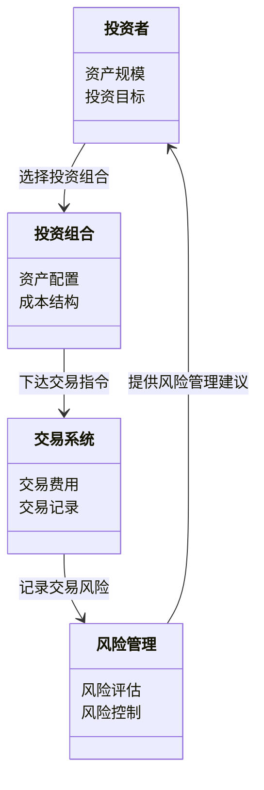
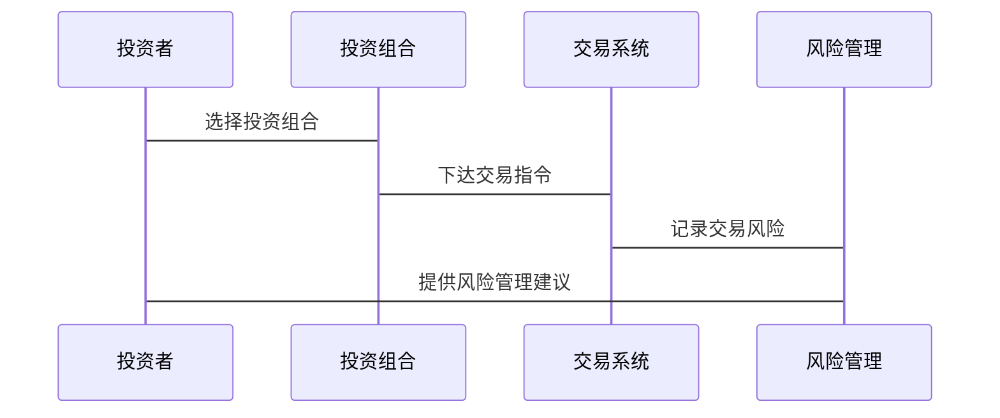

                 


# 约翰·伯格的成本意识投资策略

> 关键词：约翰·伯格、成本意识、投资策略、指数基金、投资回报、长期投资

> 摘要：本文深入分析了约翰·伯格的成本意识投资策略，探讨了低成本投资的核心理念、数学模型、系统架构设计以及实际应用案例。通过详细阐述伯格的投资哲学、成本优化算法、投资组合管理方法，本文为投资者提供了科学的投资决策依据。

---

# 第1章 约翰·伯格的成本意识投资概述

## 1.1 约翰·伯格的背景与投资理念

### 1.1.1 约翰·伯格的生平简介

约翰·伯格（John C. Bogle）是美国著名投资专家，被誉为“指数基金之父”。他是先锋集团（Vanguard Group）的创始人，致力于推广低成本投资策略。伯格于1949年出生于美国宾夕法尼亚州，1975年创立先锋集团，成为现代投资史上最具影响力的投资者之一。

### 1.1.2 成本意识投资的核心理念

伯格的成本意识投资理念基于一个简单的原则：长期来看，投资成本的高低直接影响投资回报。他认为，投资者应该尽量降低投资组合的费用支出，以最大化投资收益。这种理念与传统投资策略中追求高收益、高费用的做法形成鲜明对比。

### 1.1.3 约翰·伯格的投资哲学

伯格的投资哲学可以概括为“简单即美”。他强调，投资的本质是通过分散投资降低风险，并通过长期持有优质资产实现财富增值。他反对过度交易和频繁换手，认为这些行为不仅增加了交易成本，还可能导致投资收益的流失。

---

## 1.2 成本意识投资的背景与现状

### 1.2.1 投资领域的成本问题

在传统投资领域，高昂的管理费用、交易费用以及隐性成本（如机会成本）一直是投资者关注的重点。高昂的成本不仅降低了投资回报，还可能导致投资者的长期收益无法跑赢通胀。

### 1.2.2 现代投资市场的成本结构

随着金融市场的不断发展，投资成本的构成日益复杂。除了显性的管理费用和交易费用外，投资者还需要考虑隐性成本，例如基金的买卖价差、税收成本以及机会成本等。

### 1.2.3 成本意识投资的全球实践

成本意识投资不仅限于美国市场，其理念在全球范围内得到了广泛应用。尤其是在亚洲市场，越来越多的投资者开始关注低成本投资策略，通过指数基金等工具实现长期财富增值。

---

## 1.3 成本意识投资的意义与价值

### 1.3.1 成本对投资收益的影响

成本是影响投资收益的核心因素之一。研究表明，长期来看，投资成本的高低与投资回报呈现明显的负相关关系。降低投资成本可以显著提高投资收益，尤其是在市场波动较大的情况下。

### 1.3.2 成本意识投资的优势

成本意识投资的优势体现在以下几个方面：
1. **长期收益高**：通过降低投资成本，投资者可以获得更高的长期收益。
2. **风险分散**：低成本投资策略通常采用分散化投资，有效降低投资风险。
3. **简单易行**：成本意识投资策略简单易行，适合各类投资者。

### 1.3.3 成本意识投资的未来趋势

随着金融科技的快速发展，成本意识投资的未来趋势将更加明显。投资者将更加关注投资成本的透明化和最小化，低成本投资工具（如指数基金）的市场份额将进一步扩大。

---

## 1.4 本章小结

本章通过介绍约翰·伯格的成本意识投资理念，分析了成本意识投资的背景与现状，揭示了成本对投资收益的影响。伯格的投资哲学强调了简单与长期的重要性，为投资者提供了科学的投资决策依据。

---

# 第2章 成本意识投资的核心概念与原理

## 2.1 成本意识投资的定义与特征

### 2.1.1 成本意识投资的定义

成本意识投资是一种以降低投资成本为核心策略的投资方法。通过选择低成本投资工具和优化投资组合，投资者可以在长期获得更高的收益。

### 2.1.2 成本意识投资的核心特征

1. **低成本**：通过选择低管理费、低交易费的基金或投资工具，降低投资成本。
2. **长期持有**：通过长期持有优质资产，减少交易次数，降低交易成本。
3. **分散化**：通过分散化投资降低风险，同时优化投资成本。

### 2.1.3 成本意识投资与传统投资的区别

| **特征**       | **成本意识投资**                     | **传统投资**                       |
|----------------|--------------------------------------|------------------------------------|
| 投资理念       | 以低成本为核心，追求长期收益         | 追求高收益，可能伴随高成本         |
| 投资策略       | 长期持有、分散化投资                 | 短期交易、集中化投资               |
| 风险控制       | 通过分散化降低风险                   | 通过杠杆或其他工具放大风险         |

---

## 2.2 成本意识投资的理论基础

### 2.2.1 现代投资组合理论

现代投资组合理论（MPT）由哈里·马科维茨提出，强调通过分散化投资降低风险。成本意识投资基于MPT，进一步考虑了投资成本对收益的影响。

### 2.2.2 资本资产定价模型（CAPM）

CAPM模型用于计算资产的预期收益。成本意识投资将投资成本纳入CAPM模型，以优化投资组合的收益与成本比。

### 2.2.3 成本对投资回报的影响

成本对投资回报的影响可以用以下公式表示：
$$ R = r - \frac{费用}{资产规模} $$

其中，$R$ 是实际收益，$r$ 是预期收益，$费用$ 是投资成本，$资产规模$ 是投资规模。

---

## 2.3 成本意识投资的关键要素

### 2.3.1 投资成本的构成

投资成本主要包括以下几项：
1. **管理费用**：基金的管理费用。
2. **交易费用**：买卖证券的佣金和税费。
3. **隐性成本**：如买卖价差、市场冲击等。

### 2.3.2 成本对投资组合的影响

成本对投资组合的影响可以通过以下公式计算：
$$ R_{\text{组合}} = R_{\text{资产}} - \frac{费用}{资产规模} $$

### 2.3.3 成本优化的策略

1. **选择低成本投资工具**：如指数基金、ETF等。
2. **长期持有**：减少交易次数，降低交易成本。
3. **分散化投资**：通过分散化降低风险，同时优化成本。

---

## 2.4 本章小结

本章详细阐述了成本意识投资的核心概念与理论基础，揭示了成本对投资收益的影响，并提出了成本优化的策略。通过理解这些内容，投资者可以更好地制定低成本投资策略。

---

# 第3章 成本意识投资的数学模型与算法

## 3.1 投资成本的计算公式

投资成本的计算公式如下：
$$ C = \frac{费用}{资产规模} $$

其中，$C$ 是成本率，$费用$ 是投资成本，$资产规模$ 是投资规模。

## 3.2 成本对投资回报的影响模型

成本对投资回报的影响可以用以下公式表示：
$$ R = r - \frac{费用}{资产规模} $$

---

## 3.3 成本优化的数学模型

成本优化的数学模型如下：
$$ \min C \text{ s.t. } R \geq r_{\text{目标}} $$

其中，$C$ 是成本率，$R$ 是实际收益，$r_{\text{目标}}$ 是目标收益。

---

## 3.4 本章小结

本章通过数学模型和算法，详细分析了成本意识投资的核心原理，为投资者提供了科学的决策依据。

---

# 第4章 成本意识投资的系统分析与架构设计

## 4.1 系统功能设计

### 4.1.1 领域模型（Mermaid 类图）



### 4.1.2 系统架构设计（Mermaid 架构图）

```mermaid
docker
    系统: 成本意识投资系统
    system 投资者 {
        资产规模
        投资目标
    }
    system 投资组合 {
        资产配置
        成本结构
    }
    system 交易系统 {
        交易费用
        交易记录
    }
    system 风险管理 {
        风险评估
        风险控制
    }
    投资者 --> 投资组合
    投资组合 --> 交易系统
    交易系统 --> 风险管理
    风险管理 --> 投资者
```

### 4.1.3 系统接口设计

1. **投资者与投资组合接口**：投资者选择投资组合，投资组合返回资产配置和成本结构。
2. **投资组合与交易系统接口**：投资组合下达交易指令，交易系统返回交易费用和交易记录。
3. **交易系统与风险管理接口**：交易系统记录交易风险，风险管理返回风险评估和风险控制建议。
4. **风险管理与投资者接口**：风险管理向投资者提供风险管理建议。

### 4.1.4 系统交互设计（Mermaid 序列图）



---

## 4.2 本章小结

本章通过系统分析与架构设计，揭示了成本意识投资的实现方式。通过领域模型、系统架构图和交互序列图，投资者可以更好地理解成本意识投资的系统实现。

---

# 第5章 成本意识投资的项目实战

## 5.1 环境安装与配置

### 5.1.1 投资组合管理工具

推荐使用开源的组合管理工具，例如：
1. **Portfolio Performance Analytics**（Python）
2. **Zipline**（Python）

### 5.1.2 数据源配置

建议使用以下数据源：
1. **Yahoo Finance**：获取实时数据和历史数据。
2. **Quandl**：获取结构化数据。

## 5.2 核心实现源代码

### 5.2.1 成本计算代码（Python）

```python
def calculate_cost(fees, asset_size):
    return fees / asset_size

# 示例计算
fees = 1000  # 年度管理费用
asset_size = 1000000  # 资产规模
cost_rate = calculate_cost(fees, asset_size)
print(f"成本率：{cost_rate:.2f}%")
```

### 5.2.2 投资组合优化代码（Python）

```python
import numpy as np
from scipy.optimize import minimize

def objective(weights, expected_returns, fees, asset_size):
    return np.dot(weights.T, expected_returns) - (fees / asset_size)

def constraints(weights):
    return np.sum(weights) - 1.0

weights = np.array([0.5, 0.5])
expected_returns = np.array([0.1, 0.15])
fees = 1000
asset_size = 1000000

result = minimize(objective, weights, method='SLSQP', 
                 constraints={'type': 'eq', 'fun': constraints})

print("最优权重：", result.x)
print("最小成本率：", calculate_cost(fees, asset_size))
```

## 5.3 代码应用解读与分析

### 5.3.1 成本计算代码解读

上述代码通过计算投资成本率，帮助投资者了解投资成本对投资回报的影响。通过调整管理费用和资产规模，投资者可以更好地理解成本优化的策略。

### 5.3.2 投资组合优化代码解读

上述代码通过优化投资组合权重，实现成本最小化的目标。通过调整权重，投资者可以找到最优的投资组合，实现成本与收益的最佳平衡。

## 5.4 本章小结

本章通过项目实战，详细展示了成本意识投资的实现过程。通过环境安装、数据源配置、代码实现和案例分析，投资者可以更好地理解成本意识投资的实际应用。

---

# 第6章 成本意识投资的实际案例分析

## 6.1 约翰·伯格的经典案例

### 6.1.1 长期投资案例

伯格通过长期持有低成本指数基金，实现了超越市场平均收益的投资业绩。他的投资策略证明了低成本投资的长期有效性。

### 6.1.2 成本优化案例

通过选择低成本基金和长期持有策略，伯格的投资组合在市场波动中表现优异，证明了成本优化的有效性。

## 6.2 投资者实战案例

### 6.2.1 投资组合构建

以 $100,000 初始资金为例，构建一个低成本投资组合：
1. **资产配置**：股票60%，债券30%，现金10%。
2. **投资工具**：选择低成本指数基金，如标普500指数基金。

### 6.2.2 投资组合优化

通过定期再平衡投资组合，保持资产配置的稳定性，降低投资成本。

## 6.3 本章小结

本章通过实际案例分析，揭示了成本意识投资的实践价值。投资者可以通过学习伯格的投资策略，制定适合自己的低成本投资计划。

---

# 第7章 成本意识投资的未来展望与总结

## 7.1 未来投资环境的挑战与机遇

### 7.1.1 金融科技的影响

金融科技的发展将进一步推动成本意识投资的普及，投资者可以通过智能投顾等工具实现低成本投资。

### 7.1.2 投资策略的演变

随着市场的变化，成本意识投资的策略也将不断优化，投资者需要关注新的投资工具和策略。

## 7.2 成本意识投资的总结与展望

### 7.2.1 成本意识投资的总结

成本意识投资是一种科学的投资策略，通过降低投资成本实现长期收益的最大化。伯格的投资理念为投资者提供了宝贵的实践经验。

### 7.2.2 成本意识投资的展望

随着市场的不断发展，成本意识投资将更加重要。投资者需要关注新的投资工具和策略，优化投资组合，降低投资成本。

---

## 附录

### 附录A 术语表

1. **成本意识投资**：以降低投资成本为核心策略的投资方法。
2. **指数基金**：一种跟踪指数的基金，具有低成本、分散化的特点。

### 附录B 进一步阅读的资源

1. **《投资最重要的常识》**，作者：约翰·伯格
2. **《指数基金投资指南》**，作者：某位投资专家

---

## 结语

约翰·伯格的成本意识投资策略为投资者提供了科学的投资决策依据。通过降低成本、长期持有和分散化投资，投资者可以在复杂多变的市场中实现财富的长期增值。希望本文的分析能为投资者提供有价值的参考。

---

