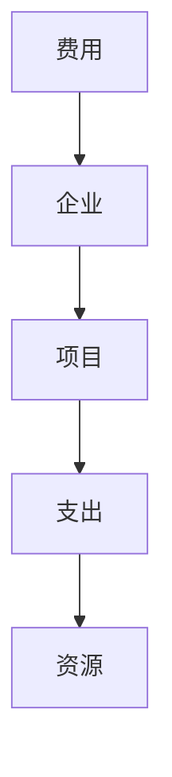
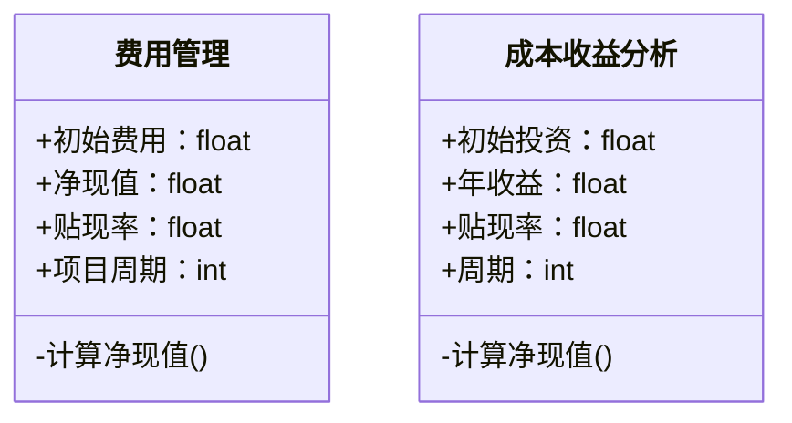

                 


# 约翰·伯格的成本意识：为什么费用很重要

## 关键词：成本意识、费用分析、成本收益、系统架构、项目实战

## 摘要：  
费用在经济活动中扮演着至关重要的角色，直接关系到企业的生存与发展。《约翰·伯格的成本意识：为什么费用很重要》这本书深入探讨了费用的核心概念、分析方法、系统架构以及实际应用。通过详细的背景介绍、算法原理、数学模型、系统设计和项目案例分析，读者能够全面理解费用的重要性和管理方法，从而在实际工作中更好地进行成本控制和收益最大化。

---

# 第一部分: 背景介绍与核心概念

## 第1章: 费用与成本意识的背景介绍

### 1.1 什么是费用

#### 1.1.1 费用的定义与核心概念
费用是指企业在经营活动中发生的各种支出，包括原材料采购、人工成本、设备折旧、租金等。费用的核心概念在于其可计量性和可追溯性，能够为企业的财务分析提供重要数据支持。

#### 1.1.2 费用与其他相关概念的对比
| 概念    | 定义                                                                 | 特性         |
|---------|----------------------------------------------------------------------|--------------|
| 成本    | 为获得某种商品或服务而发生的资源消耗。                                | 可计量性     |
| 费用    | 企业经营过程中发生的支出，计入当期损益。                            | 可追溯性     |
| 支出    | 广义的概念，包括费用和资本支出。                                      | 广义性       |

#### 1.1.3 费用的分类与层次结构
费用可以分为显性费用和隐性费用。显性费用是指直接计入财务报表的支出，如原材料采购；隐性费用则是指间接成本，如管理费用。

### 1.2 成本意识的重要性

#### 1.2.1 成本意识的核心意义
成本意识是企业管理和决策的基础，直接影响企业的利润和市场竞争力。通过成本意识，企业可以优化资源配置，降低浪费，提高效率。

#### 1.2.2 费用在经济活动中的作用
费用是企业运营的必要支出，同时也是衡量企业效率的重要指标。通过费用分析，企业可以识别成本节约的机会，优化业务流程。

#### 1.2.3 成本意识与企业竞争力的关系
成本意识强的企业能够在市场中更具竞争力。通过降低成本，企业可以提高利润率，增强市场应对能力。

## 第2章: 费用分析的基本原理

### 2.1 费用分析的框架

#### 2.1.1 费用分析的维度
费用分析可以从时间、金额、来源等多个维度进行。时间维度包括历史费用分析和未来费用预测；金额维度包括固定费用和变动费用；来源维度包括内部费用和外部费用。

#### 2.1.2 费用分析的工具与方法
常用的费用分析工具包括成本-收益分析、费用分摊模型、预算管理等。这些工具可以帮助企业更好地理解费用结构，优化费用分配。

#### 2.1.3 费用分析的边界与外延
费用分析的边界在于企业的财务报表范围，而外延则包括对供应链、客户需求的分析，以优化整体成本结构。

### 2.2 费用与收益的关系

#### 2.2.1 费用与收益的基本关系
费用与收益是企业经济活动中的对立统一关系。适当的费用投入可以带来更高的收益，但过高的费用会侵蚀利润。

#### 2.2.2 成本-收益分析模型
成本-收益分析模型是费用分析的核心工具，用于评估投资项目或决策的可行性。公式如下：

$$ NPV = \sum_{t=1}^{n} \frac{C_t}{(1+r)^t} - I $$

其中，$C_t$为第$t$年的净收益，$r$为贴现率，$I$为初始投资。

#### 2.2.3 费用控制与收益最大化
费用控制是实现收益最大化的关键。通过优化费用结构，企业可以在不降低产品或服务质量的前提下，提高盈利能力。

## 第3章: 费用的核心概念与联系

### 3.1 费用的核心概念

#### 3.1.1 费用的构成要素
费用由固定费用和变动费用组成。固定费用如租金、管理人员工资；变动费用如原材料采购、销售佣金。

#### 3.1.2 费用的属性特征对比表
| 特性    | 固定费用 | 变动费用 |
|---------|----------|----------|
| 变化性  | 固定     | 变动     |
| 可控性  | 部分可控 | 高度可控 |

#### 3.1.3 费用的实体关系图


### 3.2 费用与成本的联系与区别

#### 3.2.1 费用与成本的异同点
费用和成本在概念上存在重叠，但也有区别。费用更注重当前的支出，而成本更注重未来的收益。

#### 3.2.2 成本与费用的相互作用
成本是费用的基础，费用是成本的表现形式。通过控制成本，可以降低费用，从而提高企业的盈利能力。

#### 3.2.3 费用与成本的系统性分析
费用和成本的系统性分析需要从企业的整体角度出发，考虑各个部门的费用支出，优化资源配置。

---

# 第二部分: 费用分析的算法原理

## 第4章: 费用分析的算法基础

### 4.1 成本-收益分析算法

#### 4.1.1 算法原理
成本-收益分析通过比较投资项目或决策的净现值（NPV）来判断其可行性。如果NPV为正，则项目值得投资。

#### 4.1.2 算法步骤
1. 确定初始投资和未来收益。
2. 计算各期的净收益。
3. 将各期净收益贴现，计算总现值。
4. 计算净现值。
5. 根据净现值的正负判断项目可行性。

#### 4.1.3 算法实现的Python代码
```python
def cost_benefit_analysis(initial_cost, annual_benefit, discount_rate, period):
    present_value_benefit = annual_benefit / (1 + discount_rate) ** period
    net_present_value = present_value_benefit - initial_cost
    return "可行" if net_present_value > 0 else "不可行"
```

### 4.2 费用分摊算法

#### 4.2.1 分摊原理
费用分摊是将总费用按一定比例分配到各个部门或项目。常用的分摊方法包括按收入比例分摊、按资源消耗比例分摊等。

#### 4.2.2 分摊方法对比
| 方法         | 优点             | 缺点             |
|--------------|------------------|------------------|
| 收入比例分摊  | 简单易行         | 可能不够准确     |
| 资源消耗分摊  | 更加精确         | 实施复杂         |

#### 4.2.3 分摊算法实现
```python
def cost_allocation(total_cost, allocation_base, allocation_ratio):
    allocated_cost = total_cost * allocation_ratio / sum(allocation_ratio)
    return allocated_cost
```

---

## 第5章: 费用分析的数学模型

### 5.1 费用的数学模型

#### 5.1.1 费用的计算公式
$$ \text{总费用} = \text{固定费用} + \text{变动费用} $$

#### 5.1.2 费用分摊模型
$$ \text{分摊费用} = \frac{\text{部门资源消耗}}{\text{总资源消耗}} \times \text{总费用} $$

### 5.2 费用的优化模型

#### 5.2.1 费用优化的目标
最大化净收益，即：

$$ \max \sum_{t=1}^{n} \text{收益}_t - \sum_{t=1}^{n} \text{费用}_t $$

#### 5.2.2 费用优化的数学表达
$$ \min \text{总费用} $$

受以下约束：

$$ \text{总收益} \geq \text{总成本} $$

---

## 第6章: 费用分析的系统架构

### 6.1 系统功能设计

#### 6.1.1 领域模型


#### 6.1.2 系统架构


---

## 第7章: 费用分析的项目实战

### 7.1 项目背景

#### 7.1.1 项目介绍
本项目旨在为企业提供费用分析和优化的解决方案，帮助企业在市场竞争中降低成本，提高收益。

#### 7.1.2 项目目标
通过费用分析模型，优化企业的费用结构，提高盈利能力。

### 7.2 系统实现

#### 7.2.1 环境安装
安装Python和相关开发工具，如Jupyter Notebook、PyCharm等。

#### 7.2.2 核心实现代码
```python
def calculate_npv(initial_cost, annual_benefit, discount_rate, period):
    npv = 0
    for t in range(1, period + 1):
        npv += annual_benefit / (1 + discount_rate) ** t
    npv -= initial_cost
    return npv
```

#### 7.2.3 案例分析
假设某企业投资100万元开发新产品，预计未来5年的年收益为30万元，贴现率为10%。计算净现值：

$$ NPV = \frac{30}{(1+0.1)^1} + \frac{30}{(1+0.1)^2} + \frac{30}{(1+0.1)^3} + \frac{30}{(1+0.1)^4} + \frac{30}{(1+0.1)^5} - 100 $$

计算结果为负，说明该项目不可行。

---

## 第8章: 最佳实践与总结

### 8.1 小结

通过本书的系统介绍，读者可以全面理解费用的核心概念、分析方法和优化策略。费用分析是企业管理和决策的重要工具，能够帮助企业降低成本，提高收益。

### 8.2 注意事项

在实际应用中，费用分析需要结合企业的实际情况，灵活调整分析方法和模型。同时，要注意数据的准确性和分析结果的可操作性。

### 8.3 拓展阅读

推荐阅读《财务报表分析》和《成本管理》等相关书籍，进一步深入理解费用分析和成本管理的理论与实践。

---

# 结语

费用是企业经济活动中的重要组成部分，直接关系到企业的生存与发展。通过系统的费用分析和优化，企业可以在激烈的市场竞争中占据优势。希望本书能够为读者提供有价值的理论和实践指导，帮助企业在费用管理中实现更大的成功。

