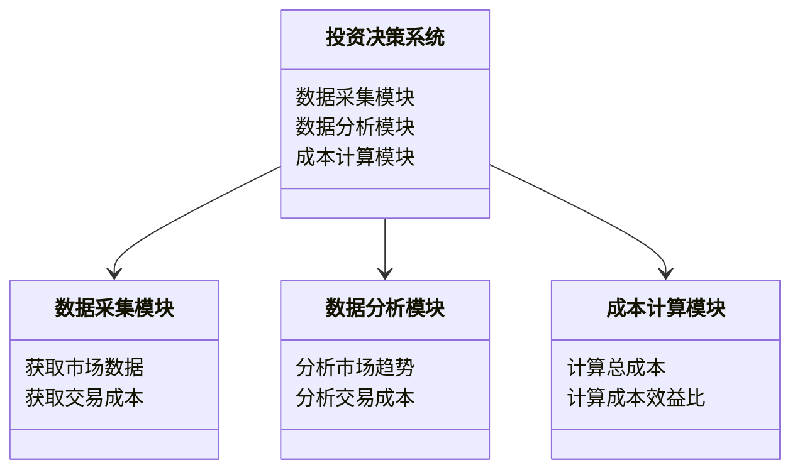
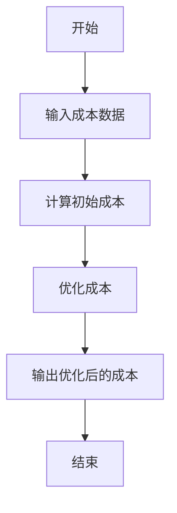

                 

# 约翰·伯格的成本意识：在零售投资者时代的重要性

---

## 关键词

- 成本意识
- 零售投资者
- 投资策略
- 约翰·伯格
- 投资心理学
- 成本效益分析

---

## 摘要

在零售投资者日益崛起的时代，成本意识成为投资决策中不可忽视的关键因素。本文从约翰·伯格的成本意识理论出发，结合零售投资者的实际情况，深入分析成本意识的核心概念、算法原理、系统架构及其在投资决策中的应用。通过具体案例分析，探讨如何在实际投资中优化成本，提升投资收益，降低风险。

---

## 目录大纲

### 第一部分: 成本意识的背景与重要性

#### 第1章: 零售投资者时代的背景

- **1.1 零售投资者的崛起**
  - 1.1.1 零售投资者的定义与特征
  - 1.1.2 零售投资者的市场规模与趋势
  - 1.1.3 零售投资者与机构投资者的对比

- **1.2 投资成本的隐性与显性**
  - 1.2.1 投资成本的分类
  - 1.2.2 隐性成本的计算与影响
  - 1.2.3 显性成本的透明化

#### 第2章: 成本意识的核心概念

- **2.1 成本意识的定义**
  - 2.1.1 成本意识的多维度解析
  - 2.1.2 成本意识与投资决策的关系
  - 2.1.3 成本意识的量化与评估

- **2.2 成本意识的结构与属性**
  - 2.2.1 成本意识的层次模型
  - 2.2.2 成本与收益的对比分析
  - 2.2.3 成本意识的核心要素

---

### 第二部分: 成本意识的算法与数学模型

#### 第3章: 成本效益分析的数学模型

- **3.1 成本效益分析的基本原理**
  - 3.1.1 成本效益分析的定义
  - 3.1.2 成本效益分析的公式推导
  - 3.1.3 成本效益比的计算方法

- **3.2 成本效益分析的算法实现**
  - 3.2.1 成本效益分析的流程图
  - 3.2.2 成本效益分析的代码实现
  - 3.2.3 成本效益分析的案例分析

#### 第4章: 成本优化的数学模型

- **4.1 成本优化的基本原理**
  - 4.1.1 成本优化的定义
  - 4.1.2 成本优化的数学公式
  - 4.1.3 成本优化的变量分析

- **4.2 成本优化的算法实现**
  - 4.2.1 成本优化的流程图
  - 4.2.2 成本优化的代码实现
  - 4.2.3 成本优化的案例分析

---

### 第三部分: 成本意识的系统架构与设计

#### 第5章: 投资决策系统的架构设计

- **5.1 投资决策系统的功能模块**
  - 5.1.1 数据采集模块
  - 5.1.2 数据分析模块
  - 5.1.3 成本计算模块

- **5.2 投资决策系统的架构图**
  - 5.2.1 系统架构图的绘制
  - 5.2.2 系统架构图的分析

#### 第6章: 成本意识在投资系统中的应用

- **6.1 成本意识在投资决策中的作用**
  - 6.1.1 成本意识对投资决策的影响
  - 6.1.2 成本意识对投资策略的优化
  - 6.1.3 成本意识对投资风险的控制

- **6.2 成本意识在投资系统中的实现**
  - 6.2.1 成本意识在系统中的模块设计
  - 6.2.2 成本意识在系统中的算法实现
  - 6.2.3 成本意识在系统中的案例分析

---

### 第四部分: 成本意识的项目实战与案例分析

#### 第7章: 项目实战: 成本意识在零售投资中的应用

- **7.1 项目背景与目标**
  - 7.1.1 项目背景介绍
  - 7.1.2 项目目标设定

- **7.2 系统实现**
  - 7.2.1 环境安装与配置
  - 7.2.2 系统核心功能实现
  - 7.2.3 系统代码实现与解读

- **7.3 案例分析**
  - 7.3.1 典型案例的选择与分析
  - 7.3.2 成本意识在案例中的具体应用
  - 7.3.3 案例总结与经验分享

#### 第8章: 总结与展望

- **8.1 成本意识的总结**
  - 8.1.1 成本意识的核心要点回顾
  - 8.1.2 成本意识在零售投资中的重要性总结

- **8.2 未来展望**
  - 8.2.1 成本意识在投资领域的未来发展趋势
  - 8.2.2 技术进步对成本意识的影响
  - 8.2.3 未来投资策略中的成本意识优化方向

---

### 第五部分: 最佳实践与注意事项

#### 第9章: 最佳实践 tips

- **9.1 投资成本的控制策略**
  - 9.1.1 降低交易成本的方法
  - 9.1.2 长期投资与成本优化
  - 9.1.3 分散投资与成本控制

- **9.2 投资心理与成本意识**
  - 9.2.1 投资心理对成本意识的影响
  - 9.2.2 理性决策与成本意识的结合
  - 9.2.3 避免情绪化投资的重要性

#### 第10章: 小结与注意事项

- **10.1 小结**
  - 10.1.1 成本意识的核心理念
  - 10.1.2 成本意识在投资中的实际应用
  - 10.1.3 成本意识的未来发展

- **10.2 注意事项**
  - 10.2.1 投资者在成本意识中的误区
  - 10.2.2 如何避免过度关注成本
  - 10.2.3 投资成本与收益的平衡点

---

### 第六部分: 拓展阅读与延伸思考

#### 第11章: 拓展阅读

- **11.1 相关书籍推荐**
  - 11.1.1 投资经典书籍
  - 11.1.2 成本分析相关书籍
  - 11.1.3 心理学与投资相关书籍

- **11.2 相关论文与研究报告**
  - 11.2.1 成本意识的学术研究
  - 11.2.2 零售投资者行为研究
  - 11.2.3 投资策略优化的最新研究

#### 第12章: 未来研究方向

- **12.1 成本意识的未来研究**
  - 12.1.1 新型成本模型的开发
  - 12.1.2 数字化与智能化的成本分析
  - 12.1.3 全球化背景下的成本意识

- **12.2 技术驱动的成本优化**
  - 12.2.1 人工智能在成本分析中的应用
  - 12.2.2 大数据分析与成本优化
  - 12.2.3 区块链技术在成本透明化中的潜力

---

### 附录

#### 附录A: 成本效益分析的数学公式

- $$\text{成本效益比} = \frac{\text{总成本}}{\text{总收益}}$$
- $$\text{成本优化目标} = \min \sum_{i=1}^{n} c_i \quad \text{在约束条件下}$$

#### 附录B: 投资决策系统的类图

#### 附录C: 成本优化算法的流程图

---

通过以上目录大纲，文章将从理论到实践，从背景到案例，系统地探讨约翰·伯格的成本意识在零售投资者时代的重要性，为投资者提供全面的指导和实践参考。

