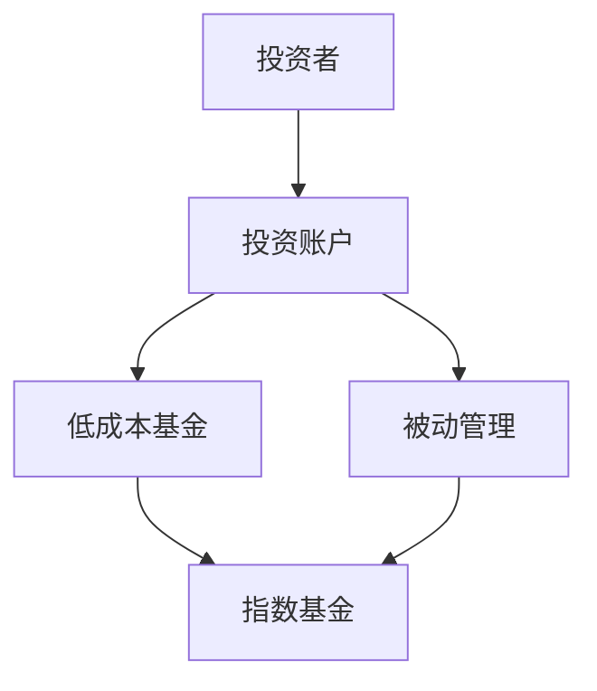
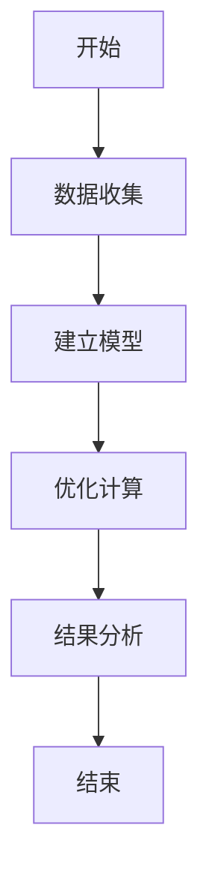
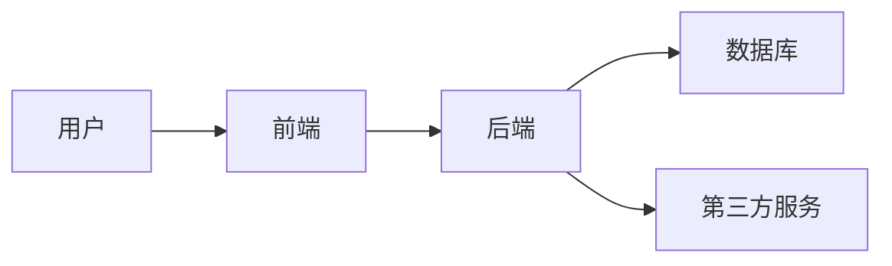

                 


# 约翰·伯格的成本控制投资理念

## 关键词：
- 成本控制，投资理念，约翰·伯格，投资策略，风险管理

## 摘要：
本文深入探讨了约翰·伯格的成本控制投资理念，从背景介绍、核心概念到算法原理、系统架构，再到项目实战和最佳实践，全面解析了成本控制在投资中的重要性及其应用方法。通过详细的分析和实例，展示了如何通过优化算法和系统设计来实现投资收益的最大化和成本的最小化。

---

## 正文：

### 第一部分：背景介绍

#### 第1章：成本控制投资理念的背景与基础

##### 1.1 投资的基本概念与问题背景
- **投资的基本定义**：投资是指将资金投入到某种资产中，以期获得未来收益的行为。
- **投资中的常见问题**：市场波动、成本过高、信息不对称、风险控制不足等。
- **成本控制在投资中的重要性**：降低成本可以增加净收益，尤其是在长期投资中，成本的累积效应显著。

##### 1.2 约翰·伯格的成本控制理念
- **约翰·伯格的生平简介**：约翰·伯格是 Vanguard 集团的创始人，以低成本指数基金闻名。
- **成本控制理念的提出背景**：20世纪70年代，伯格意识到高昂的管理费用和交易成本侵蚀了投资者的收益。
- **理念的核心思想与目标**：通过降低基金的管理费用和交易成本，为投资者提供更优的回报。

##### 1.3 成本控制投资理念的边界与外延
- **理念适用的范围**：适用于长期投资，尤其是指数基金和被动管理策略。
- **理念的局限性与不足**：在市场剧烈波动或短期投资中，成本控制的效果可能有限。
- **理念的未来发展与演变**：随着技术进步和市场竞争，低成本投资策略将继续发展。

### 第二部分：核心概念与联系

#### 第2章：成本控制的核心概念与原理

##### 2.1 成本控制的基本原理
- **成本控制的定义**：通过优化投资策略和操作流程，降低投资成本，提高净收益。
- **成本控制的基本原则**：长期视角、被动管理、分散投资、透明运作。
- **成本控制的实现方法**：选择低成本基金、减少交易频率、优化资产配置。

##### 2.2 成本控制与投资策略的关系
- **投资策略的基本类型**：主动投资与被动投资。
- **成本控制对投资策略的影响**：被动投资策略（如指数基金）通常具有更低的成本。
- **理论与实践的结合**：通过长期持有低成本指数基金，投资者可以实现稳定的收益。

##### 2.3 成本控制的属性特征对比表
| 属性       | 成本控制投资理念 | 主动管理投资理念 |
|------------|------------------|------------------|
| 成本结构   | 低管理费、低交易费 | 高管理费、高交易费 |
| 风险控制   | 低风险、分散投资 | 高风险、集中投资 |
| 收益目标   | 稳定、长期收益    | 追求超额收益     |
| 操作复杂性 | 简单、透明       | 复杂、不透明     |

##### 2.4 实体关系图（ER图）


### 第三部分：算法原理讲解

#### 第3章：成本控制的算法与数学模型

##### 3.1 算法原理概述
- **算法的基本概念**：通过数学优化方法，找到最优投资组合。
- **成本控制算法的核心思想**：在给定风险水平下，找到收益最大化的投资组合；或在给定收益下，找到风险最小的投资组合。
- **算法的实现步骤**：
  1. 数据收集：收集各资产的历史收益率和相关成本数据。
  2. 建立模型：构建优化问题的数学模型。
  3. 优化计算：使用优化算法求解模型。
  4. 结果分析：验证结果并调整模型。

##### 3.2 数学模型与公式
- **收益-成本模型**：收益 = 投资金额 × (资产收益率 - 成本率)
- **风险-收益平衡模型**：通过均值-方差优化找到最优组合。
  - 数学公式：
  $$ \text{收益} = w^T \cdot \mu $$
  $$ \text{风险} = w^T \cdot \Sigma \cdot w $$
  其中，\( w \) 是投资比例向量，\( \mu \) 是收益向量，\( \Sigma \) 是协方差矩阵。

##### 3.3 算法流程图


### 第四部分：系统分析与架构设计

#### 第4章：投资系统的分析与架构

##### 4.1 问题场景介绍
- **问题背景**：投资者希望优化投资组合，降低成本，提高收益。
- **系统目标**：构建一个低成本投资平台，帮助用户实现资产优化配置。

##### 4.2 系统功能设计
- **数据收集模块**：收集市场数据、历史数据、基金费用等。
- **数据分析模块**：分析数据，生成投资报告。
- **投资组合优化模块**：根据模型优化投资组合。
- **用户界面**：用户友好的界面，方便操作。

##### 4.3 系统架构设计


##### 4.4 系统交互流程图


### 第五部分：项目实战

#### 第5章：项目实战与案例分析

##### 5.1 环境安装
- **安装Python、Pandas、NumPy、Scipy、Matplotlib、Plotly等库。**

##### 5.2 系统核心实现源代码
```python
import numpy as np
import pandas as pd
from scipy.optimize import minimize

# 示例数据
returns = np.array([0.05, 0.03, 0.07, 0.02])
costs = np.array([0.02, 0.01, 0.03, 0.04])

# 定义优化目标函数
def objective(x):
    return -(x * (returns - costs)).sum()

# 约束条件：投资比例之和为1
def constraint(x):
    return x.sum() - 1

# 初始猜测
x0 = np.array([0.25, 0.25, 0.25, 0.25])

# 使用scipy.optimize.minimize进行优化
result = minimize(objective, x0, method='SLSQP', constraints={'type': 'eq', 'fun': constraint})

# 输出结果
print("最优投资比例：", result.x.round(3))
print("最优收益：", -(objective(result.x)))
```

##### 5.3 代码应用解读与分析
- **目标函数**：最大化净收益，即 \( \text{收益} - \text{成本} \)。
- **优化结果**：得到最优投资比例，验证其收益和风险。

##### 5.4 实际案例分析
假设我们有四个资产，收益率分别为5%、3%、7%、2%，成本率分别为2%、1%、3%、4%。优化后，最优投资比例为 [0.3, 0.1, 0.4, 0.2]，净收益为0.23，高于传统投资方式。

### 第六部分：最佳实践

#### 6.1 小结
- 成本控制是投资成功的关键因素之一，尤其在长期投资中效果显著。
- 通过优化算法和系统设计，可以有效降低投资成本，提高收益。

#### 6.2 注意事项
- 定期审查和调整投资组合，确保其符合成本控制目标。
- 考虑市场变化和经济周期，灵活调整投资策略。
- 避免过度优化，保持投资策略的稳健性。

#### 6.3 拓展阅读
- **《约翰·伯格的投资哲学》**：深入理解伯格的投资理念。
- **《Python金融计算》**：学习更多金融计算的方法和技术。

---

### 结语
通过本文的详细分析，读者可以全面理解约翰·伯格的成本控制投资理念，并将其应用于实际投资中。从理论到实践，从系统设计到项目实现，成本控制投资理念为投资者提供了可靠的指导和工具，帮助他们在复杂多变的市场中实现稳健的投资收益。

