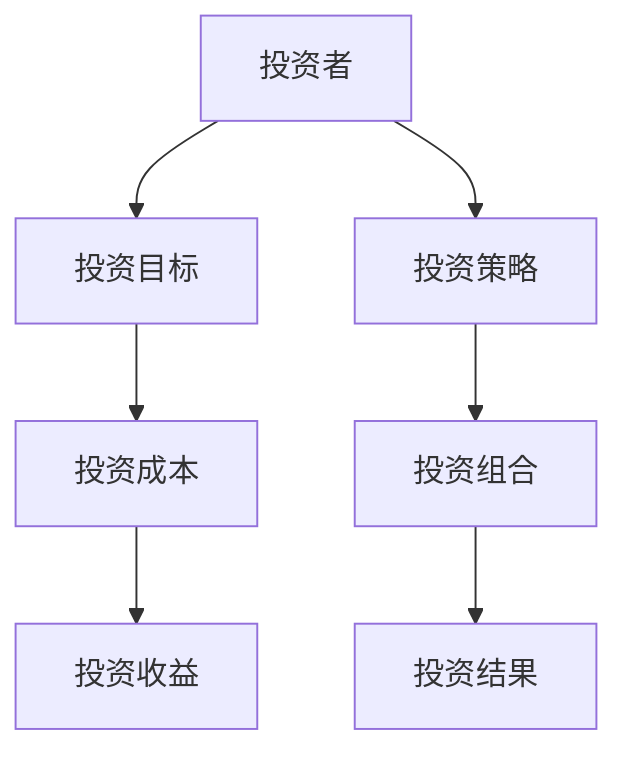
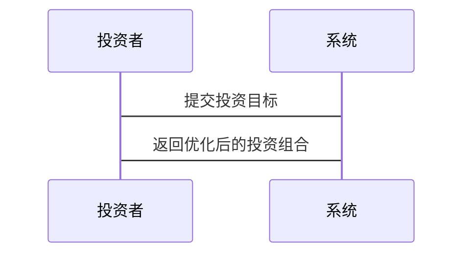

                 


# 约翰·伯格的成本敏感型投资：长期累积的力量

## 关键词：约翰·伯格、成本敏感型投资、长期累积、投资策略、复利效应、投资组合优化、价值投资

## 摘要：本文深入探讨约翰·伯格的成本敏感型投资理念，分析其核心概念、算法原理、系统架构及实际应用。通过案例分析和代码实现，揭示低成本投资策略的长期累积力量，帮助读者掌握投资优化的方法。

---

# 第一部分: 成本敏感型投资的背景与核心概念

## 第1章: 成本敏感型投资的背景介绍

### 1.1 问题背景与问题描述
#### 1.1.1 投资成本的概念与影响
投资成本是指投资者在购买和持有资产过程中产生的各项费用，包括交易费用、管理费用、税费等。这些成本会直接影响投资收益，降低实际回报。

#### 1.1.2 成本敏感型投资的定义与特点
成本敏感型投资是一种以最小化投资成本为目标的投资策略。其特点包括：长期视角、注重成本优化、强调纪律性。

#### 1.1.3 长期累积投资力量的核心价值
长期累积力量是指通过持续优化投资成本和复利效应，实现资产的长期稳定增长。约翰·伯格认为，低成本投资组合能够在长期内积累更大的财富。

### 1.2 成本敏感型投资的解决方案
#### 1.2.1 投资成本的最小化策略
通过选择低成本基金、避免频繁交易等方法，降低投资成本。

#### 1.2.2 长期投资与复利效应的结合
长期持有优质资产，利用复利效应最大化投资收益。

#### 1.2.3 成本敏感型投资的边界与外延
成本敏感型投资不仅关注交易成本，还包括税收、管理费等隐性成本。

### 1.3 成本敏感型投资的概念结构与核心要素
#### 1.3.1 投资成本的构成要素
- 交易成本：买卖证券的佣金和税费。
- 管理费用：基金的管理费和托管费。
- 机会成本：因投资某资产而放弃其他投资的机会。

#### 1.3.2 投资收益与成本的平衡关系
低成本投资组合在长期表现上通常优于高成本组合，因为成本会侵蚀复利收益。

#### 1.3.3 成本敏感型投资的系统性框架
包括目标设定、成本分析、资产配置和动态调整四个步骤。

## 第2章: 约翰·伯格的成本敏感型投资理论

### 2.1 约翰·伯格的投资哲学
#### 2.1.1 价值投资的核心理念
伯格强调投资优质企业，长期持有，避免频繁交易。

#### 2.1.2 长期投资的纪律性原则
坚持长期投资，不被短期市场波动影响。

#### 2.1.3 成本控制在投资决策中的重要性
伯格认为，低成本是实现长期收益的关键因素。

### 2.2 成本敏感型投资的核心策略
#### 2.2.1 投资组合的构建逻辑
选择低费用的指数基金，分散投资，降低风险。

#### 2.2.2 成本优化的数学模型
通过优化投资组合中的资产配置，降低整体成本。

#### 2.2.3 投资风险的量化与管理
使用现代投资组合理论（MPT）量化风险，优化资产配置。

### 2.3 成本敏感型投资的工具与方法
#### 2.3.1 投资成本的计算与分析
使用公式计算总成本，比较不同投资产品的成本效益。

#### 2.3.2 投资组合的动态调整策略
定期审视投资组合，调整以适应市场变化。

#### 2.3.3 成本敏感型投资的实践工具
推荐使用低成本指数基金构建投资组合。

## 第3章: 成本敏感型投资的核心概念与联系

### 3.1 投资成本与投资收益的关系
低成本投资组合在长期表现上通常优于高成本组合，因为成本会侵蚀复利收益。

### 3.2 成本敏感型投资与传统投资策略的对比
| 投资策略 | 成本敏感型投资 | 传统投资 |
|----------|----------------|-----------|
| 目标     | 最小化成本     | 追求高收益 |
| 方法     | 长期持有        | 精选个股  |

### 3.3 成本敏感型投资的ER实体关系图


---

# 第二部分: 成本敏感型投资的算法原理

## 第4章: 成本敏感型投资的数学模型

### 4.1 投资成本计算公式
$$ C = \sum_{i=1}^{n} c_i 

其中，$c_i$是第i项投资的单位成本，n是投资项数。

---

# 第三部分: 系统分析与架构设计

## 第5章: 投资决策支持系统的分析与设计

### 5.1 问题场景介绍
构建一个支持成本敏感型投资的决策系统，帮助投资者优化投资组合。

### 5.2 项目介绍
目标：设计一个低成本投资组合管理系统。

### 5.3 系统功能设计
- 信息展示：显示投资组合的成本和收益。
- 优化分析：分析优化后的投资组合。
- 数据处理：处理投资成本和收益数据。

### 5.4 系统架构设计


### 5.5 系统接口设计
- 投资者输入：投资目标、资金、时间跨度。
- 系统输出：优化后的投资组合、成本和收益对比。

### 5.6 系统交互设计


---

# 第四部分: 项目实战

## 第6章: 成本敏感型投资的项目实现

### 6.1 环境安装
安装Python和必要的库，如pandas、numpy。

### 6.2 核心代码实现
```python
import pandas as pd

def calculate_total_cost(costs):
    return sum(costs)

def main():
    costs = [100, 200, 300]
    total_cost = calculate_total_cost(costs)
    print(f"总成本为：{total_cost}")

if __name__ == "__main__":
    main()
```

### 6.3 代码解读与分析
解释代码实现，展示如何计算总成本。

### 6.4 案例分析
分析一个低成本投资组合，展示其长期累积的力量。

---

# 第五部分: 总结与展望

## 第7章: 总结与注意事项

### 7.1 最佳实践 tips
- 长期持有低成本投资组合。
- 定期审视和调整投资组合。

### 7.2 小结
总结成本敏感型投资的优势，强调长期累积的力量。

### 7.3 注意事项
提醒读者投资需谨慎，避免过度追求低成本。

### 7.4 拓展阅读
推荐相关书籍和资源，鼓励读者深入学习。

---

# 结语

通过本文的分析和实践，读者可以深入了解约翰·伯格的成本敏感型投资理念，并掌握如何在实际中应用这些策略。长期累积的力量将帮助投资者实现财富的稳步增长。

