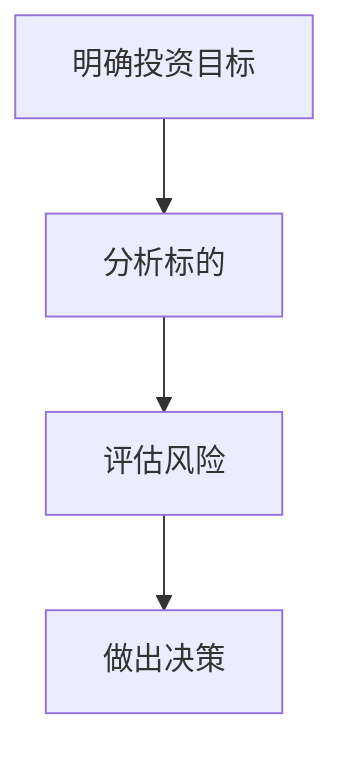
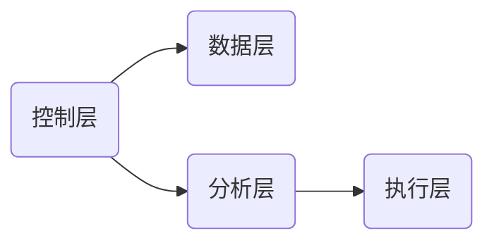

                 


# 约翰·伯格的投资常识：简单胜于复杂

## 关键词：投资常识，简单投资，复利效应，资产配置，风险管理

## 摘要：  
本文深入探讨了约翰·伯格的投资理念，强调“简单胜于复杂”的核心思想，通过分析投资的基本原理、策略和风险管理，结合实际案例和系统设计，帮助读者掌握长期稳健的投资方法。

---

# 第1章: 投资概述

## 1.1 投资的基本概念

### 1.1.1 投资的定义与分类  
投资是指将资金投入到某一领域，以期获得未来收益的行为。主要分为股票、债券、基金等类别。  

### 1.1.2 投资的重要性和意义  
投资是实现财富增长的重要手段，通过合理配置资产，可以降低风险，提高收益。  

### 1.1.3 投资的基本原则与误区  
基本原则包括分散投资、长期持有；误区包括追求短期收益、过度复杂化投资策略。

## 1.2 约翰·伯格的投资理念

### 1.2.1 约翰·伯格的背景介绍  
约翰·伯格是指数基金之父，强调长期投资和简单投资策略。

### 1.2.2 "简单胜于复杂"的核心思想  
投资的本质是简单，避免过度复杂的策略，降低操作成本和风险。

### 1.2.3 投资中的常见错误与避免  
避免频繁交易、追涨杀跌、忽视费用等错误。

## 1.3 投资市场的基本结构

### 1.3.1 股票、债券、基金等资产的定义与特点  
股票代表所有权，债券代表债权，基金是集合投资工具。

### 1.3.2 投资市场的参与者与运作机制  
参与者包括投资者、上市公司、中介机构等。

### 1.3.3 市场波动与投资者心理  
市场波动受情绪影响，投资者需保持理性。

---

# 第2章: 投资的基本原理

## 2.1 资产配置与分散投资

### 2.1.1 资产配置的定义与重要性  
资产配置是将资金分配到不同资产类别，以平衡风险和收益。

### 2.1.2 分散投资的原则与策略  
通过多样化投资降低风险，避免过度集中。

### 2.1.3 资产配置的数学模型  
$$ \text{收益} = \sum (w_i \times r_i) $$  
其中，\( w_i \) 为权重，\( r_i \) 为各资产的收益率。

## 2.2 复利效应与长期投资

### 2.2.1 复利的定义与计算公式  
复利公式：$$ A = P(1 + r)^n $$  
其中，\( A \) 为终值，\( P \) 为本金，\( r \) 为年利率，\( n \) 为年数。

### 2.2.2 长期投资的优势与风险  
长期投资通过复利效应获得更高收益，但需应对市场波动。

### 2.2.3 复利效应的实例分析  
以100元投资，年收益率10%，10年后增长至259元。

## 2.3 投资组合的优化与风险管理

### 2.3.1 投资组合优化的基本原理  
通过调整资产权重，最大化收益或最小化风险。

### 2.3.2 风险管理的核心策略  
设定止损点，分散投资，定期调整组合。

### 2.3.3 投资组合的风险-收益平衡  
使用夏普比率衡量投资组合的性价比：$$ \text{夏普比率} = \frac{E[r] - r_f}{\sigma} $$

---

# 第3章: 投资分析方法

## 3.1 基本面分析与技术分析

### 3.1.1 基本面分析的定义与步骤  
基本面分析关注公司财务状况和行业前景。

### 3.1.2 技术分析的定义与工具  
技术分析通过价格走势预测未来趋势。

### 3.1.3 两种分析方法的优缺点对比  
| 分析方法 | 优点 | 缺点 |
|----------|------|------|
| 基本面   | 精准 | 周期长 |
| 技术     | 及时 | 易受情绪影响 |

## 3.2 简单分析法的原理与应用

### 3.2.1 简单分析法的核心思想  
关注关键指标，如市盈率、ROE，避免过度分析。

### 3.2.2 简单分析法的实施步骤  
1. 选择行业龙头。
2. 分析财务报表。
3. 判断估值是否合理。

### 3.2.3 简单分析法的优缺点  
优点：简单高效；缺点：可能忽略细节。

## 3.3 投资决策的逻辑与流程

### 3.3.1 投资决策的基本逻辑  
明确目标→分析标的→评估风险→做出决策。

### 3.3.2 投资决策的流程图  


### 3.3.3 投资决策中的常见问题  
如何处理信息不全？如何应对市场变化？

---

# 第4章: 投资策略与实战

## 4.1 长期投资策略

### 4.1.1 长期投资的定义与特点  
长期持有优质资产，享受复利效应。

### 4.1.2 长期投资的实施步骤  
选择优质公司→分散投资→定期定额投入。

### 4.1.3 长期投资的案例分析  
投资指数基金，长期持有，获得稳定收益。

## 4.2 价值投资策略

### 4.2.1 价值投资的核心思想  
寻找被市场低估的优质股票。

### 4.2.2 价值投资的实施步骤  
识别低估公司→分析财务状况→长期持有。

### 4.2.3 价值投资的风险  
市场可能长期低估，需耐心等待。

## 4.3 指数基金投资策略

### 4.3.1 指数基金的定义与特点  
跟踪指数，分散风险，费用低。

### 4.3.2 指数基金的实施步骤  
选择宽基指数基金→定投→长期持有。

### 4.3.3 指数基金的优缺点  
优点：分散风险，费用低；缺点：无法超越市场。

---

# 第5章: 投资系统设计与风险管理

## 5.1 投资系统的构建

### 5.1.1 系统需求分析  
目标：实现自动化投资决策。

### 5.1.2 系统功能设计  
数据采集、分析、决策、执行。

### 5.1.3 系统架构设计  


## 5.2 风险管理策略

### 5.2.1 风险识别与评估  
识别市场风险、流动性风险等。

### 5.2.2 风险控制措施  
设置止损点，分散投资，定期调整组合。

### 5.2.3 风险管理的系统实现  
通过系统监控风险指标，自动触发预警。

---

# 第6章: 项目实战

## 6.1 环境配置与代码实现

### 6.1.1 环境配置  
安装Python、Pandas、Matplotlib等库。

### 6.1.2 核心代码实现  
```python
import pandas as pd
import matplotlib.pyplot as plt

# 数据加载
data = pd.read_csv('stock_data.csv')

# 计算收益率
data['return'] = data['close'].pct_change()

# 绘制价格走势
plt.plot(data['date'], data['close'])
plt.show()
```

## 6.2 案例分析与系统优化

### 6.2.1 案例分析  
以某指数基金为例，分析其历史收益与波动。

### 6.2.2 系统优化  
优化数据采集速度，提高分析效率。

## 6.3 总结与展望  
通过实战，验证了简单投资策略的有效性，未来可进一步优化系统。

---

# 第7章: 总结与展望

## 7.1 核心要点回顾  
简单投资策略、复利效应、风险管理。

## 7.2 未来展望  
技术进步将推动投资自动化，投资者需不断提升认知。

## 7.3 最佳实践 Tips  
坚持长期投资，避免情绪化决策，定期调整投资组合。

---

# 结语  
投资不仅是财富的积累，更是一种思维方式的修炼。通过简单而有效的策略，投资者可以在复杂多变的市场中稳健前行。

---

