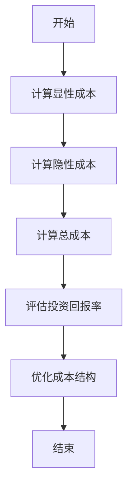

                 

# 约翰·伯格的投资成本意识

## 关键词：投资成本意识，约翰·伯格，投资策略，成本控制，投资回报，系统化投资

## 摘要：  
本文深入探讨了约翰·伯格的投资成本意识，分析其核心理念、理论基础、实际应用及其对投资决策的深远影响。文章从投资成本的基本概念出发，结合伯格的成本意识理论，系统化地分析了投资成本的分类、计算方法、优化策略以及在不同投资周期中的应用。同时，本文通过实际案例和系统架构设计，详细阐述了如何将成本意识融入投资决策中，以实现投资回报的最大化。文章最后还探讨了投资成本意识的未来发展趋势和潜在挑战。

---

# 正文

## 第一部分: 投资成本意识的概述

### 第1章: 投资成本意识的基本概念

#### 1.1 投资的基本概念

##### 1.1.1 投资的定义与分类

投资是指将资金或其他资源投入到特定项目或资产中，以期望在未来获得高于初始投入的回报。投资可以分为以下几类：

- **金融投资**：包括股票、债券、基金等金融资产的投资。
- **实物投资**：包括房地产、生产设备等实物资产的投资。
- **长期投资**：以获取未来长期收益为目的的投资。
- **短期投资**：以短期资本增值或收益为目的的投资。

投资的核心目标是通过合理配置资源，实现资产的保值和增值。

##### 1.1.2 投资成本的定义

投资成本是指在投资过程中所支出的所有资源，包括显性成本和隐性成本。显性成本是直接可见的支出，如购买资产的本金、管理费用、交易费用等；隐性成本则是机会成本、时间成本等难以量化的支出。

##### 1.1.3 投资成本意识的重要性

投资成本意识是指投资者对成本的敏感性和控制能力。在投资决策中，成本意识能够帮助投资者合理分配资源、降低不必要的支出，从而提高投资回报率。

---

#### 1.2 投资成本意识的核心要素

##### 1.2.1 投资成本的构成

投资成本主要包括以下几类：

- **显性成本**：直接与投资行为相关的支出，如购买股票的佣金、债券的申购费用等。
- **隐性成本**：间接与投资相关的支出，如机会成本（放弃其他投资的潜在收益）、时间成本（投入在投资上的时间）等。
- **固定成本**：与投资无关的固定支出，如管理费用、行政费用等。
- **变动成本**：与投资规模相关的可变支出，如交易佣金、托管费用等。

##### 1.2.2 投资成本与投资回报的关系

投资成本与投资回报呈反比关系：成本越高，回报率可能越低；成本越低，回报率可能越高。因此，在投资决策中，投资者需要在成本与回报之间找到平衡点。

##### 1.2.3 投资成本意识的形成过程

投资成本意识的形成是一个逐步积累的过程，投资者需要通过不断学习和实践，逐步认识到成本在投资中的重要性，并通过优化成本结构来提高投资效率。

---

## 第2章: 约翰·伯格的投资成本意识理论

### 2.1 约翰·伯格的投资理念

#### 2.1.1 约翰·伯格的生平简介

约翰·伯格（John Bogle）是美国著名的投资专家，也是指数基金之父。他于1940年出生，曾创立 Vanguard 集团，并倡导低成本投资策略。伯格的投资理念以“简单、低成本、长期”为核心，强调通过分散投资和控制成本来实现长期稳定的回报。

#### 2.1.2 约翰·伯格的投资哲学

伯格的投资哲学可以概括为以下几点：

- **长期投资**：伯格认为，短期市场波动无法预测，长期投资能够平滑波动，降低风险。
- **分散投资**：通过分散投资降低特定资产的风险，避免过度依赖某一种资产。
- **低成本投资**：伯格认为，高成本会侵蚀投资回报，因此低成本是实现长期收益的关键。

#### 2.1.3 约翰·伯格的成本意识理论

伯格的成本意识理论指出，投资者应该关注总成本，包括显性成本和隐性成本，并通过优化成本结构来提高投资效率。他强调，低成本投资策略能够帮助投资者在长期获得更高的净回报。

---

### 2.2 成本意识在投资决策中的作用

#### 2.2.1 成本意识对投资目标的影响

成本意识能够帮助投资者明确投资目标，避免盲目追求高回报而忽视成本因素。例如，选择低成本的指数基金可以实现长期稳定的收益，而选择高成本的主动管理型基金可能会侵蚀部分收益。

#### 2.2.2 成本意识对投资风险的控制

通过控制成本，投资者可以降低投资组合的整体风险。例如，低成本指数基金的波动性较低，能够帮助投资者在市场波动中保持稳定。

#### 2.2.3 成本意识对投资回报的优化

低成本投资策略能够最大化投资回报。例如，长期投资于低成本指数基金，扣除各项费用后，净回报率通常高于高成本主动管理型基金。

---

## 第3章: 投资成本意识的系统化分析

### 3.1 投资成本的分类与属性

#### 3.1.1 显性成本与隐性成本

- **显性成本**：可以直接量化的成本，如交易佣金、管理费用等。
- **隐性成本**：难以量化的成本，如机会成本、时间成本等。

#### 3.1.2 固定成本与变动成本

- **固定成本**：与投资规模无关的固定支出，如管理费用。
- **变动成本**：与投资规模相关的可变支出，如交易佣金。

#### 3.1.3 时间成本与机会成本

- **时间成本**：投资者投入在投资上的时间成本。
- **机会成本**：放弃其他投资机会所失去的潜在收益。

### 3.2 投资成本与投资周期的关系

#### 3.2.1 短期投资的成本特征

- 短期投资通常需要承担较高的显性成本，如频繁交易的佣金费用。
- 短期投资的隐性成本较高，如市场波动带来的机会成本。

#### 3.2.2 长期投资的成本特征

- 长期投资的显性成本较低，如定期定额投资的佣金费用分摊。
- 长期投资的隐性成本较低，如通过分散投资降低波动性。

#### 3.2.3 不同投资周期的成本优化策略

- **短期投资**：减少交易频率，选择低成本交易平台。
- **长期投资**：选择低成本的指数基金或ETF，降低管理费用。

---

## 第4章: 投资成本意识的核心算法原理

### 4.1 投资成本计算的数学模型

#### 4.1.1 投资成本计算公式

$$\text{总成本} = \text{显性成本} + \text{隐性成本}$$

#### 4.1.2 投资回报率计算公式

$$\text{投资回报率} = \frac{\text{净收益}}{\text{初始成本}} \times 100\%$$

### 4.2 投资成本优化的算法流程

#### 4.2.1 算法流程图

---

## 第5章: 投资成本意识的系统化投资方法

### 5.1 系统化投资方法的核心理念

系统化投资方法是指通过制定明确的投资策略和规则，避免人为情绪干扰，实现长期稳定的回报。约翰·伯格的低成本指数投资策略是系统化投资的典型代表。

### 5.2 系统化投资方法的实现步骤

#### 5.2.1 确定投资目标

- 明确投资目的（如保值、增值）。
- 设定投资期限（如短期、中期、长期）。

#### 5.2.2 选择投资标的

- 根据投资目标选择合适的资产类别（如股票、债券）。
- 选择低成本的指数基金或ETF。

#### 5.2.3 制定投资计划

- 设定定期定额的投资计划。
- 设定再平衡策略（定期调整投资组合以维持目标比例）。

#### 5.2.4 监控与优化

- 定期监控投资组合的表现。
- 根据市场变化优化成本结构。

---

## 第6章: 投资成本意识的实际案例分析

### 6.1 案例背景介绍

假设一位投资者计划投资100万元，投资期限为10年，目标是实现稳定的资产增值。

### 6.2 案例分析

#### 6.2.1 高成本投资策略

- 选择主动管理型基金，年管理费用率为1.5%。
- 年佣金费用为1000元。

#### 6.2.2 低成本投资策略

- 选择低成本指数基金，年管理费用率为0.5%。
- 年佣金费用为500元。

### 6.3 投资回报对比

通过计算，低成本投资策略的净回报率高于高成本投资策略。具体计算如下：

#### 6.3.1 高成本投资回报

$$\text{年净回报率} = \text{基金回报率} - \text{管理费用率} - \text{佣金费用率}$$

#### 6.3.2 低成本投资回报

$$\text{年净回报率} = \text{基金回报率} - \text{管理费用率} - \text{佣金费用率}$$

---

## 第7章: 投资成本意识的未来趋势与挑战

### 7.1 未来发展趋势

- **技术进步**：人工智能和大数据技术将为投资成本优化提供新的工具和方法。
- **全球化**：全球化投资将降低地域限制，投资者可以通过低成本平台投资全球资产。

### 7.2 潜在挑战

- **市场波动**：市场波动可能影响投资成本的计算和优化。
- **政策变化**：政策变化可能影响投资成本的结构和计算方式。

---

## 结语

约翰·伯格的投资成本意识为我们提供了一个全新的投资视角。通过合理控制投资成本，投资者可以在长期获得更高的净回报。未来，随着技术的进步和市场的变化，投资成本意识将变得更加重要。投资者需要不断学习和适应，以应对新的挑战和机遇。

---

## 参考文献

- 约翰·伯格《投资的智慧》
- 投资学相关学术文献

---

以上是《约翰·伯格的投资成本意识》的技术博客文章大纲和内容概述。希望对您有所帮助！

