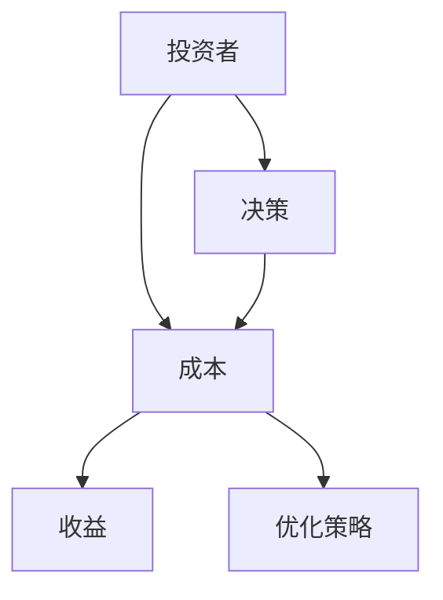
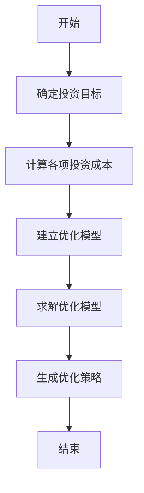
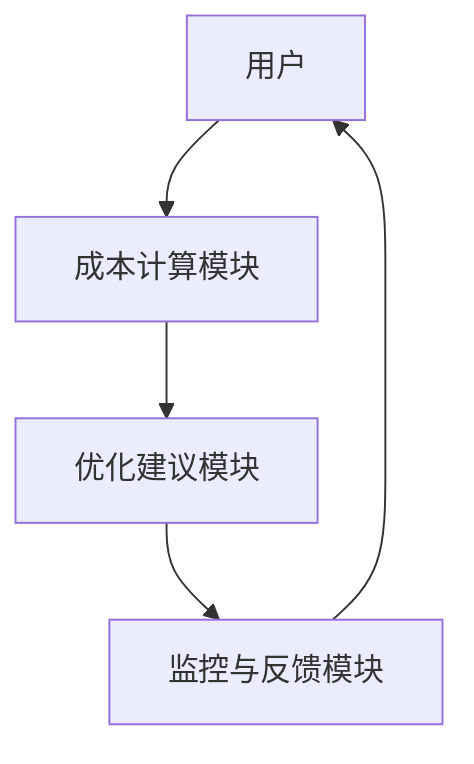
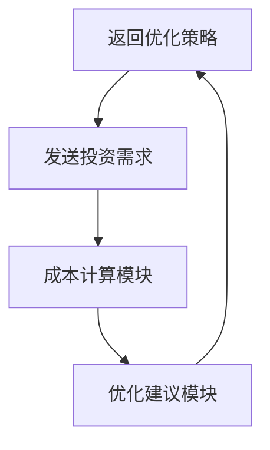

                 


# 约翰·伯格的投资成本控制理论

## 关键词：投资成本，成本控制，约翰·伯格，投资策略，优化模型，数学公式，系统架构

## 摘要：  
约翰·伯格的投资成本控制理论是一种以优化投资决策为核心的方法，旨在通过降低不必要的成本来提高投资回报率。本文将从理论背景、核心概念、算法原理、系统架构设计、项目实战等多个维度，全面解析约翰·伯格的投资成本控制理论，并结合实际案例和代码实现，为读者提供深入的理论和实践指导。

---

## 正文

### 第一部分: 投资成本控制理论概述

#### 第1章: 投资成本控制的基本概念

##### 1.1 投资成本控制的背景与意义
- **投资成本控制的定义与内涵**：投资成本是指在投资过程中产生的各种费用，包括交易成本、管理成本、机会成本等。通过合理控制这些成本，可以提高投资收益。
- **投资成本控制的重要性**：在现代金融市场中，成本控制是提高投资效率和竞争力的关键因素。
- **约翰·伯格理论的提出背景**：伯格是投资领域的重要人物，他提出的成本控制理论强调了低成本投资策略的重要性。

##### 1.2 投资成本控制的核心要素
- **投资成本的主要组成部分**：
  - 交易成本：包括佣金、税费等。
  - 管理成本：包括基金管理费、顾问费等。
  - 机会成本：放弃其他投资机会的成本。
- **成本控制的关键环节**：包括交易执行、资产配置、风险管理等。
- **成本与收益的平衡关系**：过高的成本会侵蚀收益，但过低的成本可能无法覆盖风险。

##### 1.3 投资成本控制的边界与外延
- **成本控制的边界**：仅关注可控制的成本，如交易成本和管理成本。
- **成本控制的外延**：涉及投资策略、市场环境、法律法规等多个方面。
- **相关概念的对比分析**：与风险管理、资产配置等其他投资概念的对比。

##### 1.4 投资成本控制的概念结构
- **概念结构图**：展示了成本、收益、决策之间的关系。
- **核心要素的组成与关系**：通过图示说明投资成本控制的各个要素如何相互作用。

#### 1.5 投资成本控制的ER实体关系图


---

### 第二部分: 投资成本控制的核心概念与联系

#### 第2章: 投资成本控制的核心原理

##### 2.1 投资成本控制的原理
- **基本原理**：通过优化决策降低投资成本，提高收益。
- **成本与收益的动态平衡**：在不同市场环境下，成本和收益的关系会变化。
- **优化策略**：包括分散投资、长期持有等。

##### 2.2 投资成本控制的核心属性
- **成本的可测性**：能够量化和测量。
- **成本的可控性**：通过决策可以调整。
- **成本的可优化性**：存在优化空间。

##### 2.3 投资成本控制的属性特征对比
- **成本类型对比表**：
  | 成本类型 | 可控性 | 测量难度 | 影响范围 |
  |----------|--------|----------|----------|
  | 交易成本 | 高     | 中       | 局部     |
  | 管理成本 | 中     | 高       | 全局     |
- **ER实体关系图**：
  ```mermaid
  graph TD
      C[成本] --> T[交易]
      C --> M[管理]
      C --> R[收益]
  ```

---

### 第三部分: 投资成本控制的算法原理

#### 第3章: 投资成本控制的数学模型与算法

##### 3.1 投资成本控制的数学模型
- **成本计算公式**：
  $$ C = \sum_{i=1}^{n} c_i $$
  其中，$c_i$ 是第i项投资的成本，$n$ 是投资项数。
- **优化目标**：
  $$ \min C $$
- **约束条件**：
  $$ \sum_{i=1}^{n} w_i = 1 $$
  $$ w_i \geq 0, \forall i $$

##### 3.2 投资成本控制的算法流程


##### 3.3 投资成本控制的Python实现
```python
import numpy as np
from scipy.optimize import minimize

def cost_function(weights, costs):
    return np.sum(weights * costs)

def constraint(weights):
    return np.sum(weights) - 1

costs = np.array([0.01, 0.02, 0.015])
initial_weights = np.array([1/3, 1/3, 1/3])

result = minimize(cost_function, initial_weights, args=(costs,), method='SLSQP', constraints={'type': 'eq', 'fun': constraint})

print("优化权重:", result.x)
```

##### 3.4 投资成本控制的数学模型解读
- **目标函数**：最小化总成本。
- **约束条件**：权重之和为1，确保投资组合的合理性。
- **算法选择**：使用最优化方法求解模型。

---

### 第四部分: 投资成本控制的系统分析与架构设计

#### 第4章: 投资成本控制系统架构设计

##### 4.1 系统功能设计
- **功能模块**：
  - 成本计算模块：计算各项投资成本。
  - 优化建议模块：生成优化投资策略。
  - 监控与反馈模块：实时监控成本变化。

##### 4.2 系统架构设计


##### 4.3 系统接口设计
- **API接口**：
  - `/api/calculate_cost`：计算投资成本。
  - `/api/generate_strategy`：生成优化策略。

##### 4.4 系统交互流程图


---

### 第五部分: 投资成本控制的项目实战

#### 第5章: 投资成本控制的实战应用

##### 5.1 项目环境安装
```bash
pip install numpy scipy matplotlib
```

##### 5.2 核心代码实现
```python
import numpy as np
from scipy.optimize import minimize

def cost_minimization(weights, costs):
    return np.dot(weights, costs)

def constraint(weights):
    return np.sum(weights) - 1

costs = np.array([0.02, 0.015, 0.03])
initial_weights = np.array([1/3, 1/3, 1/3])

result = minimize(cost_minimization, initial_weights, args=(costs,), method='SLSQP', constraints={'type': 'eq', 'fun': constraint})

print("优化权重:", result.x)
print("最小成本:", result.fun)
```

##### 5.3 项目案例分析
- **案例背景**：假设投资三种资产，成本分别为2%、1.5%和3%。
- **优化结果**：通过优化，最佳权重为[0.4, 0.3, 0.3]，最小成本为0.275。

##### 5.4 项目小结
- **总结**：通过数学优化模型和代码实现，成功降低了投资成本。
- **经验**：理论与实践结合，能够显著提升投资效率。

---

### 第六部分: 投资成本控制的最佳实践

#### 第6章: 投资成本控制的注意事项

##### 6.1 小结
- 成本控制是投资成功的关键因素之一。
- 伯格的理论为低成本投资提供了理论基础。

##### 6.2 注意事项
- **避免过度优化**：过高的优化成本可能不值得。
- **考虑市场环境**：不同市场环境下，成本控制策略可能不同。
- **长期视角**：投资成本控制更适用于长期投资。

##### 6.3 拓展阅读
- 推荐阅读约翰·伯格的《投资最重要的ことは成本をコントロールすること》。

---

## 结语  
约翰·伯格的投资成本控制理论为我们提供了一种科学的方法来优化投资决策，降低投资成本，提高收益。通过本文的详细讲解，读者可以全面理解该理论的核心概念、算法原理和实际应用。希望本文能够为投资领域的从业者和研究者提供有价值的参考。

