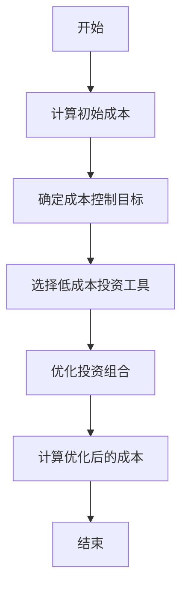
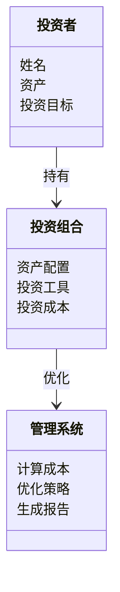

                 


# 约翰·伯格的投资成本控制：复利效应的长期影响

## 关键词：投资成本控制，复利效应，约翰·伯格，投资优化，长期影响

## 摘要：本文深入探讨了约翰·伯格在投资成本控制方面的理念及其对复利效应的长期影响。通过分析投资成本的构成、复利效应的数学模型以及两者之间的协同作用，结合实际案例和系统设计，揭示了如何通过优化投资成本来最大化复利效应带来的长期收益。

---

## 第1章：投资成本控制的背景与重要性

### 1.1 投资成本控制的背景

#### 1.1.1 投资成本的定义与分类
投资成本是指在投资过程中产生的各种费用，主要包括显性成本（如交易费用、管理费用）和隐性成本（如机会成本、心理成本）。投资成本的高低直接影响投资回报率。

#### 1.1.2 投资成本控制的必要性
在竞争激烈的市场环境中，降低成本是提高投资收益的重要途径。约翰·伯格强调，长期投资的成本控制是实现复利效应最大化的核心因素。

#### 1.1.3 约翰·伯格的投资理念与成本控制
伯格主张通过分散投资、长期持有和低成本运作来实现投资收益的最大化。他认为，低成本是复利效应得以长期积累的关键。

### 1.2 复利效应的基本概念

#### 1.2.1 复利效应的定义
复利效应是指投资收益不断再投资所产生的滚雪球效应。简单来说，复利是“利滚利”，即每期的利息不仅包括本金产生的利息，还包括之前累积的利息产生的利息。

#### 1.2.2 复利效应的数学模型
复利的数学公式为：
$$
A = P \times (1 + r)^n
$$
其中：
- $A$ 是最终金额
- $P$ 是初始本金
- $r$ 是年利率
- $n$ 是年数

#### 1.2.3 复利效应在投资中的应用
复利效应在投资中的应用广泛，例如股票投资、债券投资、基金投资等。长期来看，复利效应能够显著放大投资收益。

### 1.3 投资成本与复利效应的关系

#### 1.3.1 投资成本对复利效应的影响
投资成本会降低净收益，从而影响复利效应。例如，较高的管理费用会侵蚀投资收益，进而影响复利的累积效果。

#### 1.3.2 复利效应如何放大投资收益
复利效应通过时间的积累，能够将较小的投资收益转化为较大的财富增长。这种效应在低成本投资中表现尤为明显。

#### 1.3.3 成本控制与复利效应的长期结合
通过降低投资成本，可以增加净收益，进而提升复利效应。长期来看，成本控制对投资收益的影响是指数级的。

---

## 第2章：投资成本控制的核心概念与联系

### 2.1 投资成本的构成与分析

#### 2.1.1 显性成本与隐性成本
显性成本是指可以直接量化的费用，如交易费用、管理费用等。隐性成本是指难以量化的费用，如机会成本、心理成本等。

#### 2.1.2 成本构成的实体关系图（ER图）

```mermaid
erDiagram
    actor 投资者
    actor 市场
    actor 管理者
    entity 投资成本
    entity 复利效应
    entity 投资收益

    投资者 --> 投资成本: 支付
    市场 --> 复利效应: 产生
    管理者 --> 投资收益: 优化
    投资成本 --> 投资收益: 影响
    复利效应 --> 投资收益: 放大
```

### 2.2 复利效应的数学模型与属性特征

#### 2.2.1 复利效应的数学公式推导
复利的年增长率公式为：
$$
r_{\text{annual}} = (1 + r_{\text{monthly}})^{12} - 1
$$

#### 2.2.2 复利效应与投资成本的对比分析

| 特性            | 复利效应                 | 投资成本控制             |
|-----------------|--------------------------|--------------------------|
| 定义            | 利息的再投资效应         | 降低投资费用             |
| 影响因素        | 利率、投资时间           | 交易费用、管理费用       |
| 目标            | 最大化收益               | 最小化费用侵蚀收益       |
| 实现方式        | 再投资、长期持有         | 选择低成本投资工具       |

#### 2.3 投资成本与复利效应的协同作用

| 关系类型         | 描述                     |
|------------------|--------------------------|
| 正相关           | 成本降低，复利效应增强    |
| 负相关           | 成本增加，复利效应减弱    |
| 协同优化         | 成本控制与复利效应共同提升 |

---

## 第3章：投资成本控制的算法原理

### 3.1 投资成本控制的算法

#### 3.1.1 算法概述
投资成本控制算法旨在通过优化投资组合的结构和选择低成本工具来降低总体投资成本。

#### 3.1.2 算法流程图



#### 3.1.3 算法实现代码

```python
def calculate_cost_efficiency(principal, rate, years):
    # 计算初始成本
    initial_cost = principal * 0.01  # 假设管理费率为1%
    # 计算复利效应
    compound_interest = principal * (1 + rate) ** years
    # 计算优化后的成本
    optimized_cost = compound_interest - (compound_interest * 0.01)  # 假设优化后管理费率为1%
    return initial_cost, optimized_cost

principal = 10000
rate = 0.07
years = 30

initial_cost, optimized_cost = calculate_cost_efficiency(principal, rate, years)
print(f"初始成本：${initial_cost:.2f}")
print(f"优化后成本：${optimized_cost:.2f}")
```

---

## 第4章：数学模型与公式

### 4.1 投资成本的数学模型

$$
\text{总成本} = \text{初始投资} \times \text{管理费率} \times \text{投资时间}
$$

### 4.2 复利效应的数学公式

$$
\text{最终收益} = P \times (1 + r)^n
$$

其中：
- $P$ 是初始本金
- $r$ 是年利率
- $n$ 是年数

---

## 第5章：系统分析与架构设计

### 5.1 系统功能设计

#### 5.1.1 领域模型类图



---

## 第6章：项目实战

### 6.1 环境安装与配置

安装Python和相关库（如numpy、pandas、matplotlib）。

### 6.2 核心功能实现

#### 6.2.1 成本计算模块

```python
import numpy as np

def calculate_total_cost(principal, rate, years, fee_rate):
    # 计算每年的成本
    annual_cost = principal * fee_rate
    # 计算总成本
    total_cost = annual_cost * years
    return total_cost

principal = 10000
rate = 0.07
years = 30
fee_rate = 0.01

total_cost = calculate_total_cost(principal, rate, years, fee_rate)
print(f"总成本：${total_cost:.2f}")
```

#### 6.2.2 复利效应计算模块

```python
import matplotlib.pyplot as plt

def calculate_compound_interest(principal, rate, years):
    amounts = []
    for i in range(years):
        amounts.append(principal * (1 + rate) ** (i + 1))
    return amounts

principal = 10000
rate = 0.07
years = 30

amounts = calculate_compound_interest(principal, rate, years)
plt.plot(amounts)
plt.xlabel('年数')
plt.ylabel('金额')
plt.title('复利效应')
plt.show()
```

---

## 第7章：总结与展望

### 7.1 最佳实践 tips

- 选择低成本投资工具
- 长期持有，避免频繁交易
- 定期评估和优化投资组合

### 7.2 小结

通过优化投资成本并结合复利效应，投资者可以实现长期财富的稳健增长。

### 7.3 注意事项

- 投资有风险，需谨慎评估
- 定期审视投资策略，适应市场变化

### 7.4 拓展阅读

- 《投资学》
- 《约翰·伯格的投资之道》

---

通过本文的详细分析和实际案例，读者可以更好地理解投资成本控制与复利效应的长期影响，并将其应用于实际投资中。

