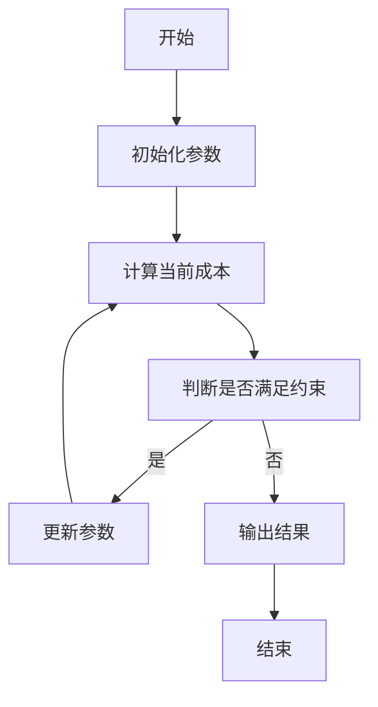
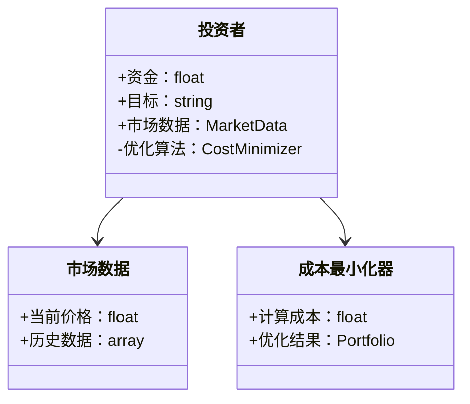

                 


# 约翰·伯格的投资成本最小化策略

## 关键词：投资成本、最小化策略、优化模型、系统设计、算法原理

## 摘要：本文深入探讨了约翰·伯格的投资成本最小化策略，从理论到实践，结合背景分析、核心概念、算法原理、系统设计和实战案例，详细阐述了如何通过优化模型和系统架构设计来实现投资成本的最小化，为投资者提供了实用的指导和建议。

---

## 第一部分：投资成本最小化策略背景

### 第1章：投资成本的背景与重要性

#### 1.1 投资成本的基本概念

投资成本是投资者在进行资产配置和交易过程中所产生的各种费用，包括交易成本、管理费用、税费等。这些成本直接影响投资回报，是投资者决策的重要考量因素。

- **交易成本**：包括佣金、买卖价差、过户费等，直接影响投资组合的收益。
- **管理费用**：基金或资产管理产品的管理费率，通常按年收取。
- **机会成本**：因资金用于某项投资而放弃的其他投资机会的成本。
- **隐性成本**：如市场冲击成本，即大额交易对市场价格的影响。

#### 1.2 投资成本最小化的背景

随着金融市场的发展，投资者对成本的关注度不断提高。尤其是在低利率环境下，降低投资成本成为提升收益的关键因素。此外，机构投资者和个人投资者都在寻求更高效的投资策略，以应对日益复杂的市场环境。

#### 1.3 投资成本最小化的目标与意义

投资成本最小化的目标是在确保风险可控的前提下，通过优化投资组合和交易策略，降低各项费用，从而提高净收益。其意义在于：

1. 提高投资组合的整体回报。
2. 增强投资策略的可扩展性。
3. 帮助投资者在长期投资中积累更多的财富。

---

### 第2章：投资成本构成与核心要素

#### 2.1 投资成本的构成要素

投资成本可以分为显性成本和隐性成本。显性成本是直接可见的费用，如佣金、管理费；隐性成本则是难以量化的，如市场冲击成本。

- **显性成本**：
  - 交易佣金：根据交易金额比例收取。
  - 买卖价差：卖出价低于买入价的部分。
  - 印花税：在某些市场中，对股票交易征收的税费。
  
- **隐性成本**：
  - 市场冲击：大额交易导致的价格波动。
  - 机会成本：资金用于投资而无法用于其他用途的成本。

#### 2.2 投资成本与投资收益的关系

投资成本与收益呈负相关关系。降低成本可以提升净收益，但过低的成本可能影响投资的流动性或安全性。因此，平衡成本与收益是关键。

#### 2.3 核心概念的属性特征对比

下表对比了显性成本和隐性成本的关键属性：

| **属性**       | **显性成本**                  | **隐性成本**                  |
|-----------------|-------------------------------|-------------------------------|
| **可量化性**     | 高                           | 低                           |
| **直接影响**     | 交易费用                     | 价格波动                     |
| **控制难度**     | 中等                         | 高                           |
| **透明度**       | 高                           | 低                           |

---

### 第3章：投资成本的核心概念与联系

#### 3.1 投资成本的核心原理

投资成本最小化的核心在于优化投资组合和交易策略。通过数学模型和算法，可以找到成本与收益的最佳平衡点。

- **数学优化模型**：通过线性规划、动态规划等方法，构建成本最小化的目标函数。
- **风险管理**：在降低成本的同时，确保投资组合的稳定性。

#### 3.2 投资成本与市场结构的关系

市场结构，如流动性、参与者数量，直接影响投资成本。例如，流动性高的市场通常交易成本较低，但可能存在更高的隐性成本。

---

## 第二部分：投资成本最小化的算法原理

### 第4章：投资成本优化的数学模型

#### 4.1 线性规划模型

线性规划是一种常见的优化方法，适用于投资成本最小化问题。目标函数和约束条件如下：

- **目标函数**：$$ \min c^T x $$
- **约束条件**：$$ A x \leq b, \quad x \geq 0 $$

其中，\( c \) 是成本向量，\( x \) 是投资组合变量。

#### 4.2 非线性优化模型

在考虑交易量和价格影响时，非线性模型更为适用：

$$ f(x) = x^2 + 2x + 1 $$

---

### 第5章：算法原理与流程图

#### 5.1 投资成本优化算法

以下为优化算法的mermaid流程图：



---

## 第三部分：系统分析与架构设计

### 第6章：系统架构设计

#### 6.1 系统功能设计

- **输入模块**：接收投资组合和市场数据。
- **处理模块**：应用优化算法计算成本。
- **输出模块**：显示优化结果。

#### 6.2 系统架构图



---

## 第四部分：项目实战

### 第7章：项目实战

#### 7.1 环境配置

- Python 3.8+
- NumPy和SciPy库

#### 7.2 核心代码实现

```python
import numpy as np
from scipy.optimize import minimize

def cost_minimization(weights, returns, risk_free_rate=0):
    # 定义目标函数
    def objective(weights):
        return -np.dot(weights, returns)  # 最小化负收益

    # 约束条件
    constraints = [
        {'type': 'eq', 'fun': lambda w: np.sum(w) - 1},  # 投资组合权重和为1
        {'type': 'ineq', 'fun': lambda w: w - 0}  # 权重非负
    ]

    # 求解
    result = minimize(objective, weights, constraints=constraints)
    return result

# 示例
returns = np.array([0.1, 0.15, 0.12])
weights_initial = np.array([1/3, 1/3, 1/3])
result = cost_minimization(weights_initial, returns)
print("最优权重：", result.x)
print("最小化收益：", result.fun)
```

---

## 第五部分：总结与展望

### 第8章：总结与展望

#### 8.1 最佳实践 tips

1. 定期审查和调整投资组合，确保成本最小化。
2. 选择低费用的基金或ETF，降低管理成本。

#### 8.2 小结

通过优化模型和系统设计，可以有效降低投资成本，提升投资回报。

#### 8.3 注意事项

- 确保模型的鲁棒性，避免市场波动导致的策略失效。
- 定期监控和更新模型参数，适应市场变化。

#### 8.4 拓展阅读

- 阅读约翰·伯格的《投资常识》深入理解投资成本的重要性。
- 学习更多优化算法，如遗传算法，应用于投资组合管理。

---

通过以上内容，您可以全面了解约翰·伯格的投资成本最小化策略，从理论到实践，结合实际案例，帮助您优化投资组合，降低投资成本，实现更好的投资回报。

