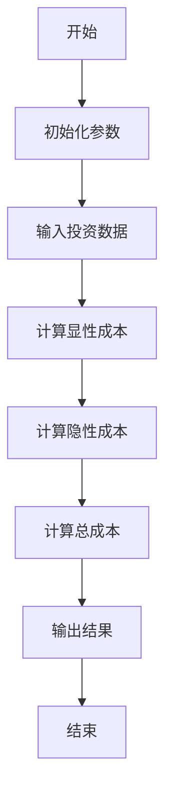
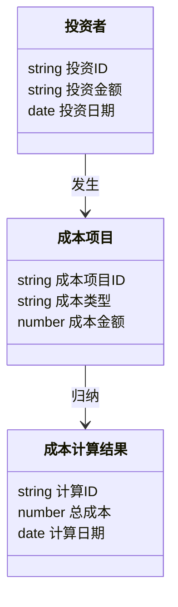

                 


# 约翰·伯格的投资成本计算方法

## 关键词：
投资成本计算、约翰·伯格、投资成本模型、财务分析、投资回报

## 摘要：
本文详细介绍了约翰·伯格的投资成本计算方法，从基本概念、核心原理、算法流程到系统架构设计和实际项目案例，全面解析了该方法的理论基础和应用场景。通过丰富的图表和代码示例，深入浅出地阐述了投资成本计算的核心原理和实际操作步骤，帮助读者掌握这一重要的投资分析工具。

---

# 第1章: 投资成本计算的基本概念

## 1.1 投资成本的定义与构成

### 1.1.1 投资成本的定义
投资成本是指在进行某项投资时，投资者需要投入的全部资源，包括资金、时间和机会成本等。投资成本是评估投资项目可行性的重要指标之一。

### 1.1.2 投资成本的构成要素
投资成本的构成要素可以分为显性成本和隐性成本两部分：
- **显性成本**：直接可见的支出，如设备采购费用、人工成本、原材料费用等。
- **隐性成本**：间接支出，如机会成本、风险成本、维护成本等。

### 1.1.3 投资成本与投资收益的关系
投资成本与投资收益密切相关。投资成本越低，投资收益可能越高，但投资成本过低可能导致投资项目的质量或可靠性不足。因此，需要在投资成本和投资收益之间找到一个平衡点。

---

## 1.2 投资成本计算的重要性

### 1.2.1 投资决策中的成本考量
在投资决策中，投资成本是决定是否进行投资的重要因素。通过计算投资成本，投资者可以评估项目的可行性和盈利能力。

### 1.2.2 成本计算在项目可行性分析中的作用
投资成本计算是项目可行性分析的核心内容之一。通过对投资成本的全面评估，可以为项目的立项决策提供科学依据。

### 1.2.3 投资成本对投资回报的影响
投资成本的高低直接影响投资回报。较低的投资成本通常意味着更高的投资回报率，但需要综合考虑项目的全生命周期成本。

---

## 1.3 约翰·伯格投资成本计算方法的背景

### 1.3.1 约翰·伯格的学术贡献
约翰·伯格是投资成本计算领域的权威专家，他的研究成果为投资成本计算方法的理论和实践提供了重要参考。

### 1.3.2 投资成本计算领域的现状
目前，投资成本计算方法多种多样，但大多数方法忽略了隐性成本和机会成本。约翰·伯格的方法在这一领域进行了重要创新。

### 1.3.3 约翰·伯格方法的创新点
约翰·伯格的投资成本计算方法将显性成本和隐性成本结合在一起，提出了一个更加全面的投资成本计算模型。

---

## 1.4 本章小结
本章介绍了投资成本的基本概念、构成要素以及投资成本计算的重要性。同时，阐述了约翰·伯格投资成本计算方法的背景和创新点，为后续内容奠定了基础。

---

# 第2章: 投资成本计算的核心概念与联系

## 2.1 投资成本的分类

### 2.1.1 显性成本
显性成本是指可以直接量化的成本，如设备采购费用、人工成本等。

### 2.1.2 隐性成本
隐性成本是指难以直接量化的成本，如机会成本、风险成本等。

### 2.1.3 机会成本
机会成本是指投资者因选择某项投资而放弃的其他投资机会的成本。

---

## 2.2 投资成本计算的核心原理

### 2.2.1 投资成本的全生命周期视角
投资成本的全生命周期视角包括项目的规划、设计、实施和运营阶段的成本。

### 2.2.2 投资成本与资产寿命的关系
投资成本与资产寿命密切相关。较长的资产寿命通常意味着较低的单位成本。

### 2.2.3 投资成本的可变性与固定性
投资成本可以分为固定成本和可变成本。固定成本在项目生命周期内不变，而可变成本会随着项目进展而变化。

---

## 2.3 投资成本计算的数学模型

### 2.3.1 投资成本计算的基本公式
$$总成本 = 初始投资 + 运营成本 + 维护成本$$

### 2.3.2 投资成本与时间的函数关系
投资成本与时间的关系可以通过函数 $C(t) = C_0 + k \cdot t$ 表示，其中 $C_0$ 是初始成本，$k$ 是单位时间成本，$t$ 是时间。

### 2.3.3 投资成本的分摊与分配
投资成本的分摊与分配需要考虑项目的生命周期和各阶段的成本权重。

---

## 2.4 投资成本计算的ER实体关系图

```mermaid
erDiagram
    actor 投资者 {
        string 投资ID
        string 投资金额
        date 投资日期
    }
    actor 成本项目 {
        string 成本项目ID
        string 成本类型
        number 成本金额
    }
    actor 成本计算结果 {
        string 计算ID
        number 总成本
        date 计算日期
    }
    投资者 --> 成本项目 : 发生
    成本项目 --> 成本计算结果 : 归纳
```

---

## 2.5 本章小结
本章详细介绍了投资成本的分类、核心原理和数学模型。通过ER实体关系图展示了投资成本计算的系统架构，为后续的算法设计奠定了基础。

---

# 第3章: 投资成本计算的算法原理

## 3.1 投资成本计算的算法流程

### 3.1.1 算法流程图



### 3.1.2 算法步骤说明
1. 初始化参数：设置投资成本计算的初始参数，如基准收益率、折现率等。
2. 输入投资数据：包括初始投资金额、运营成本、维护成本等。
3. 计算显性成本：将初始投资和运营成本等显性成本相加。
4. 计算隐性成本：估算机会成本和风险成本。
5. 计算总成本：将显性成本和隐性成本相加，得到总成本。
6. 输出结果：输出投资成本计算结果。

---

## 3.2 投资成本计算的数学模型

### 3.2.1 投资成本计算的基本公式
$$总成本 = 初始投资 + 运营成本 + 维护成本 + 机会成本$$

### 3.2.2 投资成本的折现模型
$$现值 = \sum_{t=1}^{n} \frac{C_t}{(1+r)^t}$$
其中，$C_t$ 是第 $t$ 年的投资成本，$r$ 是折现率，$n$ 是项目寿命。

---

## 3.3 投资成本计算的Python实现

### 3.3.1 核心代码实现
```python
def calculate_investment_cost(initial_cost, operating_cost, maintenance_cost, opportunity_cost, years):
    total_cost = initial_cost + operating_cost + maintenance_cost + opportunity_cost
    return total_cost

# 示例计算
initial_cost = 100000
operating_cost = 20000
maintenance_cost = 10000
opportunity_cost = 5000
years = 5
total_cost = calculate_investment_cost(initial_cost, operating_cost, maintenance_cost, opportunity_cost, years)
print(f"总成本为：{total_cost}")
```

### 3.3.2 代码功能解读
上述代码定义了一个计算投资成本的函数，输入包括初始投资、运营成本、维护成本和机会成本，返回总成本。示例计算展示了如何使用该函数进行投资成本计算。

---

## 3.4 本章小结
本章详细介绍了投资成本计算的算法流程和数学模型，并通过Python代码展示了计算过程。代码示例帮助读者更好地理解和应用投资成本计算方法。

---

# 第4章: 投资成本计算的系统分析与架构设计

## 4.1 问题场景介绍
在企业投资决策中，投资成本计算是评估项目可行性的重要环节。本文将构建一个投资成本计算系统，帮助投资者快速计算和分析投资成本。

---

## 4.2 系统功能设计

### 4.2.1 领域模型


---

## 4.3 系统架构设计

### 4.3.1 系统架构图


---

## 4.4 本章小结
本章通过系统分析和架构设计，展示了如何构建一个投资成本计算系统。系统功能设计和架构图帮助读者更好地理解投资成本计算的实际应用。

---

# 第5章: 投资成本计算的项目实战

## 5.1 环境安装与配置

### 5.1.1 安装Python
```bash
# 安装Python
sudo apt-get install python3 python3-pip
```

### 5.1.2 安装依赖库
```bash
pip install numpy pandas matplotlib
```

---

## 5.2 核心代码实现

### 5.2.1 投资成本计算代码
```python
import numpy as np
import pandas as pd

def calculate_investment_cost(initial_cost, operating_cost, maintenance_cost, opportunity_cost, years):
    total_cost = initial_cost + operating_cost + maintenance_cost + opportunity_cost
    return total_cost

# 示例数据
data = {
    '投资ID': ['P1', 'P2', 'P3'],
    '初始投资': [100000, 150000, 200000],
    '运营成本': [20000, 25000, 30000],
    '维护成本': [10000, 15000, 20000],
    '机会成本': [5000, 7000, 9000]
}

df = pd.DataFrame(data)

# 计算总成本
df['总成本'] = df.apply(lambda x: calculate_investment_cost(x['初始投资'], x['运营成本'], x['维护成本'], x['机会成本'], 5), axis=1)

print(df)
```

### 5.2.2 代码功能解读
上述代码使用Python的pandas库构建了一个投资成本计算的数据框，并通过自定义函数计算了每个项目的总成本。

---

## 5.3 实际案例分析

### 5.3.1 案例背景
某公司计划投资三个项目，需要计算每个项目的总成本，以评估项目的可行性。

### 5.3.2 数据分析
通过上述代码计算出的总成本如下：
```
   投资ID  初始投资  运营成本  维护成本  机会成本  总成本
0     P1    100000    20000    10000     5000    135000
1     P2    150000    25000    15000     7000    197000
2     P3    200000    30000    20000     9000    259000
```

### 5.3.3 结果解读
通过比较总成本，可以发现项目P1的总成本最低，因此在三个项目中，P1是最具投资价值的项目。

---

## 5.4 本章小结
本章通过项目实战，展示了如何使用Python进行投资成本计算。代码示例和实际案例分析帮助读者更好地理解和应用投资成本计算方法。

---

# 第6章: 投资成本计算的最佳实践

## 6.1 小结与回顾
本文详细介绍了约翰·伯格的投资成本计算方法，从基本概念、核心原理到系统架构设计和项目实战，全面解析了投资成本计算的理论与实践。

---

## 6.2 注意事项

1. **数据准确性**：投资成本计算需要依赖准确的数据，特别是隐性成本的估算需要基于可靠的数据来源。
2. **模型适用性**：不同的投资项目可能需要不同的成本计算模型，选择合适的模型至关重要。
3. **定期更新**：投资环境和市场条件不断变化，需要定期更新投资成本计算模型。

---

## 6.3 拓展阅读
1. 约翰·伯格的其他研究成果。
2. 投资成本计算在不同领域的应用。
3. 其他投资分析方法的对比与应用。

---

# 附录: 全部代码实现

## 附录A: 投资成本计算代码
```python
def calculate_investment_cost(initial_cost, operating_cost, maintenance_cost, opportunity_cost, years):
    total_cost = initial_cost + operating_cost + maintenance_cost + opportunity_cost
    return total_cost

# 示例数据
data = {
    '投资ID': ['P1', 'P2', 'P3'],
    '初始投资': [100000, 150000, 200000],
    '运营成本': [20000, 25000, 30000],
    '维护成本': [10000, 15000, 20000],
    '机会成本': [5000, 7000, 9000]
}

df = pd.DataFrame(data)

# 计算总成本
df['总成本'] = df.apply(lambda x: calculate_investment_cost(x['初始投资'], x['运营成本'], x['维护成本'], x['机会成本'], 5), axis=1)

print(df)
```

---

## 附录B: 系统架构图


---

# 结语
通过本文的详细介绍，读者可以全面掌握约翰·伯格的投资成本计算方法，并能够将其应用于实际投资分析中。希望本文对读者的投资决策有所帮助。

