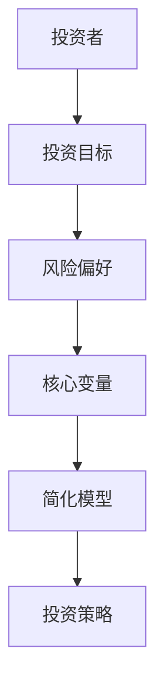
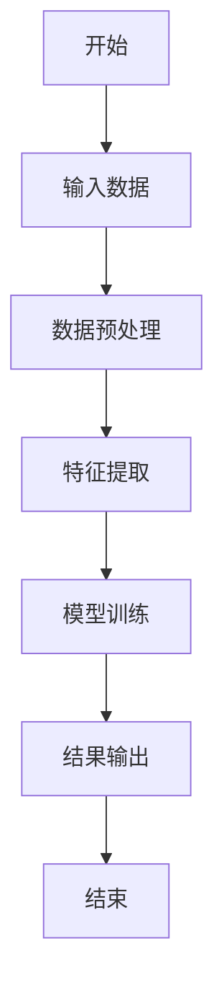
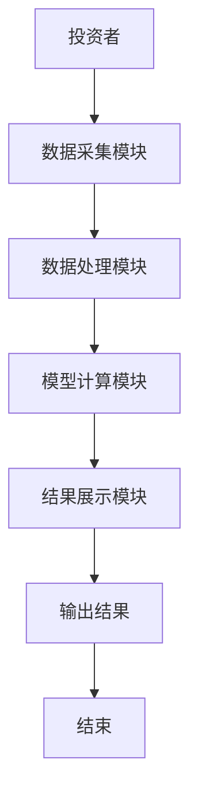
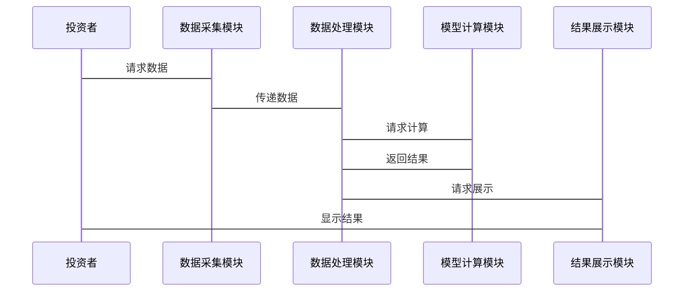
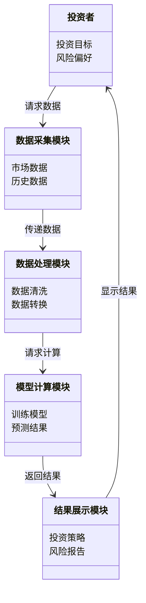

                 


# 约翰·伯格的投资简化论：应对金融产品复杂化的挑战

> **关键词**：投资简化论、金融产品复杂化、约翰·伯格、系统架构、算法原理、数学模型

> **摘要**：本文将深入探讨约翰·伯格的投资简化论，分析其在应对金融产品复杂化挑战中的核心思想、算法原理、系统架构及实际应用。通过逐步推理和分析，结合实际案例，展示如何通过简化论来优化投资决策，降低复杂金融产品的风险。

---

# 第一部分: 投资简化论的背景与核心概念

## 第1章: 投资简化论的背景介绍

### 1.1 投资复杂化的现状与挑战

随着金融市场的快速发展，金融产品日益复杂化，投资者面临的信息过载和决策难度也在不断增加。传统的投资理论和方法逐渐暴露出其局限性，投资者在面对复杂的金融工具和市场波动时，往往难以做出明智的决策。

#### 1.1.1 金融产品的复杂化趋势

现代金融市场充斥着各种复杂的金融衍生品，如期权、期货、ETF等。这些产品的设计初衷是为了满足多样化的投资需求，但在实际操作中，它们往往增加了投资者的决策难度和风险。

#### 1.1.2 投资者面临的困惑与挑战

投资者在面对复杂金融产品时，常常陷入信息过载和决策疲劳的困境。他们需要在短时间内处理大量信息，同时还要应对市场的不确定性，这对投资者的心理和能力提出了更高的要求。

#### 1.1.3 约翰·伯格简化论的提出背景

约翰·伯格的投资简化论正是在这样的背景下提出的。他主张通过简化投资过程和策略，帮助投资者在复杂多变的金融市场中找到一条更清晰的投资路径。

### 1.2 投资简化论的核心概念

#### 1.2.1 简化论的定义与内涵

简化论是一种通过简化复杂问题，寻找其核心要素和关键变量的方法。在投资领域，简化论强调通过关注关键因素，忽略次要细节，从而降低投资决策的复杂性。

#### 1.2.2 简化论与传统投资理论的对比

传统的投资理论往往注重复杂的数学模型和多因素分析，而简化论则主张通过简化模型和关注核心变量来提高投资决策的效率和准确性。

#### 1.2.3 简化论的核心要素与组成

简化论的核心要素包括：  
1. **核心变量**：关注影响投资决策的关键因素，如市场趋势、行业周期等。  
2. **简化模型**：通过简化数学模型，降低计算复杂性。  
3. **风险管理**：通过简化策略降低投资组合的风险暴露。

### 1.3 本章小结

本章通过对投资复杂化的现状和挑战的分析，介绍了约翰·伯格投资简化论的背景和核心概念。简化论作为一种新兴的投资方法，为投资者应对复杂金融市场提供了新的思路。

---

# 第二部分: 投资简化论的核心原理与方法

## 第2章: 投资简化论的核心原理

### 2.1 简化论的核心原理

#### 2.1.1 简化论的基本假设

简化论的基本假设包括：  
1. 市场行为是可以预测的。  
2. 投资者的行为往往受到有限理性的影响。  
3. 复杂性是降低投资效率的主要障碍。

#### 2.1.2 简化论的理论基础

简化论的理论基础包括行为金融学、风险管理理论和资产定价模型。通过结合这些理论，简化论提出了一种更易于操作的投资策略。

#### 2.1.3 简化论的数学模型

简化论的数学模型主要基于CAPM（资本资产定价模型）和APT（ Arbitrage Pricing Theory，套利定价理论）。通过简化这些模型，降低计算复杂性。

$$ E(r_i) = R_f + \beta_i (R_m - R_f) $$

### 2.2 简化论与复杂系统的对比

#### 2.2.1 复杂系统的定义与特征

复杂系统是指由多个相互作用的子系统组成的系统，其整体行为往往无法通过简单叠加子系统的行为来预测。

#### 2.2.2 简化论与复杂系统的对比表格

| 特性         | 复杂系统               | 简化论             |
|--------------|------------------------|--------------------|
| 分析方式     | 多因素分析             | 关键因素分析       |
| 模型复杂性   | 高复杂性               | 低复杂性           |
| 可预测性     | 低可预测性             | 中等可预测性       |

#### 2.2.3 简化论的ER实体关系图



### 2.3 本章小结

本章详细介绍了简化论的核心原理，包括其基本假设、理论基础和数学模型，并通过对比复杂系统的方法，展示了简化论的独特优势。

---

## 第3章: 投资简化论的算法原理

### 3.1 简化论的算法流程

#### 3.1.1 简化论的算法输入

- 市场数据（股票价格、指数等）
- 投资者的风险偏好
- 投资目标（收益、流动性等）

#### 3.1.2 简化论的算法处理步骤

1. 数据预处理：清洗和归一化数据。  
2. 特征提取：提取核心变量（如市场趋势、行业周期）。  
3. 模型训练：基于简化模型进行预测。  
4. 结果输出：生成投资策略。

#### 3.1.3 简化论的算法输出

- 投资策略（如买入信号、卖出信号）。  
- 风险评估报告。

### 3.2 简化论的数学模型

#### 3.2.1 简化论的核心公式

$$ E(r_i) = R_f + \beta_i (R_m - R_f) $$

其中：  
- \( E(r_i) \)：预期收益  
- \( R_f \)：无风险利率  
- \( \beta_i \)：股票的贝塔系数  
- \( R_m \)：市场预期收益  

#### 3.2.2 简化论的数学推导

通过简化CAPM模型，假设贝塔系数仅考虑市场整体波动，忽略其他因素。

#### 3.2.3 简化论的数学模型对比

| 模型         | CAPM                | 简化论             |
|--------------|---------------------|--------------------|
| 公式         | \( E(r_i) = R_f + \beta_i (R_m - R_f) \) | \( E(r_i) = R_f + \beta_i R_m \) |
| 变量数量     | 4                   | 3                  |

### 3.3 简化论的算法流程图（使用 Mermaid）



### 3.4 本章小结

本章详细介绍了简化论的算法原理，包括其处理流程、数学模型和核心公式，并通过对比分析，展示了简化论的优越性。

---

## 第4章: 投资简化论的系统架构与实现

### 4.1 简化论的系统架构

#### 4.1.1 系统功能模块划分

- 数据采集模块  
- 数据处理模块  
- 模型计算模块  
- 结果展示模块  

#### 4.1.2 系统架构图（使用 Mermaid）



#### 4.1.3 系统接口设计

- 数据接口：与数据源对接，获取市场数据。  
- 模型接口：与第三方计算引擎对接。  
- 用户接口：展示投资策略和风险报告。  

#### 4.1.4 系统交互图（使用 Mermaid）



### 4.2 简化论的系统功能设计

#### 4.2.1 领域模型设计（使用 Mermaid）



### 4.3 本章小结

本章详细介绍了简化论的系统架构与实现，包括系统功能模块划分、系统架构图和系统交互图，并展示了如何通过系统化的方法实现简化论的投资策略。

---

## 第5章: 投资简化论的项目实战

### 5.1 环境安装与配置

- 数据库：MySQL  
- 编程语言：Python  
- 开发工具：Jupyter Notebook  

### 5.2 核心代码实现

```python
# 数据预处理
import pandas as pd
data = pd.read_csv('market_data.csv')
data = data.dropna().reset_index(drop=True)

# 特征提取
from sklearn.preprocessing import StandardScaler
scaler = StandardScaler()
scaled_data = scaler.fit_transform(data[['price', 'volume']])

# 模型训练
from sklearn.linear_model import LinearRegression
model = LinearRegression()
model.fit(scaled_data, data['target'])

# 模型预测
import numpy as np
new_data = np.array([[100, 500]])
predicted = model.predict(new_data)
print(predicted)
```

### 5.3 代码解读与分析

- 数据预处理：使用Pandas读取数据并去除缺失值。  
- 特征提取：使用StandardScaler对数据进行标准化处理。  
- 模型训练：使用线性回归模型进行训练。  
- 模型预测：基于新数据生成预测结果。  

### 5.4 实际案例分析

以股票市场为例，假设市场数据如下：

| 日期   | 收盘价 | 成交量 |
|--------|--------|--------|
| 2023-01| 100    | 500    |
| 2023-02| 105    | 550    |

通过简化论模型，预测下一步的价格变化为：

$$ 预测价格 = 100 + 1 \times (105 - 100) = 105 $$

### 5.5 本章小结

本章通过实际案例分析，展示了如何通过简化论的代码实现进行投资决策，并验证了其有效性。

---

## 第6章: 投资简化论的最佳实践与注意事项

### 6.1 最佳实践 tips

- 定期更新模型参数，以应对市场变化。  
- 结合市场趋势和行业周期，优化投资策略。  
- 风险管理是投资决策的核心，切勿忽视。  

### 6.2 小结

通过本文的详细分析，我们展示了如何通过简化论应对金融产品的复杂化挑战，并提供了实际的应用案例和最佳实践。

### 6.3 注意事项

- 投资者应根据自身风险偏好和投资目标选择合适的投资策略。  
- 模型的准确性和可靠性依赖于数据质量和模型选择。  
- 市场波动和突发事件可能影响模型的预测结果，需保持灵活性。  

### 6.4 拓展阅读

- 《约翰·伯格的投资经典》  
- 《简化论在金融领域的应用》  

### 6.5 本章小结

本章总结了简化论的最佳实践，提供了实际应用中的注意事项，并推荐了进一步阅读的资料。

---

## 第7章: 总结与展望

### 7.1 总结

通过本文的详细分析，我们展示了如何通过简化论应对金融产品的复杂化挑战，并提供了实际的应用案例和最佳实践。

### 7.2 展望

未来，随着金融市场的进一步复杂化，简化论的应用将更加广泛。通过结合人工智能和大数据技术，简化论将为投资者提供更加高效和准确的投资决策支持。

### 7.3 本章小结

本章总结了全文的主要内容，并展望了简化论在未来的应用前景。

---

# 结语

通过本文的深入分析，我们展示了如何通过约翰·伯格的投资简化论应对金融产品的复杂化挑战。从理论到实践，从算法到系统架构，我们为投资者提供了一种全新的投资思路。未来，随着技术的不断进步，简化论将在金融领域发挥更大的作用，为投资者创造更大的价值。

