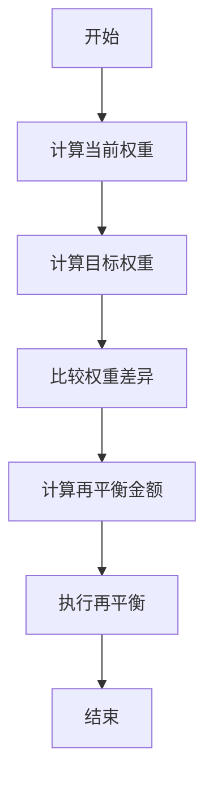
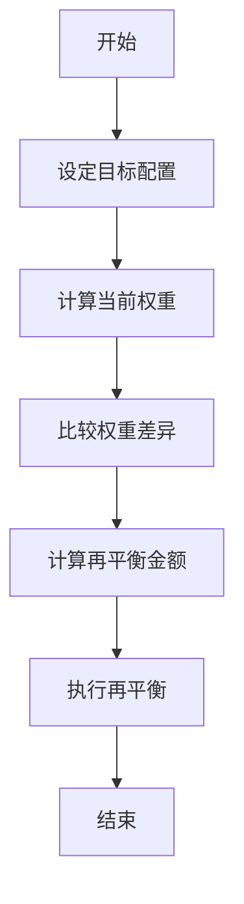
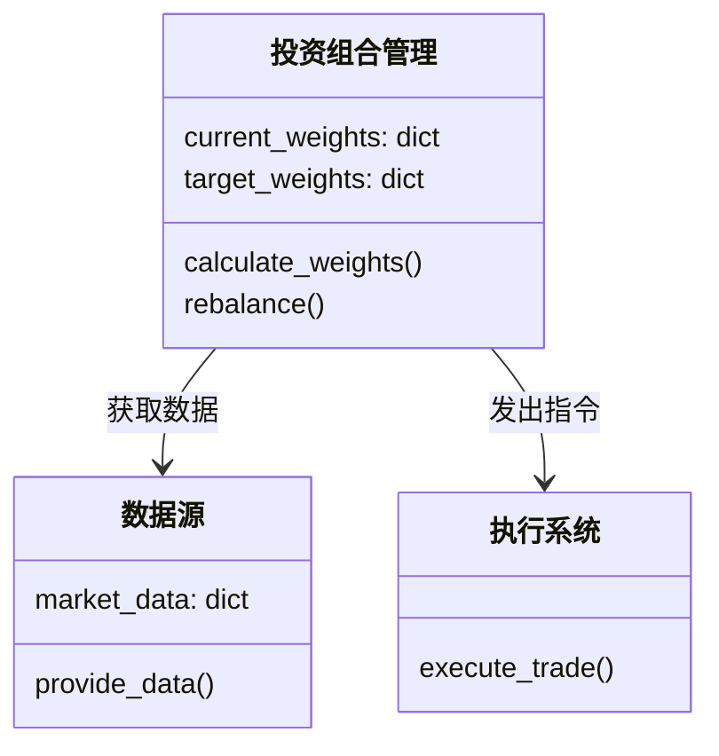

                 


# 约翰·伯格的投资组合再平衡策略

## 第1章: 投资组合再平衡的基本概念

### 1.1 投资组合再平衡的定义与重要性

#### 1.1.1 定义
投资组合再平衡是指定期调整投资组合的构成，以维持预期的风险和收益水平。这通常涉及买卖资产，以确保投资组合与既定目标相符。

#### 1.1.2 重要性
再平衡有助于管理风险，防止某类资产在组合中占比过大，从而降低整体风险。此外，再平衡还能捕捉市场变化带来的机会，优化收益。

### 1.2 再平衡的类型

#### 1.2.1 定期再平衡
按固定时间间隔（如季度或半年）进行调整，确保组合保持目标配置。

#### 1.2.2 事件驱动再平衡
根据特定事件（如市场崩盘或重大投资机会）触发调整。

#### 1.2.3 指数跟踪再平衡
根据指数成分变化进行调整，以跟踪指数表现。

### 1.3 约翰·伯格的投资策略概述

#### 1.3.1 背景介绍
约翰·伯格是指数基金的先驱，强调长期投资和成本控制。

#### 1.3.2 投资哲学
伯格主张分散投资，长期持有，相信市场有效，较少干预。

#### 1.3.3 再平衡策略
伯格的策略以被动投资为主，通过定期再平衡保持组合与指数一致。

### 1.4 小结
本章介绍了再平衡的基本概念和类型，重点分析了伯格的策略，为后续章节奠定基础。

## 第2章: 投资组合优化的数学模型

### 2.1 基本原理

#### 2.1.1 优化目标
最大化收益，最小化风险。

#### 2.1.2 约束条件
资产配置比例、投资限制等。

### 2.2 伯格策略的数学模型

#### 2.2.1 权重计算
$$ w_i = \frac{m_i}{\sum m_i} $$
其中，\( w_i \) 是资产i的权重，\( m_i \) 是资产i的价值。

#### 2.2.2 再平衡计算
比较当前权重与目标权重，计算调整金额。

### 2.3 算法流程

1. 计算当前权重。
2. 确定目标权重。
3. 比较差异，计算调整金额。
4. 执行交易。
5. 记录结果。

#### mermaid流程图


## 第3章: 约翰·伯格再平衡策略的实现

### 3.1 策略核心

#### 3.1.1 等权重再平衡
定期调整，使各资产权重相等。

#### 3.1.2 时间驱动
按固定时间进行调整。

#### 3.1.3 风险调整
根据市场变化调整风险敞口。

### 3.2 实现步骤

1. 设定目标配置。
2. 计算当前权重。
3. 比较差异，计算调整金额。
4. 执行交易。

#### mermaid流程图


### 3.3 系统分析与架构

#### 3.3.1 领域模型


#### 3.3.2 架构设计


### 3.4 项目实战

#### 3.4.1 环境安装
安装Python、Pandas等工具。

#### 3.4.2 核心代码
```python
def calculate_weights(portfolio):
    total = sum(portfolio.values())
    return {asset: weight/total for asset, weight in portfolio.items()}

def rebalance(current, target):
    differences = {asset: target[asset] - current[asset] for asset in target}
    return differences
```

#### 3.4.3 案例分析
分析一个投资组合，展示再平衡的过程和结果。

### 3.5 小结
本章详细讲解了伯格策略的实现，从理论到代码，为实际应用提供了指导。

---

通过以上结构，文章将全面而深入地探讨约翰·伯格的投资组合再平衡策略，从理论到实践，为读者提供有价值的见解和指导。

