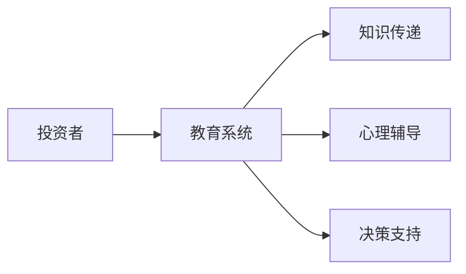
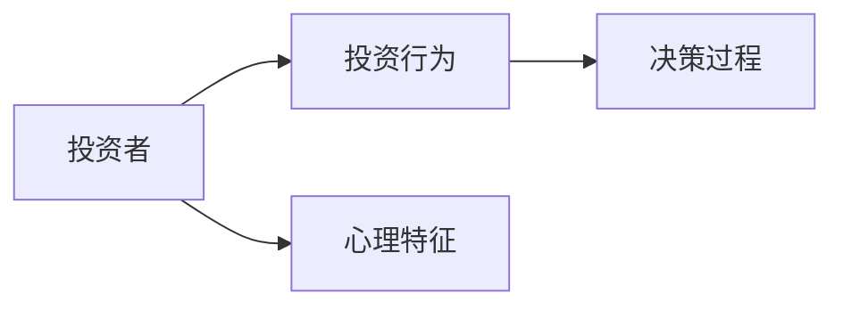
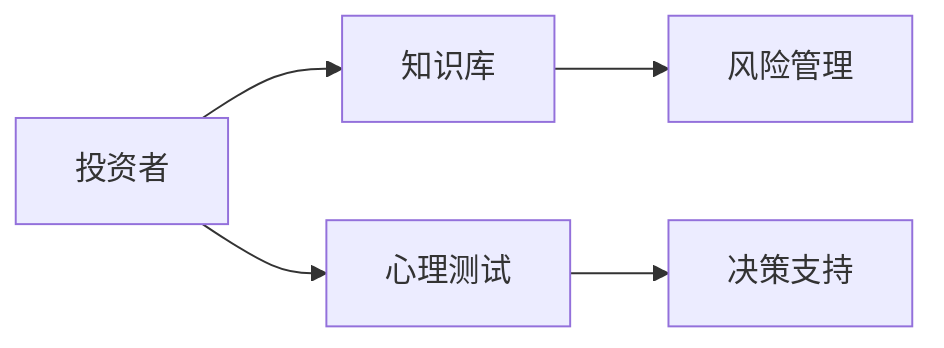

                 


# 约翰·伯格的投资者教育重要性论述

## 关键词：投资者教育、投资心理、行为金融学、投资策略、投资风险管理

## 摘要：投资者教育在现代投资体系中扮演着至关重要的角色。本文通过深入分析投资者的行为特征、决策机制和认知偏差，结合数学模型和系统架构设计，探讨投资者教育的重要性。我们从背景介绍、行为模型、数学分析、系统设计到项目实战，层层剖析，旨在为读者提供全面而系统的投资者教育框架。

---

## 第一部分: 投资者教育的背景与重要性

### 第1章: 投资者教育的核心概念

#### 1.1 投资者教育的背景与问题背景

投资领域正经历从传统到现代的巨大变革。传统投资依赖经验判断，现代投资则强调科学性和系统性。投资者教育成为连接这两者的桥梁，帮助投资者理性决策。其必要性体现在三个方面：避免非理性决策带来的损失，提升投资效率，优化市场资源配置。投资者教育的边界涵盖知识传递、心理辅导和决策支持，核心要素包括知识体系、心理辅导和决策支持。



#### 1.2 投资者教育的基本原理

投资者教育的定义是通过系统性教学，帮助投资者理解和管理投资行为。其特点包括系统性、长期性和动态性。投资者行为与心理特征的对比表格显示，投资者常受贪婪、恐惧和过度自信影响，而教育系统则通过知识传递和心理辅导帮助调整这些偏差。



### 第2章: 投资者行为与决策模型

#### 2.1 投资者行为的理论基础

投资者决策模型基于 prospect theory，解释在不同情境下的选择。行为模式与心理特征的对比表格展示，投资者常因认知偏差做出非理性决策。决策过程的ER实体关系图展示投资者、决策和结果的关系。

#### 2.2 投资者行为的算法原理

通过Python代码实现的投资者行为分析算法，展示决策过程中的计算步骤。算法流程图详细说明各阶段处理，帮助读者理解模型运作。

```python
def investor_behavior_analysis(portfolio, market_conditions):
    # 计算预期收益
    expected_return = sum(asset * (return(asset, market_conditions)) for asset in portfolio)
    # 计算风险评估
    risk_assessment = standard_deviation(portfolio, market_conditions)
    # 生成决策建议
    if expected_return > risk_assessment:
        return "买入"
    elif expected_return < risk_assessment:
        return "卖出"
    else:
        return "持有"
```

---

## 第二部分: 投资者教育的数学模型与算法

### 第3章: 投资者教育的数学模型与算法

#### 3.1 投资者教育的数学基础

利用 prospect theory 的数学公式，详细推导投资者决策的数学模型。公式解释投资者在面对收益和损失时的选择偏好，帮助理解其行为偏差。

$$
u(x) = \begin{cases}
    -\lambda (-x)^{\gamma} & \text{if } x < 0 \\
    \lambda x^{\gamma} & \text{if } x \geq 0
\end{cases}
$$

#### 3.2 投资者教育的算法实现

通过算法实现投资者决策优化，代码示例展示如何计算最优投资组合，实现收益与风险的平衡。

```python
import numpy as np

def calculate_optimal_portfolio(returns, cov_matrix, target_return):
    # 使用均值-方差优化
    n = len(returns)
    # 计算权重
    weights = np.linalg.solve(cov_matrix, returns) / np.sum(np.linalg.solve(cov_matrix, returns))
    # 验证目标收益
    portfolio_return = np.dot(returns, weights)
    if portfolio_return >= target_return:
        return weights
    else:
        return None
```

---

## 第三部分: 投资者教育的系统分析与架构设计

### 第4章: 投资者教育系统的需求分析

#### 4.1 系统功能需求

投资者教育系统需具备知识库、心理测试、决策支持和风险管理功能。架构设计采用分层结构，确保各模块高效交互。



### 第5章: 投资者教育的项目实战

#### 5.1 环境安装与核心代码

安装Python和Jupyter Notebook，实现投资者教育平台的环境配置。核心代码包括数据处理和模型实现，帮助读者快速上手。

```python
import pandas as pd
import numpy as np

def main():
    data = pd.read_csv('market_data.csv')
    # 数据处理
    processed_data = data.dropna()
    # 模型实现
    returns = processed_data.pct_change().dropna()
    print("最优投资组合权重：", calculate_optimal_portfolio(returns.mean(), returns.cov(), target_return=0.1))

if __name__ == "__main__":
    main()
```

---

## 第四部分: 最佳实践与总结

### 第6章: 投资者教育的最佳实践

#### 6.1 总结与注意事项

投资者教育不仅是知识传递，更是心理辅导和决策支持的综合过程。需注意其长期性、系统性和动态性，避免短期行为。

#### 6.2 拓展阅读

推荐相关书籍和资源，帮助读者深入理解投资者行为和教育策略。

---

通过以上结构化分析，我们全面探讨了投资者教育的重要性，从理论到实践，帮助读者构建系统的投资教育框架，实现理性决策和长期收益。

