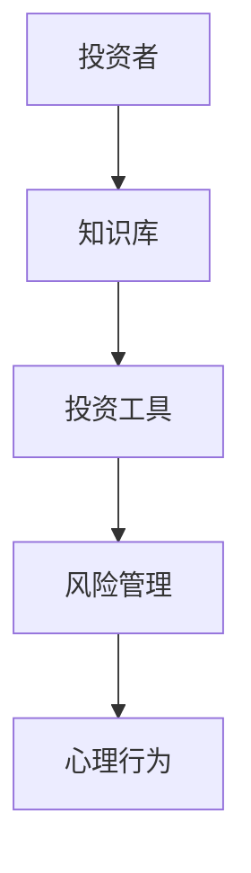
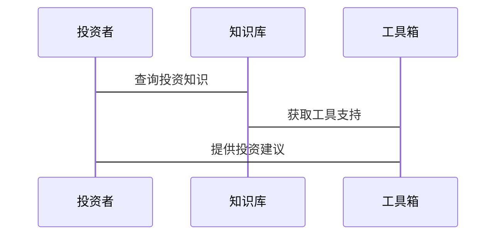

                 


# 约翰·伯格的投资者教育：普及金融知识的重要性

## 关键词：投资者教育、约翰·伯格、金融知识、投资策略、风险管理、指数投资、心理行为

## 摘要：本文通过分析约翰·伯格的投资者教育理念，强调普及金融知识的重要性。文章从金融市场的基本概念入手，深入探讨伯格的投资理念，结合投资策略与风险管理，分析投资者心理与行为，提供实际操作指南，并通过案例分析进一步阐述。文章旨在帮助读者掌握核心金融知识，提升投资能力，避免常见误区，实现长期稳健投资。

---

## 第一部分：投资者教育的背景与重要性

### 第1章：金融市场概述

#### 1.1 金融市场的基本概念

##### 1.1.1 金融市场的定义与组成

- **金融市场**是资金流动的场所，由投资者、发行人和中介机构构成。
- **主要功能**包括资金筹集、价格发现和风险管理。
- **参与者**包括个人投资者、机构投资者、上市公司、银行和证券公司。

##### 1.1.2 金融市场的类型

- **股票市场**：交易公司股份，代表所有权。
- **债券市场**：交易债务工具，代表债权。
- **基金市场**：集合投资工具，分散风险。

##### 1.1.3 投资者的分类

- **个人投资者**：小额投资，风险承受能力较低。
- **机构投资者**：如基金、保险公司，资金规模大，专业性强。

#### 1.2 投资的基本原理

##### 1.2.1 投资的目标与风险

- **目标**：资本增值、收入获取、本金保值。
- **风险**：本金损失、流动性风险、市场波动。

##### 1.2.2 投资的基本原则

- **分散投资**：降低风险，避免过度依赖单一资产。
- **长期持有**：通过复利效应实现财富增长。
- **费用控制**：低费用投资工具更优。

---

### 第2章：约翰·伯格的投资理念

#### 2.1 约翰·伯格的生平与贡献

- **背景**：伯格于1934年出生，是指数投资的倡导者。
- **贡献**：创立先锋集团，推广低成本指数基金。
- **哲学**：强调长期投资，避免频繁交易。

#### 2.2 伯格的指数投资策略

- **指数基金**：跟踪市场指数，如标普500。
- **优势**：分散风险，费用低，长期收益稳定。
- **劣势**：不适应短期波动，需长期持有。

---

### 第3章：投资者教育的核心内容

#### 3.1 金融知识的普及

- **基础概念**：资产类别、市场结构、投资工具。
- **投资工具**：股票、债券、基金、ETF。
- **市场机制**：价格形成、供求关系、信息影响。

#### 3.2 投资者心理与行为

- **心理偏差**：过度自信、从众心理、损失厌恶。
- **行为影响**：情绪化决策、追涨杀跌、频繁交易。

---

### 第4章：投资策略与风险管理

#### 4.1 资产配置的重要性

- **定义**：将资金分配到不同资产类别，优化风险收益。
- **类型**：股债平衡、激进型、保守型。
- **制定策略**：考虑风险承受、投资期限、目标收益。

#### 4.2 风险管理的策略

- **风险评估**：分析市场、行业、公司风险。
- **风险控制**：设定止损点，分散投资，定期 rebalancing。

---

### 第5章：投资者心理与行为

#### 5.1 心理偏差分析

- **过度自信**：认为自己能预测市场，导致错误决策。
- **从众心理**：跟随大众，忽视独立思考。
- **损失厌恶**：避免损失，导致保守投资。

#### 5.2 理性与非理性决策

- **理性决策**：基于数据和逻辑，长期视角。
- **非理性决策**：受情绪影响，短期行为。

#### 5.3 克服心理障碍

- **自我认知**：了解自身优缺点，避免过度自信。
- **纪律性**：坚持投资计划，避免冲动交易。

---

### 第6章：实际操作指南

#### 6.1 如何选择基金

- **业绩表现**：关注长期而非短期。
- **费用结构**：选择低费用的指数基金。
- **风险管理**：分散投资，避免集中风险。

#### 6.2 投资组合管理

- **定期审查**：评估表现，调整配置。
- **再平衡**：根据市场变化，调整资产比例。
- **税务规划**：利用税收优惠，降低负担。

---

### 第7章：案例分析

#### 7.1 约翰·伯格的经典案例

- **指数基金的表现**：长期优于主动管理基金。
- **投资者教育的成果**：提升投资素养，减少错误决策。

---

## 第二部分：金融知识的系统化学习

### 第8章：系统分析与架构设计方案

#### 8.1 问题场景介绍

- **问题背景**：投资者知识不足，导致决策失误。
- **目标**：构建系统化的学习框架。

#### 8.2 系统功能设计

- **领域模型**：投资者-知识-行为的交互关系。
- **系统架构**：模块化设计，包括知识库、工具箱、心理指导。

#### 8.3 系统架构图



#### 8.4 系统接口设计

- **输入**：投资者需求、市场数据。
- **输出**：个性化建议、风险评估。

#### 8.5 系统交互图



---

### 第9章：项目实战

#### 9.1 环境安装

- **工具**：Excel、投资软件（如Morningstar）。
- **数据源**：Yahoo Finance、美联储数据。

#### 9.2 核心实现

- **资产配置模块**：根据风险偏好分配资产。
- **风险管理模块**：设定止损，定期 rebalancing。

#### 9.3 代码实现

```python
def calculate_risk_return(portfolio):
    # 计算投资组合的风险和回报
    return (return, risk)
```

---

### 第10章：最佳实践与小结

#### 10.1 小结

- **核心内容**：金融知识的重要性，伯格的投资理念，风险管理与心理行为。
- **关键点**：长期投资，分散风险，避免情绪化决策。

#### 10.2 注意事项

- **持续学习**：市场变化，需不断更新知识。
- **纪律性**：坚持投资计划，避免短期波动影响决策。

#### 10.3 拓展阅读

- **书籍推荐**：《投资常识》、《证券分析》。
- **网站推荐**：Morningstar、Fidelity。

---

通过系统化的投资者教育，普及金融知识，帮助投资者做出明智决策，实现长期稳健投资。

