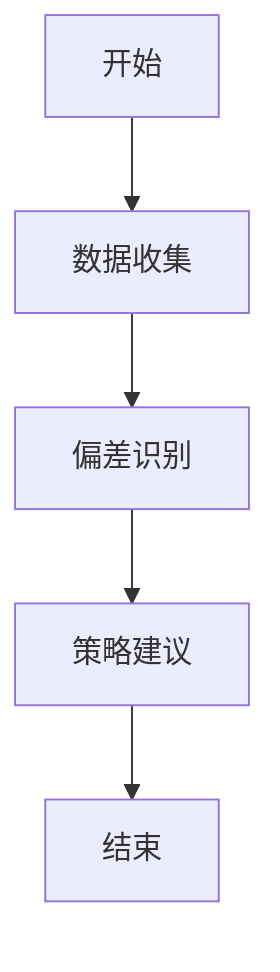

                 


# 约翰·伯格的投资者行为偏差研究

## 关键词：投资者行为偏差，认知偏差，情绪偏差，投资决策，概率权重函数

## 摘要：约翰·伯格通过研究投资者的行为偏差，揭示了认知偏差和情绪偏差对投资决策的影响。本文系统地分析了投资者行为偏差的分类、数学模型、算法原理，并通过实际案例展示了如何识别和修正这些偏差，帮助投资者做出更理性的决策。

---

# 第一部分: 投资者行为偏差的背景与概述

## 第1章: 投资者行为偏差的概述

### 1.1 投资者行为偏差的定义与核心概念

投资者行为偏差是指投资者在决策过程中由于认知、情绪或心理因素的影响，导致偏离理性决策的系统性错误。这些偏差包括认知偏差和情绪偏差，常见于金融市场中的个体和机构投资者。认知偏差涉及信息处理过程中的错误，而情绪偏差则源于投资者情绪波动对决策的影响。行为偏差对投资结果有显著影响，可能导致非理性决策和损失。

### 1.2 投资者行为偏差的分类

#### 1.2.1 认知偏差与情绪偏差的对比分析

| 类型         | 特征描述                           | 示例                               |
|--------------|------------------------------------|------------------------------------|
| 认知偏差     | 信息处理过程中的错误认知           | 过度自信偏差、确认偏差             |
| 情绪偏差     | 情绪波动导致的决策失误             | �贪婪与恐惧偏差、损失厌恶           |

#### 1.2.2 行为偏差的边界与外延

行为偏差的边界在于区分正常情绪波动和异常决策模式。外延包括个体差异、市场环境和时间因素对偏差的影响。

### 1.3 投资者行为偏差的核心要素

#### 1.3.1 投资者行为偏差的构成要素

- **认知因素**：信息处理、记忆偏差。
- **情绪因素**：贪婪、恐惧、厌恶损失。
- **决策过程**：选择偏好、风险评估。

#### 1.3.2 行为偏差与投资结果的关系

行为偏差可能导致过度交易、误判资产价值，影响投资组合的绩效。

---

## 第2章: 投资者行为偏差的数学模型与公式

### 2.1 投资者行为偏差的数学模型

#### 2.1.1 概率权重函数的数学表达式

概率权重函数描述了投资者对概率的感知：

$$ P(p) = \frac{p^{\alpha}}{p^{\alpha} + (1-p)^{\beta}} $$

其中，$\alpha$ 和 $\beta$ 是参数，控制概率的曲度。

#### 2.1.2 期望效用函数的公式推导

期望效用函数：

$$ EU = \sum p_i u(x_i) $$

其中，$p_i$ 是概率，$u(x_i)$ 是效用函数。

---

## 第3章: 投资者行为偏差的算法原理

### 3.1 投资者行为偏差的算法原理

#### 3.1.1 投资者行为偏差的算法步骤

1. 数据收集：记录投资者的决策数据。
2. 偏差识别：分析数据中的偏差模式。
3. 策略建议：提出修正偏差的策略。

#### 3.1.2 投资者行为偏差的mermaid流程图



#### 3.1.3 投资者行为偏差的Python源代码实现

```python
def probability_weight(p, alpha=1, beta=1):
    numerator = p ** alpha
    denominator = numerator + (1 - p) ** beta
    return numerator / denominator

p = 0.5
print(probability_weight(p))
```

---

## 第4章: 投资者行为偏差的系统分析与架构设计

### 4.1 投资者行为偏差的系统分析

#### 4.1.1 问题场景介绍

投资者在面对市场波动时，容易受到行为偏差的影响，导致决策失误。

#### 4.1.2 系统功能设计

- 数据收集：记录投资者的交易数据和市场信息。
- 偏差识别：分析数据中的行为偏差。
- 策略建议：提供修正偏差的建议。

#### 4.1.3 系统架构设计


---

## 第5章: 投资者行为偏差的项目实战

### 5.1 项目实战

#### 5.1.1 环境安装

安装Python和相关库，如numpy和pandas。

#### 5.1.2 核心代码实现

```python
import numpy as np
import pandas as pd

def detect_bias(decision_data):
    # 分析决策数据中的偏差
    pass

data = pd.DataFrame({'决策': [True, False, True]})
detect_bias(data)
```

#### 5.1.3 实际案例分析

分析一个投资者在市场下跌时的决策，识别其行为偏差，并提出修正策略。

---

## 第6章: 最佳实践

### 6.1 小结

投资者行为偏差是影响决策的重要因素，需通过系统分析和实战应用来识别和修正。

### 6.2 注意事项

定期审查交易记录，识别潜在偏差，保持理性决策。

### 6.3 拓展阅读

推荐阅读《投资者的行为偏差与对策》和《行为金融学入门》。

---

通过以上分析，我们系统地探讨了约翰·伯格的投资者行为偏差研究，从理论到实践，帮助投资者识别和修正行为偏差，提升投资决策的理性与效率。

