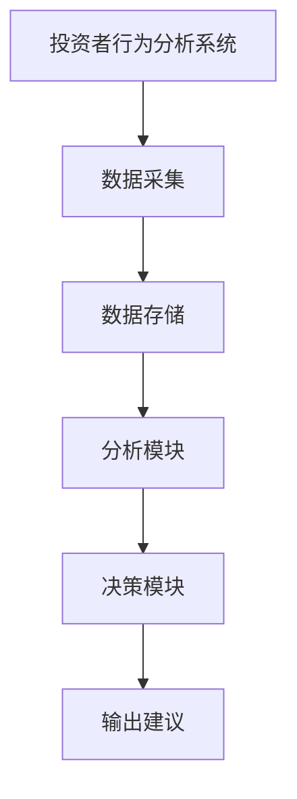
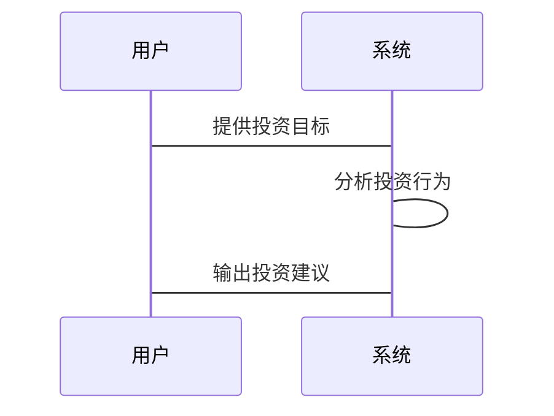

                 


# 约翰·伯格的投资者行为分析

## 关键词：
- 约翰·伯格
- 投资者行为分析
- 价值投资
- 长期投资
- 投资策略
- 投资哲学
- 风险控制

## 摘要：
本文深入分析了约翰·伯格的投资理念和行为模式，探讨了其在价值投资、长期投资以及风险管理方面的独特见解。通过行为金融学的视角，结合数学模型和系统设计，帮助读者理解如何将伯格的理念应用于实际投资中，提升投资决策的科学性和有效性。

---

# 约翰·伯格的投资者行为分析

## 第1章 约翰·伯格的投资理念概述

### 1.1 约翰·伯格的生平与投资哲学

#### 1.1.1 伯格的早年经历与职业生涯
约翰·伯格（John Bogle）是美国著名投资家，指数基金之父，共同基金行业的革新者。出生于1934年，伯格的职业生涯始于1951年，他在宾夕法尼亚大学获得学士学位后，进入华安银行信托部工作。1965年，他创立了华安共同基金公司（Vanguard Group），这是第一家以指数基金为基础的共同基金公司。伯格的早年经历使他深刻理解了投资的本质，并形成了独特的投资哲学。

#### 1.1.2 伯格的投资哲学核心观点
伯格的投资哲学以价值投资为核心，强调长期投资和分散投资。他认为市场是不可预测的，投资者应避免频繁交易和追求短期收益。伯格的哲学可以总结为以下几点：
1. **价值投资**：寻找被市场低估的资产，长期持有。
2. **长期投资**：通过长期持有优质资产，获得稳定的复利收益。
3. **分散投资**：通过分散投资降低风险，避免过度集中。

#### 1.1.3 伯格对投资行业的贡献
伯格的贡献主要体现在以下几个方面：
- **指数基金的推广**：他创立了华安基金，推动了指数基金的发展，使普通投资者也能以低成本获得市场平均收益。
- **费用透明化**：伯格主张降低管理费用，使投资者能够获得更高的净收益。
- **投资教育**：他撰写了许多书籍和文章，教育投资者理性投资，避免短期波动的干扰。

### 1.2 价值投资的定义与特点

#### 1.2.1 价值投资的基本概念
价值投资是一种投资策略，强调以低于内在价值的价格购买资产。伯格认为，市场波动性和投资者情绪常常导致资产价格偏离其真实价值，这为长期投资者提供了机会。

#### 1.2.2 价值投资与成长投资的区别
- **价值投资**：关注低估值资产，强调安全边际。
- **成长投资**：关注高增长潜力的资产，愿意为未来增长支付溢价。

#### 1.2.3 价值投资的核心要素
1. **安全边际**：购买价格低于内在价值。
2. **长期视角**：耐心持有，等待价值回归。
3. **分散投资**：降低特定资产的风险。

### 1.3 长期投资的意义与优势

#### 1.3.1 长期投资的定义与特点
长期投资是指投资者持有资产超过一年，利用复利效应实现财富增长。其特点是：
- 避免短期波动的干扰。
- 利用市场复利效应，实现财富稳步增长。

#### 1.3.2 长期投资的优势
1. **复利效应**：长期持有能够最大化复利收益。
2. **降低交易成本**：频繁交易增加佣金和税费支出。
3. **减少情绪干扰**：长期视角有助于克服市场恐慌和贪婪。

#### 1.3.3 长期投资与短期投资的对比
| 对比维度 | 长期投资 | 短期投资 |
|----------|----------|----------|
| 风险     | 较低     | 较高     |
| 收益     | 稳定     | 波动性大 |
| 成本     | 较低     | 较高     |
| 情绪干扰 | 较小     | 较大     |

---

## 第2章 投资者行为分析的核心概念

### 2.1 投资者行为分析的背景介绍

#### 2.1.1 行为金融学的定义
行为金融学是研究投资者心理和行为对市场影响的学科，强调认知偏差和情绪在投资决策中的作用。

#### 2.1.2 投资者行为分析的必要性
- 帮助投资者识别和克服认知偏差。
- 提供科学的投资决策框架。

#### 2.1.3 投资者行为分析的边界与外延
- 研究范围：个体投资者行为、群体行为对市场的整体影响。
- 外延：涉及心理学、经济学、社会学等多个领域。

### 2.2 投资者行为分析的核心要素

#### 2.2.1 投资者的认知过程
- 信息处理：投资者如何处理信息，形成决策。
- 认知偏差：常见的偏差包括确认偏差、损失厌恶等。

#### 2.2.2 投资者的情感因素
- 情绪波动：贪婪和恐惧如何影响决策。
- 信任与风险偏好：投资者对风险的态度。

#### 2.2.3 投资者决策的外部环境
- 市场环境：市场波动、经济周期。
- 社会环境：媒体影响、羊群效应。

---

## 第3章 投资者行为分析的理论基础

### 3.1 行为金融学的基本原理

#### 3.1.1 行为金融学的核心理论
- ** prospect theory**：Kahneman和Tversky提出，解释投资者如何评估风险和收益。
- ** Framing effect**：框架效应影响决策。

#### 3.1.2 行为金融学与传统金融学的区别
| 维度       | 行为金融学                     | 传统金融学                   |
|------------|-------------------------------|------------------------------|
| 基础假设   | 有限理性，情绪影响             | 完全理性，无情绪影响           |
| 研究重点   | 投资者心理和行为               | 资产定价模型                   |
| 应用场景   | 实际市场中的投资者行为分析     | 理论模型指导市场定价           |

### 3.2 投资者行为分析的核心要素

#### 3.2.1 认知偏差对投资决策的影响
- 确认偏差：只关注支持自己观点的信息。
- 过度自信：高估自己的判断能力。

#### 3.2.2 情绪波动对投资行为的影响
- 贪婪与恐惧：导致市场泡沫和崩盘。
- 投资者情绪指数：如NACSI指数，反映市场情绪。

---

## 第4章 投资者行为分析的算法与数学模型

### 4.1 投资者行为分析的数学模型

#### 4.1.1 CAPM模型
CAPM（资本资产定价模型）用于评估资产的预期收益：
\[ E(R_i) = R_f + \beta_i (E(R_m) - R_f) \]
其中，\( R_f \) 是无风险利率，\( \beta_i \) 是资产的贝塔系数，\( E(R_m) \) 是市场预期收益率。

#### 4.1.2 夏普比率
夏普比率衡量投资组合的风险调整后收益：
\[ \text{夏普比率} = \frac{E(R_p) - R_f}{\sigma_p} \]
其中，\( E(R_p) \) 是投资组合的预期收益，\( R_f \) 是无风险利率，\( \sigma_p \) 是投资组合的标准差。

### 4.2 投资者行为分析的算法实现

#### 4.2.1 算法步骤
1. 收集市场数据。
2. 计算资产的预期收益和风险。
3. 应用CAPM或夏普比率进行评估。

#### 4.2.2 算法实现代码
```python
import pandas as pd
import numpy as np

# 示例数据
returns = pd.Series([0.1, 0.05, -0.02, 0.08, 0.02])
rf = 0.02
market_return = 0.06

# 计算夏普比率
def sharpe_ratio(returns, rf):
    excess_returns = returns - rf
    return excess_returns.mean() / excess_returns.std()

sharpe = sharpe_ratio(returns, rf)
print(f"夏普比率: {sharpe}")
```

---

## 第5章 投资者行为分析的系统设计

### 5.1 系统功能设计

#### 5.1.1 系统功能模块
- 数据采集模块：收集市场数据。
- 分析模块：计算资产收益和风险。
- 决策模块：基于模型生成投资建议。

#### 5.1.2 系统架构设计


### 5.2 系统交互设计

#### 5.2.1 系统接口设计
- 数据接口：提供API访问市场数据。
- 用户接口：友好的交互界面，显示分析结果。

#### 5.2.2 系统交互流程


---

## 第6章 项目实战

### 6.1 环境安装

#### 6.1.1 安装Python环境
使用Anaconda安装Python 3.8及以上版本。

### 6.2 核心代码实现

#### 6.2.1 计算夏普比率
```python
import pandas as pd
import numpy as np

def calculate_sharpe_ratio(returns, risk_free_rate):
    excess_returns = returns - risk_free_rate
    return (excess_returns.mean()) / (excess_returns.std())

# 示例数据
returns = pd.Series([0.1, 0.05, -0.02, 0.08, 0.02])
risk_free_rate = 0.02

sharpe_ratio = calculate_sharpe_ratio(returns, risk_free_rate)
print(f"夏普比率: {sharpe_ratio}")
```

### 6.3 案例分析

#### 6.3.1 投资组合优化
使用均值-方差优化方法构建最优投资组合：
\[ \text{Minimize } \sigma^2 \text{ subject to } \sum w_i = 1 \]
其中，\( w_i \) 是资产权重，\( \sigma^2 \) 是组合的方差。

---

## 第7章 总结与展望

### 7.1 总结
本文通过分析约翰·伯格的投资理念和行为模式，结合行为金融学的理论，探讨了投资者行为分析的核心概念、算法原理和系统设计。通过项目实战，展示了如何将伯格的理念应用于实际投资中。

### 7.2 展望
未来的研究可以进一步结合人工智能技术，优化投资者行为分析模型，提升预测精度和决策效率。同时，可以探索投资者行为对市场整体影响的量化方法，为政策制定提供依据。

### 7.3 最佳实践 Tips
- **长期投资**：避免频繁交易，降低费用和情绪干扰。
- **分散投资**：通过多样化降低风险。
- **持续学习**：关注市场动态，提升投资能力。

---

通过本文的分析，读者可以更好地理解约翰·伯格的投资理念，并将其应用于实际投资中，提升投资决策的科学性和有效性。

