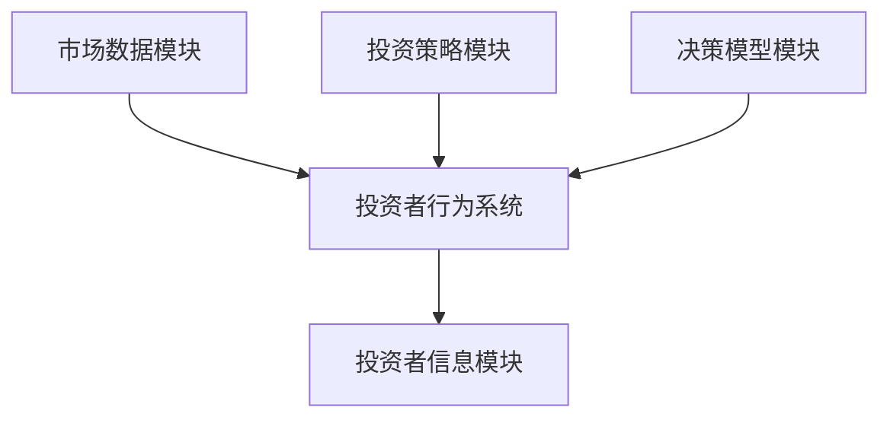
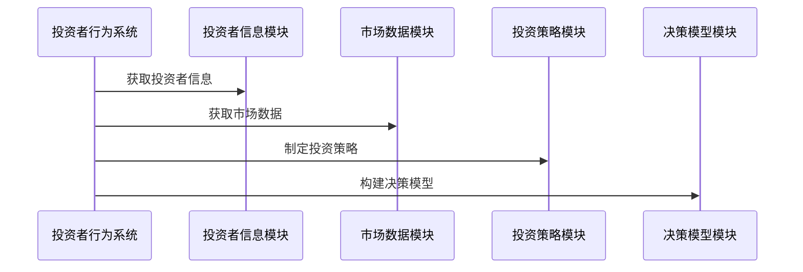

                 


# 约翰·伯格的投资者行为学观点

## 关键词：投资者行为学，约翰·伯格，认知偏差，情绪影响，投资策略，决策模型

## 摘要：本文深入探讨了约翰·伯格的投资者行为学观点，分析了投资者心理与行为的核心要素，包括认知偏差、情绪影响和决策策略。通过构建投资者行为模型，本文详细讲解了如何将理论应用于实际投资决策，结合具体案例和系统设计，提供了实践指导和优化建议。

---

## # 第1章: 投资者行为学概述

### ## 1.1 投资者行为学的背景与意义

#### ### 1.1.1 问题背景与问题描述

投资者行为学是研究投资者在不同市场条件下如何做出决策的学科。投资者在面对复杂市场环境时，会受到多种因素的影响，如心理偏差、情绪波动、市场信息等。这些因素可能导致非理性决策，进而影响投资收益和市场效率。约翰·伯格作为投资领域的权威，提出了许多关于投资者行为的深刻见解，强调了心理因素在投资决策中的重要性。

#### ### 1.1.2 投资者行为学的核心概念

投资者行为学研究的核心在于理解投资者的心理和行为模式，分析这些模式如何影响投资决策和市场结果。其核心概念包括认知偏差、情绪影响、风险偏好、决策过程等。这些概念帮助我们更好地理解投资者的行为动机和决策逻辑。

#### ### 1.1.3 约翰·伯格的投资者行为学观点

约翰·伯格认为，投资者的行为受到心理因素的显著影响。他强调长期投资的重要性，并指出投资者往往过于关注短期市场波动，导致非理性决策。伯格的研究为投资者行为学提供了丰富的理论框架，帮助投资者更好地理解和管理自己的行为。

### ## 1.2 投资者行为学的基本框架

#### ### 1.2.1 投资者决策的核心要素

投资者的决策过程涉及信息处理、情绪控制、风险评估等多个环节。核心要素包括信息收集与分析、决策制定与执行、反馈与调整。这些要素共同构成了投资者行为学的基本框架。

#### ### 1.2.2 投资者心理与行为的关联

投资者的心理状态直接影响其行为表现。认知偏差、情绪波动等因素会导致投资者在决策过程中出现偏差，进而影响投资结果。理解这种关联有助于制定更有效的投资策略。

#### ### 1.2.3 约翰·伯格的投资者行为学理论体系

伯格的理论体系强调长期投资和价值投资，认为市场短期波动难以预测，但长期趋势可以通过基本面分析来把握。他提出了“投资者行为周期”模型，分析了投资者在不同市场阶段的行为特点。

### ## 1.3 本章小结

本章介绍了投资者行为学的基本概念和研究意义，详细阐述了约翰·伯格的核心观点。通过分析投资者决策的核心要素和心理行为的关联，为后续章节的深入探讨奠定了基础。

---

## # 第2章: 投资者心理与行为分析

### ## 2.1 投资者认知偏差与决策错误

#### ### 2.1.1 认知偏差的定义与分类

认知偏差是指投资者在信息处理过程中产生的系统性错误。常见的认知偏差包括确认偏差、过度自信偏差、从众偏差等。这些偏差会导致投资者在决策过程中出现错误判断。

#### ### 2.1.2 常见的认知偏差对投资者决策的影响

确认偏差使投资者倾向于寻找支持自己观点的信息，忽视反面证据；过度自信偏差导致投资者高估自己的判断能力；从众偏差则使投资者跟随市场潮流，忽视独立分析。这些偏差都会影响投资决策的质量。

#### ### 2.1.3 约翰·伯格对认知偏差的分析

伯格指出，认知偏差是投资者行为的主要障碍之一。他强调了长期投资的重要性，建议投资者避免短期波动的干扰，坚持基本面分析。

#### ### 图2-1：常见认知偏差对投资者决策的影响


---

### ## 2.2 投资者情绪与市场行为

#### ### 2.2.1 情绪在投资决策中的作用

情绪是投资者行为的重要驱动力。恐惧和贪婪等情绪会导致投资者做出非理性决策，如过度交易或盲目跟风。情绪波动对市场走势有显著影响。

#### ### 2.2.2 市场情绪周期与投资者行为

市场情绪呈现周期性波动，投资者在牛市中过于乐观，在熊市中过于悲观。这种情绪周期影响投资者的决策，导致市场的过度波动。

#### ### 2.2.3 约翰·伯格对投资者情绪的研究

伯格认为，情绪是投资者行为的关键因素。他建议投资者通过长期投资来规避情绪波动的影响，保持理性决策。

#### ### 图2-2：市场情绪周期与投资者行为


---

### ## 2.3 投资者行为模型构建

#### ### 2.3.1 行为模型的构建方法

行为模型通过分析投资者的心理和行为特征，构建数学模型来描述投资者的决策过程。常用的方法包括决策树分析、博弈论模型等。

#### ### 2.3.2 约翰·伯格的行为模型分析

伯格的行为模型强调长期投资和价值投资，认为市场短期波动不可预测，但长期趋势可以通过基本面分析来把握。

#### ### 2.3.3 行为模型在实际投资中的应用

行为模型可以帮助投资者识别认知偏差和情绪影响，制定更科学的投资策略。例如，通过模型分析，投资者可以更好地控制情绪，避免非理性决策。

---

## # 第3章: 投资者决策过程与策略

### ## 3.1 投资者决策过程的阶段划分

#### ### 3.1.1 信息收集与处理

投资者需要收集市场信息，进行分析和处理，以做出决策。

#### ### 3.1.2 信息分析与决策制定

通过对信息的分析，投资者制定决策，并选择投资策略。

#### ### 3.1.3 决策执行与反馈

投资者执行决策，并根据市场反馈调整策略。

---

### ## 3.2 投资者决策策略的多样性

#### ### 3.2.1 价值投资策略

价值投资注重基本面分析，寻找被市场低估的股票。伯格认为这是长期投资的基石。

#### ### 3.2.2 技术分析策略

技术分析通过研究价格走势和交易量来预测市场走势。伯格对此持保留态度，认为技术分析难以预测长期趋势。

#### ### 3.2.3 约翰·伯格的长期投资策略

伯格强调长期投资的重要性，认为市场短期波动不可预测，但长期趋势可以通过基本面分析来把握。

---

### ## 3.3 投资者策略选择的影响因素

#### ### 3.3.1 个人风险偏好

投资者的风险偏好影响其策略选择。风险厌恶的投资者倾向于保守策略，而风险寻求的投资者则倾向于高风险高回报的策略。

#### ### 3.3.2 市场环境与经济周期

市场环境和经济周期影响投资者的策略选择。例如，在经济衰退时期，投资者可能更倾向于防御性投资。

#### ### 3.3.3 信息的可获得性与质量

信息的可获得性和质量影响投资者的决策。高质量的信息有助于投资者做出更明智的决策。

---

## # 第4章: 投资者行为学的系统分析与架构设计

### ## 4.1 问题场景介绍

投资者行为学的研究需要构建一个完整的系统来分析投资者的行为模式，制定有效的投资策略。

---

### ## 4.2 系统功能设计

#### ### 4.2.1 领域模型


---

#### ### 4.2.2 系统架构设计



---

#### ### 4.2.3 系统接口设计

系统接口包括投资者信息接口、市场数据接口、投资策略接口和决策模型接口。

---

#### ### 4.2.4 系统交互设计



---

## # 第5章: 项目实战

### ## 5.1 环境安装

安装必要的开发工具和数据源，例如Python、数据可视化库等。

---

### ## 5.2 系统核心实现源代码

#### ### 5.2.1 投资者行为分析代码

```python
def analyze_behavior(data):
    # 数据处理和分析
    pass

def generate_strategy(data):
    # 生成投资策略
    pass
```

---

### ## 5.3 代码应用解读与分析

通过代码分析投资者行为，生成投资策略，并进行结果解读。

---

### ## 5.4 实际案例分析

通过具体案例分析，展示如何应用约翰·伯格的观点进行投资策略分析。

---

### ## 5.5 项目小结

总结项目实施过程中的经验和教训，提出改进建议。

---

## # 第6章: 最佳实践与小结

### ## 6.1 注意事项

投资者在实际操作中需要注意避免认知偏差和情绪影响，保持理性决策。

---

### ## 6.2 小结

总结全文内容，强调投资者行为学的重要性，以及约翰·伯格观点的实践意义。

---

### ## 6.3 拓展阅读

推荐相关书籍和资源，供读者进一步学习和研究。

---

## # 第7章: 结语

总结全文，强调投资者行为学的重要性和实际应用价值，鼓励读者深入研究和实践。

--- 

通过以上结构，我们可以系统地探讨约翰·伯格的投资者行为学观点，结合理论分析和实际案例，为投资者提供有价值的指导和建议。

