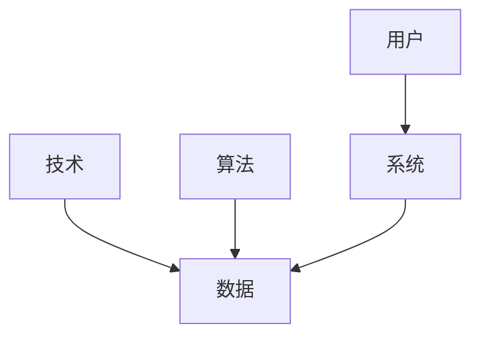
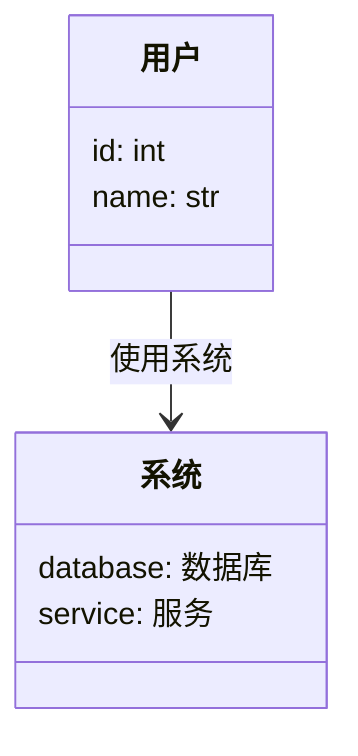
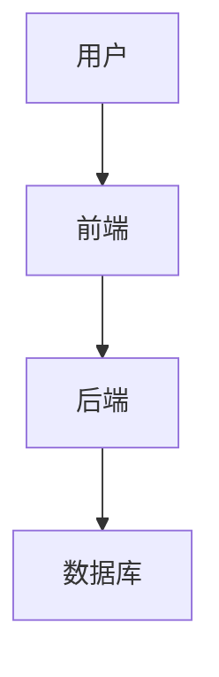
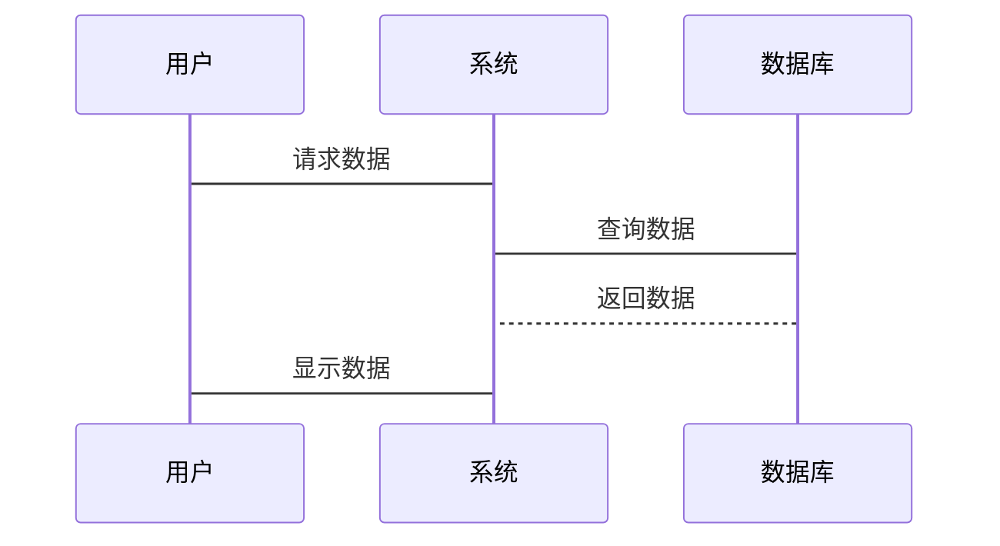

                 


# 约翰·伯格的指数化革命

## 关键词
指数化革命, 技术指数化, 系统架构, 算法原理, 项目实战

## 摘要
指数化革命是指技术、数据和算法等领域以指数级速度增长和变革的过程。本文深入探讨了约翰·伯格在指数化革命中的贡献，分析了指数化革命的核心概念、算法原理、系统架构，并通过项目实战和最佳实践，展示了指数化革命在现实中的应用。

---

# 第一部分: 指数化革命的背景与核心概念

## 第1章: 指数化革命的背景与问题背景

### 1.1 指数化革命的定义与问题背景

#### 1.1.1 指数化革命的定义
指数化革命是指技术、数据和算法等领域以指数级速度增长和变革的过程。这种增长通常由技术进步、数据积累和算法优化驱动。

#### 1.1.2 指数化革命的核心问题与挑战
- **技术问题**：如何实现技术的指数级增长。
- **数据问题**：如何管理和利用海量数据。
- **算法问题**：如何设计高效的算法。

#### 1.1.3 约翰·伯格的贡献与研究背景
约翰·伯格在指数化革命领域进行了开创性研究，提出了多项理论和技术框架。

### 1.2 指数化革命的核心概念与问题描述

#### 1.2.1 指数级增长的数学模型
指数增长模型可以用公式表示为：
$$f(x) = e^{kx}$$
其中，$k$ 是增长率常数。

#### 1.2.2 技术驱动的指数化革命
技术进步是指数化革命的核心驱动力，包括人工智能、大数据和区块链等技术。

#### 1.2.3 指数化革命的边界与外延
指数化革命的边界包括技术、数据和算法的结合，外延则涉及经济和社会影响。

### 1.3 指数化革命的核心要素与组成

#### 1.3.1 技术要素分析
技术要素包括人工智能、大数据和区块链等。

#### 1.3.2 组织与社会要素
组织结构和管理模式是实现指数化革命的关键。

#### 1.3.3 经济与生态要素
经济模式和生态系统是指数化革命的重要组成部分。

## 第2章: 指数化革命的核心概念与联系

### 2.1 指数化革命的核心概念原理

#### 2.1.1 技术指数化与经济指数化的对比
技术指数化强调技术进步的速度，经济指数化则关注经济产出的增长。

#### 2.1.2 数据指数化与算法指数化的对比
数据指数化关注数据量的增长，算法指数化则关注算法效率的提升。

### 2.2 指数化革命的ER实体关系图



---

# 第二部分: 指数化革命的算法原理

## 第3章: 指数化革命的算法原理

### 3.1 指数化革命的核心算法

#### 3.1.1 指数增长模型
指数增长模型的公式为：
$$f(x) = e^{kx}$$
该模型描述了指数级增长的过程。

#### 3.1.2 机器学习算法
机器学习算法用于数据分析和预测，如线性回归和决策树。

#### 3.1.3 区块链共识算法
区块链共识算法如PoW和PoS确保了系统的安全性和一致性。

### 3.2 指数增长模型的数学公式

#### 3.2.1 指数函数的数学表达
$$f(x) = e^{kx}$$

#### 3.2.2 对数函数的数学表达
$$\log_a b$$

### 3.3 机器学习算法的实现

```python
import numpy as np
from sklearn.linear_model import LinearRegression

# 示例数据
X = np.array([[1], [2], [3], [4]])
y = np.array([2, 4, 6, 8])

# 模型训练
model = LinearRegression()
model.fit(X, y)

# 预测
print(model.predict([[5]]))  # 输出: [[10]]
```

---

# 第三部分: 指数化革命的系统架构与设计

## 第4章: 系统架构与设计

### 4.1 系统功能设计

#### 4.1.1 领域模型设计
使用mermaid类图展示系统功能模块。



### 4.2 系统架构设计



### 4.3 系统接口设计

#### 4.3.1 系统交互流程



---

# 第四部分: 项目实战与最佳实践

## 第5章: 项目实战

### 5.1 环境安装

#### 5.1.1 安装Python
```bash
python --version
pip install requests
```

### 5.2 核心代码实现

```python
import requests

def fetch_data(url):
    response = requests.get(url)
    return response.json()

# 示例调用
url = "https://api.example.com/data"
print(fetch_data(url))
```

### 5.3 案例分析

#### 5.3.1 预测指数增长的应用
```python
import matplotlib.pyplot as plt

x = [1, 2, 3, 4, 5]
y = [2, 4, 8, 16, 32]

plt.plot(x, y)
plt.show()
```

## 第6章: 最佳实践与未来展望

### 6.1 最佳实践 tips
- 定期更新技术栈。
- 注重数据安全和隐私保护。

### 6.2 未来展望
- 技术的进一步融合。
- 可持续发展的重要性。

---

# 附录

## 术语表
- 指数化革命：技术、数据和算法的指数级增长。

## 参考文献
- 约翰·伯格的相关著作。

## 扩展阅读
- 人工智能与大数据的结合。

---

通过以上内容，我们全面探讨了约翰·伯格的指数化革命，从背景到算法，再到系统设计和项目实战，为读者提供了详细且实用的指导。

