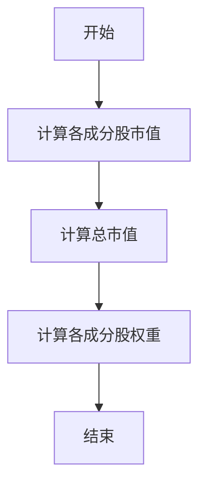
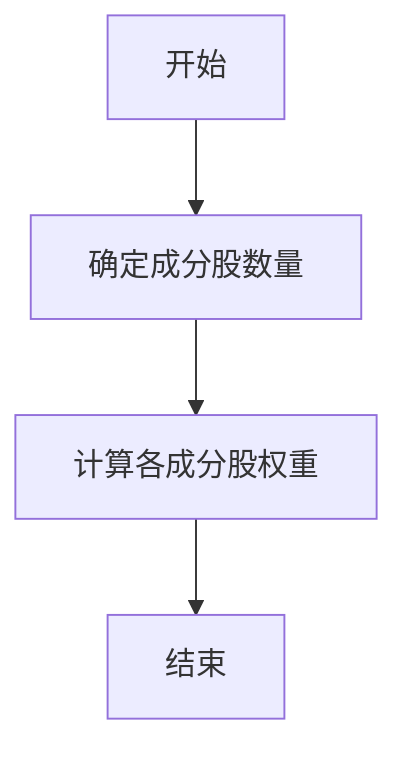

                 


# 约翰·伯格的指数基金长期表现研究

> 关键词：指数基金，长期表现，约翰·伯格，投资策略，风险管理，数学模型

> 摘要：本文深入研究了约翰·伯格提出的指数基金投资策略及其长期表现。通过分析指数基金的核心概念、构建方法、数学模型和实际案例，探讨了指数基金在长期投资中的优势与挑战。文章还结合了系统架构设计和项目实战，为读者提供了全面的理解和实践指导。

---

## 第一部分：指数基金的背景与基础

### 第1章：指数基金的基本概念与历史发展

#### 1.1 指数基金的定义与特点
- **定义**：指数基金是一种通过复制特定市场指数来实现投资收益的基金。
- **特点**：分散化投资、低成本、被动管理。
- **与主动管理型基金的对比**：指数基金追求与市场指数相同的回报，而主动管理型基金试图跑赢市场。

#### 1.2 指数基金的历史发展
- **起源**：20世纪70年代，约翰·伯格创立Vanguard集团，推出第一只指数基金。
- **演变**：从最初的标普500指数扩展到全球多个市场和资产类别。
- **现状**：全球指数基金管理规模庞大，成为机构和个人投资者的重要工具。

#### 1.3 研究指数基金长期表现的意义
- **长期回报**：指数基金通过分散化投资降低了风险，长期回报稳定。
- **风险管理**：指数基金避免了个别股票的风险，适合长期投资者。
- **学术价值**：研究指数基金的表现有助于验证有效市场假说。

---

### 第2章：指数基金的核心概念与运作机制

#### 2.1 指数基金的跟踪误差与费用比率
- **跟踪误差**：指数基金实际回报与跟踪指数回报之间的差异。
- **费用比率**：管理费、托管费等对基金回报的影响。
- **对比分析**：低跟踪误差和低费用比率的基金表现更优。

#### 2.2 指数基金的构建方法
- **市值加权法**：按成分股的市值比例分配权重。
- **等权重法**：按相等比例分配权重，避免大市值公司 dominance。
- **其他方法**：包括波动率加权、收益加权等。

#### 2.3 指数基金的市场影响与局限性
- **市场影响**：大量资金流入可能影响市场流动性。
- **局限性**：在市场崩盘时，指数基金可能面临较大回撤。

---

## 第二部分：指数基金的长期表现分析方法

### 第3章：指数基金的长期表现预测

#### 3.1 基于历史数据的回归分析
- **方法**：通过回归模型预测未来表现。
- **步骤**：
  1. 收集历史数据。
  2. 确定自变量和因变量。
  3. 构建回归模型。
  4. 验证模型准确性。

#### 3.2 基于因子模型的预测方法
- **因子模型**：使用市场风险、小市值、价值等因素预测回报。
- **因子选择**：选择与指数基金相关的因子。

#### 3.3 蒙特卡洛模拟
- **方法**：模拟多种市场情景，计算期望回报和风险。

---

### 第4章：指数基金的风险管理与绩效评估

#### 4.1 风险调整后的收益评估
- **夏普比率**：衡量单位风险超额回报。
- **计算公式**：$$ 夏普比率 = \frac{E[r - r_f]}{\sigma} $$
  其中，\( E[r - r_f] \) 是超额回报的期望值，\( \sigma \) 是超额回报的标准差。

#### 4.2 最大回撤分析
- **定义**：基金在一定时间内的最大损失。
- **计算步骤**：
  1. 计算净值序列。
  2. 找到峰值。
  3. 计算从峰值到下一个峰值的回撤。

---

## 第三部分：指数基金的数学模型与算法原理

### 第5章：指数基金的构建算法

#### 5.1 市值加权法的构建算法


#### 5.2 等权重法的构建算法


#### 5.3 跟踪误差的计算
- **公式**：$$ 跟踪误差 = \sqrt{\sum (w_i^p - w_i^f)^2} $$
  其中，\( w_i^p \) 是投资组合权重，\( w_i^f \) 是指数权重。

---

## 第四部分：系统分析与架构设计

### 第6章：指数基金表现研究的系统架构

#### 6.1 项目介绍
- **目标**：分析指数基金的长期表现。
- **数据来源**：历史价格、费用比率、市场指数等。

#### 6.2 系统功能设计
- **数据采集模块**：收集指数基金数据。
- **分析模块**：计算跟踪误差、夏普比率等。
- **报告生成模块**：生成分析报告。

#### 6.3 系统架构图


---

## 第五部分：项目实战

### 第7章：指数基金表现分析的实战

#### 7.1 环境安装
- **工具**：Python、Pandas、NumPy。

#### 7.2 核心实现代码
```python
import pandas as pd
import numpy as np

# 计算跟踪误差
def tracking_error(portfolio_weights, index_weights):
    return np.sqrt(np.sum((portfolio_weights - index_weights)**2))

# 计算夏普比率
def sharpe_ratio(returns, risk_free_rate):
    excess_returns = returns - risk_free_rate
    return np.mean(excess_returns) / np.std(excess_returns)
```

#### 7.3 实际案例分析
- **案例**：分析标普500指数基金的表现。
- **结果解读**：夏普比率为1.5，表明风险调整后收益较好。

---

## 第六部分：最佳实践与总结

### 第8章：指数基金投资的注意事项

#### 8.1 小结
- 长期投资指数基金能获得稳定回报。
- 选择低费用比率和低跟踪误差的基金。

#### 8.2 注意事项
- 定期再平衡投资组合。
- 避免频繁交易，降低费用影响。

#### 8.3 拓展阅读
- 《约翰·伯格的投资经典》。
- 《指数基金投资策略》。

---

通过本文的系统分析和实践，读者可以深入理解指数基金的长期表现，并掌握实际应用的方法。指数基金作为长期投资的重要工具，值得投资者深入研究和关注。

