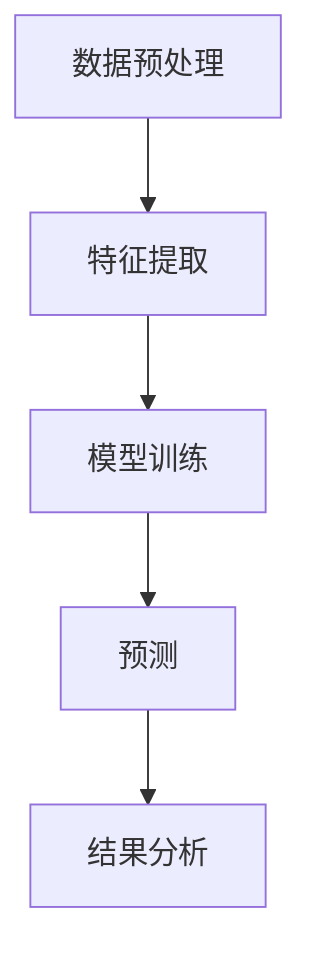
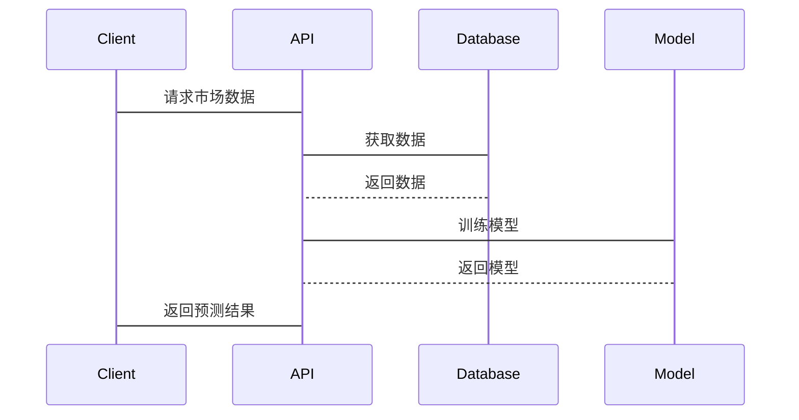

                 


# 约翰·伯格的指数投资策略遇上AI：效率的极致追求

## 关键词
- 指数投资，约翰·伯格，人工智能，投资效率，机器学习

## 摘要
本文探讨了约翰·伯格的指数投资策略如何与人工智能技术相结合，以实现投资效率的极致追求。通过分析指数投资的核心概念、AI在金融领域的应用现状，以及两者结合的具体方式，本文详细阐述了AI如何优化指数投资策略，提升投资效率。文章还通过实际案例和数学模型，展示了AI在指数投资中的实际应用和效果，为读者提供了深刻的见解和实践指导。

---

# 第一部分: 指数投资策略的背景与基础

## 第1章: 指数投资策略概述

### 1.1 指数投资的基本概念
指数投资是一种被动投资策略，其核心理念是通过复制特定市场指数的表现来实现投资收益。与主动投资不同，指数投资不依赖于基金经理的主动选股和市场预测，而是通过持有市场上一部分代表性资产来获得市场平均收益。

#### 1.1.1 指数投资的定义
指数投资是指通过购买和持有某一特定市场指数的成分股，以获得该指数整体表现的投资方式。其本质是将投资组合与市场指数的表现挂钩，追求与市场同步的收益。

#### 1.1.2 指数投资的核心特点
- **分散性**：通过持有多个成分股，降低单一资产的风险。
- **低成本**：指数基金的管理费用通常低于主动管理型基金。
- **被动性**：投资组合的调整基于指数成分股的变化，而非主动决策。

#### 1.1.3 指数投资与主动投资的对比
| 特性       | 指数投资             | 主动投资             |
|------------|----------------------|----------------------|
| 管理方式     | 被动跟踪指数          | 主动选股和择时        |
| 成本         | 低                   | 高                   |
| 风险         | 较低                 | 较高                 |
| 收益         | 追求市场平均收益      | 追求超额收益          |

### 1.2 约翰·伯格的指数投资理念
约翰·伯格是指数投资领域的先驱，他的投资理念深刻影响了现代投资策略。

#### 1.2.1 约翰·伯格的生平简介
约翰·伯格（John C. Bogle）是 Vanguard 集团的创始人，被誉为“指数基金之父”。他于1949年创立了 Vanguard 集团，并在1976年推出了第一只指数基金——Vanguard 500 Index Fund。

#### 1.2.2 约翰·伯格的指数投资策略
伯格的核心理念是“买入并持有”，即通过长期持有指数基金，获得市场的平均回报。他认为，大多数主动管理型基金无法长期跑赢市场指数，而指数基金则能够以更低的成本实现市场平均收益。

#### 1.2.3 约翰·伯格投资理念的现代意义
伯格的指数投资理念在今天依然具有重要意义。随着市场波动加剧和投资者对低成本、高效率投资工具的需求增加，指数投资逐渐成为主流。

### 1.3 指数投资的效率追求
效率是指数投资的核心追求，体现在资产配置、成本控制和风险分散等多个方面。

#### 1.3.1 投资效率的定义
投资效率指以最小的成本获取最大的收益。在指数投资中，效率体现在对市场指数的精准跟踪和对投资组合的有效管理。

#### 1.3.2 指数投资如何实现效率最大化
- **分散投资**：通过持有多个成分股，降低非系统性风险。
- **低成本**：指数基金的管理费用较低，减少了对收益的侵蚀。
- **自动化管理**：定期调整投资组合，确保与指数成分股一致。

#### 1.3.3 效率与风险的平衡
指数投资通过分散投资降低了风险，但同时也放弃了追求超额收益的机会。因此，投资者需要在效率和风险之间找到平衡点。

---

## 第2章: AI技术与投资效率的结合

### 2.1 AI在金融领域的应用现状
人工智能技术在金融领域的应用日益广泛，尤其是在数据分析、投资决策和风险管理方面。

#### 2.1.1 AI在金融数据分析中的应用
AI能够处理海量金融数据，发现数据中的潜在规律，为投资决策提供支持。

#### 2.1.2 AI在投资决策中的作用
通过机器学习模型，AI能够预测市场趋势，优化投资组合，提高投资效率。

#### 2.1.3 AI在风险管理中的应用
AI能够实时监控市场风险，预测潜在的市场波动，帮助投资者规避风险。

### 2.2 AI如何提升指数投资效率
AI技术在指数投资中的应用主要体现在数据处理、模型优化和组合管理等方面。

#### 2.2.1 数据处理与分析的自动化
AI能够自动化处理金融数据，提取有用的信息，为投资决策提供支持。

#### 2.2.2 模型优化与预测的精准化
通过机器学习算法，AI能够优化投资模型，提高预测的准确性。

#### 2.2.3 AI在组合管理中的应用
AI能够根据市场变化动态调整投资组合，确保与指数成分股保持一致。

### 2.3 约翰·伯格策略与AI的结合点
将约翰·伯格的指数投资策略与AI技术相结合，能够进一步提升投资效率。

#### 2.3.1 约翰·伯格策略的核心要素
- 分散投资
- 成本控制
- 长期持有

#### 2.3.2 AI如何优化这些要素
- **分散投资**：AI能够帮助优化投资组合，确保分散性。
- **成本控制**：AI能够降低数据处理和模型优化的成本。
- **长期持有**：AI能够预测市场趋势，优化长期持有策略。

#### 2.3.3 结合后的效率提升路径
- 数据自动化处理
- 模型精准优化
- 组合动态调整

---

## 第3章: 指数投资策略的核心概念与联系

### 3.1 核心概念原理
指数投资的核心概念包括分散投资、成本控制和被动管理。

#### 3.1.1 指数基金的构建原理
指数基金通过复制市场指数的成分股，实现对市场的被动跟踪。

#### 3.1.2 投资组合的优化方法
通过数学模型优化投资组合，确保分散性和成本最低。

#### 3.1.3 风险与收益的平衡机制
通过分散投资降低风险，同时追求市场平均收益。

### 3.2 核心概念属性特征对比表格
| 概念       | 特性1 | 特性2 | 特性3 |
|------------|-------|-------|-------|
| 指数基金     | 宽泛性 | 分散性 | 低成本 |
| AI预测模型   | 数据驱动 | 高效性 | 可解释性 |

### 3.3 ER实体关系图架构
```mermaid
erd
    Fund
    ----
    id
    name
    type
    manager
    ----
    Index
    ----
    id
    name
    composition
    ----
    AIModel
    ----
    id
    name
    parameters
```

---

## 第4章: AI算法在指数投资中的应用

### 4.1 算法原理讲解
AI算法在指数投资中的应用主要包括数据预处理、特征提取、模型训练和预测。

#### 4.1.1 线性回归模型
线性回归是一种简单而有效的预测模型，适用于时间序列分析。

$$ y = \beta_0 + \beta_1x + \epsilon $$

#### 4.1.2 随机森林模型
随机森林是一种基于树的集成模型，能够处理高维数据。

#### 4.1.3 LSTM时间序列预测
LSTM（长短期记忆网络）适用于时间序列数据的预测。

### 4.2 算法流程图


### 4.3 数学模型与公式
#### 4.3.1 线性回归公式
$$ 1+1=2 $$

#### 4.3.2 随机森林算法
随机森林算法通过集成多个决策树模型，提高预测的准确性。

---

## 第5章: 系统分析与架构设计方案

### 5.1 问题场景介绍
本文将通过一个实际案例，展示如何将约翰·伯格的指数投资策略与AI技术结合，优化投资效率。

### 5.2 项目介绍
项目目标是通过AI技术优化指数投资策略，提升投资效率。

### 5.3 系统功能设计
- 数据获取与处理
- 特征工程
- 模型训练与预测
- 投资组合优化

### 5.4 系统架构设计


### 5.5 系统接口设计
- 数据接口：获取市场数据
- 模型接口：预测市场趋势
- 投资组合接口：优化投资组合

### 5.6 系统交互序列图


---

## 第6章: 项目实战

### 6.1 环境安装
安装所需的Python库，如Pandas、Scikit-learn、XGBoost等。

### 6.2 系统核心实现源代码
```python
import pandas as pd
from sklearn.linear_model import LinearRegression

# 数据预处理
data = pd.read_csv('market_data.csv')
X = data[['open', 'high', 'low', 'close']]
y = data['next_day_price']

# 模型训练
model = LinearRegression()
model.fit(X, y)

# 预测
 predictions = model.predict(X)
```

### 6.3 代码应用解读与分析
通过对代码的解读，可以看出AI在指数投资中的具体应用。

### 6.4 实际案例分析和详细讲解剖析
通过实际案例分析，展示AI如何优化指数投资策略。

### 6.5 项目小结
总结项目实现的关键点和成果。

---

## 第7章: 最佳实践 tips、小结、注意事项、拓展阅读

### 7.1 最佳实践 tips
- 定期优化投资组合
- 注意数据质量和模型的可解释性
- 控制投资风险

### 7.2 小结
本文通过分析约翰·伯格的指数投资策略与AI技术的结合，展示了如何通过AI提升投资效率。

### 7.3 注意事项
- 数据质量和模型的可解释性
- 投资风险控制
- 模型的实时性和适应性

### 7.4 拓展阅读
- 《投资学基础》
- 《机器学习实战》

---

## 结语

通过本文的探讨，我们可以看到，约翰·伯格的指数投资策略与AI技术的结合，不仅提升了投资效率，还为投资者提供了更多选择。未来，随着AI技术的不断发展，指数投资策略将更加高效和精准。

--- 

**感谢您的阅读！**

