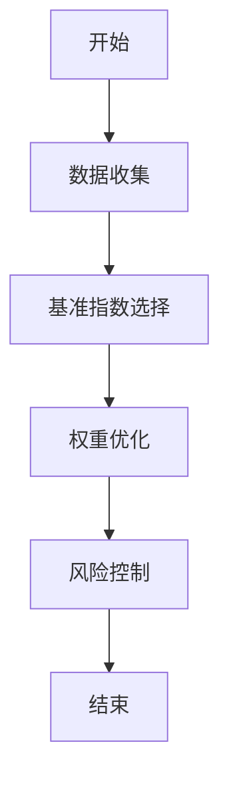
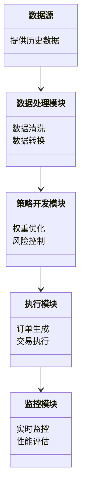
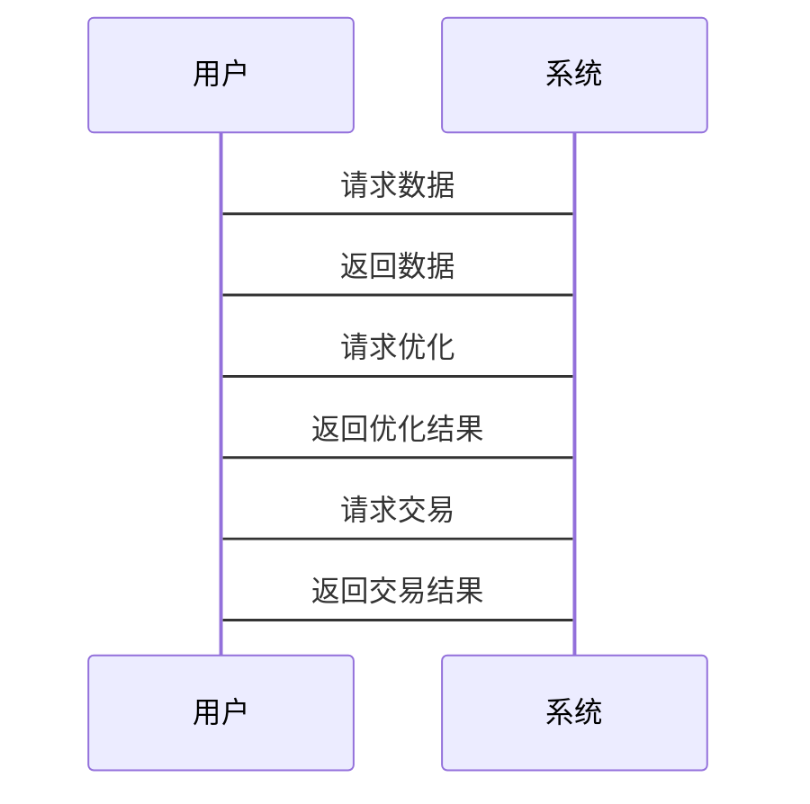
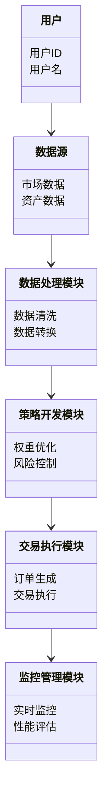
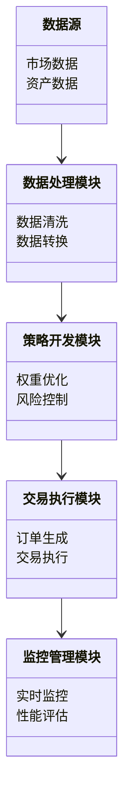

                 


# 约翰·伯格的指数革命：智能Beta策略的兴起

## 关键词
- 智能Beta策略
- 指数基金
- 量化投资
- 约翰·伯格
- 系统架构

## 摘要
本文深入探讨了智能Beta策略的兴起及其对指数革命的影响，结合约翰·伯格的贡献，分析了智能Beta策略的核心原理、算法实现、系统架构及项目实战。通过详细的数学模型和代码示例，本文展示了智能Beta策略在量化投资中的应用，并提出了系统设计的最佳实践和未来展望。

---

## 第一部分：智能Beta策略与指数革命的背景介绍

### 第1章：指数基金与智能Beta策略概述

#### 1.1 指数基金的起源与发展

##### 1.1.1 指数基金的定义与特点
指数基金是一种以特定市场指数为基准，通过复制指数成分股的表现来实现投资收益的基金。其特点包括分散化、低成本和被动管理。指数基金的收益与所跟踪的指数表现密切相关，避免了主动管理的高成本和高风险。

##### 1.1.2 智能Beta策略的提出与背景
智能Beta策略是一种结合被动投资与主动管理的策略，通过优化投资组合的权重，以实现超越基准指数的超额收益。其提出背景源于市场对更高收益和更低风险的需求，尤其是在传统被动投资无法满足的情况下，智能Beta策略应运而生。

##### 1.1.3 约翰·伯格与指数基金的关联
约翰·伯格是指数基金的先驱，他于1975年创立了 Vanguard 集团，并推出了第一只指数基金。伯格的贡献在于将指数投资推向大众，并证明了低成本指数基金的长期收益潜力。

#### 1.2 智能Beta策略的核心概念

##### 1.2.1 智能Beta的定义与特征
智能Beta策略是一种通过优化投资组合权重，以实现风险调整后收益最大化的方法。其特征包括：偏离基准指数、优化权重、动态调整和风险控制。

##### 1.2.2 智能Beta与传统被动投资的区别
智能Beta策略与传统被动投资的主要区别在于权重调整和风险管理。智能Beta策略通过优化权重和引入风险管理技术，旨在在控制风险的前提下实现超额收益。

##### 1.2.3 智能Beta策略的优势与应用场景
智能Beta策略的优势在于其灵活性和适应性，能够在不同市场条件下优化投资组合。其应用场景包括：市场波动较大时的风险控制、长期投资的收益增强以及定制化投资需求的满足。

#### 1.3 约翰·伯格的指数革命

##### 1.3.1 约翰·伯格的生平与贡献
约翰·伯格是指数基金的先驱，他通过创新和降低成本，推动了指数投资的普及。他的贡献不仅在于产品创新，还包括教育投资者关于低成本投资的理念。

##### 1.3.2 指数革命的核心思想
指数革命的核心思想是通过低成本和分散化投资，实现长期稳定的收益。伯格强调长期投资和纪律性，认为市场波动无法被预测，而通过分散化和低成本可以实现最优收益。

##### 1.3.3 智能Beta策略的兴起与影响
智能Beta策略的兴起是对传统被动投资的补充，它通过优化和动态调整，提供了更高的收益潜力和更低的风险。其影响包括推动量化投资的发展和改变传统投资策略。

---

### 第2章：智能Beta策略的核心原理

#### 2.1 智能Beta策略的数学模型

##### 2.1.1 智能Beta策略的数学表达式
智能Beta策略的优化目标可以表示为：
$$
\min_w \left( \frac{1}{2} w^T \Sigma w + \lambda \|w - w_{\text{基准}}\|_2^2 \right)
$$

其中，\( w \) 是投资组合的权重向量，\( \Sigma \) 是资产的协方差矩阵，\( \lambda \) 是控制偏离基准的参数，\( w_{\text{基准}} \) 是基准指数的权重向量。

##### 2.1.2 智能Beta策略的优化算法
智能Beta策略的优化算法通常包括以下几个步骤：

1. **数据收集与预处理**：收集资产的收益率数据，并进行标准化和去噪处理。
2. **基准指数的选择与构建**：选择合适的基准指数，并计算其权重。
3. **智能Beta权重的计算与调整**：使用优化算法计算最优权重，并调整以偏离基准指数。
4. **投资组合的优化与风险控制**：通过优化算法调整权重，以实现风险调整后的收益最大化。

#### 2.2 智能Beta策略的实现步骤

##### 2.2.1 数据收集与预处理
在实现智能Beta策略之前，需要收集相关资产的历史收益率数据，并进行清洗和预处理。例如，使用Python的 pandas 库进行数据清洗：

```python
import pandas as pd

# 假设data为包含资产收益率的数据框
data = pd.read_csv('returns.csv')
data.dropna(inplace=True)  # 删除缺失值
data = data.iloc[-100:]  # 保留最近100个交易日的数据
```

##### 2.2.2 基准指数的选择与构建
选择一个合适的基准指数，并计算其权重。例如，使用市值加权指数：

```python
import numpy as np

# 假设 benchmark_weights 为基准指数的权重向量
benchmark_weights = np.array([0.2, 0.3, 0.1, 0.4])
```

##### 2.2.3 智能Beta权重的计算与调整
使用优化算法计算最优权重，并调整以偏离基准指数。例如，使用凸优化算法：

```python
from scipy.optimize import minimize

def objective_function(w, Sigma, benchmark_weights, lambda_):
    return 0.5 * w.T.dot(Sigma).dot(w) + lambda_ * (w - benchmark_weights).T.dot(w)

# 初始权重设为基准权重
w0 = benchmark_weights

# 使用 scipy.optimize.minimize 进行优化
result = minimize(objective_function, w0, args=(Sigma, benchmark_weights, lambda_))
optimal_weights = result.x
```

##### 2.2.4 投资组合的优化与风险控制
通过优化算法调整权重，以实现风险调整后的收益最大化。例如，计算优化后的权重并验证其有效性。

#### 2.3 智能Beta策略的优缺点分析

##### 2.3.1 优点：低成本、高透明度、风险可控
智能Beta策略通过优化算法实现低成本和高透明度，同时通过风险控制技术降低投资组合的风险。

##### 2.3.2 缺点：可能偏离基准、在极端市场条件下表现不佳
智能Beta策略的优化结果可能偏离基准指数，在极端市场条件下可能无法达到预期收益。

---

### 第3章：指数革命的技术实现

#### 3.1 智能Beta策略的算法实现

##### 3.1.1 使用Python实现智能Beta权重计算
以下是一个简单的Python代码示例，展示如何计算智能Beta策略的权重：

```python
import numpy as np
from scipy.optimize import minimize

def calculate_beta(weights, market_return, asset_return):
    beta = np.cov(asset_return, market_return) / np.var(market_return)
    return beta

# 示例数据
market_return = np.array([0.05, 0.06, 0.04, 0.07])
asset_return = np.array([0.06, 0.07, 0.05, 0.08])

# 初始权重设为均匀分布
weights = np.array([0.25, 0.25, 0.25, 0.25])

# 使用 minimize 函数优化权重
result = minimize(calculate_beta, weights, args=(market_return, asset_return))
optimal_weights = result.x

print("Optimal weights:", optimal_weights)
```

##### 3.1.2 使用mermaid画出算法流程图
以下是一个mermaid流程图，展示智能Beta策略的算法实现流程：



#### 3.2 系统架构与项目实战

##### 3.2.1 量化投资平台的系统架构设计
以下是一个量化投资平台的系统架构图，展示其主要组成部分：



##### 3.2.2 系统功能设计与实现
以下是一个简单的量化投资平台的功能设计：

1. **数据处理模块**：负责收集和处理市场数据。
2. **策略开发模块**：实现智能Beta策略的优化算法。
3. **执行模块**：根据优化结果生成交易订单并执行。
4. **监控模块**：实时监控投资组合的表现并评估性能。

#### 3.3 系统交互设计与实现

##### 3.3.1 使用mermaid绘制系统交互图
以下是一个系统交互图，展示量化投资平台的用户与系统之间的交互：



##### 3.3.2 代码实现与解读
以下是一个简单的量化投资平台的代码实现，展示如何实现智能Beta策略的优化：

```python
import numpy as np
from scipy.optimize import minimize

def calculate_beta(weights, market_return, asset_return):
    beta = np.cov(asset_return, market_return) / np.var(market_return)
    return beta

# 示例数据
market_return = np.array([0.05, 0.06, 0.04, 0.07])
asset_return = np.array([0.06, 0.07, 0.05, 0.08])

# 初始权重设为均匀分布
weights = np.array([0.25, 0.25, 0.25, 0.25])

# 使用 minimize 函数优化权重
result = minimize(calculate_beta, weights, args=(market_return, asset_return))
optimal_weights = result.x

print("Optimal weights:", optimal_weights)
```

#### 3.4 最佳实践与小结

##### 3.4.1 实战经验与教训
在实现智能Beta策略的过程中，需要注意数据质量、模型选择和风险控制。例如，选择合适的数据源和模型参数，避免过度优化和过拟合。

##### 3.4.2 系统设计中的注意事项
在系统设计中，需要考虑数据处理的效率、算法的可扩展性和系统的稳定性。例如，使用分布式计算和实时监控技术，确保系统的高效运行和稳定。

##### 3.4.3 对未来发展的展望
未来，智能Beta策略可能会更加智能化和自动化，通过引入人工智能和大数据技术，进一步优化投资组合的表现。同时，随着市场的不断发展，智能Beta策略的应用场景也将更加广泛。

---

## 第二部分：系统分析与架构设计方案

### 第4章：系统分析与架构设计

#### 4.1 系统功能设计

##### 4.1.1 系统功能模块划分
量化投资平台的功能模块包括数据处理、策略开发、交易执行和监控管理。

##### 4.1.2 领域模型设计
以下是一个领域模型设计的类图：



#### 4.2 系统架构设计

##### 4.2.1 系统架构设计
以下是一个量化投资平台的系统架构图：



#### 4.3 系统接口设计

##### 4.3.1 系统接口设计
量化投资平台的主要接口包括数据接口、策略接口和交易接口。

##### 4.3.2 接口交互流程
以下是一个接口交互流程的序列图：


---

## 第三部分：项目实战

### 第5章：项目实战

#### 5.1 环境安装与配置

##### 5.1.1 安装Python环境
使用Anaconda安装Python环境，并配置必要的库：

```bash
conda create -n quant python=3.8
conda activate quant
pip install numpy scipy pandas matplotlib
```

#### 5.2 系统核心实现

##### 5.2.1 数据处理模块实现
实现数据清洗和转换功能：

```python
import pandas as pd
import numpy as np

# 数据清洗
def clean_data(data):
    data.dropna(inplace=True)
    return data

# 数据转换
def transform_data(data):
    data['return'] = data['close'].pct_change()
    return data
```

##### 5.2.2 智能Beta策略实现
实现智能Beta策略的优化算法：

```python
from scipy.optimize import minimize

def objective_function(w, Sigma, benchmark_weights, lambda_):
    return 0.5 * w.T.dot(Sigma).dot(w) + lambda_ * (w - benchmark_weights).T.dot(w)

# 优化权重
def optimize_weights(Sigma, benchmark_weights, lambda_):
    result = minimize(objective_function, benchmark_weights, args=(Sigma, benchmark_weights, lambda_))
    return result.x
```

##### 5.2.3 交易执行模块实现
实现订单生成和交易执行功能：

```python
def generate_order(weights, current_weights, target_weights):
    order = {}
    for i in range(len(weights)):
        diff = target_weights[i] - current_weights[i]
        if diff > 0:
            order[i] = diff
        elif diff < 0:
            order[i] = diff
    return order

def execute_trade(order):
    # 模拟交易执行
    print("执行交易订单：", order)
```

#### 5.3 实际案例分析与详细解读

##### 5.3.1 实际案例分析
以下是一个实际案例分析，展示如何使用智能Beta策略优化投资组合：

```python
import numpy as np
from scipy.optimize import minimize

# 示例数据
market_return = np.array([0.05, 0.06, 0.04, 0.07])
asset_return = np.array([0.06, 0.07, 0.05, 0.08])
benchmark_weights = np.array([0.25, 0.25, 0.25, 0.25])

# 定义目标函数
def objective_function(w, market_return, asset_return):
    return np.cov(asset_return, market_return) / np.var(market_return)

# 使用 minimize 函数优化权重
result = minimize(objective_function, benchmark_weights, args=(market_return, asset_return))
optimal_weights = result.x

print("最优权重：", optimal_weights)
```

##### 5.3.2 详细解读与分析
通过上述代码，我们可以看到智能Beta策略如何通过优化算法调整投资组合的权重，以实现风险调整后的收益最大化。在实际应用中，需要根据市场情况动态调整权重，并结合实时数据进行优化。

#### 5.4 项目小结

##### 5.4.1 项目总结
智能Beta策略通过优化算法实现投资组合的动态调整，能够在不同市场条件下优化收益和风险。

##### 5.4.2 经验与教训
在实现智能Beta策略的过程中，需要注意数据质量、模型选择和风险控制。同时，系统的稳定性和高效性也是实现智能Beta策略的重要因素。

##### 5.4.3 改进与优化
未来可以进一步优化智能Beta策略，引入更多因素和算法，如机器学习和大数据技术，以提高投资组合的表现。

---

## 第四部分：总结与展望

### 第6章：总结与展望

#### 6.1 最佳实践 tips
在实现智能Beta策略时，需要注意数据质量、模型选择和风险控制。同时，系统的稳定性和高效性也是实现智能Beta策略的重要因素。

#### 6.2 章节小结
智能Beta策略通过优化算法实现投资组合的动态调整，能够在不同市场条件下优化收益和风险。其核心原理包括数学模型和优化算法，系统架构包括数据处理、策略开发、交易执行和监控管理模块。

#### 6.3 注意事项与建议
在实际应用中，需要注意市场风险、数据质量和模型的适应性。同时，建议结合实时数据和动态调整，以提高投资组合的收益和稳定性。

#### 6.4 拓展阅读与学习资源
建议读者进一步阅读相关书籍和论文，如《Python量化投资实战》和《智能Beta策略的应用与优化》。

---

## 附录

### A. 算法实现的详细代码
以下是智能Beta策略实现的详细代码：

```python
import numpy as np
from scipy.optimize import minimize

def calculate_beta(weights, market_return, asset_return):
    beta = np.cov(asset_return, market_return) / np.var(market_return)
    return beta

# 示例数据
market_return = np.array([0.05, 0.06, 0.04, 0.07])
asset_return = np.array([0.06, 0.07, 0.05, 0.08])
benchmark_weights = np.array([0.25, 0.25, 0.25, 0.25])

# 定义目标函数
def objective_function(w, market_return, asset_return):
    return np.cov(asset_return, market_return) / np.var(market_return)

# 使用 minimize 函数优化权重
result = minimize(objective_function, benchmark_weights, args=(market_return, asset_return))
optimal_weights = result.x

print("最优权重：", optimal_weights)
```

### B. 系统架构图
以下是量化投资平台的系统架构图：


### C. 扩展阅读资料
以下是关于智能Beta策略的扩展阅读资料：

1.《The New Finance: The Case for Capitalism, Without Capitalists》 - John C. Bogle
2.《Quantitative Equity Portfolio Management》 - Ludwig B. 著
3.《Smart Beta: A New Approach to Portfolio Construction》 - 哈佛大学出版社

---

通过本文的详细讲解，我们深入探讨了智能Beta策略的兴起及其对指数革命的影响，结合约翰·伯格的贡献，分析了智能Beta策略的核心原理、算法实现、系统架构及项目实战。希望本文能为读者提供清晰的思路和实用的指导，帮助他们在量化投资领域取得更好的成果。

