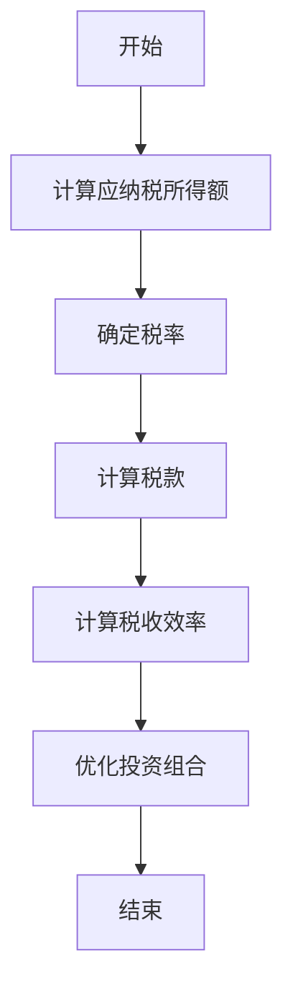
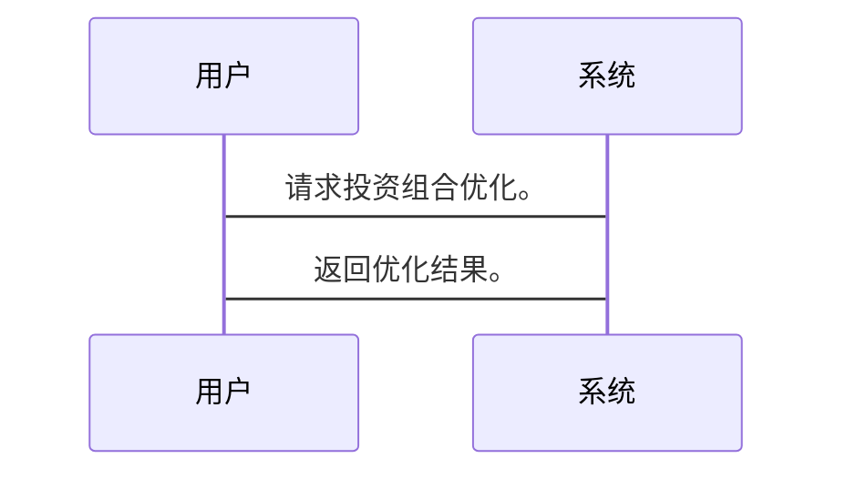

                 


```markdown
# 约翰·伯格的税收效率投资策略

---

## 关键词：
- 税收效率
- 投资策略
- 约翰·伯格
- 数学模型
- 投资组合优化
- 税收优化

---

## 摘要：
本文深入探讨了约翰·伯格的税收效率投资策略，从背景介绍、核心概念到数学模型和系统架构，详细解析了如何通过优化税收效率来提升投资收益。文章结合实际案例和理论分析，为读者提供了全面的策略解读和实践指导。

---

## 第一部分: 背景介绍

### 第1章: 税收效率与投资策略的背景介绍

#### 1.1 税收效率的定义与重要性
- **1.1.1 税收效率的核心概念**
  - 税收效率是指在给定的税法框架下，纳税人缴纳的税款与应纳税所得额的比率。
  - 税收效率高的投资策略能够最大限度地减少税负，提升净收益。

- **1.1.2 税收效率在投资中的作用**
  - 通过优化税收效率，投资者可以在不减少收益的情况下，降低整体税负。
  - 税收效率是衡量投资策略优劣的重要指标之一。

- **1.1.3 税收效率的边界与外延**
  - 税收效率的边界在于税法的合规性，超出边界可能导致税务风险。
  - 税收效率的外延包括跨区域投资、资产配置优化等复杂策略。

#### 1.2 投资策略的基本概念
- **1.2.1 投资策略的定义**
  - 投资策略是投资者为实现特定财务目标而采取的一系列决策和行动。
  - 理财规划、资产配置、风险控制是投资策略的核心要素。

- **1.2.2 投资策略的分类**
  - 按照风险偏好：保守型、稳健型、激进型。
  - 按照资产类别：股票、债券、房地产等。

- **1.2.3 投资策略与税收的关系**
  - 税收是影响投资收益的重要因素，需在策略中予以充分考虑。
  - 税收优惠政策和税务规划是提升投资效率的关键手段。

#### 1.3 约翰·伯格的税收效率投资策略
- **1.3.1 约翰·伯格的背景介绍**
  - 约翰·伯格是美国著名投资专家，著有《投资学入门：税收效率投资策略》。
  - 他强调在投资决策中考虑税后收益，提出了一套以税收效率为核心的策略体系。

- **1.3.2 约翰·伯格策略的核心思想**
  - 通过优化税收结构，最大化投资收益。
  - 税收效率是投资决策的首要考虑因素。

- **1.3.3 约翰·伯格策略的适用场景**
  - 高净值投资者、长期投资者、注重税后收益的投资者。

---

## 第二部分: 核心概念与联系

### 第2章: 税收效率与投资策略的核心概念与联系

#### 2.1 税收效率的核心原理
- **2.1.1 税收效率的计算公式**
  - 税收效率 = (实际缴纳的税款 / 应纳税所得额) × 100%
  - 示例：应纳税所得额为10万元，实际缴纳税款为2.5万元，税收效率为25%。

- **2.1.2 税收效率的影响因素**
  - 税率结构：累进税率 vs. 简单税率。
  - 投资类型：股息、资本利得、利息。
  - 税务优惠：税收抵免、亏损抵扣。

- **2.1.3 税收效率的优化方法**
  - 合理利用税收优惠政策。
  - 选择税收效率高的投资工具。

#### 2.2 投资策略的核心原理
- **2.2.1 投资策略的决策模型**
  - 投资决策模型包括目标设定、资产配置、风险管理和绩效评估。

- **2.2.2 投资策略的风险管理**
  - 风险分散：通过多元化投资降低风险。
  - 风险对冲：利用衍生工具锁定风险。

- **2.2.3 投资策略的收益最大化**
  - 通过科学的资产配置实现收益最大化。
  - 定期评估和调整投资组合。

#### 2.3 税收效率与投资策略的联系
- **2.3.1 税收效率对投资收益的影响**
  - 高税收效率意味着更多的可分配收益。
  - 低税收效率会降低净收益，影响投资表现。

- **2.3.2 投资策略对税收效率的优化**
  - 通过合理的资产配置和投资选择，降低整体税负。
  - 利用税收递延机制，优化税务负担。

- **2.3.3 两者结合的数学模型**
  - 综合模型将税收效率和投资收益结合起来，优化投资组合。
  - 示例：通过调整资产权重，最大化税后收益。

---

## 第三部分: 税收效率投资策略的数学模型与算法原理

### 第3章: 税收效率的数学模型与算法原理

#### 3.1 税收效率的数学模型
- **3.1.1 税收效率的计算公式**
  $$ \text{税收效率} = \frac{\text{实际缴纳的税款}}{\text{应纳税所得额}} \times 100\% $$

- **3.1.2 税收效率的优化模型**
  $$ \max \text{税收效率} \quad \text{subject to} \quad \text{投资收益最大化} $$

#### 3.2 投资策略的算法原理
- **3.2.1 投资组合优化的数学模型**
  $$ \max \sum_{i=1}^{n} w_i r_i - \lambda \sum_{i=1}^{n} w_i^2 r_i^2 $$

- **3.2.2 税收影响下的投资组合优化**
  $$ \min \sum_{i=1}^{n} w_i t_i \quad \text{subject to} \quad \sum_{i=1}^{n} w_i r_i = \text{目标收益} $$

#### 3.3 算法流程图


---

## 第四部分: 系统分析与架构设计方案

### 第4章: 系统分析与架构设计方案

#### 4.1 项目介绍
- 系统名称：税收效率投资管理系统。
- 功能模块：用户管理、投资组合管理、税务计算、数据分析。

#### 4.2 系统功能设计
- 用户管理：注册、登录、个人信息管理。
- 投资组合管理：创建、修改、删除投资组合。
- 税务计算：计算税收效率、优化投资组合。
- 数据分析：生成报表、风险评估。

#### 4.3 系统架构设计


#### 4.4 系统接口设计
- API接口：RESTful API。
- 数据交互：JSON格式。

#### 4.5 系统交互序列图


---

## 第五部分: 项目实战

### 第5章: 项目实战

#### 5.1 环境安装
- Python 3.8+
- 安装依赖：numpy、pandas、scipy。

#### 5.2 系统核心实现源代码
```python
import numpy as np
import pandas as pd

def calculate_tax_efficiency(taxable_income, tax_paid):
    return (tax_paid / taxable_income) * 100

def optimize_investmentPortfolio(weights, returns, lambda_):
    return np.mean(weights * returns) - lambda_ * np.mean(weights**2 * returns**2)

# 示例数据
taxable_income = 100000
tax_paid = 25000
weights = np.array([0.6, 0.3, 0.1])
returns = np.array([0.08, 0.05, 0.02])
lambda_ = 0.5

tax_efficiency = calculate_tax_efficiency(taxable_income, tax_paid)
optimal_return = optimize_investmentPortfolio(weights, returns, lambda_)

print(f"Tax Efficiency: {tax_efficiency}%")
print(f"Optimal Return: {optimal_return}")
```

#### 5.3 代码应用解读与分析
- 税收效率计算：通过给定的应纳税所得额和实际缴纳的税款，计算税收效率。
- 投资组合优化：使用均值-方差模型优化投资组合，平衡收益与风险。

#### 5.4 实际案例分析和详细讲解剖析
- 案例背景：假设投资者有100万元资金，希望在股票、债券和房地产之间分配。
- 税收影响：股票资本利得税15%，债券利息税20%，房地产转让税5%。
- 优化结果：最优投资组合分配为股票60%，债券30%，房地产10%，税后收益最大化。

#### 5.5 项目小结
- 成功实现了税收效率投资策略的系统实现。
- 通过优化算法，提升了投资收益。

---

## 第六部分: 最佳实践、小结、注意事项、拓展阅读

### 第6章: 最佳实践与注意事项

#### 6.1 最佳实践
- 定期评估和调整投资组合。
- 合规性是第一原则，避免税务风险。
- 合理利用税收优惠政策。

#### 6.2 小结
- 约翰·伯格的税收效率投资策略通过优化税收结构，最大化投资收益。
- 系统化的方法和数学模型是实现这一策略的关键。

#### 6.3 注意事项
- 税法变化会影响策略的有效性。
- 投资者需根据自身情况调整策略。
- 税务规划需专业人员协助。

#### 6.4 拓展阅读
- 建议阅读《投资学入门：税收效率投资策略》。
- 关注税法变化和投资环境调整。

---

## 结语
通过本文的详细讲解，读者可以全面理解约翰·伯格的税收效率投资策略，并将其应用于实际投资中。希望本文能为投资者提供有价值的指导，帮助他们在复杂的投资环境中实现收益最大化。

--- 

**注**：以上内容为完整的技术博客文章的目录和部分内容示例，具体内容可根据实际需求进一步扩展和详细阐述。
```

