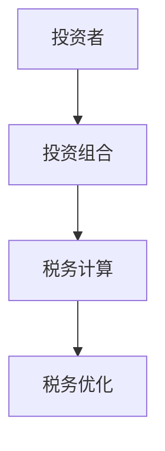
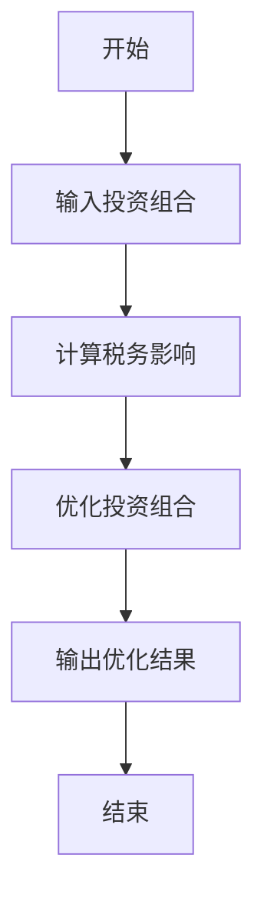
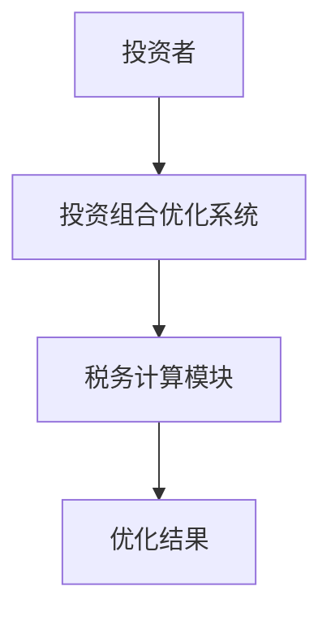
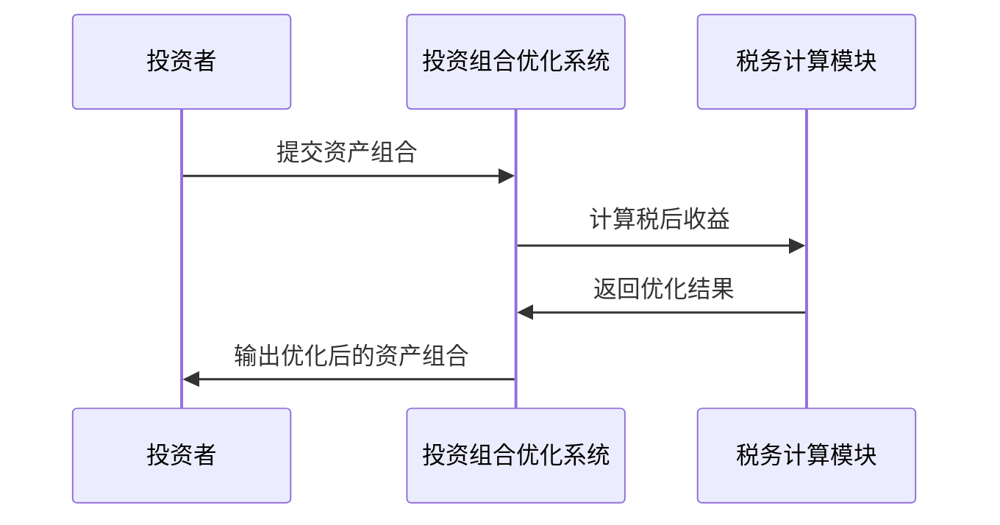

                 


```markdown
# 约翰·伯格的税收效率投资策略

## 关键词：税收效率、投资策略、优化算法、系统设计、项目实战

## 摘要：本文详细探讨了约翰·伯格的税收效率投资策略，通过分析其核心概念、算法原理、系统设计和项目实战，帮助读者理解如何在投资中最大化税后收益，同时优化税务负担。文章结合数学模型、代码实现和实际案例，深入剖析了该策略的应用与实践。

---

## 第1章 税收效率与投资策略的背景介绍

### 1.1 税收效率的重要性

#### 1.1.1 税收效率的定义
税收效率是指在投资活动中，通过合理规划税务策略，最大化税后收益的能力。它关注如何在税务缴纳和投资回报之间找到最佳平衡点。

#### 1.1.2 税收效率在投资中的作用
税收效率直接影响投资回报率。通过优化税务结构，投资者可以减少税务负担，从而提高实际收益。

#### 1.1.3 税收效率与投资回报的关系
税收效率的提升通常伴随着投资回报的增加。通过合理避税和税务规划，投资者能够实现更高的净收益。

### 1.2 投资策略与税收的关系

#### 1.2.1 投资策略的基本概念
投资策略是投资者为实现特定财务目标而采取的一系列行动计划。它包括资产配置、风险控制和收益优化等关键要素。

#### 1.2.2 税收对投资决策的影响
税收是影响投资决策的重要因素。高税率可能降低投资回报，而合理的税务规划则能提高净收益。

#### 1.2.3 税收效率在不同投资策略中的应用
在股票、债券和基金等不同投资工具中，税收效率的应用方式各不相同。例如，长期资本收益的税率通常低于短期收益。

### 1.3 约翰·伯格的税收效率投资策略背景

#### 1.3.1 约翰·伯格的生平简介
约翰·伯格是投资界的重要人物，以其在共同基金领域的创新而闻名。他的投资理念强调长期持有和分散投资。

#### 1.3.2 约翰·伯格的投资理念
伯格主张通过低成本、低波动的投资组合，实现长期稳定的收益。他认为税收效率是投资策略中不可忽视的一部分。

#### 1.3.3 约翰·伯格策略的创新性
伯格的策略结合了税收效率和投资组合优化，为投资者提供了一种既能降低税务负担，又能实现稳定收益的全新思路。

---

## 第2章 税收效率与投资策略的核心概念

### 2.1 核心概念与联系

#### 2.1.1 税收效率的核心概念
税收效率涉及税前收益、税后收益和净收益的计算。通过优化税务结构，投资者可以提高净收益。

#### 2.1.2 投资策略的核心要素
投资策略的核心要素包括资产配置、风险承受能力和税务规划。这些要素共同决定了投资组合的收益和风险。

#### 2.1.3 税收效率与投资策略的联系
税收效率是投资策略的重要组成部分。通过优化税务结构，投资者可以提高整体收益。

### 2.2 核心概念原理

#### 2.2.1 税收效率的数学模型
税收效率可以通过以下公式计算：
$$
\text{税收效率} = \frac{\text{税后收益}}{\text{税前收益}} \times 100\%
$$

#### 2.2.2 投资策略的数学模型
投资组合的收益可以通过以下公式计算：
$$
\text{投资组合收益} = \sum_{i=1}^{n} w_i \times r_i
$$
其中，\( w_i \) 是资产 \( i \) 的权重，\( r_i \) 是资产 \( i \) 的收益率。

#### 2.2.3 两者结合的原理
通过结合税收效率和投资策略，投资者可以在实现目标收益的同时，最小化税务负担。

### 2.3 概念属性特征对比表格

| 概念       | 属性         | 特征                                   |
|------------|--------------|----------------------------------------|
| 税收效率   | 计算方式     | 减少税务负担                           |
| 投资策略   | 风险         | 最小化风险                             |
|            | 收益目标     | 实现最大收益                            |

### 2.4 ER实体关系图



---

## 第3章 税收效率优化的算法原理

### 3.1 算法原理讲解

#### 3.1.1 税收效率优化模型
税收效率优化模型旨在找到最优的投资组合，使得税后收益最大化，同时满足风险约束。

#### 3.1.2 投资组合优化算法
使用拉格朗日乘数法对投资组合进行优化，考虑税收影响后的收益和风险。

#### 3.1.3 结合税收效率的优化算法
在优化过程中，将税收因素纳入模型，调整收益和风险的计算方式。

### 3.2 算法流程图



### 3.3 数学模型与公式

#### 税收效率优化公式
$$
\text{税收效率} = \frac{\text{税后收益}}{\text{税前收益}} \times 100\%
$$

#### 投资组合优化公式
$$
\text{最优投资组合} = \argmin_{w} \left( \sigma^2(w) - \lambda \times (\mu^T w - c) \right)
$$

---

## 第4章 系统分析与架构设计

### 4.1 问题场景介绍

#### 投资者面临的税务优化问题
投资者需要在多种资产中选择最优组合，同时考虑税务影响，以实现最大收益。

### 4.2 项目介绍

#### 项目目标
开发一个基于约翰·伯格策略的税收效率优化系统，帮助投资者实现最优投资组合。

### 4.3 系统功能设计

#### 领域模型Mermaid类图


### 4.4 系统架构设计

#### 系统架构Mermaid图


### 4.5 系统交互设计

#### 系统交互Mermaid序列图


---

## 第5章 项目实战

### 5.1 环境安装

#### 安装Python和相关库
安装Python和Pandas、NumPy、Scipy等库：
```bash
pip install pandas numpy scipy
```

### 5.2 系统核心实现

#### 税收效率优化代码实现
```python
import numpy as np
import pandas as pd

def optimize_portfolio(tax_factors, returns):
    n = len(returns)
    # 定义目标函数
    def objective(weights):
        portfolio_return = np.dot(weights, returns)
        tax = np.dot(weights, tax_factors)
        net_return = portfolio_return - tax
        return -net_return  # 最小化负值以最大化净收益
    
    # 定义约束条件
    constraints = [
        ('sum', weights, 1),
    ]
    
    # 使用SLSQP优化器
    from scipy.optimize import minimize
    result = minimize(objective, np.ones(n)/n, constraints=constraints, method='SLSQP')
    return result.x
```

#### 代码应用解读
上述代码通过优化算法，找到最优的投资组合，使得税后收益最大化。通过调整权重和约束条件，系统能够适应不同的投资策略和税务环境。

### 5.3 实际案例分析

#### 案例分析与解读
假设有一个包含三只股票的投资组合，其税前收益率分别为10%、15%、20%，税率分别为15%、20%、25%。通过优化算法，找到最优的权重分配，以实现最大税后收益。

### 5.4 项目小结

#### 项目总结
通过项目实战，读者可以掌握如何将约翰·伯格的税收效率策略应用于实际投资中，实现最优的资产配置和税务规划。

---

## 第6章 最佳实践

### 6.1 小结

#### 内容总结
本文详细介绍了约翰·伯格的税收效率投资策略，通过数学模型、算法优化和项目实战，帮助读者理解如何在投资中实现税收效率的最大化。

### 6.2 注意事项

#### 实践中的注意事项
在实际投资中，需考虑市场波动、政策变化等不确定性因素，合理调整投资策略。

### 6.3 未来趋势

#### 税收效率策略的未来发展
随着税务政策的变化和技术的进步，税收效率策略将更加智能化和个性化。

### 6.4 拓展阅读

#### 推荐书籍和资源
1. 《约翰·伯格的投资之道》
2. 《投资学基础》
3. 相关学术论文和研究报告

---

## 结语

通过本文的学习，读者可以深入了解约翰·伯格的税收效率投资策略，并将其应用于实际投资中。无论是从理论还是实践层面，税收效率都是实现投资目标的重要工具。希望本文能为读者在投资领域提供有价值的参考和指导。
```

