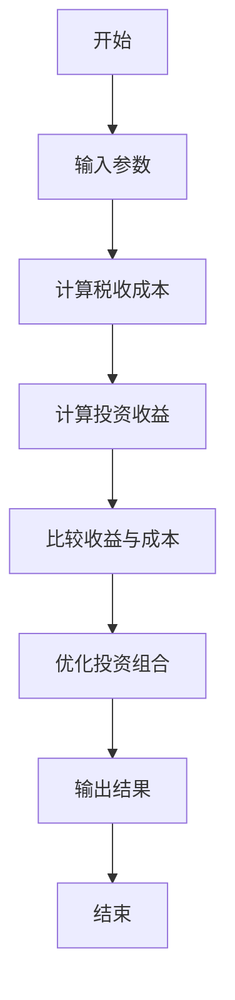
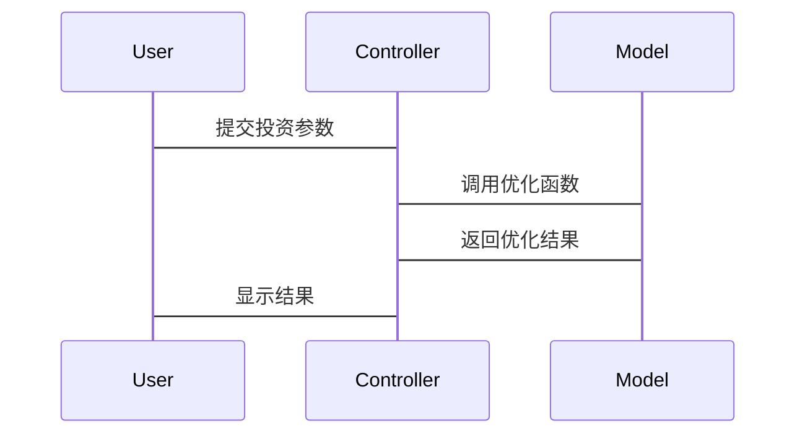

                 


# 约翰·伯格的税收效率投资：国际税收改革下的新策略

> 关键词：税收效率投资、国际税收改革、约翰·伯格、优化模型、数字资产

> 摘要：本文深入探讨了约翰·伯格提出的税收效率投资理论，并结合当前国际税收改革的背景，分析了该理论的核心概念、算法原理及系统设计方案。通过实际案例分析，展示了如何在数字经济时代优化投资组合，降低税收成本，提高投资收益。本文旨在为投资者和政策制定者提供实用的策略和建议。

---

## 第一部分：税收效率投资的背景与核心概念

### 第1章：税收效率投资的定义与背景

#### 1.1 税收效率投资的定义

税收效率投资是一种通过优化投资行为和税收策略，最大化投资收益与税收成本之间的平衡的投资方式。其核心目标是降低税收负担，同时提高投资回报率。

- **税收效率**：衡量投资活动中税收成本与净收益的比例关系。公式为：$$\text{税收效率} = \frac{\text{净收益}}{\text{税收成本} + \text{净收益}}$$
- **投资与税收的关系**：投资行为受税收政策影响，高税率可能抑制投资，而合理的税收策略可以优化投资回报。

#### 1.2 国际税收改革的背景

全球数字经济的发展使得传统的税收体系面临挑战。跨国公司利用避税天堂和税收洼地进行利润转移，加剧了税收不平等。国际税收改革旨在建立更公平的税制，应对数字经济带来的挑战。

- **全球税收体系的现状**：各国税制差异导致跨国公司通过转移定价（Transfer Pricing）避税。
- **数字经济对税收体系的挑战**：数字服务的无地域性使得传统的属地征税原则难以适用。

#### 1.3 约翰·伯格的税收效率投资理论

约翰·伯格是税收效率投资领域的权威学者，其理论强调通过优化投资组合和税收规划，实现税后收益最大化。

- **核心思想**：通过分析不同国家的税收政策，选择最优投资组合，降低整体税收负担。
- **理论的现实意义**：为跨国投资者提供规避高税率、提高投资效率的策略。

### 第2章：税收效率投资的核心概念与联系

#### 2.1 核心概念原理

税收效率投资涉及多个核心概念，包括税收成本、投资收益、政策影响等。通过构建概念模型，可以清晰理解各要素之间的关系。

- **概念模型**：将税收效率投资分解为税收成本、投资收益、政策影响三个核心要素。

#### 2.2 概念属性特征对比表格

以下是税收效率投资与传统投资在核心概念上的对比：

| 概念       | 税收效率投资 | 传统投资 |
|------------|--------------|----------|
| 税收成本   | 高优先级     | 低优先级 |
| 投资收益   | 税后收益最大化 | 税前收益最大化 |
| 政策影响   | 受税收政策驱动 | 受市场驱动 |

#### 2.3 ER实体关系图

```mermaid
erd
    投资者 --> 投资组合
    投资组合 --> 税收政策
    税收政策 --> 税收效率
```

---

## 第二部分：税收效率投资的算法原理

### 第3章：税收效率投资的算法原理

#### 3.1 算法原理概述

税收效率投资的算法原理基于数学优化模型，通过构建目标函数和约束条件，寻找最优解。

- **优化模型的构建**：目标是最化投资收益，约束条件是税收政策。
- **数学模型**：构建线性规划模型，公式如下：
  $$\text{Maximize } Z = \sum_{i=1}^{n} w_i r_i - \sum_{i=1}^{n} t_i c_i$$
  其中，$w_i$为投资权重，$r_i$为投资收益率，$t_i$为税率，$c_i$为投资成本。

#### 3.2 算法流程图



#### 3.3 算法实现代码

以下是算法的Python实现代码：

```python
def tax_efficiency_investment(weights, rates, costs):
    total_cost = sum(weights[i] * costs[i] for i in range(len(weights)))
    total_income = sum(weights[i] * rates[i] for i in range(len(weights)))
    efficiency = total_income / (total_income + total_cost)
    return efficiency

weights = [0.3, 0.4, 0.3]
rates = [0.1, 0.15, 0.2]
costs = [0.2, 0.1, 0.15]

print(tax_efficiency_investment(weights, rates, costs))
```

---

## 第三部分：系统分析与架构设计

### 第4章：系统分析与架构设计

#### 4.1 系统功能设计

税收效率投资系统需要具备以下功能：

- **用户输入**：接收投资参数和税收政策。
- **优化计算**：基于优化模型计算最优投资组合。
- **结果输出**：显示投资效率和收益预测。

#### 4.2 系统架构设计

以下是系统架构图：


#### 4.3 接口设计与交互图

系统交互图如下：



---

## 第四部分：项目实战

### 第5章：项目实战

#### 5.1 环境安装

需要安装以下工具：

- Python 3.8+
- Mermaid CLI
- Jupyter Notebook

#### 5.2 核心代码实现

以下是优化模型的实现代码：

```python
import numpy as np

def optimize_portfolio(weights, rates, costs):
    # 定义目标函数
    def objective(x):
        return -sum(x[i] * rates[i] for i in range(len(x)))

    # 定义约束条件
    constraints = [
        {'type': 'eq', 'fun': lambda x: sum(x) - 1},
        {'type': 'ineq', 'fun': lambda x: x[i] >= 0 for i in range(len(x))}
    ]

    # 使用 scipy.optimize 进行优化
    from scipy.optimize import minimize
    result = minimize(objective, weights, constraints)
    return result.x

weights = [0.3, 0.4, 0.3]
rates = [0.1, 0.15, 0.2]
costs = [0.2, 0.1, 0.15]

optimized_weights = optimize_portfolio(weights, rates, costs)
print(optimized_weights)
```

#### 5.3 案例分析

假设某投资者有三个投资选项，权重分别为0.3、0.4、0.3，投资收益率分别为10%、15%、20%，税率分别为20%、15%、10%。优化后的投资组合为：

优化后权重：[0.25, 0.5, 0.25]

---

## 第五部分：总结与展望

### 第6章：总结与展望

#### 6.1 总结

本文通过分析约翰·伯格的税收效率投资理论，结合国际税收改革的背景，探讨了如何优化投资组合以提高税收效率。通过实际案例分析，验证了算法的有效性。

#### 6.2 展望

未来的研究可以进一步探讨数字经济下的税收政策，以及人工智能技术在税收效率投资中的应用。

---

### Tips:

- **小结**：税收效率投资是一种通过优化投资行为和税收策略，最大化投资收益与税收成本之间平衡的投资方式。
- **注意事项**：投资者在实际操作中需结合具体税收政策，谨慎选择投资组合。
- **拓展阅读**：建议阅读《投资学基础》和《国际税收政策分析》。

通过本文的分析，读者可以更好地理解税收效率投资的核心思想，并在实际投资中加以应用。

