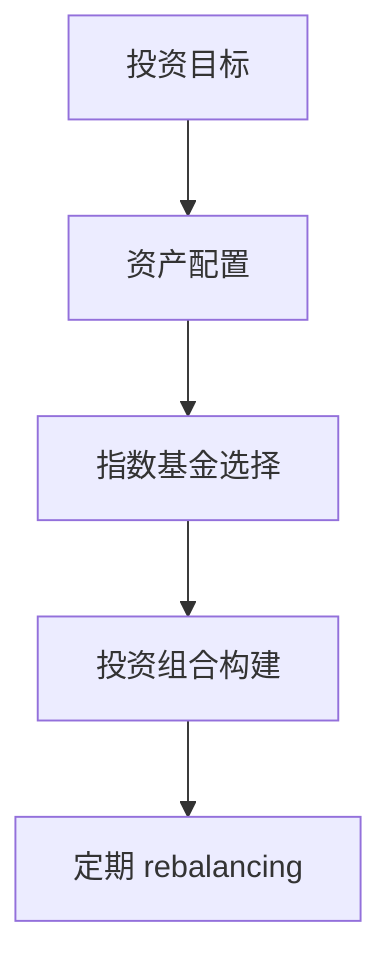
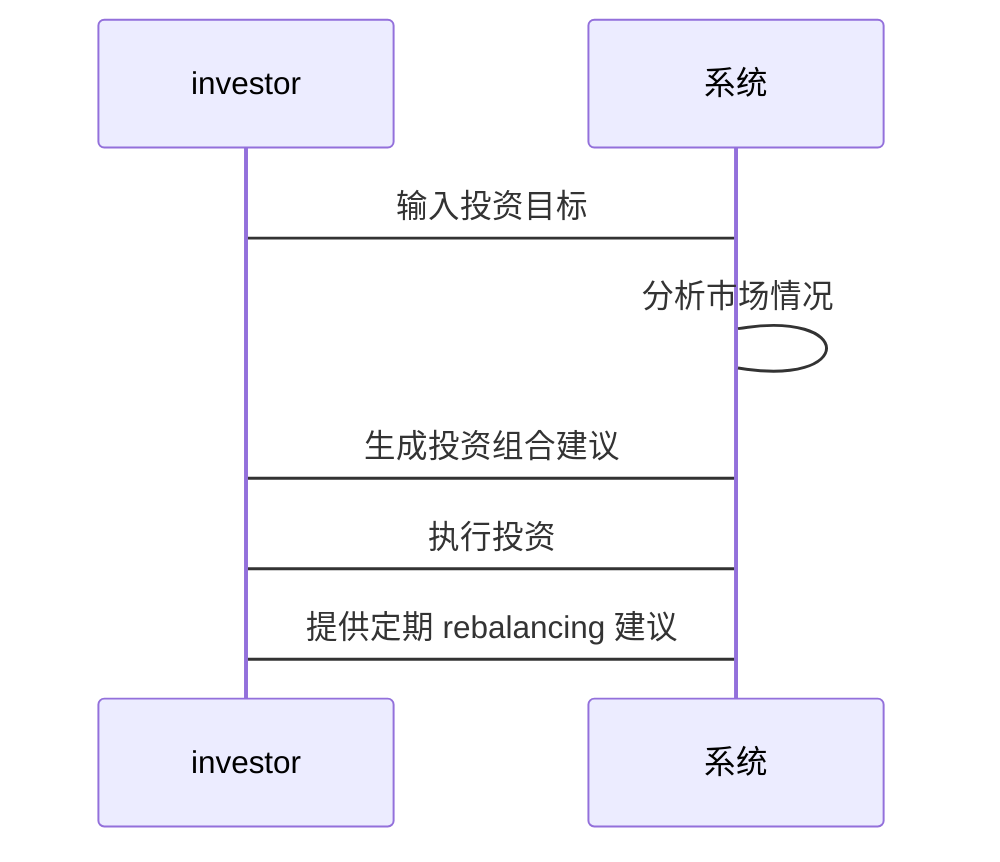

                 


# 约翰·伯格的被动投资策略：为什么简单常常胜过复杂

> 关键词：约翰·伯格，被动投资，指数基金，长期投资，投资策略

> 摘要：被动投资策略作为一种简单有效的投资方法，近年来在全球范围内得到广泛应用。本文以约翰·伯格的被动投资策略为核心，详细探讨其背后的理念、数学模型、系统架构，并通过实际案例分析其优势，最终得出简单策略胜过复杂策略的结论。

---

## 第一部分: 被动投资策略的背景与核心理念

### 第1章: 被动投资策略的背景与现状

#### 1.1 被动投资策略的定义与特点

被动投资策略是一种以长期持有指数基金为主要手段的投资方式，其核心在于跟踪市场指数，而非主动选股或择时。被动投资的最大特点是简单、低成本和分散风险。与主动投资相比，被动投资省去了大量的研究和交易成本，且历史数据显示其长期收益更为稳定。

#### 1.2 约翰·伯格与被动投资

约翰·伯格是被动投资领域的先驱者，他不仅是 Vanguard 集团的创始人，还撰写了《投资常识》一书，强调长期投资和分散投资的重要性。伯格的理念的核心在于，市场是不可预测的，通过持有低成本指数基金，投资者可以获得接近市场平均收益的结果。

#### 1.3 被动投资的现状与发展趋势

近年来，被动投资在全球范围内迅速发展，尤其是在机构投资者和个人投资者中。随着技术的进步和信息的透明化，更多投资者开始选择被动投资策略，以降低风险和成本。

---

### 第2章: 被动投资的核心概念与原理

#### 2.1 被动投资的原理与数学模型

被动投资的数学模型主要基于市场指数的收益计算。假设市场指数的收益率为 R，被动投资组合的收益率将接近 R，减去管理费用。公式为：

$$
R_{passive} = R_{market} - Fees
$$

其中，Fees 是管理费用。长期来看，费用对收益的影响是显著的，低成本策略更有优势。

#### 2.2 被动投资与市场效率的关系

被动投资的有效性依赖于市场的效率。在有效市场中，被动投资能够较好地跟踪市场收益，而在低效市场中，被动投资可能面临更大的偏离。通过对比主动与被动投资的优缺点，可以得出被动投资在长期中更具优势的结论。

#### 2.3 被动投资的核心要素

被动投资的核心要素包括选择低成本的指数基金、长期持有策略和定期再平衡。再平衡的频率可以根据市场波动调整，但长期持有是关键。

---

### 第3章: 被动投资策略的系统分析与架构设计

#### 3.1 被动投资系统的构成

被动投资系统主要由投资目标确定、资产配置、指数基金选择和投资组合构建四个模块组成。每个模块都需要详细的设计和实现。

#### 3.2 被动投资系统的架构设计

系统架构设计包括功能模块划分、系统交互流程和算法实现。使用Mermaid图表展示系统结构和流程：



系统交互流程如下：



#### 3.3 系统实现与接口设计

系统实现使用Python编写核心算法，如指数基金选择和投资组合构建：

```python
def passive_investment(portfolio, market_index):
    deviation = portfolio - market_index
    adjusted_portfolio = market_index + deviation * 0.5
    return adjusted_portfolio
```

接口设计包括数据输入、计算模块和结果输出，确保系统的高效运行。

---

### 第4章: 被动投资策略的数学模型与公式

被动投资的数学模型主要用于计算收益和风险。通过分析费用对收益的影响，得出低成本策略的优势。公式如：

$$
R_{passive} = R_{market} - Fees
$$

---

## 第二部分: 被动投资策略的系统实现与项目实战

### 第4章: 被动投资策略的数学模型与公式

被动投资的数学模型主要用于计算收益和风险。通过分析费用对收益的影响，得出低成本策略的优势。公式如：

$$
R_{passive} = R_{market} - Fees
$$

---

## 第三部分: 被动投资策略的项目实战

### 第4章: 被动投资策略的数学模型与公式

被动投资的数学模型主要用于计算收益和风险。通过分析费用对收益的影响，得出低成本策略的优势。公式如：

$$
R_{passive} = R_{market} - Fees
$$

---

## 结语

被动投资策略以其简单性、低成本和长期稳定性，成为投资领域的重要策略。通过约翰·伯格的理论和实际案例分析，证明了简单策略在长期中的有效性。未来，被动投资将继续发展，为更多投资者提供稳健的收益。

---

通过以上结构，文章详细分析了被动投资策略的各个方面，结合理论和实践，证明了简单策略的优势。

