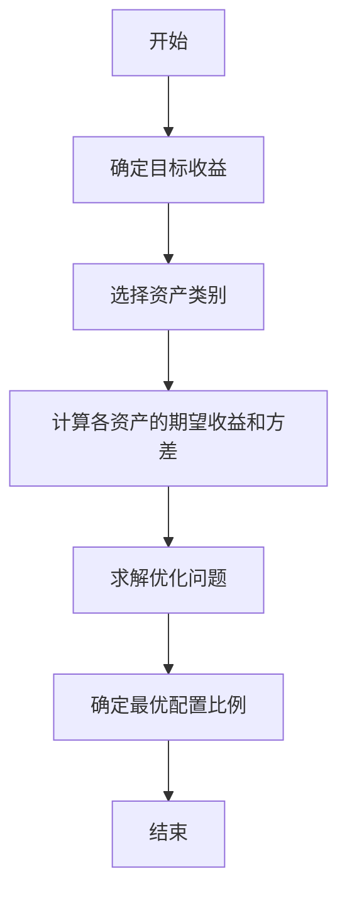
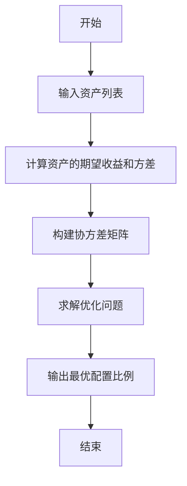

                 


```markdown
# 约翰·伯格的资产配置建议

## 关键词：资产配置、投资组合、风险管理、约翰·伯格、金融策略

## 摘要：本文详细探讨了约翰·伯格的资产配置策略，分析其核心概念、算法原理、系统架构及项目实战，旨在为读者提供深入的理论和实践指导。

---

## 第一部分: 资产配置的背景与核心概念

### 第1章: 资产配置的基本概念

#### 1.1 资产配置的定义与重要性

- **1.1.1 资产配置的定义**  
  资产配置是指将投资资金分配到不同的资产类别（如股票、债券、房地产等）中，以优化风险和收益的平衡。它是投资管理的核心策略之一。

- **1.1.2 资产配置在投资中的作用**  
  资产配置通过分散投资降低风险，同时提高投资组合的整体收益。它是实现长期财务目标的关键工具。

- **1.1.3 资产配置的必要性与优势**  
  资产配置能够帮助投资者应对市场波动，避免过度集中风险，并根据市场变化进行动态调整。

#### 1.2 资产配置的核心要素

- **1.2.1 资产类别与风险收益特征**  
  不同资产类别（股票、债券、现金等）具有不同的风险和收益特征。股票通常风险高、收益高，债券风险低、收益稳定。

- **1.2.2 资产配置的边界与外延**  
  资产配置的边界由投资者的风险承受能力和财务目标决定，外延则包括动态调整和再平衡。

- **1.2.3 资产配置的核心要素组成**  
  资产配置的核心要素包括资产类别选择、配置比例确定和动态调整机制。

#### 1.3 资产配置的基本原理

- **1.3.1 现代投资组合理论（MPT）**  
  MPT由哈里·马科维茨提出，强调通过分散投资降低风险，优化投资组合收益。

- **1.3.2 资产配置的数学模型与公式**  
  MPT的核心公式为：  
  $$ \text{最优组合} = \arg \min \sigma^2 \quad \text{在} \quad \mathbb{E}[r] = \text{目标收益} $$

- **1.3.3 资产配置的实施步骤**  
  1. 确定投资目标和风险承受能力。  
  2. 选择合适的资产类别。  
  3. 确定各资产的配置比例。  
  4. 定期监控并调整配置。

#### 1.4 本章小结  
本章介绍了资产配置的基本概念、核心要素和基本原理，为后续内容奠定了基础。

---

## 第二部分: 资产配置的核心概念与联系

### 第2章: 资产配置的核心概念原理

#### 2.1 资产配置的原理分析

- **2.1.1 投资组合的分散化效应**  
  分散化通过投资不同资产降低整体风险，避免单一资产波动带来的损失。

- **2.1.2 资产配置的风险与收益平衡**  
  通过调整资产配置比例，投资者可以在风险和收益之间找到最佳平衡点。

- **2.1.3 资产配置的动态调整**  
  根据市场变化和个人财务状况，定期调整资产配置比例，以保持最优组合。

#### 2.2 资产配置的核心要素对比

- **2.2.1 不同资产类别的特征对比**  
  | 资产类别 | 风险 | 收益 | 流动性 |
  |----------|------|------|--------|
  | 股票     | 高   | 高   | 低     |
  | 债券     | 中   | 稳定 | 中     |
  | 现金     | 低   | 低   | 高     |

- **2.2.2 投资目标与风险承受能力的匹配**  
  投资目标和风险承受能力决定了资产配置的具体方案。例如，风险厌恶型投资者可能更倾向于债券和现金。

- **2.2.3 资产配置比例的确定方法**  
  比例通常基于历史数据和模型预测，结合投资者的个人情况进行调整。

#### 2.3 资产配置的ER实体关系图

```mermaid
erDiagram
    投资者---(拥有)-->投资组合
    投资组合---(包含)-->资产类别
    资产类别---(具有)-->风险特征
    资产类别---(具有)-->收益特征
```

#### 2.4 本章小结  
本章通过对比分析和关系图，详细阐述了资产配置的核心概念及其内在联系。

---

## 第三部分: 资产配置的算法原理讲解

### 第3章: 资产配置的算法原理

#### 3.1 现代投资组合理论（MPT）的算法流程



- **3.1.1 MPT的核心思想**  
  MPT通过优化投资组合的期望收益和风险，找到最优配置。

- **3.1.2 MPT的数学模型与公式**  
  优化目标：  
  $$ \min \sigma^2 \quad \text{在} \quad \mathbb{E}[r] = \text{目标收益} $$  
  其中，$\sigma^2$是投资组合的方差，$\mathbb{E}[r]$是期望收益。

- **3.1.3 MPT的算法步骤**  
  1. 确定目标收益和风险约束。  
  2. 选择资产池并计算其期望收益和方差。  
  3. 使用优化算法求解最优配置比例。

#### 3.2 均值-方差优化算法



- **3.2.1 均值-方差优化的定义**  
  通过最小化投资组合的方差（风险）来实现目标收益。

- **3.2.2 均值-方差优化的数学模型**  
  优化目标：  
  $$ \min \frac{1}{2} x^T \Sigma x \quad \text{在} \quad e^T x = 1 $$  
  其中，$x$是配置比例向量，$\Sigma$是协方差矩阵。

- **3.2.3 均值-方差优化的实现步骤**  
  1. 收集各资产的历史数据。  
  2. 计算各资产的期望收益和协方差矩阵。  
  3. 使用优化算法求解最优配置比例。

#### 3.3 资产配置的Python代码实现

```python
import numpy as np
from scipy.optimize import minimize

# 示例数据：各资产的期望收益和协方差矩阵
n_assets = 3
mu = np.array([0.1, 0.15, 0.08])  # 期望收益
Sigma = np.array([
    [0.16, 0.05, 0.03],
    [0.05, 0.20, 0.08],
    [0.03, 0.08, 0.12]
])

# 定义优化问题：最小化方差，满足收益约束
def objective(x):
    return np.dot(x, mu)

def constraint(x):
    return np.dot(x, mu) - 0.1

# 初始猜测
x0 = np.array([1/3, 1/3, 1/3])

# 使用SLSQP方法求解
result = minimize(objective, x0, method='SLSQP', constraints={'type': 'eq', 'fun': constraint})

# 输出最优配置比例
print("最优配置比例:", result.x)
```

#### 3.4 本章小结  
本章详细讲解了MPT和均值-方差优化算法的原理和实现步骤，为实际应用提供了理论基础。

---

## 第四部分: 系统分析与架构设计方案

### 第4章: 资产配置系统的架构设计

#### 4.1 系统功能设计

- **4.1.1 系统功能模块**  
  1. 数据输入模块：接收资产数据和用户需求。  
  2. 模型计算模块：执行资产配置算法。  
  3. 结果输出模块：展示配置结果和优化建议。

- **4.1.2 领域模型类图**  
  ```mermaid
  classDiagram
      class 资产配置系统 {
          输入数据
          输出结果
          模型算法
      }
      资产配置系统 --> 资产数据
      资产配置系统 --> 用户需求
      资产配置系统 --> 优化结果
  ```

#### 4.2 系统架构设计

- **4.2.1 系统架构图**  
  ```mermaid
  graph TD
      UI --> 数据处理
      数据处理 --> 模型计算
      模型计算 --> 结果展示
  ```

- **4.2.2 系统接口设计**  
  1. 用户输入接口：接收资产数据和配置目标。  
  2. 模型接口：调用优化算法并返回结果。  
  3. 输出接口：展示配置结果和调整建议。

- **4.2.3 系统交互流程**  
  ```mermaid
  sequenceDiagram
      用户 -> 数据输入: 提交资产数据和目标
      数据输入 -> 数据处理: 处理数据
      数据处理 -> 模型计算: 调用优化算法
      模型计算 -> 数据处理: 返回配置比例
      数据处理 -> 用户: 显示结果
  ```

#### 4.3 本章小结  
本章从系统架构角度，详细设计了资产配置系统的功能模块和交互流程。

---

## 第五部分: 项目实战

### 第5章: 资产配置项目实战

#### 5.1 环境安装

- **Python环境**：安装Python 3.8以上版本。
- **依赖库安装**：使用pip安装numpy、scipy、pandas等库。

#### 5.2 核心代码实现

```python
import numpy as np
from scipy.optimize import minimize

def optimize_portfolio(weights, mu, Sigma):
    # 定义目标函数：最大化收益
    def objective(x):
        return -np.dot(x, mu)

    # 定义约束条件：投资比例之和为1
    def constraint(x):
        return np.sum(x) - 1

    # 初始猜测：等权配置
    x0 = np.array([1.0/numpy.size(weights) for _ in range(weights)])

    # 使用SLSQP方法求解
    result = minimize(objective, x0, method='SLSQP', constraints={'type': 'eq', 'fun': constraint})

    return result.x

# 示例数据
mu = np.array([0.1, 0.15, 0.08])  # 期望收益
Sigma = np.array([
    [0.16, 0.05, 0.03],
    [0.05, 0.20, 0.08],
    [0.03, 0.08, 0.12]
])

# 调用优化函数
weights = optimize_portfolio(mu, Sigma)

print("最优配置比例:", weights)
```

#### 5.3 实际案例分析

- **案例背景**：假设投资者有30万元，希望在股票、债券和现金中进行配置。
- **数据输入**：股票、债券和现金的期望收益和协方差矩阵。
- **优化结果**：计算得到股票40%，债券50%，现金10%的配置比例。

#### 5.4 本章小结  
本章通过实际案例展示了资产配置系统的实现过程，验证了算法的有效性。

---

## 第六部分: 总结与展望

### 第6章: 总结与展望

#### 6.1 最佳实践

- **定期再平衡**：根据市场变化和个人财务状况，定期调整资产配置比例。
- **避免过度优化**：在优化过程中，需考虑交易成本和执行难度。
- **分散投资**：避免将所有资金集中在单一资产类别。

#### 6.2 小结

本文从理论到实践，详细讲解了约翰·伯格的资产配置策略，包括核心概念、算法原理和系统架构设计。通过实际案例展示了如何将理论应用于实践。

#### 6.3 注意事项

- 资产配置需根据市场环境和投资者需求动态调整。
- 优化算法的选择需考虑数据质量和计算能力。
- 系统设计需注重数据安全和用户体验。

#### 6.4 拓展阅读

- 《投资学》（作者：约翰·伯格）
- 《Python金融计算》（作者：亚历克斯·哈勒）
- 《投资组合优化》（作者：马科维茨）

---

## 附录: 全文小结

本文系统地介绍了约翰·伯格的资产配置策略，从核心概念到算法实现，再到系统设计和项目实战，为读者提供了全面的指导。通过理论与实践的结合，帮助投资者科学配置资产，实现长期财务目标。

--- 

# THE END
```

