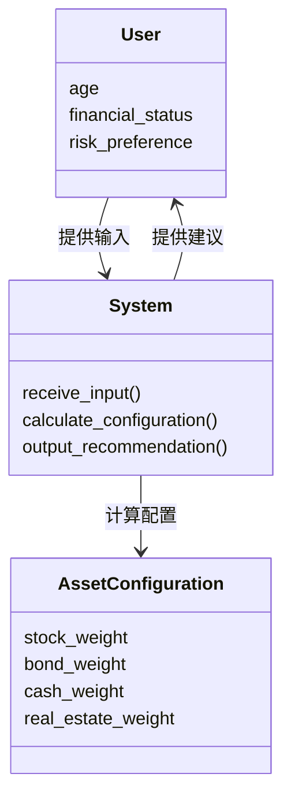
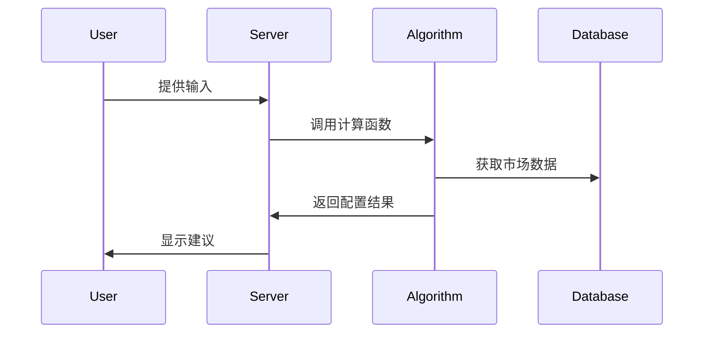

                 


# 约翰·伯格的资产配置建议：年龄与风险的平衡

---

## 关键词：
资产配置，投资组合，风险管理，年龄因素，约翰·伯格，动态调整，风险管理策略

---

## 摘要：
本文深入探讨了约翰·伯格提出的资产配置策略，特别是如何根据年龄和风险承受能力来平衡投资组合。通过分析现代投资组合理论、风险与收益的权衡，以及生命周期理论，本文为读者提供了从理论到实践的全面指导。结合实际案例和系统设计，文章详细阐述了如何构建和优化投资组合，帮助读者在不同的人生阶段做出明智的财务决策。

---

# 第一部分: 资产配置的核心概念与背景

## 第1章: 资产配置的背景与重要性

### 1.1 资产配置的基本概念

#### 1.1.1 资产配置的定义
资产配置是指将资金分配到不同资产类别（如股票、债券、房地产等）以实现投资目标的过程。其核心在于通过分散投资来降低风险并提高收益。

#### 1.1.2 资产配置的重要性
- **风险分散**：通过投资不同类型资产，降低单一资产带来的风险。
- **收益最大化**：根据不同资产的收益特征，优化整体投资组合的回报。
- **动态调整**：根据市场变化和个人情况调整资产配置。

#### 1.1.3 资产配置的核心要素
- **资产类别**：股票、债券、现金、房地产等。
- **权重分配**：各类资产在投资组合中的比例。
- **时间跨度**：投资的期限长短影响配置策略。

### 1.2 约翰·伯格的资产配置理念

#### 1.2.1 约翰·伯格的背景介绍
约翰·伯格是著名的投资专家，以其在资产配置领域的研究闻名。他的理论强调长期投资和风险管理。

#### 1.2.2 约翰·伯格的资产配置理论
伯格认为，资产配置是投资成功的关键，特别是要根据个人的年龄和风险承受能力进行动态调整。

#### 1.2.3 年龄与风险的平衡关系
- **年轻阶段**：高风险资产比例较高，追求高收益。
- **中年阶段**：平衡型配置，兼顾风险和收益。
- **老年阶段**：保守配置，注重本金安全。

### 1.3 资产配置的常见误区

#### 1.3.1 过度集中投资的风险
集中投资可能导致重大损失，分散投资可以降低风险。

#### 1.3.2 忽略风险承受能力的后果
不考虑自身风险承受能力可能导致投资决策失误。

#### 1.3.3 资产配置的动态调整
忽视市场变化和自身情况的动态调整可能导致投资组合表现不佳。

---

## 第2章: 现代投资组合理论

### 2.1 投资组合理论的基本原理

#### 2.1.1 投资组合理论的起源
由Harry Markowitz提出的现代投资组合理论（MPT）奠定了资产配置的理论基础。

#### 2.1.2 投资组合的收益与风险关系
收益与风险呈正相关，高收益伴随着高风险。

#### 2.1.3 马科维茨的有效前沿理论
有效前沿是指在给定风险下，收益最大化；或在给定收益下，风险最小化的投资组合。

### 2.2 风险与收益的平衡

#### 2.2.1 风险的定义与分类
- **系统性风险**：市场整体风险，如经济衰退。
- **非系统性风险**：特定资产或行业的风险。

#### 2.2.2 收益的来源与计算
收益来源于资本利得和分红收入，计算时需考虑通货膨胀的影响。

#### 2.2.3 风险-收益权衡的数学模型
使用均值-方差模型优化投资组合。

### 2.3 资产配置的数学模型

#### 2.3.1 均值-方差优化模型
$$ \text{目标：} \min \sigma^2 \quad \text{在} \quad \sum w_i r_i = R $$

#### 2.3.2 资本资产定价模型（CAPM）
$$ E(r_i) = r_f + \beta_i (E(r_m) - r_f) $$

#### 2.3.3 投资组合风险的计算公式
$$ \sigma_p^2 = \sum w_i^2 \sigma_i^2 + 2 \sum_{i<j} w_i w_j \sigma_{ij} $$

### 2.4 本章小结
现代投资组合理论为资产配置提供了科学的数学模型，是实现风险与收益平衡的重要工具。

---

## 第3章: 年龄与风险的动态平衡

### 3.1 不同年龄段的资产配置特点

#### 3.1.1 年轻阶段的高风险配置
- 高股票比例，追求高增长。
- 例如：股票占比60%，债券占比20%，现金占比20%。

#### 3.1.2 中年阶段的平衡配置
- 股票和债券各占40%，现金占比20%。
- 例如：股票40%，债券40%，房地产20%，现金10%。

#### 3.1.3 老年阶段的保守配置
- 低股票比例，注重本金安全。
- 例如：债券60%，现金30%，股票10%。

### 3.2 年龄与风险承受能力的关系

#### 3.2.1 风险承受能力的评估方法
- 耐心度：愿意承受多长时间的波动。
- 财务状况：净资产规模影响风险承受能力。

#### 3.2.2 年龄对风险偏好的影响
- 年龄越大，风险偏好越低。
- 年龄越小，风险承受能力越强。

#### 3.2.3 动态调整资产配置的策略
- 定期评估财务状况和市场环境。
- 根据变化调整资产配置比例。

### 3.3 资产配置的动态优化

#### 3.3.1 经济周期对资产配置的影响
- 上升周期：增加股票配置。
- 下降周期：增加债券配置。

#### 3.3.2 不同人生阶段的资产配置策略
- 学生阶段：高风险投资。
- 初期职业生涯：平衡配置。
- 中年阶段：注重稳定收益。
- 老年阶段：保守投资。

### 3.4 本章小结
根据年龄和风险承受能力动态调整资产配置，是实现长期财务目标的关键。

---

## 第4章: 资产配置的系统与架构设计

### 4.1 资产配置系统的需求分析

#### 4.1.1 问题场景介绍
投资者需要根据年龄和风险偏好选择合适的资产配置方案。

#### 4.1.2 系统功能设计
- 用户输入：年龄、财务状况、风险偏好。
- 系统输出：资产配置建议。

#### 4.1.3 领域模型（Mermaid类图）


### 4.2 系统架构设计

#### 4.2.1 系统架构图


#### 4.2.2 系统交互设计


### 4.3 系统接口设计

#### 4.3.1 API接口设计
- 输入：年龄、财务状况、风险偏好。
- 输出：各类资产的配置比例。

#### 4.3.2 接口实现示例
```python
def calculate_asset_configuration(age, financial_status, risk_preference):
    # 计算权重
    stock = max(0, min(70, (100 - age) * 0.5))
    bond = max(0, min(30, age * 0.3))
    cash = 10
    return {'stock': stock, 'bond': bond, 'cash': cash}
```

---

## 第5章: 项目实战与案例分析

### 5.1 环境安装

#### 5.1.1 安装Python环境
使用Anaconda安装Python 3.8及以上版本。

#### 5.1.2 安装依赖库
安装pandas、numpy、scipy等库。

### 5.2 核心代码实现

#### 5.2.1 资产配置算法实现
```python
import numpy as np
import pandas as pd

def optimize_portfolio(r, w, constraints):
    return np.dot(r, w)
```

#### 5.2.2 风险评估模型
```python
def calculate_risk(risk_factors, portfolio_weights):
    return np.std(risk_factors)
```

### 5.3 案例分析与解读

#### 5.3.1 案例背景
一位30岁的投资者，年收入高，愿意承担较高风险。

#### 5.3.2 资产配置建议
股票60%，债券20%，现金20%。

#### 5.3.3 实际收益计算
- 年收益：10%（股票） + 5%（债券） + 1%（现金） = 16%。

---

## 第6章: 最佳实践与注意事项

### 6.1 最佳实践 tips

#### 6.1.1 分散投资
避免将所有资金投入单一资产。

#### 6.1.2 定期复盘
每年至少一次评估和调整资产配置。

#### 6.1.3 专业建议
必要时咨询财务顾问。

### 6.2 注意事项

#### 6.2.1 市场波动
避免因短期波动频繁调整配置。

#### 6.2.2 通货膨胀
考虑通胀对资产配置的影响。

#### 6.2.3 税务影响
了解不同资产的税务政策。

### 6.3 本章小结
遵循最佳实践，注意潜在风险，才能实现长期的财务目标。

---

## 第7章: 总结与展望

### 7.1 总结
本文详细探讨了约翰·伯格的资产配置理论，特别是如何根据年龄和风险承受能力进行动态调整。通过理论分析和实际案例，为读者提供了科学的投资指导。

### 7.2 展望
未来的研究可以进一步结合人工智能技术，优化资产配置模型，提供更精准的投资建议。

---

## 参考文献

- Markowitz, H. (1952). Portfolio Selection. Journal of Finance.
- Modern Portfolio Theory and Risk Management. John Wiley & Sons.
- 其他相关投资书籍和论文。

---

通过本文的详细分析和指导，读者可以更好地理解资产配置的重要性，并根据自身的实际情况制定合理的投资策略。

