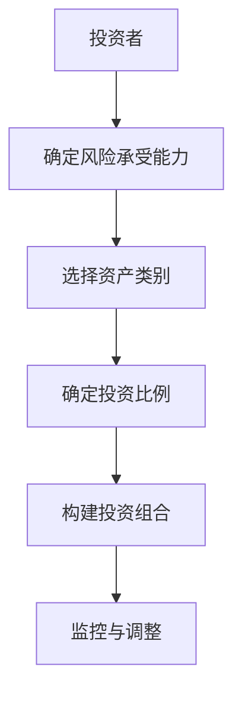
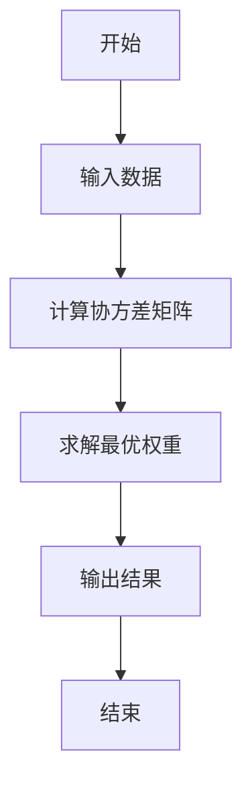

                 


# 约翰·伯格的资产配置理论

## 关键词：
资产配置、投资组合管理、风险管理、现代投资组合理论、金融建模、Python编程

## 摘要：
本文系统阐述了约翰·伯格的资产配置理论，从理论背景、核心概念、算法原理到系统设计、项目实战和最佳实践，全面解析资产配置的原理与应用。文章结合技术与金融知识，通过清晰的逻辑分析和丰富的图表，帮助读者深入理解资产配置的理论与实践。

---

## 正文

---

### 第一部分: 资产配置理论的背景与核心概念

#### 第1章: 资产配置的基本概念与背景

##### 1.1 资产配置的定义与内涵

###### 1.1.1 资产配置的定义
资产配置是指将资金分配到不同的资产类别（如股票、债券、现金等）中，以实现风险与收益的最佳平衡。其核心在于通过多元化投资降低风险，同时追求最大化的收益。

###### 1.1.2 资产配置的核心内涵
资产配置不仅仅是选择资产类别，还包括确定各资产的投资比例。它是投资组合管理的核心，旨在平衡风险与收益。

###### 1.1.3 资产配置与投资组合管理的关系
资产配置是投资组合管理的基础，后者通过优化资产配置和证券选择，构建最优的投资组合。

##### 1.2 资产配置的历史发展与重要性

###### 1.2.1 资产配置的起源与发展
资产配置的起源可以追溯到古代，但现代资产配置理论始于20世纪50年代，以哈里·马科维茨的现代投资组合理论（MPT）为代表。

###### 1.2.2 资产配置在现代投资管理中的地位
资产配置是投资组合管理的核心，决定组合的收益与风险特征。

###### 1.2.3 资产配置的实践意义与应用领域
资产配置广泛应用于机构投资、个人理财等领域，帮助投资者实现长期收益目标。

##### 1.3 资产配置的核心要素与边界

###### 1.3.1 资产配置的核心要素分析
核心要素包括资产类别选择、投资比例分配、风险承受能力等。

###### 1.3.2 资产配置的边界与外延
资产配置的边界由投资者的风险承受能力和收益目标决定，外延涉及动态调整和风险管理。

##### 1.4 资产配置的理论基础与框架

###### 1.4.1 现代投资组合理论（MPT）概述
MPT强调通过分散投资降低风险，构建有效前沿，实现最优资产配置。

###### 1.4.2 资产配置的理论模型与框架
MPT模型通过数学优化，确定各资产的最优权重。

###### 1.4.3 资产配置与有效前沿的关系
有效前沿代表在给定风险下收益最高的组合，是资产配置的重要工具。

#### 第2章: 资产配置的核心概念与联系

##### 2.1 资产配置的原理与机制

###### 2.1.1 资产配置的原理
通过分散投资降低风险，优化收益。

###### 2.1.2 资产配置的实现机制
包括资产选择、比例分配、动态调整等步骤。

##### 2.2 资产配置的核心要素对比分析

###### 2.2.1 不同资产类别的特征对比
| 资产类别 | 风险 | 收益 |
|----------|------|------|
| 股票     | 高   | 高   |
| 债券     | 中   | 中   |
| 现金     | 低   | 低   |

##### 2.3 资产配置的ER实体关系图与流程图

###### 2.3.1 资产配置的ER实体关系图
```mermaid
erd
actor: 投资者
asset: 资产类别
portfolio: 投资组合
risk: 风险管理
```

###### 2.3.2 资产配置的Mermaid流程图


---

### 第二部分: 资产配置的算法原理与数学模型

#### 第3章: 资产配置的算法原理

##### 3.1 现代投资组合理论（MPT）算法

###### 3.1.1 MPT的核心算法概述
MPT通过优化数学模型，确定各资产的最优权重。

###### 3.1.2 均值-方差优化的数学模型
数学公式：
$$
\text{minimize } \sigma^2 \quad \text{subject to } \sum w_i = 1
$$
其中，$$\sigma^2$$ 表示组合的方差，$$w_i$$ 表示各资产的权重。

###### 3.1.3 MPT算法的实现步骤
1. 计算各资产的预期收益和协方差矩阵。
2. 使用优化算法求解最优权重。

##### 3.2 资产配置的数学模型实现

###### 3.2.1 Python代码实现
```python
import numpy as np
import matplotlib.pyplot as plt

# 示例数据
assets = 3
returns = np.array([0.1, 0.05, 0.08])
cov_matrix = np.array([
    [0.02, 0.01, 0.015],
    [0.01, 0.03, 0.02],
    [0.015, 0.02, 0.04]
])

# 均值-方差优化
n = len(returns)
cov = cov_matrix
inv_cov = np.linalg.inv(cov)
ones = np.ones(n)
denominator = ones.T.dot(inv_cov).dot(ones)
weights = inv_cov.dot(ones) / denominator

print("最优权重：", weights)
```

###### 3.2.2 算法流程图


---

### 第三部分: 资产配置的系统分析与架构设计

#### 第4章: 资产配置系统的构建

##### 4.1 问题场景介绍
投资者希望根据自身风险偏好构建最优投资组合。

##### 4.2 系统功能设计

###### 4.2.1 领域模型Mermaid类图


##### 4.3 系统架构设计Mermaid架构图


##### 4.4 系统接口设计与交互流程

###### 4.4.1 系统接口设计
- 输入接口：风险承受能力、资产类别等。
- 输出接口：最优权重、预期收益、风险等。

###### 4.4.2 系统交互Mermaid序列图


---

### 第四部分: 资产配置的项目实战

#### 第5章: 资产配置的Python实现

##### 5.1 环境安装
安装Python和必要的库（numpy, pandas, matplotlib）。

##### 5.2 核心实现代码

###### 5.2.1 读取数据
```python
import pandas as pd
data = pd.read_csv('assets.csv')
```

###### 5.2.2 计算协方差矩阵
```python
cov_matrix = data.cov()
```

###### 5.2.3 求解最优权重
```python
n = len(data.columns)
inv_cov = np.linalg.inv(cov_matrix)
weights = inv_cov.dot(ones) / ones.T.dot(inv_cov).dot(ones)
```

##### 5.3 案例分析与结果解读
分析权重分布，解释如何平衡风险与收益。

---

### 第五部分: 资产配置的最佳实践

#### 第6章: 最佳实践与小结

##### 6.1 小结
资产配置是投资管理的核心，MPT提供了科学的方法。

##### 6.2 注意事项
- 定期调整配置。
- 考虑市场变化。
- 保持长期视角。

##### 6.3 拓展阅读
推荐相关书籍和论文，深入学习资产配置理论。

---

## 结语
通过本文的系统分析，读者可以全面理解约翰·伯格的资产配置理论，从理论到实践，掌握其在投资管理中的应用。希望本文能为读者提供有价值的见解和指导。

--- 

**全文完**

