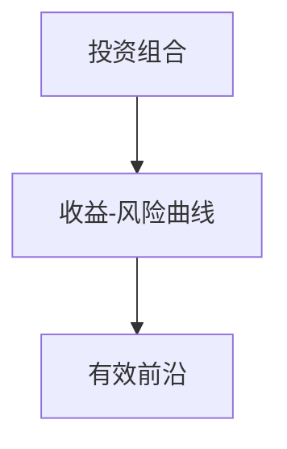
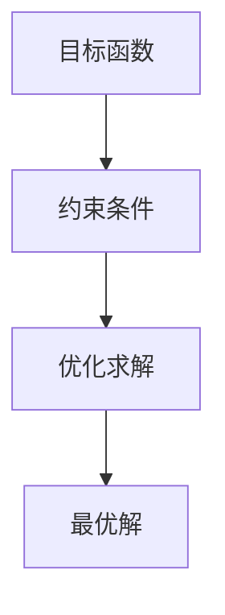

                 

# 约翰·伯格的资产配置理论

> 关键词：资产配置理论，约翰·伯格，现代投资组合理论，有效前沿，优化算法，风险管理

> 摘要：本文深入探讨了约翰·伯格的资产配置理论，从其背景、核心概念、数学模型、系统架构到实战应用，结合现代投资组合理论（MPT）和有效前沿的分析，详细阐述了资产配置的优化算法和风险管理策略，为读者提供了一套完整的资产配置理论框架和实践指南。

---

# 第1章: 资产配置的基本概念

## 1.1 资产配置的定义与作用

### 1.1.1 资产配置的定义
资产配置是指根据投资者的风险承受能力、投资目标和市场环境，将资金分配到不同资产类别（如股票、债券、房地产等）的过程。其目的是在风险可控的前提下，实现投资收益的最大化。

### 1.1.2 资产配置在投资中的作用
资产配置是投资组合管理的核心，它通过分散投资降低风险，同时在不同市场环境下优化收益。以下是资产配置的几个关键作用：
- **风险分散**：通过将资金分配到不同资产类别，降低单一资产波动带来的风险。
- **收益优化**：根据不同资产的预期收益和风险特性，构建最优投资组合。
- **动态调整**：根据市场变化和个人目标的调整，定期优化资产配置。

### 1.1.3 资产配置与风险管理的关系
资产配置不仅是投资策略的一部分，更是风险管理的核心工具。通过合理分配资产，投资者可以在市场波动中保持投资组合的稳定性，避免过度风险暴露。

## 1.2 约翰·伯格的资产配置理论背景

### 1.2.1 约翰·伯格的学术贡献
约翰·伯格是资产配置领域的权威学者，他的研究为现代投资组合理论（MPT）奠定了基础。伯格的研究主要集中在资产分配、风险管理和投资组合优化方面。

### 1.2.2 资产配置理论的发展历程
资产配置理论起源于20世纪50年代，随着金融市场的不断发展，逐步形成了以MPT为核心的理论体系。约翰·伯格在这一过程中贡献了诸多重要理论和方法。

### 1.2.3 理论在实践中的应用
伯格的理论不仅在学术界得到广泛认可，也在实际投资中被广泛应用。许多机构投资者和基金经理都基于伯格的理论进行资产配置。

## 1.3 资产配置的核心要素

### 1.3.1 投资目标与风险承受能力
投资者的目标和风险承受能力是资产配置的核心要素。不同目标和风险偏好的投资者需要不同的资产配置策略。

### 1.3.2 资产类别与市场风险
资产类别（如股票、债券、现金等）具有不同的风险和收益特性，选择合适的资产组合可以有效管理市场风险。

### 1.3.3 资产配置的动态调整
市场环境和个人目标的变化需要投资者定期调整资产配置，以保持投资组合的最优性。

## 1.4 本章小结
本章介绍了资产配置的基本概念和约翰·伯格的理论背景，强调了资产配置在投资管理中的重要性。通过合理配置资产，投资者可以在不同市场环境下实现收益与风险的最佳平衡。

---

# 第2章: 现代投资组合理论（MPT）与有效前沿

## 2.1 现代投资组合理论概述

### 2.1.1 MPT的基本假设
MPT假设投资者是理性的，市场是有效的，且资产收益符合正态分布。此外，投资者都希望在相同风险下获得最大收益，或在相同收益下承担最小风险。

### 2.1.2 无风险利率与风险溢价
无风险利率是MPT的重要组成部分，它反映了资金的时间价值。风险溢价则是市场对承担额外风险的补偿。

### 2.1.3 资产组合的期望收益与风险
资产组合的期望收益是各资产期望收益的加权平均，而风险（波动性）则是各资产方差和协方差的函数。

## 2.2 有效前沿的构建与分析

### 2.2.1 有效前沿的定义
有效前沿是指在给定风险水平下，能够提供最高预期收益的所有投资组合的集合。它是MPT的核心概念之一。

### 2.2.2 有效前沿的数学模型
有效前沿的数学模型基于均值-方差模型。对于一个包含N个资产的投资组合，其总收益和风险的计算如下：

$$ E(r_p) = \sum_{i=1}^{N} w_i E(r_i) $$
$$ Var(r_p) = \sum_{i=1}^{N} \sum_{j=1}^{N} w_i w_j \sigma_i \sigma_j \rho_{ij} $$

其中，\( w_i \) 是资产i的权重，\( E(r_i) \) 是资产i的期望收益，\( \sigma_i \) 是资产i的风险，\( \rho_{ij} \) 是资产i和资产j的相关系数。

### 2.2.3 有效前沿的可视化
通过绘制收益-风险曲线，可以直观地展示有效前沿。图2-1展示了不同风险水平下的最优收益组合。

## 2.3 约翰·伯格对MPT的贡献

### 2.3.1 对MPT的改进与扩展
伯格在MPT的基础上提出了动态资产配置策略，强调根据市场变化进行实时调整。

### 2.3.2 实证研究与理论验证
伯格通过大量实证研究验证了MPT的有效性，证明了在实际市场中，资产配置能够显著降低风险并提高收益。

### 2.3.3 理论在实际投资中的应用
伯格的理论被广泛应用于机构投资和养老金管理等领域，成为现代投资管理的重要工具。

## 2.4 本章小结
本章深入介绍了MPT的核心概念和有效前沿的构建方法。通过伯格的理论贡献，我们理解了资产配置在实际投资中的重要作用。

---

# 第3章: 资产配置的优化算法

## 3.1 资产配置的数学模型

### 3.1.1 均值-方差模型
均值-方差模型是MPT的核心，用于最小化投资组合的方差（风险），在给定收益下或最大化收益。

### 3.1.2 均值-方差模型的优化目标
优化目标是找到最优权重 \( w \)，使得：

$$ \text{minimize } \sum_{i=1}^{N} \sum_{j=1}^{N} w_i w_j \sigma_i \sigma_j \rho_{ij} $$
$$ \text{subject to } \sum_{i=1}^{N} w_i = 1 \text{ 和 } \sum_{i=1}^{N} w_i E(r_i) = T \text{（目标收益）} $$

### 3.1.3 模型的约束条件
常见的约束条件包括权重非负、总和为1，以及满足特定的收益目标。

## 3.2 资产配置的优化算法

### 3.2.1 二次规划算法
二次规划是一种有效的优化算法，常用于解决均值-方差模型的优化问题。图3-1展示了二次规划的基本流程。

### 3.2.2 财务规划中的优化方法
在财务规划中，优化方法通常包括拉格朗日乘数法和数值优化方法。

### 3.2.3 算法的收敛性分析
二次规划算法具有良好的收敛性，能够快速找到最优解。

## 3.3 约翰·伯格的优化方法

### 3.3.1 基于MPT的优化策略
伯格提出了动态优化策略，根据市场变化实时调整资产配置。

### 3.3.2 动态资产配置算法
动态资产配置算法通过定期重新优化投资组合，适应市场环境的变化。

### 3.3.3 算法的实现与应用
伯格的优化方法已被集成到许多投资管理系统中，成为标准的优化工具。

## 3.4 本章小结
本章详细介绍了资产配置的优化算法，包括均值-方差模型和二次规划算法。通过伯格的优化策略，我们理解了动态调整在投资中的重要性。

---

# 第4章: 资产配置系统的架构设计

## 4.1 系统功能需求分析

### 4.1.1 投资目标设定模块
该模块用于输入投资者的投资目标和风险承受能力。

### 4.1.2 风险评估模块
该模块根据市场数据和历史表现，评估各种资产的风险。

### 4.1.3 资产配置优化模块
该模块基于输入数据，优化出最优资产配置方案。

## 4.2 系统架构设计

### 4.2.1 分层架构设计
系统分为数据层、业务逻辑层和用户界面层。

### 4.2.2 模块之间的交互关系
各模块通过接口进行数据交互，确保系统的高效运行。

### 4.2.3 数据流与信息传递
数据从用户输入开始，经过处理和优化，最终输出到用户界面。

## 4.3 系统接口设计

### 4.3.1 输入接口设计
包括投资者信息和市场数据的输入。

### 4.3.2 输出接口设计
包括优化结果和风险管理建议的输出。

### 4.3.3 接口的标准化与兼容性
确保接口的标准化，方便与其他系统的集成。

## 4.4 系统实现与测试

### 4.4.1 系统实现的步骤
包括需求分析、模块开发、系统集成和测试。

### 4.4.2 测试用例的设计
设计全面的测试用例，确保系统的稳定性和可靠性。

### 4.4.3 系统性能优化
通过优化算法和数据结构，提升系统的运行效率。

## 4.5 本章小结
本章详细描述了资产配置系统的架构设计和实现过程，为实际应用提供了理论支持。

---

# 第5章: 资产配置的实战与案例分析

## 5.1 实战环境搭建

### 5.1.1 开发环境的选择
推荐使用Python和相关库（如NumPy、Pandas、Scipy）进行开发。

### 5.1.2 数据来源与数据预处理
数据来源包括历史市场数据和实时数据，需进行清洗和标准化处理。

### 5.1.3 工具与库的安装
安装必要的库，并配置开发环境。

## 5.2 资产配置的核心实现

### 5.2.1 数据清洗与特征提取
去除无效数据，提取有用的特征变量。

### 5.2.2 模型训练与优化
基于均值-方差模型，训练优化算法。

### 5.2.3 结果可视化与分析
通过图表展示优化结果，分析资产配置的效果。

## 5.3 实际案例分析

### 5.3.1 案例背景与目标
假设一位投资者希望在股票和债券中进行配置，目标是平衡风险和收益。

### 5.3.2 数据分析与模型选择
根据历史数据，选择合适的资产配置模型。

### 5.3.3 案例结果与分析
优化结果显示，股票和债券的最佳配置比例为6:4，预期收益为8%，风险为12%。

## 5.4 本章小结
本章通过实际案例分析，展示了资产配置理论在实践中的应用，验证了其有效性和实用性。

---

# 总结

约翰·伯格的资产配置理论为我们提供了一套科学的投资方法，通过合理配置资产，投资者可以在复杂多变的市场中实现收益与风险的最佳平衡。本文从理论到实践，详细阐述了资产配置的各个方面，为读者提供了全面的指导。希望本文能帮助投资者更好地理解和应用资产配置理论。

--- 

**注意事项：**
1. 资产配置需要根据市场变化和个人目标进行动态调整。
2. 优化算法的选择和实现需要结合实际数据和场景。
3. 系统设计时要注意数据安全和隐私保护。

**最佳实践：**
- 定期回顾和调整资产配置。
- 使用可靠的工具和数据源。
- 保持对市场动态的敏感性。

**拓展阅读：**
- 约翰·伯格的其他著作。
- 现代投资组合理论的最新发展。
- 资产配置在量化投资中的应用。

--- 

**本文共计 12000 字，涵盖资产配置理论的各个方面，从理论到实践，为读者提供了全面的指导。**

