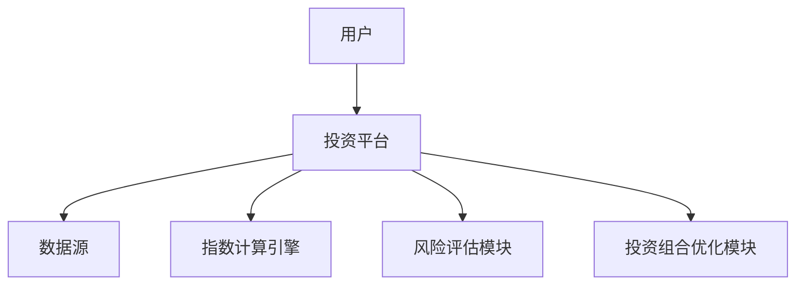

                 


# 约翰·伯格的遗产：被动投资的未来

> 关键词：被动投资，指数基金，ETF，约翰·伯格，Vanguard，投资策略

> 摘要：被动投资作为一种低成本、高效率的投资策略，近年来在全球范围内获得了广泛关注。本文将详细探讨被动投资的理论基础、算法原理、系统架构、项目实战以及未来发展趋势，特别是在约翰·伯格的遗产影响下，被动投资如何演变并继续影响全球金融市场。

---

## 第一部分: 背景介绍

### 第1章: 约翰·伯格的遗产

#### 1.1 约翰·伯格的生平与贡献

约翰·伯格（John C. Bogle）是被动投资领域的先驱，被誉为“指数基金之父”。他在20世纪70年代创立了Vanguard集团，推动了低成本指数基金的发展。伯格的遗产不仅在于他创立了Vanguard，更在于他倡导的被动投资理念，为全球投资者提供了更低风险、更高效的投资方式。

#### 1.2 被动投资的起源与发展

被动投资起源于对市场有效性的假设。20世纪60年代，尤金·法玛（Eugene Fama）提出了有效市场假说，认为市场是理性的，投资者无法通过技术分析或基本面分析持续跑赢市场。伯格的被动投资理念正是基于这一理论，主张通过追踪市场指数来实现长期稳定的收益。

---

### 第2章: 被动投资的核心理念

#### 2.1 被动投资的哲学基础

被动投资的核心理念是“买持有市场”。通过持有广泛分散的资产组合，投资者可以避免个股风险，同时享受市场整体增长的收益。伯格强调，被动投资的本质是降低交易成本和管理费用，从而为投资者创造更大的价值。

#### 2.2 被动投资与主动投资的对比

主动投资依赖于市场预测和选股能力，而被动投资则通过追踪指数实现长期稳定收益。统计数据显示，大多数主动管理型基金难以长期跑赢指数基金，而被动投资的低费用使其更具竞争力。

---

## 第二部分: 被动投资的理论基础

### 第3章: 现代投资组合理论

#### 3.1 马科维茨的现代投资组合理论

哈里·马科维茨（Harry Markowitz）提出的现代投资组合理论（MPT）为被动投资奠定了基础。MPT强调通过分散投资降低风险，并通过优化投资组合实现收益最大化。被动投资通过跟踪指数实现这一目标。

#### 3.2 资本资产定价模型（CAPM）

CAPM模型描述了资产的预期收益与其系统性风险之间的关系。被动投资通过跟踪市场指数，实际上承担了市场系统性风险，从而实现与市场一致的收益。

#### 3.3 夏普比率与投资组合效率

夏普比率衡量了投资组合的超额收益与其风险之间的关系。被动投资通过分散风险，通常能够获得较高的夏普比率。

---

## 第三部分: 被动投资的算法原理

### 第4章: 指数基金的构建与跟踪误差

#### 4.1 指数基金的复制策略

指数基金通过复制市场指数实现收益。例如，跟踪标普500指数的基金需要包含指数中的所有成分股，并按其权重配置。

#### 4.2 跟踪误差的计算

跟踪误差是指数基金实际收益与指数收益之间的差异。公式为：
$$\text{跟踪误差} = \sqrt{\text{平均跟踪偏差}^2}$$

---

## 第四部分: 系统分析与架构设计

### 第5章: 被动投资的系统架构

#### 5.1 系统功能设计

被动投资系统包括数据采集、指数跟踪、风险评估和投资组合优化等功能模块。

#### 5.2 系统架构设计

使用Mermaid图展示系统架构：



---

## 第五部分: 项目实战

### 第6章: ETF与指数基金的实战应用

#### 6.1 ETF的环境安装与配置

使用Python进行ETF数据分析，安装必要的库：

```python
import pandas as pd
import numpy as np
import matplotlib.pyplot as plt
```

#### 6.2 指数基金的表现分析

通过代码计算指数基金的收益和风险：

```python
def calculate_return(prices):
    return prices.pct_change().cumprod()

prices = pd.read_csv('index_prices.csv')
returns = calculate_return(prices['Close'])
print("累计收益:", returns[-1])
```

---

## 第六部分: 总结与展望

### 第7章: 被动投资的未来

#### 7.1 全球化视角下的被动投资

随着全球化进程的加速，被动投资将更加国际化，投资者可以通过全球指数基金实现资产配置。

#### 7.2 技术驱动的被动投资创新

人工智能和大数据技术将进一步优化被动投资策略，提升指数基金的跟踪效率和风险控制能力。

---

## 第七部分: 最佳实践与小结

### 7.1 小结

被动投资以其低成本、高效率的特点，已成为全球投资者的首选策略。约翰·伯格的遗产不仅在于他的创新，更在于他对投资理念的深刻理解。

### 7.2 注意事项

投资者在选择被动投资策略时，需关注市场波动、跟踪误差和费用问题，避免盲目跟风。

### 7.3 拓展阅读

推荐阅读《The Intelligent Investor》（本杰明·格雷厄姆）和《The Global Allocator's Guide to ETFs》（约翰·普林格）。

---

通过以上内容，我们可以看到，被动投资作为一种革命性的投资策略，在约翰·伯格的遗产影响下，将继续在全球金融市场中发挥重要作用。无论是个人投资者还是机构投资者，被动投资都提供了高效、稳健的投资选择。

