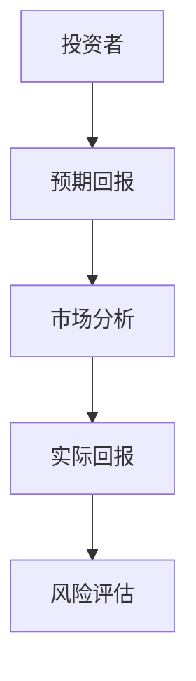
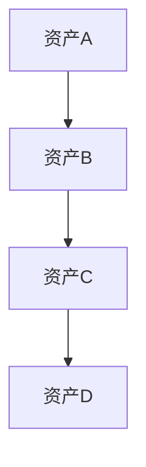
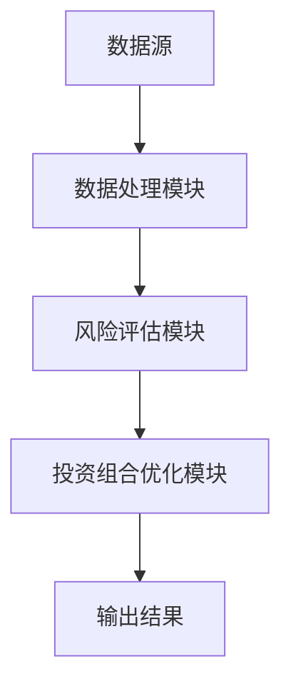
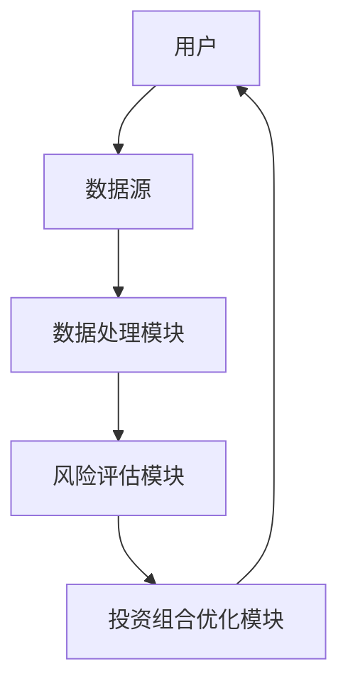

                 


```markdown
# 约翰·伯格的长期投资回报预期管理

> 关键词：长期投资，回报预期管理，约翰·伯格，投资策略，风险管理

> 摘要：本文深入探讨了约翰·伯格的长期投资理念及其在回报预期管理中的应用。通过分析其投资哲学、数学模型、系统架构和实际案例，详细解读了如何通过长期投资策略实现稳定的回报预期管理。

---

## 第一部分: 长期投资回报预期管理的背景与概念

### 第1章: 长期投资回报预期管理的背景介绍

#### 1.1 投资回报预期管理的定义与核心概念
##### 1.1.1 投资回报预期管理的定义
投资回报预期管理是指投资者通过分析市场数据、企业基本面和宏观经济指标，预测未来投资收益的过程。其核心在于通过科学的方法设定合理的回报目标，并通过动态调整投资组合来实现这些目标。

##### 1.1.2 长期投资的内涵与外延
长期投资是一种以持有资产数年以上为目标的投资策略，强调对企业基本面的深入研究和市场趋势的长期判断。其外延包括股票、债券、基金等多种资产类别。

##### 1.1.3 投资回报预期管理的核心要素
- **预期目标**：设定明确的回报目标。
- **风险控制**：通过分散投资降低风险。
- **动态调整**：根据市场变化及时调整投资组合。

#### 1.2 约翰·伯格的长期投资理念
##### 1.2.1 约翰·伯格的生平与投资哲学
约翰·伯格是美国著名投资家，以其长期价值投资策略闻名。他强调买入优质企业并长期持有的理念，认为市场波动是投资机会而非风险。

##### 1.2.2 长期投资的优势与局限性
- **优势**：通过复利效应实现财富增长，避免短期波动的干扰。
- **局限性**：需要较强的资金流动性管理，且长期投资并不保证收益。

##### 1.2.3 伯格投资策略的演变与影响
伯格的投资策略对全球投资界产生了深远影响，尤其在机构投资和个人理财领域。

### 第2章: 投资回报预期管理的核心概念与联系

#### 2.1 投资回报预期管理的原理
##### 2.1.1 投资回报的期望值计算公式
$$ E(r) = \sum (p_i \times r_i) $$

##### 2.1.2 投资回报的方差与标准差
$$ \sigma^2 = \sum p_i (r_i - E(r))^2 $$

#### 2.2 核心概念对比表
| 概念 | 定义 | 特点 |
|------|------|------|
| 预期回报 | 投资者对未来收益的估计 | 基于历史数据和市场分析 |
| 风险 | 投资收益的不确定性 | 通常与回报成正比 |

#### 2.3 实体关系图


---

## 第二部分: 投资回报预期管理的算法与数学模型

### 第3章: 投资回报预期管理的数学模型

#### 3.1 预期回报的计算
##### 3.1.1 简单预期回报计算
$$ E(r) = \frac{1}{n} \sum_{i=1}^{n} r_i $$

##### 3.1.2 加权预期回报计算
$$ E(r) = \sum_{i=1}^{n} w_i r_i $$

#### 3.2 风险调整后的预期回报
##### 3.2.1 风险调整公式
$$ E(r_{\text{调整}}) = E(r) - \alpha \times \sigma^2 $$

##### 3.2.2 风险调整的夏普比率
$$ \text{夏普比率} = \frac{E(r) - R_f}{\sigma} $$

### 第4章: 投资组合优化的算法实现

#### 4.1 马科维茨投资组合理论
##### 4.1.1 均值-方差优化


##### 4.1.2 优化目标函数
$$ \min_w \sum_{i,j} w_i w_j \sigma_{ij} $$

#### 4.2 现实中的投资组合优化
##### 4.2.1 约束条件下的优化
$$ \sum w_i = 1 $$

---

## 第三部分: 系统分析与架构设计

### 第5章: 系统分析与架构设计方案

#### 5.1 项目介绍
本项目旨在构建一个基于约翰·伯格长期投资理念的投资回报预期管理系统，实现投资组合的优化配置和风险控制。

#### 5.2 系统功能设计
##### 5.2.1 数据采集模块
- 采集股票价格、财务数据等。

##### 5.2.2 数据分析模块
- 计算预期回报和风险指标。

##### 5.2.3 投资组合优化模块
- 应用马科维茨理论优化投资组合。

#### 5.3 系统架构设计


#### 5.4 系统交互设计


---

## 第四部分: 项目实战

### 第6章: 项目实战

#### 6.1 环境安装
- 安装Python、Pandas、NumPy等工具。

#### 6.2 核心实现源代码
```python
import numpy as np
import pandas as pd

# 示例数据
returns = np.array([0.1, 0.15, 0.08, 0.12])

# 计算预期回报
E_r = np.mean(returns)
print(f"预期回报: {E_r}")

# 计算标准差
std_dev = np.std(returns)
print(f"标准差: {std_dev}")
```

#### 6.3 应用解读与分析
通过上述代码，我们可以计算出投资组合的预期回报和风险水平，为投资决策提供数据支持。

#### 6.4 实际案例分析
以伯格的投资组合为例，分析其历史回报与预期回报的偏差。

#### 6.5 项目小结
通过实战项目，我们验证了数学模型的有效性，并展示了如何将理论应用于实际投资决策。

---

## 第五部分: 总结与展望

### 第7章: 总结与展望

#### 7.1 核心内容回顾
- 约翰·伯格的长期投资理念
- 投资回报预期管理的数学模型
- 系统架构设计与项目实战

#### 7.2 未来展望
- 结合人工智能技术优化投资策略
- 进一步研究动态资产配置策略

---

## 附录

### 附录A: 进一步学习的资源
- 推荐书籍：《投资学》、《约翰·伯格的投资哲学》
- 推荐网站：Quantitative Research

### 附录B: 工具与库
- Python库：Pandas、NumPy、Scipy
- 数据源：Yahoo Finance、Quandl
```

