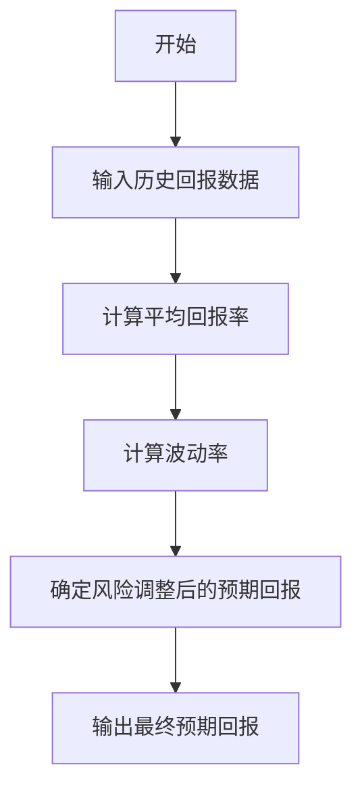
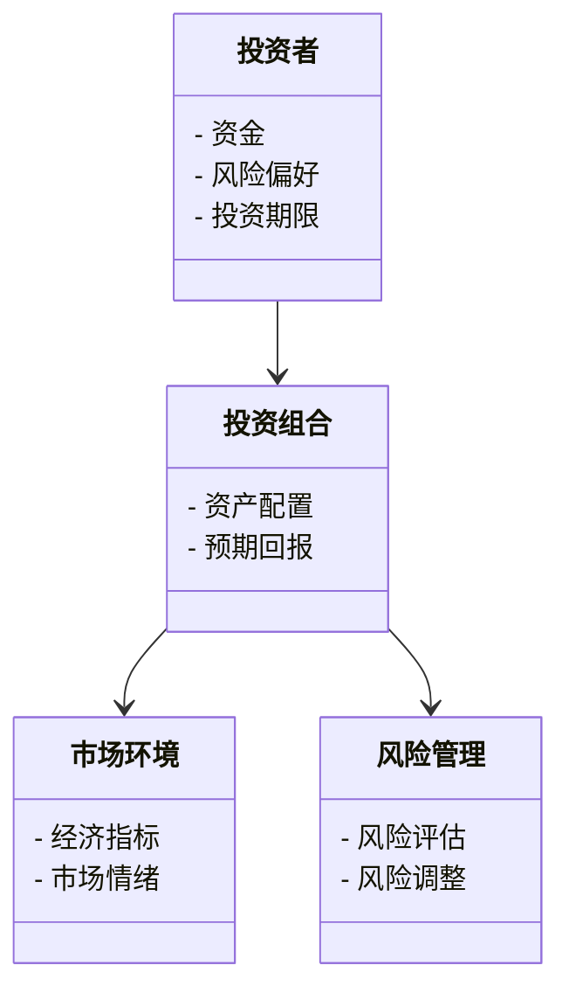

                 


# 约翰·伯格的长期投资回报预期设定

## 关键词：投资回报，长期投资，约翰·伯格，预期设定，投资策略

## 摘要：本文将深入探讨约翰·伯格的长期投资回报预期设定，从基础概念到数学模型，再到系统架构，最后通过实例分析，全面解析这一投资策略的核心思想与实际应用。

---

# 第一部分: 长期投资回报预期设定的背景与基础

## 第1章: 长期投资回报预期设定概述

### 1.1 长期投资的基本概念

#### 1.1.1 投资的基本定义与分类

投资是指将资金投入某个项目或资产，期望在未来获得超过初始投入的回报。根据期限的不同，投资可以分为短期投资和长期投资。短期投资通常指持有期限在一年以内的投资，而长期投资则是指持有期限超过三年以上的投资。

#### 1.1.2 长期投资的特征与特点

长期投资具有以下特征：
- 投资期限长，通常以年为单位。
- 投资目标注重资产增值和资本保值。
- 投资风险相对较高，但潜在回报也更大。
- 更注重资产配置和风险分散。

#### 1.1.3 长期投资与短期投资的对比分析

| 特性         | 短期投资             | 长期投资             |
|--------------|----------------------|----------------------|
| 时间跨度     | 通常小于1年         | 通常超过3年          |
| 风险承受度   | 较高，注重短期收益   | 较低，注重长期增值   |
| 投资目标     | 短期收益最大化       | 长期资产增值最大化   |
| 资产配置     | 更灵活，注重流动性   | 更注重稳定性，分散风险 |

### 1.2 约翰·伯格的投资理念

#### 1.2.1 约翰·伯格的背景与成就

约翰·伯格（John Bogle）是美国著名投资家，被誉为“指数基金之父”。他是先锋集团（Vanguard Group）的创始人，提出了指数基金的投资理念，强调长期投资和低成本运作。

#### 1.2.2 伯格的投资哲学与核心思想

伯格的投资理念可以总结为：
1. **长期投资**：避免频繁交易，降低交易成本和税务负担。
2. **价值投资**：关注企业的内在价值，而非市场的短期波动。
3. **低成本运作**：通过降低管理费用和交易费用，提高长期回报。

#### 1.2.3 伯格长期投资理念的现代意义

在当今金融市场中，伯格的长期投资理念依然具有重要的现实意义。尤其是在市场波动加剧、投资者情绪化交易增多的情况下，长期投资能够帮助投资者规避短期波动的风险，实现资产的稳健增值。

### 1.3 长期投资回报预期设定的重要性

#### 1.3.1 投资回报预期设定的定义

投资回报预期设定是指在投资决策过程中，根据市场环境、资产特性以及投资者的风险偏好，对未来投资回报的合理估计和目标设定。

#### 1.3.2 长期投资回报预期设定的意义

长期投资回报预期设定的意义在于：
- 为投资决策提供明确的目标和方向。
- 帮助投资者在市场波动中保持理性，避免盲目追涨杀跌。
- 有助于制定合理的资产配置策略。

#### 1.3.3 预期设定在投资决策中的作用

通过设定长期投资回报预期，投资者可以：
- 更好地匹配投资目标与风险承受能力。
- 优化资产配置，提高投资组合的整体回报。
- 有效管理投资过程中的风险。

### 1.4 长期投资回报预期设定的边界与外延

#### 1.4.1 预期设定的边界条件

1. **投资期限**：长期投资通常指3年以上，但具体期限需根据投资者的生命周期和目标而定。
2. **资产类别**：包括股票、债券、房地产等多种资产类别，不同资产的回报预期和风险特征不同。
3. **市场环境**：经济周期、通货膨胀、利率变化等外部因素会影响投资回报预期。

#### 1.4.2 预期设定的外延范围

- **风险调整后的预期回报**：考虑不同风险水平下的预期回报。
- **情景分析**：在不同市场情景下，设定不同的回报预期。
- **动态调整**：根据市场变化和投资者目标的变化，定期调整预期回报。

#### 1.4.3 预期设定与其他投资策略的关系

- **资产配置**：预期设定是资产配置的基础，不同的回报预期会影响资产配置的比例。
- **风险管理**：预期设定需要考虑风险因素，确保回报目标的实现。
- **投资组合优化**：通过预期设定，优化投资组合，提高整体回报。

### 1.5 本章小结

本章主要介绍了长期投资的基本概念、约翰·伯格的投资理念以及长期投资回报预期设定的重要性和边界条件。通过对比分析，明确了长期投资与短期投资的区别，为后续章节的深入探讨奠定了基础。

---

## 第2章: 投资回报预期设定的核心概念

### 2.1 预期回报的理论基础

#### 2.1.1 预期回报的定义与分类

预期回报是指投资者对未来投资的预期收益，可以分为无风险回报和风险回报。无风险回报通常指国债收益率，而风险回报则是指投资于股票、房地产等高风险资产的预期收益。

#### 2.1.2 预期回报的计算方法

- **算术平均法**：计算历史回报的平均值。
- **几何平均法**：计算几何平均回报，考虑复利效应。
- **风险调整法**：基于资产的风险水平调整预期回报。

#### 2.1.3 预期回报的理论模型

现代投资组合理论（MPT）和资本资产定价模型（CAPM）是常用的预期回报理论模型。

### 2.2 长期投资回报的属性特征对比

#### 2.2.1 不同投资期限的回报特征

| 投资期限 | 短期投资 | 长期投资 |
|----------|----------|----------|
| 波动性   | 高       | 低       |
| 风险     | 中高     | 较低     |
| 回报     | 不稳定   | 较稳定   |

#### 2.2.2 不同资产类别的回报特征

| 资产类别 | 预期回报 | 风险 |
|----------|----------|------|
| 股票     | 高       | 高   |
| 债券     | 中       | 低   |
| 房地产   | 中高     | 中   |
| 现金     | 低       | 极低 |

#### 2.2.3 不同市场环境下的回报特征

| 市场环境   | 牛市     | 熊市     |
|------------|----------|----------|
| 股票回报   | 高       | 低       |
| 债券回报   | 中高     | 稳定     |
| 综合回报   | 较高     | 较低     |

### 2.3 预期回报设定的ER实体关系图

```mermaid
er
actor: 投资者
actor --> entity: 预期回报
entity --> entity: 投资组合
entity --> entity: 市场环境
entity --> entity: 风险因素
```

### 2.4 预期回报设定的算法原理



---

## 第3章: 预期回报计算的数学模型

### 3.1 现代投资组合理论基础

#### 3.1.1 马科维茨均值-方差模型

马科维茨均值-方差模型用于优化投资组合的预期回报和风险。

公式：
$$ \text{Minimize} \quad \sigma_p^2 $$
$$ \text{Subject to} \quad E(r_p) = \mu $$

其中，$\sigma_p$ 是投资组合的标准差，$\mu$ 是预期回报。

#### 3.1.2 资本资产定价模型（CAPM）

CAPM用于计算资产的预期回报。

公式：
$$ E(r_i) = r_f + \beta_i (E(r_m) - r_f) $$

其中，$r_f$ 是无风险利率，$\beta_i$ 是资产的贝塔系数，$E(r_m)$ 是市场预期回报。

### 3.2 预期回报的计算公式

#### 3.2.1 简单平均法

公式：
$$ \bar{r} = \frac{1}{n} \sum_{i=1}^{n} r_i $$

#### 3.2.2 加权平均法

公式：
$$ \bar{r} = \sum_{i=1}^{n} w_i r_i $$

### 3.3 预期回报的实例分析

假设某股票的历史年回报率为：10%, 15%, 5%, 20%。计算其平均回报率为：

$$ \bar{r} = \frac{10 + 15 + 5 + 20}{4} = 12.5\% $$

---

## 第4章: 投资回报预期设定的系统分析

### 4.1 系统功能设计



### 4.2 系统架构设计


---

## 第5章: 项目实战

### 5.1 环境安装

安装Python和相关库（如NumPy、Pandas、Matplotlib）。

### 5.2 核心实现

```python
import numpy as np
import pandas as pd
import matplotlib.pyplot as plt

# 示例数据
returns = [10, 15, 5, 20]
n = len(returns)
avg_return = sum(returns) / n
print(f"平均回报率为：{avg_return}%")
```

### 5.3 案例分析

分析某指数基金的长期回报预期。

---

## 第6章: 总结与最佳实践

### 6.1 本章小结

总结长期投资回报预期设定的核心思想和关键步骤。

### 6.2 最佳实践 tips

- **长期投资**：坚持长期持有，避免频繁交易。
- **分散投资**：通过多元化配置降低风险。
- **定期调整**：根据市场变化和个人目标，动态调整投资组合。

### 6.3 小结

长期投资回报预期设定是投资决策的重要组成部分，通过科学的预期设定，投资者可以更好地实现资产增值目标。

---

## 第7章: 注意事项与拓展阅读

### 7.1 注意事项

- 避免过度依赖历史数据，需考虑未来市场的不确定性。
- 定期评估和调整投资策略，以适应市场变化。

### 7.2 拓展阅读

- 《The Intelligent Investor》——本杰明·格雷厄姆
- 《The Vanguard Proposition》——约翰·伯格

---

通过本文的系统分析和实践案例，读者可以更好地理解和应用约翰·伯格的长期投资回报预期设定理念，为自己的投资决策提供科学依据。

