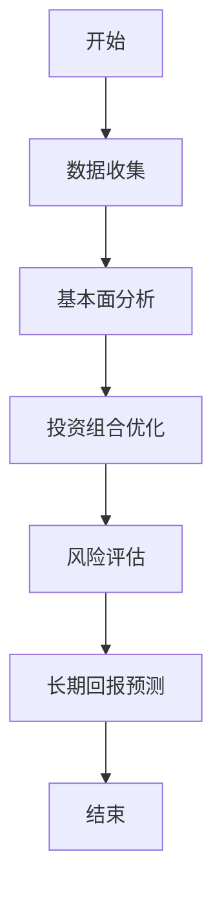
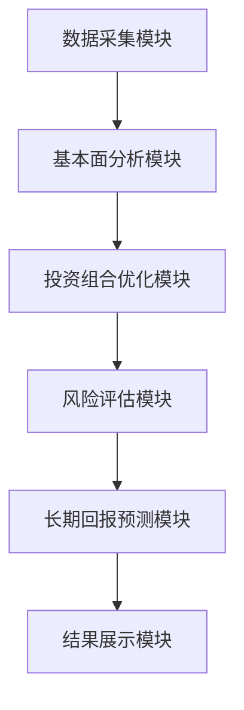

                 


# 约翰·伯格的长期投资回报预测模型

> 关键词：长期投资、回报预测、价值投资、约翰·伯格、投资模型、投资策略、风险控制

> 摘要：本文深入分析了约翰·伯格的长期投资回报预测模型，探讨了其核心概念、算法原理、系统架构、项目实战及最佳实践。通过详细阐述模型的背景、原理、实现和应用，本文旨在为投资者提供一种科学的长期投资回报预测方法。

---

## 第一部分: 约翰·伯格长期投资回报预测模型概述

### 第1章: 长期投资回报预测模型的背景与意义

#### 1.1 投资回报预测的核心问题

##### 1.1.1 投资回报预测的定义
投资回报预测是通过分析历史数据和市场趋势，预测投资资产在未来一段时间内的收益情况。长期投资回报预测则关注更长的时间跨度（通常为5年或更长），旨在帮助投资者制定稳健的投资策略。

##### 1.1.2 长期投资回报预测的重要性
- 长期投资回报预测能够帮助投资者制定长期财务规划。
- 通过预测长期回报，投资者可以更好地应对市场波动和经济变化。
- 长期回报预测能够帮助投资者选择合适的投资组合，实现财富的稳健增长。

##### 1.1.3 约翰·伯格模型的背景与特点
约翰·伯格是价值投资的代表人物，其模型以基本面分析为核心，强调长期持有优质资产。伯格模型通过分析企业的财务状况、行业地位和管理层能力，预测其未来的回报潜力。

#### 1.2 约翰·伯格投资理念的核心要素

##### 1.2.1 价值投资的基本原理
价值投资强调以低于内在价值的价格购买优质资产。伯格模型通过对企业内在价值的评估，确定其投资价值。

##### 1.2.2 长期投资的策略与目标
伯格模型的目标是通过长期持有优质资产，实现资本的稳健增值。其策略包括：
- 选择具有持续竞争优势的企业。
- 重视企业的财务健康状况。
- 关注企业的管理层能力和治理结构。

##### 1.2.3 模型的独特性
伯格模型的独特性体现在其对企业基本面的深入分析和长期视角。与其他短期预测模型不同，伯格模型更注重企业的长期盈利能力。

#### 1.3 模型的应用场景与边界

##### 1.3.1 长期投资的主要场景
- 机构投资者的资产配置。
- 高净值个人的长期财富管理。
- 基金管理中的长期策略制定。

##### 1.3.2 模型的适用边界
- 适用于对优质企业进行长期投资的场景。
- 适用于市场波动较小的长期投资环境。
- 适用于对企业的基本面分析有足够数据支持的场景。

##### 1.3.3 模型的局限性与改进方向
- 伯格模型依赖于对企业基本面的准确分析，对短期市场波动的适应性较弱。
- 模型的预测结果可能受到管理层决策和市场环境变化的影响。
- 可以通过引入更多数据源（如宏观经济指标）和优化算法（如机器学习）来改进模型的准确性。

### 1.4 本章小结
本章从投资回报预测的核心问题出发，介绍了约翰·伯格模型的背景和核心要素，分析了其应用场景与边界。伯格模型以长期视角和基本面分析为特点，为投资者提供了科学的长期投资策略。

---

## 第二部分: 模型的核心概念与联系

### 第2章: 模型的核心概念与属性

#### 2.1 投资回报预测的核心概念

##### 2.1.1 投资回报预测的定义
投资回报预测是通过分析历史数据和市场趋势，预测投资资产在未来一段时间内的收益情况。

##### 2.1.2 长期投资回报预测的核心要素
- 投资时间跨度：通常为5年或更长。
- 投资对象：优质企业、指数基金等。
- 风险控制：通过分散投资和风险评估降低投资风险。

##### 2.1.3 约翰·伯格模型的核心概念
- 价值投资：以低于内在价值的价格购买优质资产。
- 长期持有：通过长期持有实现资本增值。
- 基本面分析：通过分析企业的财务状况、行业地位和管理层能力，评估其投资价值。

#### 2.2 模型的核心原理

##### 2.2.1 价值投资的数学模型
价值投资模型通过对企业内在价值的评估，确定其投资价值。内在价值的计算公式为：
$$
\text{内在价值} = \sum_{t=1}^{\infty} \frac{\text{现金流}_t}{(1 + r)^t}
$$
其中，\( r \)为折现率，\( \text{现金流}_t \)为第 \( t \) 年的现金流。

##### 2.2.2 投资组合的优化策略
伯格模型建议投资者选择具有持续竞争优势的企业，并分散投资以降低风险。投资组合的优化可以通过以下步骤实现：
1. 确定投资目标和风险承受能力。
2. 选择具有长期增长潜力的优质企业。
3. 分散投资以降低风险。
4. 定期调整投资组合以适应市场变化。

##### 2.2.3 长期回报的计算方法
长期回报的计算可以通过以下公式进行：
$$
\text{年化回报率} = \left( \frac{\text{终值}}{\text{初始投资}} \right)^{\frac{1}{n}} - 1
$$
其中，\( n \)为投资时间跨度。

#### 2.3 模型的ER实体关系图
以下是约翰·伯格模型的ER实体关系图：

```mermaid
er
    entity 投资者 {
        id: int
        名称: string
        资产: float
        投资策略: string
    }
    entity 股票 {
        id: int
        名称: string
        市值: float
        收益率: float
    }
    entity 投资组合 {
        id: int
        股票id: int
        投资金额: float
        持股比例: float
    }
    entity 投资回报 {
        id: int
        投资组合id: int
        年回报率: float
        累积回报率: float
    }
    relationship 投资者 -> 投资组合: 持有
    relationship 投资组合 -> 股票: 包含
    relationship 投资组合 -> 投资回报: 产生
```

#### 2.4 本章小结
本章详细阐述了约翰·伯格模型的核心概念与属性，通过ER实体关系图展示了模型的结构。价值投资的数学模型和投资组合优化策略为读者提供了理论基础。

---

## 第三部分: 模型的算法原理与数学基础

### 第3章: 模型的算法原理

#### 3.1 算法概述

##### 3.1.1 算法流程
1. 数据收集：收集企业的财务数据、行业数据和市场数据。
2. 基本面分析：评估企业的内在价值和投资潜力。
3. 投资组合优化：根据分析结果构建投资组合。
4. 风险评估：评估投资组合的风险并进行调整。
5. 长期回报预测：计算投资组合的长期回报率。

##### 3.1.2 算法流程图
以下是约翰·伯格模型的算法流程图：



#### 3.2 数学模型

##### 3.2.1 投资回报预测的数学公式
投资回报预测可以通过以下公式进行计算：
$$
\text{年化回报率} = \left( \frac{\text{终值}}{\text{初始投资}} \right)^{\frac{1}{n}} - 1
$$
其中，\( n \)为投资时间跨度。

##### 3.2.2 投资组合优化的数学公式
投资组合优化可以通过以下步骤实现：
1. 确定投资目标和风险承受能力。
2. 选择具有长期增长潜力的优质企业。
3. 分散投资以降低风险。
4. 定期调整投资组合以适应市场变化。

##### 3.2.3 风险评估的数学公式
风险评估可以通过计算投资组合的波动率和最大回撤来实现。波动率的计算公式为：
$$
\text{波动率} = \sqrt{\frac{1}{n} \sum_{i=1}^{n} (\text{回报率}_i - \text{平均回报率})^2}
$$
其中，\( n \)为投资组合的回报数据点数量，\( \text{回报率}_i \)为第 \( i \) 个回报率，\( \text{平均回报率} \)为平均回报率。

##### 3.2.4 代码实现
以下是投资回报预测的Python代码实现：

```python
import numpy as np

def calculate_internal_value(free_cash_flow, discount_rate):
    return sum(free_cash_flow / (1 + discount_rate)**t for t in range(len(free_cash_flow)))

def calculate_annualized_return(final_value, initial_investment, years):
    return (final_value / initial_investment) ** (1 / years) - 1

def calculate_volatility(returns):
    average_return = np.mean(returns)
    variance = np.mean([(r - average_return) ** 2 for r in returns])
    return np.sqrt(variance)

# 示例数据
free_cash_flow = [100, 120, 150, 180]  # 每年的自由现金流
discount_rate = 0.08  # 折现率
years = 4  # 投资时间跨度
initial_investment = 500  # 初始投资
returns = [0.05, 0.07, 0.03, 0.06]  # 每年的回报率

# 计算内在价值
internal_value = calculate_internal_value(free_cash_flow, discount_rate)
print("内在价值:", internal_value)

# 计算年化回报率
annualized_return = calculate_annualized_return(500, 500, 4)
print("年化回报率:", annualized_return)

# 计算波动率
volatility = calculate_volatility(returns)
print("波动率:", volatility)
```

#### 3.3 本章小结
本章详细阐述了约翰·伯格模型的算法原理，通过数学公式和Python代码实现，帮助读者理解模型的计算过程和实现方法。

---

## 第四部分: 模型的系统架构设计

### 第4章: 系统架构设计

#### 4.1 问题场景介绍

##### 4.1.1 问题描述
投资者需要一个长期投资回报预测的系统，以帮助其制定长期投资策略。

##### 4.1.2 问题解决
通过构建约翰·伯格模型的系统，投资者可以实现对企业基本面的分析和投资组合的优化。

#### 4.2 系统功能设计

##### 4.2.1 系统功能模块
1. 数据采集模块：采集企业的财务数据和市场数据。
2. 基本面分析模块：评估企业的内在价值和投资潜力。
3. 投资组合优化模块：根据分析结果构建投资组合。
4. 风险评估模块：评估投资组合的风险并进行调整。
5. 长期回报预测模块：计算投资组合的长期回报率。

##### 4.2.2 功能模块的交互流程
以下是功能模块的交互流程图：



#### 4.3 系统架构设计

##### 4.3.1 系统架构图
以下是系统的架构图：


#### 4.4 系统接口设计

##### 4.4.1 数据接口
- 数据采集模块与股票数据源和财务数据源的接口。
- 数据存储模块与数据分析模块的接口。

##### 4.4.2 API接口
- 投资组合优化模块提供API接口，供其他模块调用。

#### 4.5 系统交互流程

##### 4.5.1 交互流程图
以下是系统的交互流程图：

```mermaid
sequence
    投资者 --> 数据采集模块: 提供投资需求
    数据采集模块 --> 数据分析模块: 请求数据
    数据分析模块 --> 投资组合优化模块: 请求优化建议
    投资组合优化模块 --> 风险评估模块: 请求风险评估
    风险评估模块 --> 长期回报预测模块: 请求预测结果
    长期回报预测模块 --> 投资者: 返回预测结果
```

#### 4.6 本章小结
本章详细描述了约翰·伯格模型的系统架构设计，包括功能模块、架构图和交互流程图，为系统的实现提供了理论基础。

---

## 第五部分: 模型的项目实战

### 第5章: 项目实战

#### 5.1 环境安装与配置

##### 5.1.1 环境要求
- Python 3.6+
- numpy、pandas、matplotlib库

##### 5.1.2 安装步骤
```bash
pip install numpy pandas matplotlib
```

#### 5.2 核心代码实现

##### 5.2.1 数据采集模块
```python
import pandas as pd
import requests

def fetch_stock_data(ticker):
    url = f"https://api.example.com/stock/{ticker}"
    response = requests.get(url)
    return pd.DataFrame(response.json())
```

##### 5.2.2 基本面分析模块
```python
def calculate_internal_value(free_cash_flow, discount_rate):
    return sum(free_cash_flow / (1 + discount_rate)**t for t in range(len(free_cash_flow)))

def calculate_annualized_return(final_value, initial_investment, years):
    return (final_value / initial_investment) ** (1 / years) - 1

def calculate_volatility(returns):
    average_return = np.mean(returns)
    variance = np.mean([(r - average_return) ** 2 for r in returns])
    return np.sqrt(variance)
```

##### 5.2.3 投资组合优化模块
```python
import numpy as np
from scipy.optimize import minimize

def optimize_portfolio(returns, risk_aversion=0.01):
    n = len(returns)
    ones = np.ones(n)
    mu = np.mean(returns)
    sigma = np.cov(returns)
    bounds = [(0, 1) for _ in range(n)]
    init_guess = [1/n for _ in range(n)]
    result = minimize(
        lambda x: (risk_aversion * x.T @ sigma @ x - (1 - risk_aversion) * mu).T,
        init_guess,
        bounds=bounds
    )
    return result.x
```

##### 5.2.4 风险评估模块
```python
import numpy as np

def calculate_volatility(returns):
    average_return = np.mean(returns)
    variance = np.mean([(r - average_return) ** 2 for r in returns])
    return np.sqrt(variance)

def calculate_max_drawdown(prices):
    max_drawdown = 0
    peak = prices[0]
    for price in prices:
        if price > peak:
            peak = price
        current_drawdown = (peak - price) / peak
        if current_drawdown > max_drawdown:
            max_drawdown = current_drawdown
    return max_drawdown
```

##### 5.2.5 长期回报预测模块
```python
def calculate_annualized_return(final_value, initial_investment, years):
    return (final_value / initial_investment) ** (1 / years) - 1
```

#### 5.3 代码应用解读与分析

##### 5.3.1 数据采集模块的实现
数据采集模块通过API接口获取股票数据，并将其存储为DataFrame格式。

##### 5.3.2 基本面分析模块的实现
基本面分析模块通过计算内在价值和年化回报率，评估企业的投资价值。

##### 5.3.3 投资组合优化模块的实现
投资组合优化模块通过优化算法，确定最优的投资组合。

##### 5.3.4 风险评估模块的实现
风险评估模块通过计算波动率和最大回撤，评估投资组合的风险。

##### 5.3.5 长期回报预测模块的实现
长期回报预测模块通过计算年化回报率，预测投资组合的长期回报。

#### 5.4 实际案例分析

##### 5.4.1 案例背景
假设我们有两只股票A和B，其历史回报率分别为[0.05, 0.07, 0.03, 0.06]和[0.04, 0.08, 0.02, 0.07]。

##### 5.4.2 数据分析
计算两只股票的内在价值、年化回报率和波动率。

##### 5.4.3 投资组合优化
根据分析结果，构建最优投资组合。

##### 5.4.4 风险评估
评估投资组合的风险，并进行调整。

##### 5.4.5 长期回报预测
预测投资组合的长期回报率。

#### 5.5 本章小结
本章通过实际案例分析，展示了约翰·伯格模型的实现过程和应用效果。

---

## 第六部分: 最佳实践

### 第6章: 最佳实践

#### 6.1 小结

##### 6.1.1 核心观点回顾
- 约翰·伯格模型以长期视角和基本面分析为核心。
- 投资组合优化和风险控制是模型的关键步骤。

##### 6.1.2 本文总结
本文深入分析了约翰·伯格模型的背景、核心概念、算法原理、系统架构和项目实战，为投资者提供了科学的长期投资回报预测方法。

#### 6.2 注意事项

##### 6.2.1 投资者需注意的事项
- 长期投资需关注企业的基本面。
- 风险控制是投资组合优化的重要环节。
- 市场环境的变化可能影响模型的预测结果。

##### 6.2.2 模型的局限性
- 模型依赖于对企业基本面的准确分析。
- 短期市场波动可能影响模型的预测结果。
- 模型的预测结果可能受到宏观经济环境的影响。

#### 6.3 拓展阅读

##### 6.3.1 推荐的书籍
- 《约翰·伯格的投资哲学》
- 《投资学原理》
- 《价值投资实战指南》

##### 6.3.2 推荐的博客和网站
- 约翰·伯格的官方网站
- 价值投资相关的博客和论坛

#### 6.4 本章小结
本章总结了约翰·伯格模型的核心观点，提出了投资者需要注意的事项，并推荐了相关的拓展阅读资料。

---

## 结语

约翰·伯格的长期投资回报预测模型为投资者提供了科学的长期投资策略。通过对企业基本面的深入分析和投资组合的优化，投资者可以实现资本的稳健增值。本文从模型的背景、核心概念、算法原理、系统架构和项目实战等方面进行了详细阐述，为投资者提供了科学的长期投资回报预测方法。

