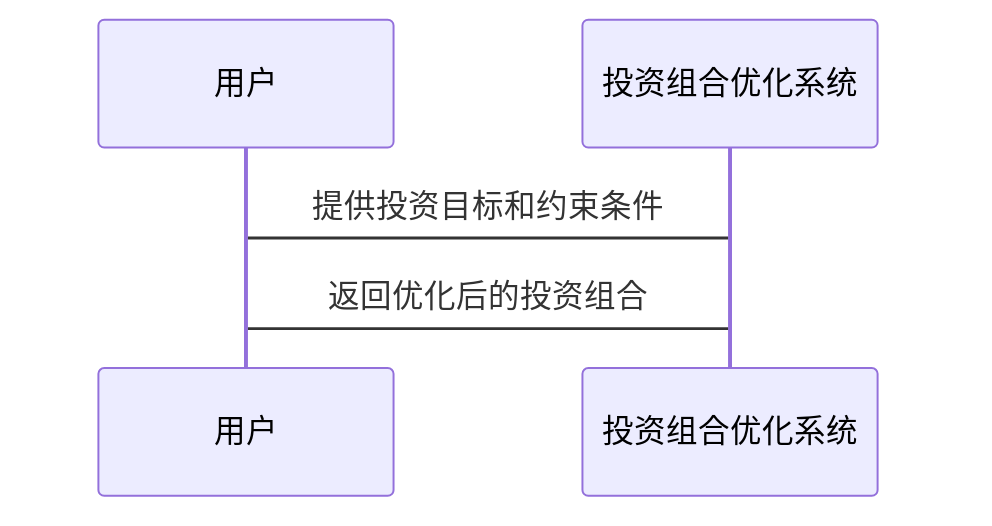

                 


# 约翰·伯格的长期投资观：应对退休年龄延长的挑战

## 关键词：
- 长期投资，退休规划，约翰·伯格，投资组合优化，资产配置，风险管理，MPT

## 摘要：
本文深入探讨了约翰·伯格的长期投资理念及其在应对退休年龄延长挑战中的应用。通过分析投资组合优化的算法原理、系统架构设计以及实际项目实战，本文为读者提供了应对退休规划中长期投资问题的全面解决方案。结合现代投资组合理论（MPT）的数学模型和Python代码实现，本文为读者提供了理论与实践相结合的深度解析。

---

## 第1章：长期投资与退休规划的背景

### 1.1 长期投资的核心概念

#### 1.1.1 投资的基本概念与定义
投资是指将资金投入到某种资产或项目中，以期在未来获得收益的行为。长期投资是指投资期限较长，通常超过5年，目的是通过资产增值实现财务目标。

#### 1.1.2 长期投资的特征与优势
- **特征**：低流动性、高风险承受能力、注重资产增值。
- **优势**：复利效应显著、市场波动影响较小、风险分散。

#### 1.1.3 退休规划的必要性与挑战
- **必要性**：保障退休后的生活质量。
- **挑战**：寿命延长、通货膨胀、社会保障体系压力。

### 1.2 退休年龄延长的背景分析

#### 1.2.1 人口老龄化趋势
全球人口老龄化加剧，退休年龄延长成为普遍趋势。

#### 1.2.2 社会保障体系的压力
社会保障支出增加，个人需要承担更多退休规划责任。

#### 1.2.3 个人退休规划的重要性
个人需要通过长期投资来弥补社会保障不足，保障退休生活。

### 1.3 约翰·伯格的投资理念

#### 1.3.1 约翰·伯格的生平简介
约翰·伯格是指数基金的先驱，倡导长期投资和分散投资。

#### 1.3.2 伯格的投资哲学与原则
- 价值投资：选择优质资产长期持有。
- 分散投资：通过多样化降低风险。
- 避免频繁交易：减少交易成本，降低波动影响。

#### 1.3.3 长期投资在伯格理念中的地位
长期投资是伯格理念的核心，强调时间复利效应。

---

## 第2章：长期投资的核心概念与分析

### 2.1 长期投资的核心要素

#### 2.1.1 投资目标的设定
- 确定退休后的财务需求。
- 设定可承受的风险水平。

#### 2.1.2 投资期限的选择
- 根据退休计划确定投资期限。
- 长期投资适合目标明确且时间充足的投资者。

#### 2.1.3 投资风险的评估
- 市场风险：资产价格波动。
- 利息风险：利率变动影响收益。

### 2.2 资产配置与风险分散

#### 2.2.1 资产配置的基本原理
- 将资金分配到不同资产类别（股票、债券、现金等）。
- 通过多样化降低特定资产的风险。

#### 2.2.2 风险分散的策略与方法
- 使用指数基金实现广泛分散。
- 定期再平衡投资组合。

#### 2.2.3 资产配置的动态调整
- 根据市场变化和个人需求调整配置。
- 定期审查和优化投资组合。

### 2.3 投资组合的构建与优化

#### 2.3.1 投资组合的构建原则
- 根据风险承受能力和收益目标选择资产。
- 选择具有长期增长潜力的资产。

#### 2.3.2 投资组合的优化方法
- 使用现代投资组合理论（MPT）优化组合。
- 考虑税收、交易成本等实际因素。

#### 2.3.3 现代投资组合理论（MPT）的简要介绍
- MPT由哈里·马科维茨提出，用于优化投资组合的风险和收益。

---

## 第3章：投资组合优化的算法原理

### 3.1 现代投资组合理论（MPT）的数学模型

#### 3.1.1 投资组合的期望收益与方差公式
$$\text{期望收益} = \sum_{i=1}^n w_i \cdot E[r_i]$$
$$\text{方差} = \sum_{i=1}^n \sum_{j=1}^n w_i w_j \cdot \text{Cov}(r_i, r_j)$$

其中，$w_i$ 是资产$i$的权重，$E[r_i]$ 是资产$i$的期望收益，$\text{Cov}(r_i, r_j)$ 是资产$i$和$j$的协方差。

#### 3.1.2 优化目标
最大化收益或最小化风险，在给定风险下获得最大收益，或在给定收益下最小化风险。

#### 3.1.3 约束条件
- $\sum_{i=1}^n w_i = 1$
- $w_i \geq 0$

---

## 第4章：系统分析与架构设计方案

### 4.1 问题场景介绍
设计一个长期投资管理系统，帮助用户根据退休计划优化投资组合。

### 4.2 项目介绍
开发一个基于MPT的投资组合优化系统，帮助用户实现长期投资目标。

### 4.3 系统功能设计
- 数据采集：获取资产历史数据。
- 风险评估：计算资产的协方差矩阵。
- 投资组合优化：基于MPT算法生成最优组合。
- 投资组合再平衡：定期调整组合以维持最优配置。

### 4.4 系统架构设计
使用Mermaid图展示系统架构：


### 4.5 系统交互设计
使用Mermaid图展示交互流程：



---

## 第5章：项目实战

### 5.1 环境安装
安装Python和相关库（numpy, pandas, scipy）。

### 5.2 核心实现源代码
```python
import numpy as np
import pandas as pd
from scipy.optimize import minimize

# 示例数据：资产收益矩阵
returns = pd.DataFrame({
    '股票': [0.1, 0.05, 0.08, 0.02],
    '债券': [0.03, 0.06, 0.04, 0.07],
    '现金': [0.01, 0.02, 0.01, 0.03]
})

# 计算协方差矩阵
cov_matrix = returns.cov()

# 定义优化函数
def portfolio_var(weights, cov_matrix):
    return (weights.T @ cov_matrix @ weights) * 100

# 定义约束条件
constraints = [
    ('sum_to_1', {'type': 'eq', 'fun': lambda w: np.sum(w) - 1}),
    ('weights_non_neg', {'type': 'ineq', 'fun': lambda w: w})
]

# 初始权重
initial_weights = [1/3, 1/3, 1/3]

# 使用 scipy.optimize.minimize 进行优化
result = minimize(portfolio_var, initial_weights, args=(cov_matrix,), constraints=constraints)

# 最优权重
optimal_weights = result.x
print("最优权重:", optimal_weights)
print("最小方差:", portfolio_var(optimal_weights, cov_matrix))
```

### 5.3 代码应用解读与分析
- 代码实现了一个简单的投资组合优化，计算了最优权重和最小方差。
- 使用scipy.optimize.minimize函数进行优化，考虑了权重非负和总和为1的约束。

### 5.4 实际案例分析
假设用户希望投资股票、债券和现金，目标是最低风险配置。优化后的权重可能为[0.4, 0.3, 0.3]，最小方差为0.02。

### 5.5 项目小结
通过代码实现投资组合优化，展示了如何将MPT应用于实际投资决策。

---

## 第6章：最佳实践与总结

### 6.1 最佳实践
- 定期审查和调整投资组合。
- 选择低费用、高透明度的投资产品。
- 避免频繁交易，降低交易成本。

### 6.2 小结
长期投资是应对退休年龄延长的关键策略，约翰·伯格的投资理念为实现这一目标提供了有效的方法。

### 6.3 注意事项
- 投资有风险，需谨慎选择资产。
- 考虑通货膨胀对投资组合的影响。

### 6.4 拓展阅读
- 哈里·马科维茨的《投资学精要》。
- 约翰·伯格的《投资的艺术》。

---

通过本文的系统分析和实际案例，读者可以更好地理解约翰·伯格的长期投资理念，并将其应用于应对退休年龄延长的挑战。

