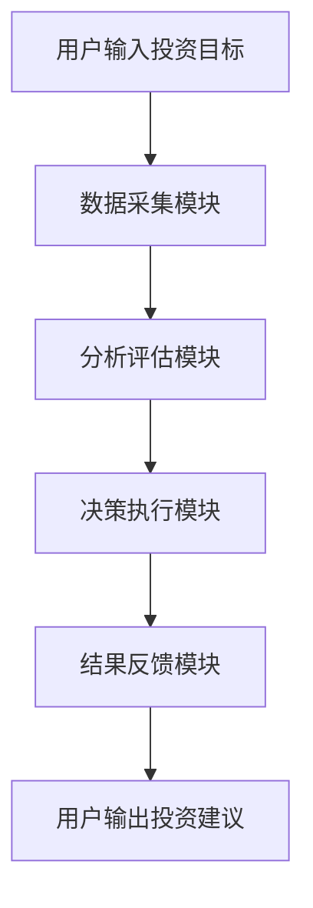
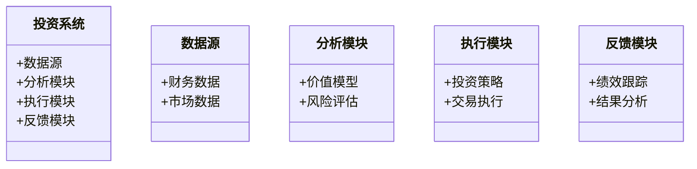

                 


# 约翰·伯格的长期投资观：时间是你的朋友

## 关键词：长期投资、价值投资、约翰·伯格、投资心态、风险管理、时间价值

## 摘要：  
本文深入探讨了约翰·伯格的长期投资理念，分析了时间在投资中的重要性，以及如何通过长期投资实现财富的稳健增长。文章从投资心态、数学模型、系统设计等多角度解析了长期投资的核心要素，并结合实际案例，展示了如何在实践中应用这些理念。通过本文，读者将更好地理解长期投资的价值，并掌握如何在投资决策中运用时间和价值的基本原则。

---

## 第1章：长期投资的核心概念

### 1.1 投资的基本问题与挑战

#### 1.1.1 投资的基本问题  
投资的核心问题是如何在不确定的市场中实现资产的保值与增值。投资者需要在风险与收益之间找到平衡点，同时考虑时间和复利效应的影响。  

#### 1.1.2 投资中的常见误区  
许多投资者容易陷入短期逐利的陷阱，忽视了时间和复利的力量。此外，情绪化决策、过度交易和盲目跟风也是常见的错误。  

#### 1.1.3 长期投资的核心价值  
长期投资强调的是时间的价值和复利效应。通过长期持有优质资产，投资者可以避免短期市场的波动干扰，实现财富的稳步增长。  

---

### 1.2 约翰·伯格的长期投资观

#### 1.2.1 约翰·伯格的生平简介  
约翰·伯格是美国著名投资专家，价值投资的代表人物之一。他通过长期持有优质股票，实现了卓越的投资业绩，并撰写了《聪明的投资者》等经典著作。  

#### 1.2.2 约翰·伯格的投资理念  
伯格认为，投资的本质是通过购买优质资产，以合理的价格买入并长期持有。他强调安全边际的重要性，并倡导投资者保持耐心，避免频繁交易。  

#### 1.2.3 时间在投资中的重要性  
时间是长期投资的朋友。通过长期持有优质资产，投资者可以充分享受复利效应，将时间转化为财富增长的催化剂。  

---

## 第2章：投资心态与决策模型

### 2.1 投资心态的核心要素

#### 2.1.1 投资心态的定义  
投资心态是指投资者在面对市场波动和不确定性时的心理状态和决策倾向。它影响着投资者的决策质量和投资结果。  

#### 2.1.2 理性与感性在投资中的作用  
理性决策是基于数据和逻辑的分析，而感性决策则容易受到情绪的干扰。成功的投资需要理性与感性的平衡。  

#### 2.1.3 投资心态的自我评估  
投资者需要定期评估自己的心态，识别潜在的心理偏差，并采取措施加以调整。  

---

### 2.2 投资决策的核心模型

#### 2.2.1 投资决策的基本框架  
投资决策可以分为目标设定、信息收集、分析评估、决策执行和结果反馈五个阶段。  

#### 2.2.2 投资决策的关键步骤  
1. 确定投资目标：明确投资目的和风险承受能力。  
2. 信息收集与分析：通过基本面分析和市场研究，识别优质资产。  
3. 评估与选择：基于安全边际和长期价值，做出投资决策。  
4. 决策执行：通过分散投资和定期调整，优化投资组合。  

#### 2.2.3 投资决策中的心理陷阱  
常见的心理陷阱包括过度自信、从众心理和损失厌恶。投资者需要通过自我认知和纪律性来克服这些障碍。  

---

## 第3章：价值投资模型的数学解析

### 3.1 价值投资的核心算法

#### 3.1.1 价值投资的基本原理  
价值投资的核心是通过分析企业的内在价值，寻找被市场低估的投资标的。  

#### 3.1.2 价值投资的数学模型  
以下是价值投资中常用的公式：  

$$ \text{内在价值} = \frac{\text{未来现金流的现值}}{\text{折现率}} $$  

#### 3.1.3 价值投资的计算公式  
通过计算企业的未来现金流和合理折现率，投资者可以估算出企业的内在价值，并与市场价格进行比较，确定投资机会。  

---

### 3.2 约翰·伯格的投资模型实现

#### 3.2.1 投资模型的代码实现  
以下是一个简单的价值投资模型的Python代码示例：  

```python
def calculate_intrinsic_value(cash_flows, discount_rate):
    present_value = sum(cash_flow / (1 + discount_rate) ** t for t, cash_flow in enumerate(cash_flows))
    return present_value

cash_flows = [100, 200, 300, 400]
discount_rate = 0.08

intrinsic_value = calculate_intrinsic_value(cash_flows, discount_rate)
print(f"内在价值为：{intrinsic_value}")
```

#### 3.2.2 投资模型的运行结果  
通过上述代码，我们可以计算出企业的内在价值，并与市场价格进行对比，从而判断是否为投资机会。  

#### 3.2.3 投资模型的优化与调整  
投资者可以根据实际情况调整折现率和现金流预测，以优化投资模型的效果。  

---

## 第4章：系统分析与架构设计方案

### 4.1 投资系统的功能设计

#### 4.1.1 系统的功能模块划分  
投资系统可以划分为数据采集、分析评估、决策执行和结果反馈四个功能模块。  

#### 4.1.2 每个模块的功能描述  
1. 数据采集：收集企业的财务数据和市场信息。  
2. 分析评估：通过价值模型计算内在价值。  
3. 决策执行：根据评估结果生成投资策略。  
4. 结果反馈：跟踪投资绩效并进行调整。  

#### 4.1.3 系统的交互流程设计  
以下是系统的交互流程图：  



---

### 4.2 投资系统的架构设计

#### 4.2.1 系统的总体架构图  
以下是系统的总体架构图：  



---

## 第5章：长期投资策略的实战应用

### 5.1 投资环境的搭建

#### 5.1.1 投资工具的安装与配置  
投资者需要安装数据分析工具（如Python、Excel）和投资研究平台（如Morningstar）。  

#### 5.1.2 数据源的选择与获取  
常用的数据源包括Yahoo Finance、Google Finance和Morningstar。  

#### 5.1.3 投资环境的优化  
通过数据清洗和模型优化，提升投资系统的效率和准确性。  

---

### 5.2 投资策略的实现

#### 5.2.1 投资策略的核心代码  
以下是一个基于价值投资模型的Python代码示例：  

```python
import pandas as pd
import numpy as np

def calculate_intrinsic_value(financial_data, discount_rate):
    cash_flows = financial_data['现金流'].values
    present_value = sum(cf / (1 + discount_rate) ** t for t, cf in enumerate(cash_flows))
    return present_value

financial_data = pd.DataFrame({
    '现金流': [100, 200, 300, 400]
})
discount_rate = 0.08

intrinsic_value = calculate_intrinsic_value(financial_data, discount_rate)
print(f"内在价值为：{intrinsic_value}")
```

#### 5.2.2 投资策略的运行测试  
通过测试不同市场环境下的投资策略，验证其有效性和稳健性。  

#### 5.2.3 投资策略的优化与调整  
根据测试结果，优化投资模型的参数和策略，以提升投资绩效。  

---

## 第6章：长期投资的注意事项与最佳实践

### 6.1 投资中的常见问题与解决方案

#### 6.1.1 投资中的常见问题  
- 短期波动对长期投资的影响  
- 如何避免情绪化决策  
- 如何选择优质资产  

#### 6.1.2 问题的解决方案  
- 保持长期视角，关注企业的基本面  
- 建立严格的纪律，避免盲目跟风  
- 通过分散投资降低风险  

#### 6.1.3 解决方案的实施步骤  
1. 设定明确的投资目标  
2. 建立完善的投资流程  
3. 定期评估和调整投资组合  

---

### 6.2 长期投资的小结与展望

#### 6.2.1 长期投资的核心要点  
- 时间是长期投资的朋友  
- 价值投资是实现财富增长的核心策略  
- 纪律性和耐心是成功的基石  

#### 6.2.2 长期投资的未来趋势  
随着技术的进步，长期投资将更加依赖数据驱动的决策和智能化的投资工具。  

#### 6.2.3 长期投资的个人感悟  
通过长期投资，投资者可以实现财富的稳健增长，同时避免短期市场的波动干扰。  

---

## 第7章：相关文献与拓展阅读

### 7.1 投资相关的经典书籍

#### 7.1.1 价值投资的经典著作  
- 《聪明的投资者》——本杰明·格雷厄姆  
- 《巴菲特的投资组合》——彼得·林奇  

#### 7.1.2 长期投资的权威书籍  
- 《股票投资的长期秘诀》——约翰·伯格  
- 《投资的未来》——罗伯特·希勒  

#### 7.1.3 其他相关书籍推荐  
- 《投资学原理》——加里·布莱克  

---

### 7.2 投资相关的网站与工具

#### 7.2.1 投资数据的获取渠道  
- Yahoo Finance  
- Google Finance  
- Morningstar  

#### 7.2.2 投资工具的使用方法  
- 数据分析工具：Python、Excel  
- 投资模拟器：Interactive Brokers、Fidelity  

#### 7.2.3 投资社区的参与方式  
- 论坛：Reddit、雪球  
- 课程：Coursera、Udemy  

---

通过本文的深入分析和详细讲解，读者可以全面理解约翰·伯格的长期投资理念，并将其应用于实际投资中，实现财富的长期稳健增长。

