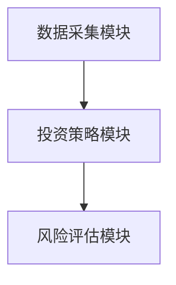

                 


# 约翰·伯格：指数基金之父的投资智慧

## 关键词：指数基金，约翰·伯格，投资策略，风险管理，数学模型

## 摘要：本文深入探讨了指数基金之父约翰·伯格的投资智慧，从指数基金的核心概念、数学模型、投资策略到系统架构与实现，结合实际案例分析，为读者提供全面的指数基金投资指南。文章通过详细的分析和推理，帮助读者理解指数基金的投资原理，并通过项目实战掌握指数基金的投资方法。

---

## 第1章：指数基金的背景与起源

### 1.1 指数基金的定义与核心概念

#### 1.1.1 指数基金的定义
指数基金是一种以特定市场指数为标的，追踪该指数表现的基金。它的核心目标是通过复制指数的表现，为投资者提供与市场同步的收益。指数基金的特点是分散化投资、低成本和低风险。

#### 1.1.2 指数基金的核心特征
- **分散化投资**：通过投资于指数中的所有成分股，降低单一股票的风险。
- **低成本**：指数基金的管理费用通常低于主动管理型基金。
- **被动投资**：指数基金通过跟踪指数，而非主动选股，减少了人为操作的风险。

#### 1.1.3 指数基金与传统投资方式的对比
- **传统投资**：依赖基金经理的选股能力，费用较高，风险集中。
- **指数基金**：分散风险，费用低，适合长期投资。

### 1.2 约翰·伯格与指数基金的起源

#### 1.2.1 约翰·伯格的生平简介
约翰·伯格（John C. Bogle）是指数基金的发明者，也是Vanguard集团的创始人。他于1934年出生于美国宾夕法尼亚州，1965年创立Vanguard集团。

#### 1.2.2 指数基金的发明与Vanguard的创立
1975年，伯格推出了第一只指数基金——Vanguard S&P 500指数基金。这一创新彻底改变了投资行业，使普通投资者能够以低成本投资于整个市场。

#### 1.2.3 指数基金对投资行业的影响
指数基金的普及降低了投资门槛，使更多人能够参与到投资中，同时推动了低成本投资产品的普及。

### 1.3 指数基金的现状与发展趋势

#### 1.3.1 全球指数基金的发展现状
目前，指数基金在全球范围内得到广泛应用，尤其是在美国市场，指数基金占据了很大的市场份额。

#### 1.3.2 指数基金在中国市场的应用与挑战
中国市场的指数基金发展迅速，但也面临一些挑战，如市场波动大、投资者认知不足等。

#### 1.3.3 指数基金的未来发展趋势
随着技术进步和投资者对低成本、高效率投资工具的需求增加，指数基金将继续保持增长。

---

## 第2章：指数基金的数学模型与原理

### 2.1 指数基金的核心原理

#### 2.1.1 指数基金的投资策略
指数基金通过跟踪市场指数，实现与市场同步的收益。其核心策略是分散化投资和低成本运作。

#### 2.1.2 指数基金的风险与收益分析
- **风险**：通过分散化投资，降低个股风险，但仍存在市场整体波动的风险。
- **收益**：长期来看，指数基金的收益接近市场平均收益，通常高于主动管理型基金的收益。

#### 2.1.3 指数基金的费用结构与成本控制
指数基金的管理费用通常低于主动管理型基金，主要原因在于其被动投资的特性。

### 2.2 指数基金的数学模型

#### 2.2.1 指数基金的收益率计算公式
指数基金的收益率可以通过指数的收益率来计算：
$$
R_{\text{基金}} = R_{\text{指数}}
$$

#### 2.2.2 指数基金的风险调整收益模型（CAPM）
CAPM模型用于衡量资产的预期收益：
$$
R_i = R_f + \beta_i (R_m - R_f)
$$
其中：
- \( R_i \)：资产的预期收益
- \( R_f \)：无风险利率
- \( \beta_i \)：资产的贝塔系数
- \( R_m \)：市场预期收益

#### 2.2.3 指数基金的分散化投资原理
通过投资于多个成分股，指数基金能够降低个股风险，使整体投资风险接近市场风险。

---

## 第3章：指数基金的投资策略与实践

### 3.1 指数基金的投资策略

#### 3.1.1 定期定额投资（定投）策略
定投策略通过定期投入固定金额，分散投资成本，降低市场波动风险。

#### 3.1.2 指数基金的资产配置策略
根据市场情况，动态调整指数基金在投资组合中的比例。

#### 3.1.3 指数基金的风险管理策略
通过分散投资、设置止损点等方法，控制投资风险。

### 3.2 指数基金的投资组合管理

#### 3.2.1 指数基金的分散化投资原理
通过投资多个成分股，降低个股风险。

#### 3.2.2 指数基金的再平衡策略
定期调整投资组合，使其与指数成分股比例一致。

#### 3.2.3 指数基金的长期投资效果分析
长期来看，指数基金能够实现稳定的收益增长。

---

## 第4章：指数基金的系统架构与实现

### 4.1 指数基金投资系统的概述

#### 4.1.1 系统目标与功能需求
- 目标：提供指数基金投资的自动化管理。
- 需求：数据采集、投资策略执行、风险评估。

#### 4.1.2 系统架构设计
- 数据采集模块：获取指数数据。
- 投资策略模块：执行定投策略。
- 风险评估模块：监控投资风险。

#### 4.1.3 系统架构图


### 4.2 系统功能模块设计

#### 4.2.1 数据采集模块
- 数据源：股票指数数据。
- 实现：通过API获取指数数据。

#### 4.2.2 投资策略模块
- 策略：定期定额投资。
- 实现：根据设定的时间和金额执行投资。

#### 4.2.3 风险评估模块
- 方法：监控指数波动，评估投资风险。

### 4.3 系统接口设计

#### 4.3.1 数据接口设计
- 输入：指数代码。
- 输出：指数数据。

#### 4.3.2 用户交互接口设计
- 输入：投资金额、投资周期。
- 输出：投资计划。

#### 4.3.3 系统日志与监控接口设计
- 输入：无。
- 输出：系统日志和风险提示。

---

## 第5章：指数基金的项目实战与案例分析

### 5.1 环境搭建与数据准备

#### 5.1.1 投资分析工具的安装与配置
- 工具：Python、Pandas、Matplotlib。

#### 5.1.2 数据源的选择与获取
- 数据源：Yahoo Finance API。
- 获取：通过Python代码获取指数数据。

### 5.2 指数基金的核心实现

#### 5.2.1 数据采集与处理
```python
import pandas as pd
import yfinance as yf

# 获取指数数据
index_data = yf.download('^GSPC', start='2020-01-01', end='2023-12-31')
```

#### 5.2.2 定投策略实现
```python
def dollar_cost_avg(investment, start_date, end_date, frequency='monthly'):
    dates = pd.date_range(start=start_date, end=end_date, freq=frequency)
    total_invest = 0
    for date in dates:
        amount = investment / len(dates)
        total_invest += amount
    return total_invest
```

#### 5.2.3 投资效果分析
```python
import matplotlib.pyplot as plt

index_data['Close'].plot()
plt.show()
```

### 5.3 案例分析与详细讲解

#### 5.3.1 投资策略效果
通过定投策略，投资者能够以较低成本分散风险，实现稳定收益。

#### 5.3.2 投资风险分析
通过监控市场波动，及时调整投资策略，降低风险。

---

## 第6章：总结与展望

### 6.1 本章总结
本文从指数基金的核心概念、数学模型、投资策略到系统架构与实现，全面探讨了指数基金的投资智慧。

### 6.2 未来展望
随着技术进步和市场需求变化，指数基金将继续发展，为投资者提供更好的服务。

---

## 参考文献与附录

- 附录A：指数基金相关代码
- 附录B：系统架构图
- 附录C：投资策略流程图

---

通过以上分析，读者可以全面了解指数基金的投资智慧，并掌握实际操作方法。指数基金作为一种高效的投资工具，值得投资者深入了解和应用。

