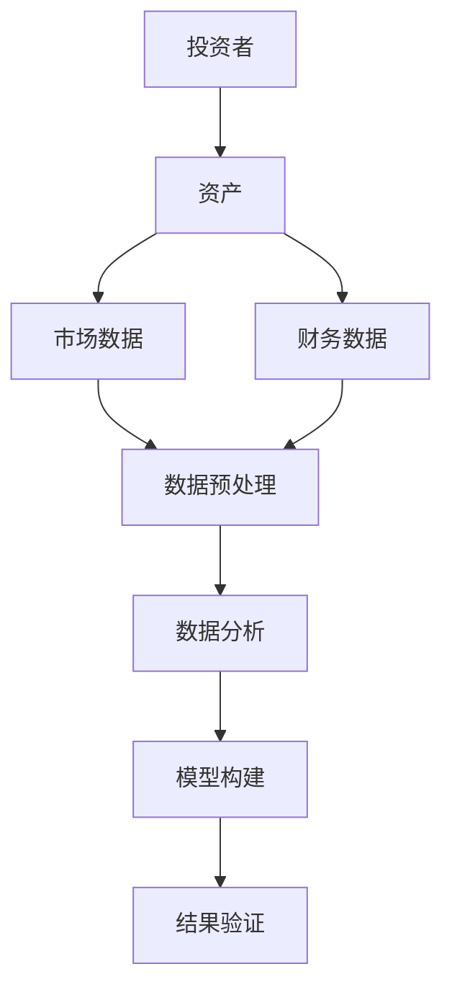
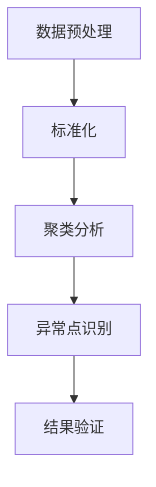
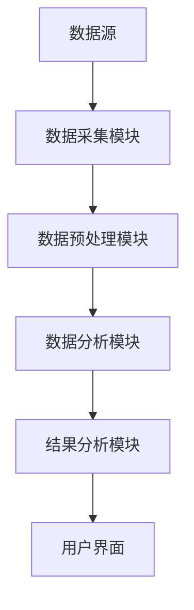

                 


# 《约翰·内夫的价值陷阱识别技巧》

## 关键词：价值陷阱、约翰·内夫、投资决策、风险管理、数据分析、模式识别

## 摘要：
本文深入探讨了约翰·内夫的价值陷阱识别技巧，从基础概念到高级算法，结合实际案例分析，系统地讲解了如何识别和避免价值陷阱。文章内容涵盖价值陷阱的定义、识别方法、算法原理、数学模型、系统架构设计和项目实战，旨在帮助读者掌握这一重要投资技巧。

---

## 第一部分：价值陷阱识别基础

### 第1章：价值陷阱概述

#### 1.1 价值陷阱的基本概念
价值陷阱是指在投资过程中，由于信息不对称、市场波动或其他外部因素，导致某些资产或项目的表面价值与实际价值严重不符的情况。投资者如果未能识别这些陷阱，可能会蒙受重大损失。

**1.1.1 价值陷阱的定义**
价值陷阱通常表现为：
- 资产价格被高估或低估。
- 公司财务数据虚假或不透明。
- 市场情绪过度乐观或悲观。

**1.1.2 价值陷阱的类型**
- **财务造假型**：公司通过虚增收入或隐瞒债务等手段掩盖真实财务状况。
- **市场泡沫型**：市场过度炒作导致资产价格远高于其实际价值。
- **管理失误型**：公司管理层决策失误导致企业陷入困境。

**1.1.3 价值陷阱的特征**
- **数据异常**：财务数据与行业平均水平差异显著。
- **市场反应滞后**：市场对某些负面信息反应迟钝。
- **风险信号**：存在潜在的法律、财务或经营风险。

#### 1.2 价值陷阱识别的重要性
识别价值陷阱对投资者至关重要，尤其是在做出投资决策时，必须避免陷入这些陷阱。

**1.2.1 识别价值陷阱的意义**
- **保护投资本金**：避免因误判资产价值导致的重大损失。
- **提高投资效率**：通过识别陷阱，优化投资组合。
- **增强市场洞察力**：深入理解市场机制，提升投资能力。

**1.2.2 价值陷阱对投资决策的影响**
- **投资损失**：误判资产价值可能导致重大财务损失。
- **投资机会错失**：未能识别陷阱可能导致错失优质投资机会。
- **投资信心动摇**：频繁误判可能削弱投资者信心。

**1.2.3 价值陷阱识别的挑战**
- **信息不对称**：投资者难以获取完整准确的信息。
- **市场复杂性**：市场波动和不确定性增加识别难度。
- **人为因素**：情绪化决策和认知偏差影响判断。

#### 1.3 价值陷阱识别的基本方法
以下是识别价值陷阱的几种常用方法：

**1.3.1 基于数据分析的方法**
- **财务指标分析**：通过分析市盈率、市净率等指标识别高估或低估的资产。
- **趋势分析**：观察价格走势，识别异常波动。

**1.3.2 基于模式识别的方法**
- **模式识别**：通过历史数据识别价格波动的模式。
- **聚类分析**：将相似的资产分组，识别异常值。

**1.3.3 基于专家经验的方法**
- **专家意见**：听取行业专家的意见，避免误判。
- **案例分析**：研究类似案例，总结经验教训。

---

### 第2章：价值陷阱识别的核心概念

#### 2.1 价值陷阱识别的原理
价值陷阱识别的核心在于通过数据分析和模式识别，发现潜在风险。

**2.1.1 价值陷阱识别的逻辑框架**
1. 数据采集：收集相关资产的财务数据和市场数据。
2. 数据预处理：清洗数据，消除噪声。
3. 数据分析：通过统计方法识别异常值。
4. 模型构建：建立数学模型预测风险。
5. 结果验证：通过回测验证模型的有效性。

**2.1.2 价值陷阱识别的关键因素**
- **数据特征**：包括资产价格、成交量等。
- **模型特征**：包括算法的选择和参数设置。
- **风险特征**：包括波动性、相关性等。

**2.1.3 价值陷阱识别的数学模型**
- **回归模型**：用于预测资产价格。
- **分类模型**：用于判断资产是否为价值陷阱。

#### 2.2 价值陷阱识别的核心要素
价值陷阱识别需要关注以下几个核心要素：

**2.2.1 数据特征**
- 资产价格：包括收盘价、开盘价等。
- 成交量：包括成交量、成交额等。
- 市场指数：包括大盘指数、行业指数等。

**2.2.2 模型特征**
- 算法选择：包括聚类分析、异常检测等。
- 参数设置：包括模型的超参数调整。

**2.2.3 风险特征**
- 波动性：资产价格波动的程度。
- 相关性：资产价格与其他资产的相关性。

#### 2.3 价值陷阱识别的实体关系图
通过实体关系图，可以更清晰地理解价值陷阱识别的过程。



---

### 第3章：价值陷阱识别的算法原理

#### 3.1 价值陷阱识别的算法选择
选择合适的算法是价值陷阱识别的关键。

**3.1.1 常见算法概述**
- **聚类分析**：用于发现资产价格的异常波动。
- **异常检测**：用于识别偏离正常趋势的数据点。
- **回归分析**：用于预测资产价格。

**3.1.2 算法选择的依据**
- 数据类型：数值型数据适合回归分析，分类数据适合聚类分析。
- 数据规模：大数据适合分布式算法，小数据适合传统算法。
- 计算效率：需要考虑算法的复杂度和运行时间。

**3.1.3 算法优缺点对比**

| 算法名称 | 优点 | 缺点 |
|----------|------|------|
| 聚类分析 | 无监督学习，适合发现数据分布 | 需要人工调整参数 |
| 异常检测 | 可以发现异常点 | 对噪声敏感 |
| 回归分析 | 可以预测数值型数据 | 假设线性关系 |

#### 3.2 价值陷阱识别的算法流程图
以下是聚类分析和异常检测的流程图：



#### 3.3 价值陷阱识别的算法实现
以下是聚类分析的Python代码示例：

```python
from sklearn.cluster import KMeans
import numpy as np

# 数据预处理
data = np.array([[1, 2], [3, 4], [5, 6], [7, 8]])

# 标准化
from sklearn.preprocessing import StandardScaler
scaler = StandardScaler()
data_scaled = scaler.fit_transform(data)

# 聚类分析
kmeans = KMeans(n_clusters=2, random_state=0)
kmeans.fit(data_scaled)

# 异常点识别
# 使用聚类后的标签判断异常点
labels = kmeans.labels_
for i in range(len(labels)):
    if labels[i] == 0:
        print("正常点")
    else:
        print("异常点")
```

---

### 第4章：价值陷阱识别的数学模型

#### 4.1 价值陷阱识别的数学模型构建
以下是回归分析的数学模型：

$$ y = \beta_0 + \beta_1x + \epsilon $$

其中：
- \( y \) 是目标变量（资产价格）
- \( x \) 是自变量（市场指数）
- \( \beta_0 \) 是截距
- \( \beta_1 \) 是回归系数
- \( \epsilon \) 是误差项

#### 4.2 价值陷阱识别的数学公式
以下是回归模型的公式推导：

$$ \hat{\beta}_1 = \frac{\sum_{i=1}^{n}(x_i - \bar{x})(y_i - \bar{y})}{\sum_{i=1}^{n}(x_i - \bar{x})^2} $$

其中：
- \( \hat{\beta}_1 \) 是估计的回归系数
- \( \bar{x} \) 和 \( \bar{y} \) 是 \( x \) 和 \( y \) 的平均值

---

## 第二部分：价值陷阱识别的系统架构设计

### 第5章：系统分析与架构设计方案

#### 5.1 问题场景介绍
价值陷阱识别系统需要处理大量的市场数据，识别潜在的风险。

#### 5.2 系统功能设计
以下是系统功能模块：

- **数据采集模块**：采集市场数据和财务数据。
- **数据预处理模块**：清洗数据，消除噪声。
- **数据分析模块**：通过聚类分析和异常检测识别价值陷阱。
- **结果分析模块**：输出识别结果，供投资者参考。

#### 5.3 系统架构设计
以下是系统架构图：



---

## 第三部分：价值陷阱识别的项目实战

### 第6章：项目实战

#### 6.1 环境安装
- Python 3.8及以上
- NumPy、Pandas、Scikit-learn库

#### 6.2 系统核心实现源代码
以下是聚类分析的代码实现：

```python
from sklearn.cluster import KMeans
import numpy as np
import pandas as pd

# 数据预处理
data = pd.read_csv('market_data.csv')
data_scaled = data[['open', 'high', 'low', 'close']].apply(lambda x: (x - x.mean()) / x.std())

# 聚类分析
kmeans = KMeans(n_clusters=2, random_state=0)
kmeans.fit(data_scaled)

# 异常点识别
labels = kmeans.labels_
data['label'] = labels
data.to_csv('result.csv', index=False)
```

#### 6.3 代码应用解读与分析
- 数据预处理：对数据进行标准化处理。
- 聚类分析：使用K均值聚类算法识别异常点。
- 结果分析：输出识别结果，标记异常点。

#### 6.4 实际案例分析和详细讲解剖析
通过具体案例，分析如何识别价值陷阱。

---

## 第四部分：价值陷阱识别的最佳实践

### 第7章：总结与展望

#### 7.1 小结
价值陷阱识别是投资决策中不可忽视的重要环节，通过数据分析和模式识别，可以有效避免误判。

#### 7.2 注意事项
- 数据质量：确保数据的准确性和完整性。
- 模型优化：根据实际情况调整模型参数。
- 风险管理：合理控制投资风险。

#### 7.3 拓展阅读
- 《投资学基础》
- 《数据挖掘与机器学习》

---

以上是《约翰·内夫的价值陷阱识别技巧》的完整目录和内容框架，希望对您有所帮助！

